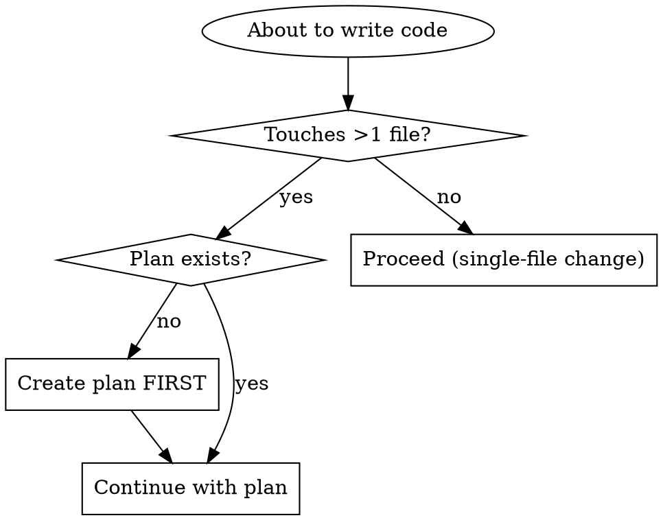

# Planning Skill

Create implementation plans with executable, self-contained milestones.

> A good plan makes implementation mechanical. A vague plan leads to rework.

---

## The Iron Law

```
NO CROSS-FILE CHANGE WITHOUT A PLAN FIRST
```

If your change touches more than one file, you need a plan. Period.

**No exceptions:**
- Not for "simple" changes
- Not for "obvious" patterns
- Not for time pressure
- Not for "I'll be careful"
- Not for "I know this codebase well"

**Violating the letter of this rule is violating the spirit of this rule.**

Already wrote code without a plan? Stop. Create the plan now. Verify spec coverage. Find all affected callers. THEN continue.

---

## Quick Reference

| Action | Risk | When to Use |
|--------|------|-------------|
| `Create` | 🟢 Low | New file |
| `Add` | 🟢 Low | New method/field, no existing code affected |
| `Modify[signature]` | 🟠 High | Change params/return type → update ALL callers |
| `Modify[logic]` | 🟡 Medium | Change implementation, same signature |
| `Modify[field]` | 🟡 Medium | Add/remove/change fields |
| `Delete` | 🔴 Critical | Remove file/method → verify no usages |

## When NOT to Use

- Single-file bug fix with obvious solution → Just fix it
- One-line change → No plan needed
- Pure refactoring within one file → Too granular for planning
- Research/exploration tasks → Use research skill instead

---

## Core Principles

### CRITICAL: Green State Constraint

Each milestone MUST leave codebase in green state:

- Compilable (`./gradlew compileKotlin`)
- All tests pass (`./gradlew test`)

If changing A breaks B, include fixing B in the SAME milestone. This includes test code - if modifying production code breaks existing tests, update those tests in the same milestone.

Runtime constraints matter: Spring Bean conflicts, DI failures, and configuration errors are NOT caught by compilation but will fail tests.

### CRITICAL: Atomic Operations

These MUST NOT be split across milestones:

| Operation | Symptom if Split |
|-----------|------------------|
| Interface implementation replacement | `NoUniqueBeanDefinitionException` |
| Database schema + entity change | `SchemaManagementException` |
| Signature change without updating callers | Compilation failure |
| Required field/parameter addition | Compilation failure in dependents |

### CRITICAL: Change Propagation

When you modify code, changes propagate. Everything affected must be in the SAME milestone.

**Signature Changes → Compilation Failure**

Change method signature, return type, or add required parameter → all callers break.

**Logic Changes → Test Failure**

Change internal logic → existing tests verifying old behavior fail.

**Structural Changes → Runtime Failure**

Replace interface impl, change schema → Spring context or DB mapping fails.

### One Milestone = One Responsibility

A responsibility is a reason to change.

- "Point can be used" → one responsibility
- "Point can expire" → another responsibility
- "Usage history is recorded" → another responsibility

When responsibility is clear, scope becomes clear. Everything needed to fulfill that responsibility goes in the milestone. Nothing else.

### Self-Contained Milestones

Each milestone must be understandable without context from other milestones.

Think of each milestone as a work order that could be handed to a contractor who knows nothing about the rest of the project.

- Implementer may execute milestone without seeing full plan
- All file paths, spec references, pattern references included
- Dependencies on previous milestones explicitly noted

---

## Spec Alignment Principles

### Spec-Based Description

Describe milestones based on spec document content only. This includes requirements, background, example code, constraints, integration points, migration notes—anything present in the spec.

Do NOT arbitrarily decide implementation details not present in the spec. If the spec doesn't specify how to implement something, leave that decision to the implementer's judgment.

- Spec has pseudo-code → include it as-is
- Spec has field table → reference it, don't convert to code
- Spec is silent on implementation → describe what to achieve, not how

### Rich Context Transfer

Include not only direct implementation details but also the reasoning, background, and constraints from spec documents.

The implementer should be able to make informed decisions without lacking context. When spec explains WHY something is needed, transfer that context to the milestone.

- Background: Why this feature exists
- Constraints: Performance considerations, fault isolation requirements
- Related sections: Integration points, migration notes that affect implementation

### Spec Coverage

Every requirement in spec files MUST map to at least one milestone.

After creating milestones, verify coverage with a Spec Requirement Mapping table:

```markdown
| Requirement | Spec Location | Milestone |
|-------------|---------------|----------|
| [Requirement 1] | [file#section] | Milestone N |
```

If a spec requirement has no corresponding milestone, the plan is incomplete.

### Surface Clarifications

If spec documents have business ambiguities, put them in milestone Clarifications sections. Do NOT assume or make decisions on behalf of the spec author.

Clarifications are for genuine ambiguities where:
- Spec is unclear or contradictory
- Multiple valid interpretations exist
- Business decision is needed before implementation

Technical decisions (library choice, algorithm selection, etc.) are NOT clarifications—those belong to the implementer.

---

## Milestone Structure (Summary)

```markdown
- [ ] Milestone N: [Responsibility Title]

### Risk
- **Level**: 🟢 Low | 🟡 Medium | 🟠 High | 🔴 Critical
- **Reason**: [Why this risk level]

### Clarifications (if any)
- [ ] [Question that must be answered before implementation]

### TODO
- [ ] [Action] `[path]` - [description] (spec: [ref], pattern: `[file:lines]`)

### Check
- [ ] Check `[path]` - [why this file might be affected]

### Tests
- [ ] [Create/Update] `[test_path]` - [what to verify]

### Done When
- [ ] `./gradlew test --tests "*TestName*"` passes
```

For detailed structure, action types, and examples, see `references/milestone-guide.md`

---

## Action Types (Summary)

| Action | When to Use | Risk |
|--------|-------------|------|
| `Create` | New file | 🟢 Low |
| `Add` | New method/field in existing file (no existing code affected) | 🟢 Low |
| `Modify[signature]` | Change parameters/return type | 🟠 High - update all callers |
| `Modify[logic]` | Change implementation, same signature | 🟡 Medium - update tests |
| `Modify[field]` | Add/remove/change fields | 🟡 Medium |
| `Delete` | Remove file or method | 🔴 Critical - verify no usages |

---

## Risk Classification (Summary)

| Level | When to Use |
|-------|-------------|
| 🟢 Low | New files, additive code |
| 🟡 Medium | Modify existing logic, config changes |
| 🟠 High | Signature changes, schema changes |
| 🔴 Critical | Deletions, interface replacement, breaking changes |

**CRITICAL**: 🔴 Critical items require explicit verification before execution.

---

## Quality Checklist (Summary)

Before finalizing any milestone:

**Green State**
- [ ] Milestone leaves codebase compilable
- [ ] Milestone leaves all tests passing
- [ ] Atomic operations NOT split
- [ ] Signature changes include ALL callers

**Completeness**
- [ ] Every TODO has: file path + spec reference + pattern reference
- [ ] Every TODO uses correct action type
- [ ] Files that MAY be affected are in Check section

**Self-Containment**
- [ ] Milestone understandable in isolation
- [ ] Dependencies explicitly noted

For full checklist, see `references/workflow.md#phase-4`

---

## References

| File | When to Read |
|------|--------------|
| `references/milestone-guide.md` | When writing milestone details |
| `references/workflow.md` | When following planning process step-by-step |
| `templates/plan-template.md` | When writing final plan.md output |
| `examples/point-system-plan.md` | For reference on good plan structure |
| `tests/pressure-scenarios.md` | When validating skill compliance under pressure |

---

## Common Mistakes

| Mistake | Why It's Wrong | Fix |
|---------|----------------|-----|
| Splitting interface + impl across milestones | `NoUniqueBeanDefinitionException` at runtime | Same milestone for both |
| Changing signature without updating callers | Compilation failure | Include ALL callers in same milestone |
| Schema change separate from entity change | `SchemaManagementException` | Same milestone |
| Multiple responsibilities per milestone | Unclear scope, hard to verify | One responsibility = one reason to change |
| Assuming implementation details not in spec | Over-engineering, wrong decisions | Describe WHAT, let implementer decide HOW |
| Missing spec requirement in milestones | Incomplete implementation | Use Spec Requirement Mapping table |
| Not including test updates with logic changes | Tests fail after milestone | Update tests verifying changed behavior |

---

## Rationalization Table

When you hear yourself thinking these, STOP. The excuse doesn't make the violation okay.

### Skipping Planning

| Excuse | Reality |
|--------|---------|
| "This is a small/simple change" | Small changes touch multiple files. Cross-file = needs plan. |
| "I know this codebase well" | Familiarity breeds overconfidence. You'll miss callers. |
| "The pattern is obvious" | Obvious to you ≠ obvious to the codebase. Check section exists for a reason. |
| "Time pressure - just this once" | Time pressure is exactly when mistakes happen. Plan saves debug time. |
| "I'll plan as I go" | That's not planning. That's hoping. Plan BEFORE code. |
| "I can keep it in my head" | You can't. Document it. Check sections catch what memory misses. |
| "This is what a senior engineer does" | Senior engineers plan. They just do it faster. Skipping ≠ seniority. |
| "Skip the ceremony, change is bounded" | "Ceremony" IS discipline. Bounded changes still cross files. Plan. |
| "IDE finds all callers better than I can" | IDE finds syntax. Plan finds design dependencies IDE can't see. |
| "Plan creates redundant documentation" | Plan is the source of truth. IDE output is ephemeral. Document it. |
| "Friction without proportional value" | Friction prevents mistakes. 15-min plan saves 2-hour debug. |
| "I found this during research" | Research ≠ license to code. Separate concerns. Separate plans. |

### Cutting Corners in Plan

| Excuse | Reality |
|--------|---------|
| "Check section is overkill" | You'll miss a caller. Green state violation waiting to happen. |
| "Spec reference is obvious" | Implementer doesn't have your context. Reference it. |
| "Done When is just 'tests pass'" | Which tests? Be specific. `--tests "*ClassName*"`. |
| "I'll merge these milestones" | You're hiding complexity. If atomic operations involved, you'll break green state. |
| "4 milestones for this is too many" | More milestones = more checkpoints = safer rollback. Keep them. |

### Handling Ambiguity Wrong

| Excuse | Reality |
|--------|---------|
| "I'll make a reasonable assumption" | Business decisions aren't yours. Clarifications section. |
| "Senior reviewed it, so it's complete" | Reviewed ≠ no ambiguities. Surface what you find. |
| "Edge cases can be follow-up" | Edge cases are requirements. Map them to milestones. |
| "I can decide this technical detail" | Technical decisions yes. Business logic decisions NO. |
| "Asking slows everyone down" | Wrong implementation slows everyone down more. Ask. |

### After-the-Fact Rationalization

| Excuse | Reality |
|--------|---------|
| "Tests pass, so it's fine" | Tests pass ≠ spec coverage. Verify requirements. |
| "I already did the work" | Sunk cost fallacy. Retroactive planning still needed. |
| "It works, why document?" | Future you won't remember. Implementer needs context. |
| "Retroactive planning is fake planning" | Retroactive verification catches missed callers. Do it. |

---

## Red Flags - STOP Immediately

These thoughts mean you're about to violate planning discipline:

### Pre-Implementation Red Flags

| Thought | What to Do |
|---------|------------|
| "This is simple, no plan needed" | It touches multiple files? Plan. |
| "I'll figure out dependencies as I go" | STOP. Find callers FIRST. Add to Check section. |
| "The spec is clear enough" | Read it again. Any ambiguity? Clarifications section. |
| "I know where all the callers are" | grep it. Document in Check section. You missed one. |
| "IDE/tooling will catch everything" | IDE catches syntax errors. Check section catches design dependencies. Both needed. |
| "This is what experienced devs do" | Experienced devs plan faster, not skip planning. Same discipline. |
| "I'm 90% done, last bit is trivial" | Last 10% causes 90% of bugs. Same discipline, every milestone. |

### Research-to-Implementation Red Flags

| Thought | What to Do |
|---------|------------|
| "While I'm here, I'll just fix this" | STOP. Note in research.md. Create separate plan for fix. |
| "It's one line, doesn't need a plan" | One line can break many files. If cross-file impact, needs plan. |
| "Research and fix are related" | Related ≠ same task. Separate plans, separate commits. |

### During-Planning Red Flags

| Thought | What to Do |
|---------|------------|
| "This milestone is getting too long" | Split by responsibility. One milestone = one reason to change. |
| "I'll combine these to save time" | Check for atomic operations. Don't split interface + impl. |
| "Check section is empty" | Wrong. Every Modify[signature] has callers. Find them. |
| "Pattern reference not needed" | Add it. `domain/order/Order.kt:L45-60` style. |

### Post-Implementation Red Flags

| Thought | What to Do |
|---------|------------|
| "Code works, skip plan verification" | STOP. Create Spec Requirement Mapping table. Any gaps? |
| "I'm sure I covered everything" | grep for callers of modified methods. Check section was right? |
| "Tests pass, ship it" | Which spec requirements have tests? All of them? |

---

## Red Flag Flowchart


