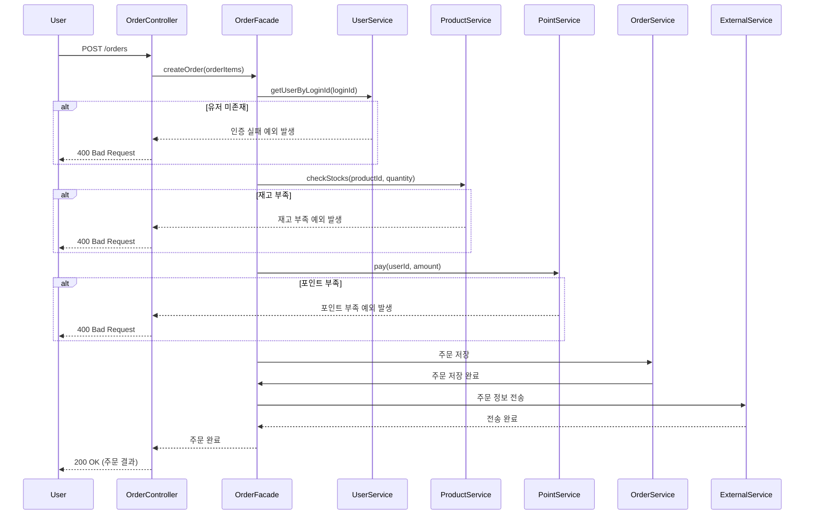
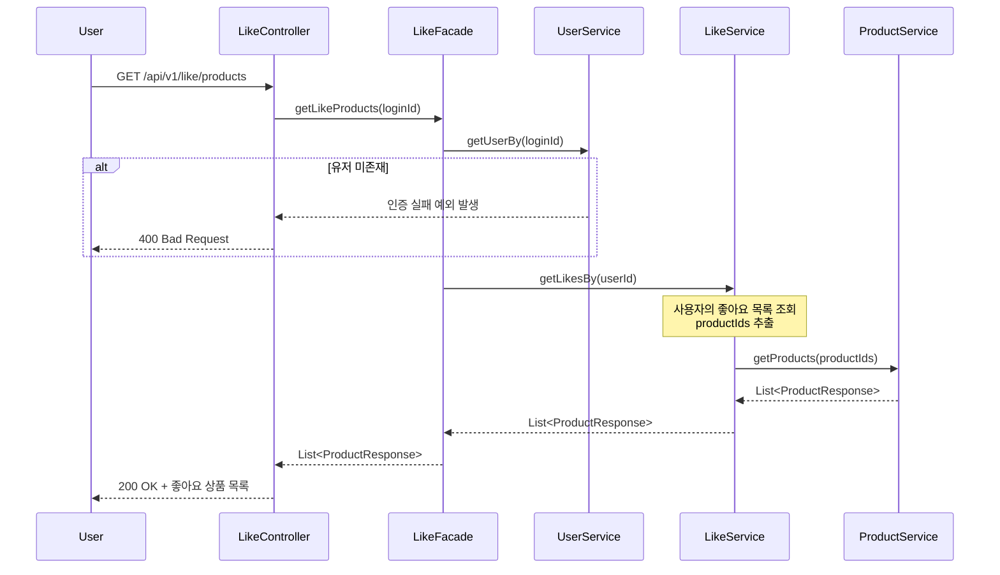

### 시퀀스 다이어그램 최소 2개 이상 ( 머메이드 기반 작성 권장 )

## 주문 요청

```mermaid
sequenceDiagram
    participant User
    participant OrderController
    participant OrderFacade
    participant UserService
    participant ProductService
    participant PointService
    participant OrderService
    participant ExternalService
    User ->> OrderController: POST /orders
    OrderController ->> OrderFacade: createOrder(orderItems)
    OrderFacade ->> UserService: getUserByLoginId(loginId)
    alt 유저 미존재
        UserService -->> OrderController: 인증 실패 예외 발생
        OrderController -->> User: 400 Bad Request
    end

    OrderFacade ->> ProductService: checkStocks(productId, quantity)
    alt 재고 부족
        ProductService -->> OrderController: 재고 부족 예외 발생
        OrderController -->> User: 400 Bad Request
    end

    OrderFacade ->> PointService: pay(userId, amount)
    alt 포인트 부족
        PointService -->> OrderController: 포인트 부족 예외 발생
        OrderController -->> User: 400 Bad Request
    end

    OrderFacade ->> OrderService: 주문 저장
    OrderService ->> OrderFacade: 주문 저장 완료
    OrderFacade ->> ExternalService: 주문 정보 전송
    ExternalService -->> OrderFacade: 전송 완료
    OrderFacade -->> OrderController: 주문 완료
    OrderController -->> User: 200 OK (주문 결과)
```

## 내가 좋아요 한 상품 목록

```mermaid
sequenceDiagram
    participant User
    participant LikeController
    participant LikeFacade
    participant UserService
    participant LikeService
    participant ProductService
    User ->> LikeController: GET /api/v1/like/products
    LikeController ->> LikeFacade: getLikeProducts(loginId)
    LikeFacade ->> UserService: getUserBy(loginId)
    alt 유저 미존재
        UserService -->> LikeController: 인증 실패 예외 발생
        LikeController -->> User: 400 Bad Request
    end

    LikeFacade ->> LikeService: getLikesBy(userId)
    Note over LikeService: 사용자의 좋아요 목록 조회<br/>productIds 추출
    LikeService ->> ProductService: getProducts(productIds)
    ProductService -->> LikeService: List<ProductResponse>
    LikeService -->> LikeFacade: List<ProductResponse>
    LikeFacade -->> LikeController: List<ProductResponse>
    LikeController -->> User: 200 OK + 좋아요 상품 목록
```