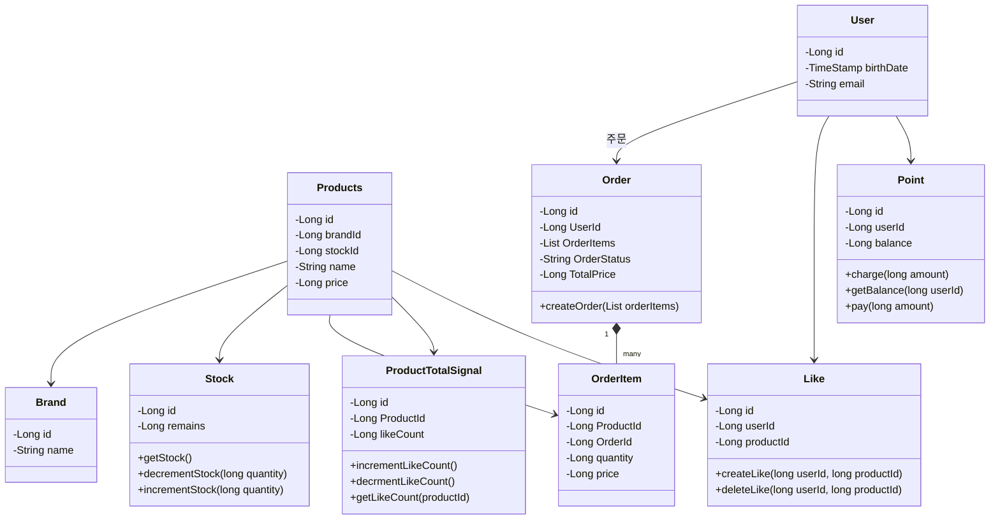

### 도메인 객체 설계 ( 클래스 다이어 그램 or 설명 중심 )

```mermaid
classDiagram
    direction TB
    class Products {
        -Long id
        -Long brandId
        -Long stockId
        -String name
        -Long price
    }
    class ProductTotalSignal {
        -Long id
        -Long ProductId
        -Long likeCount
        +incrementLikeCount()
        +decrmentLikeCount()
        +getLikeCount(productId)
    }

    class Brand {
        -Long id
        -String name
    }

    class Like {
        -Long id
        -Long userId
        -Long productId
        +createLike(long userId, long productId)
        +deleteLike(long userId, long productId)
    }

    class User {
        -Long id
        -TimeStamp birthDate
        -String email
    }

    class Point {
        -Long id
        -Long userId
        -Long balance
        +charge(long amount)
        +getBalance(long userId)
        +pay(long amount)
    }

    class OrderItem {
        -Long id
        -Long ProductId
        -Long OrderId
        -Long quantity
        -Long price
    }

    class Stock {
        -Long id
        -Long remains
        +getStock()
        +decrementStock(long quantity)
        +incrementStock(long quantity)
    }

    class Order {
        -Long id
        -Long UserId
        -List OrderItems
        -String OrderStatus
        -Long TotalPrice
        +createOrder(List<OrderItem> orderItems)
    }

    Products --> Brand
    Products --> Stock
    Products --> OrderItem
    Products --> ProductTotalSignal
    User --> Order: 주문
    Order "1" *-- "many" OrderItem
    Products --> Like
    User --> Like
    User --> Point


```