# 브랜드 목록 조회
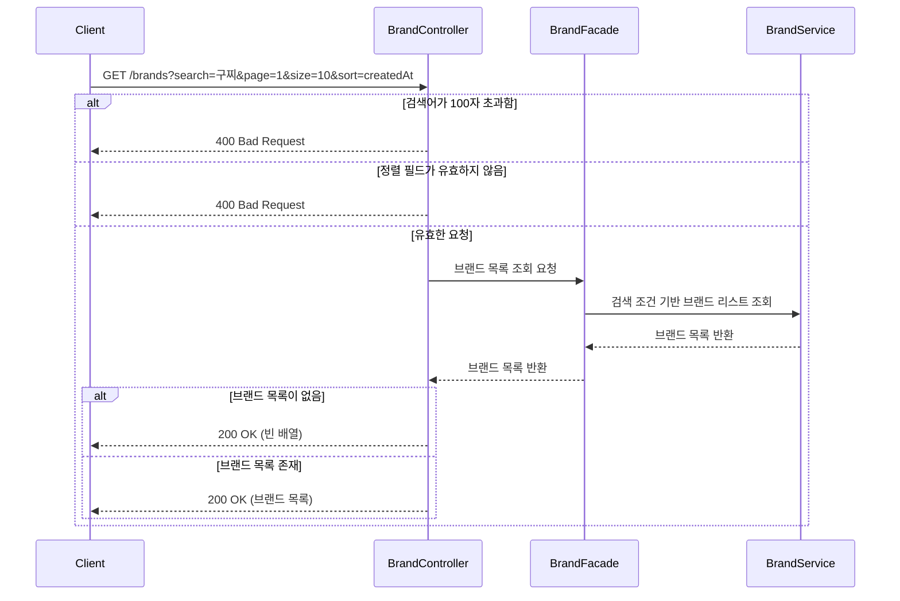
```mermaid
sequenceDiagram
    participant Client
    participant BrandController
    participant BrandFacade
    participant BrandService

    Client->>BrandController: GET /brands?search=구찌&page=1&size=10&sort=createdAt

    alt 검색어가 100자 초과함
        BrandController-->>Client: 400 Bad Request
    else 정렬 필드가 유효하지 않음
        BrandController-->>Client: 400 Bad Request
    else 유효한 요청
        BrandController->>BrandFacade: 브랜드 목록 조회 요청
        BrandFacade->>BrandService: 검색 조건 기반 브랜드 리스트 조회
        BrandService-->>BrandFacade: 브랜드 목록 반환
        BrandFacade-->>BrandController: 브랜드 목록 반환

        alt 브랜드 목록이 없음
            BrandController-->>Client: 200 OK (빈 배열)
        else 브랜드 목록 존재
            BrandController-->>Client: 200 OK (브랜드 목록)
        end
    end
```

# 브랜드 상세 조회
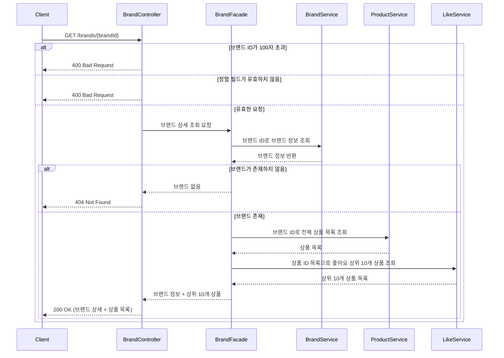
```mermaid
sequenceDiagram
    participant Client
    participant BrandController
    participant BrandFacade
    participant BrandService
    participant ProductService
    participant LikeService

    Client->>BrandController: GET /brands/{brandId}

    alt 브랜드 ID가 100자 초과
        BrandController-->>Client: 400 Bad Request
    else 정렬 필드가 유효하지 않음
        BrandController-->>Client: 400 Bad Request
    else 유효한 요청
        BrandController->>BrandFacade: 브랜드 상세 조회 요청
        BrandFacade->>BrandService: 브랜드 ID로 브랜드 정보 조회
        BrandService-->>BrandFacade: 브랜드 정보 반환

        alt 브랜드가 존재하지 않음
            BrandFacade-->>BrandController: 브랜드 없음
            BrandController-->>Client: 404 Not Found
        else 브랜드 존재
            BrandFacade->>ProductService: 브랜드 ID로 전체 상품 목록 조회
            ProductService-->>BrandFacade: 상품 목록
            BrandFacade->>LikeService: 상품 ID 목록으로 좋아요 상위 10개 상품 조회
            LikeService-->>BrandFacade: 상위 10개 상품 목록
            BrandFacade-->>BrandController: 브랜드 정보 + 상위 10개 상품
            BrandController-->>Client: 200 OK (브랜드 상세 + 상품 목록)
        end
    end
```

# 상품 목록 조회
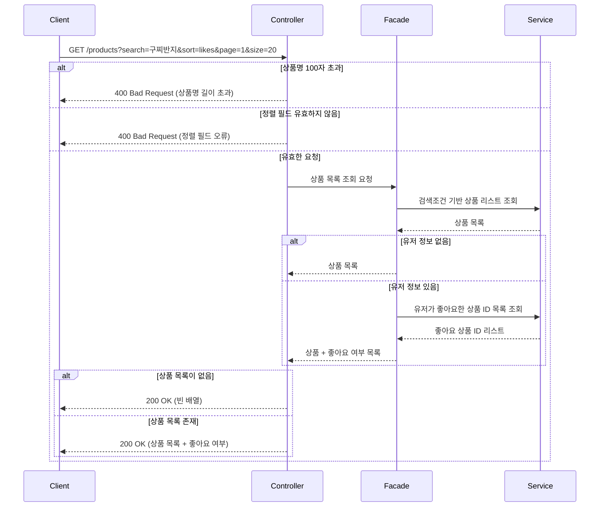
```mermaid
sequenceDiagram
    participant Client
    participant Controller
    participant Facade
    participant Service

    Client->>Controller: GET /products?search=구찌반지&sort=likes&page=1&size=20

    alt 상품명 100자 초과
        Controller-->>Client: 400 Bad Request (상품명 길이 초과)
    else 정렬 필드 유효하지 않음
        Controller-->>Client: 400 Bad Request (정렬 필드 오류)
    else 유효한 요청
        Controller->>Facade: 상품 목록 조회 요청
        Facade->>Service: 검색조건 기반 상품 리스트 조회
        Service-->>Facade: 상품 목록

        alt 유저 정보 없음
            Facade-->>Controller: 상품 목록
        else 유저 정보 있음
            Facade->>Service: 유저가 좋아요한 상품 ID 목록 조회
            Service-->>Facade: 좋아요 상품 ID 리스트
            Facade-->>Controller: 상품 + 좋아요 여부 목록
        end

        alt 상품 목록이 없음
            Controller-->>Client: 200 OK (빈 배열)
        else 상품 목록 존재
            Controller-->>Client: 200 OK (상품 목록 + 좋아요 여부)
        end
    end
```

# 상품 정보 조회
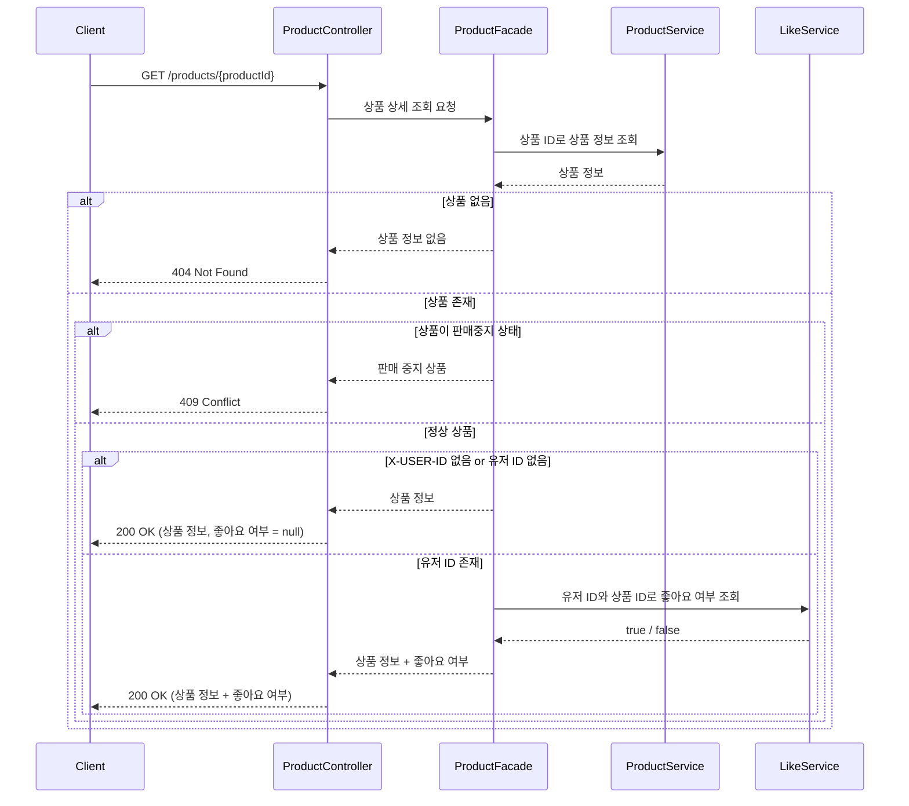
```mermaid
sequenceDiagram
    participant Client
    participant ProductController
    participant ProductFacade
    participant ProductService
    participant LikeService

    Client->>ProductController: GET /products/{productId}

    ProductController->>ProductFacade: 상품 상세 조회 요청

    ProductFacade->>ProductService: 상품 ID로 상품 정보 조회
    ProductService-->>ProductFacade: 상품 정보

    alt 상품 없음
        ProductFacade-->>ProductController: 상품 정보 없음
        ProductController-->>Client: 404 Not Found
    else 상품 존재
        alt 상품이 판매중지 상태
            ProductFacade-->>ProductController: 판매 중지 상품
            ProductController-->>Client: 409 Conflict
        else 정상 상품
            alt X-USER-ID 없음 or 유저 ID 없음
                ProductFacade-->>ProductController: 상품 정보
                ProductController-->>Client: 200 OK (상품 정보, 좋아요 여부 = null)
            else 유저 ID 존재
                ProductFacade->>LikeService: 유저 ID와 상품 ID로 좋아요 여부 조회
                LikeService-->>ProductFacade: true / false
                ProductFacade-->>ProductController: 상품 정보 + 좋아요 여부
                ProductController-->>Client: 200 OK (상품 정보 + 좋아요 여부)
            end
        end
    end
```

# 장바구니 목록 조회
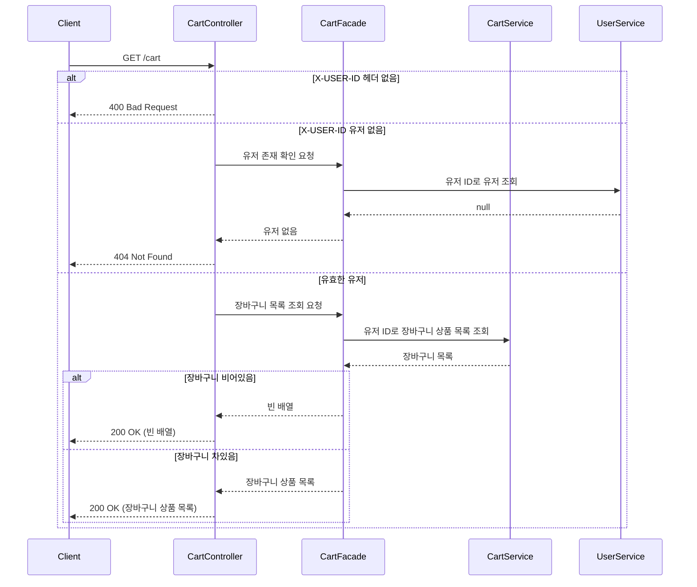
```mermaid
sequenceDiagram
    participant Client
    participant CartController
    participant CartFacade
    participant CartService
    participant UserService

    Client->>CartController: GET /cart

    alt X-USER-ID 헤더 없음
        CartController-->>Client: 400 Bad Request
    else X-USER-ID 유저 없음
        CartController->>CartFacade: 유저 존재 확인 요청
        CartFacade->>UserService: 유저 ID로 유저 조회
        UserService-->>CartFacade: null
        CartFacade-->>CartController: 유저 없음
        CartController-->>Client: 404 Not Found
    else 유효한 유저
        CartController->>CartFacade: 장바구니 목록 조회 요청
        CartFacade->>CartService: 유저 ID로 장바구니 상품 목록 조회
        CartService-->>CartFacade: 장바구니 목록

        alt 장바구니 비어있음
            CartFacade-->>CartController: 빈 배열
            CartController-->>Client: 200 OK (빈 배열)
        else 장바구니 차있음
            CartFacade-->>CartController: 장바구니 상품 목록
            CartController-->>Client: 200 OK (장바구니 상품 목록)
        end
    end
```

# 장바구니에 상품 담기
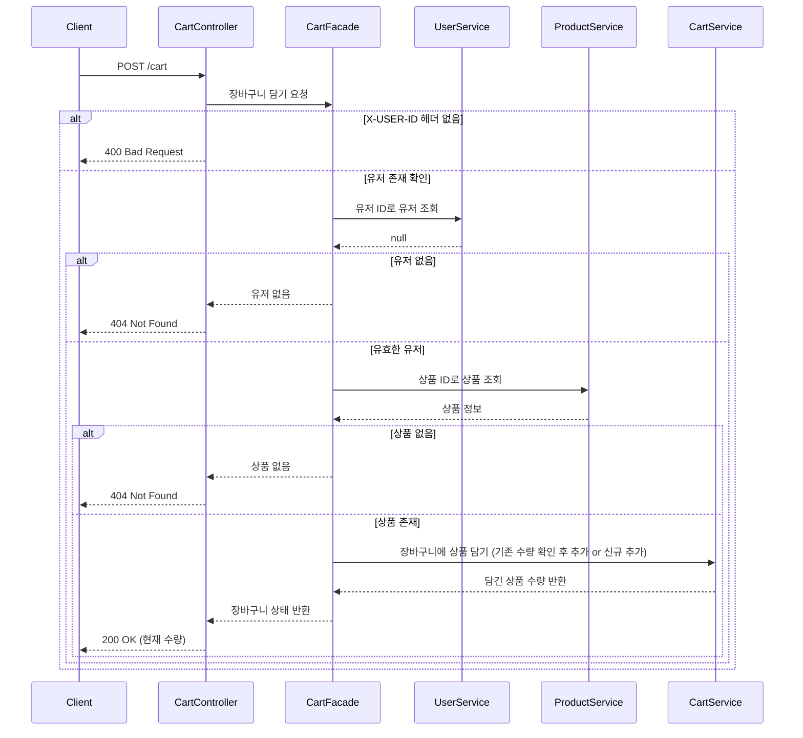
```mermaid
sequenceDiagram
    participant Client
    participant CartController
    participant CartFacade
    participant UserService
    participant ProductService
    participant CartService

    Client->>CartController: POST /cart
    CartController->>CartFacade: 장바구니 담기 요청

    alt X-USER-ID 헤더 없음
        CartController-->>Client: 400 Bad Request
    else 유저 존재 확인
        CartFacade->>UserService: 유저 ID로 유저 조회
        UserService-->>CartFacade: null

        alt 유저 없음
            CartFacade-->>CartController: 유저 없음
            CartController-->>Client: 404 Not Found
        else 유효한 유저
            CartFacade->>ProductService: 상품 ID로 상품 조회
            ProductService-->>CartFacade: 상품 정보
        
            alt 상품 없음
                CartFacade-->>CartController: 상품 없음
                CartController-->>Client: 404 Not Found
            else 상품 존재
                CartFacade->>CartService: 장바구니에 상품 담기 (기존 수량 확인 후 추가 or 신규 추가)
                CartService-->>CartFacade: 담긴 상품 수량 반환
                CartFacade-->>CartController: 장바구니 상태 반환
                CartController-->>Client: 200 OK (현재 수량)
            end
        end
    end
```

# 장바구니에 담긴 상품 제거
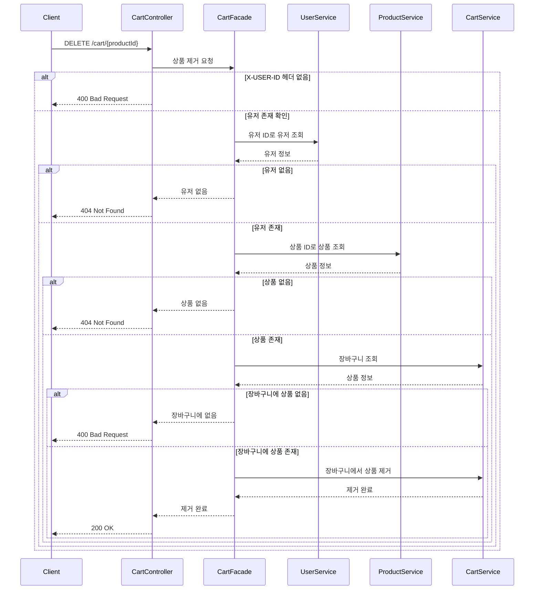
```mermaid
sequenceDiagram
    participant Client
    participant CartController
    participant CartFacade
    participant UserService
    participant ProductService
    participant CartService

    Client->>CartController: DELETE /cart/{productId}
    CartController->>CartFacade: 상품 제거 요청

    alt X-USER-ID 헤더 없음
        CartController-->>Client: 400 Bad Request
    else 유저 존재 확인
        CartFacade->>UserService: 유저 ID로 유저 조회
        UserService-->>CartFacade: 유저 정보

        alt 유저 없음
            CartFacade-->>CartController: 유저 없음
            CartController-->>Client: 404 Not Found
        else 유저 존재
            CartFacade->>ProductService: 상품 ID로 상품 조회
            ProductService-->>CartFacade: 상품 정보

            alt 상품 없음
                CartFacade-->>CartController: 상품 없음
                CartController-->>Client: 404 Not Found
            else 상품 존재
                CartFacade->>CartService: 장바구니 조회
                CartService-->>CartFacade: 상품 정보

                alt 장바구니에 상품 없음
                    CartFacade-->>CartController: 장바구니에 없음
                    CartController-->>Client: 400 Bad Request
                else 장바구니에 상품 존재
                    CartFacade->>CartService: 장바구니에서 상품 제거
                    CartService-->>CartFacade: 제거 완료
                    CartFacade-->>CartController: 제거 완료
                    CartController-->>Client: 200 OK
                end
            end
        end
    end
```

# 좋아요 등록
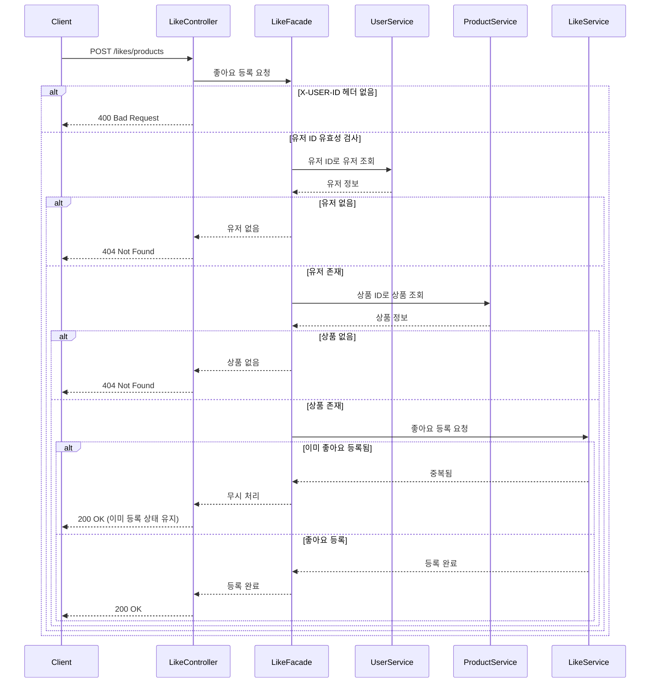
```mermaid
sequenceDiagram
    participant Client
    participant LikeController
    participant LikeFacade
    participant UserService
    participant ProductService
    participant LikeService

    Client->>LikeController: POST /likes/products
    LikeController->>LikeFacade: 좋아요 등록 요청

    alt X-USER-ID 헤더 없음
        LikeController-->>Client: 400 Bad Request
    else 유저 ID 유효성 검사
        LikeFacade->>UserService: 유저 ID로 유저 조회
        UserService-->>LikeFacade: 유저 정보

        alt 유저 없음
            LikeFacade-->>LikeController: 유저 없음
            LikeController-->>Client: 404 Not Found
        else 유저 존재
            LikeFacade->>ProductService: 상품 ID로 상품 조회
            ProductService-->>LikeFacade: 상품 정보

            alt 상품 없음
                LikeFacade-->>LikeController: 상품 없음
                LikeController-->>Client: 404 Not Found
            else 상품 존재
                LikeFacade->>LikeService: 좋아요 등록 요청

                alt 이미 좋아요 등록됨
                    LikeService-->>LikeFacade: 중복됨
                    LikeFacade-->>LikeController: 무시 처리
                    LikeController-->>Client: 200 OK (이미 등록 상태 유지)
                else 좋아요 등록
                    LikeService-->>LikeFacade: 등록 완료
                    LikeFacade-->>LikeController: 등록 완료
                    LikeController-->>Client: 200 OK
                end
            end
        end
    end
```

# 좋아요 취소
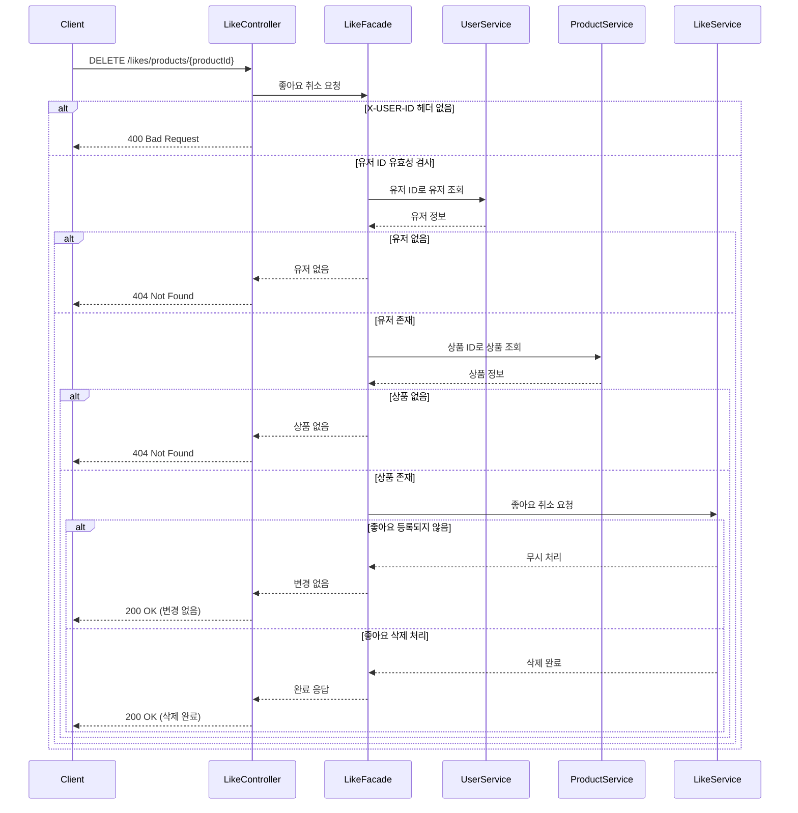
```mermaid
sequenceDiagram
    participant Client
    participant LikeController
    participant LikeFacade
    participant UserService
    participant ProductService
    participant LikeService

    Client->>LikeController: DELETE /likes/products/{productId}
    LikeController->>LikeFacade: 좋아요 취소 요청

    alt X-USER-ID 헤더 없음
        LikeController-->>Client: 400 Bad Request
    else 유저 ID 유효성 검사
        LikeFacade->>UserService: 유저 ID로 유저 조회
        UserService-->>LikeFacade: 유저 정보

        alt 유저 없음
            LikeFacade-->>LikeController: 유저 없음
            LikeController-->>Client: 404 Not Found
        else 유저 존재
            LikeFacade->>ProductService: 상품 ID로 상품 조회
            ProductService-->>LikeFacade: 상품 정보

            alt 상품 없음
                LikeFacade-->>LikeController: 상품 없음
                LikeController-->>Client: 404 Not Found
            else 상품 존재
                LikeFacade->>LikeService: 좋아요 취소 요청

                alt 좋아요 등록되지 않음
                    LikeService-->>LikeFacade: 무시 처리
                    LikeFacade-->>LikeController: 변경 없음
                    LikeController-->>Client: 200 OK (변경 없음)
                else 좋아요 삭제 처리
                    LikeService-->>LikeFacade: 삭제 완료
                    LikeFacade-->>LikeController: 완료 응답
                    LikeController-->>Client: 200 OK (삭제 완료)
                end
            end
        end
    end
```

# 좋아요 상품 목록 조회
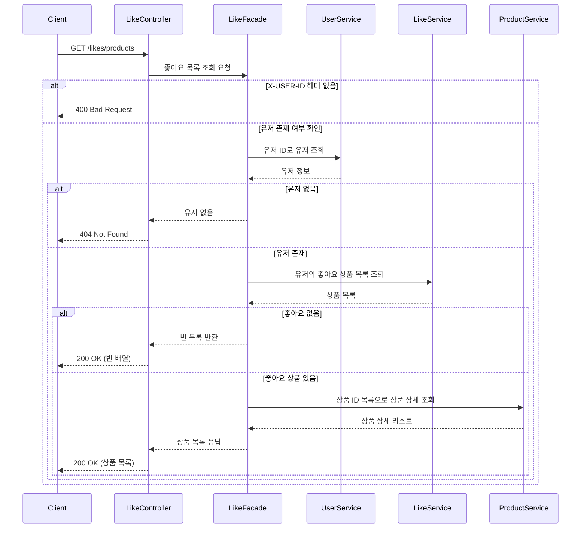
```mermaid
sequenceDiagram
    participant Client
    participant LikeController
    participant LikeFacade
    participant UserService
    participant LikeService
    participant ProductService

    Client->>LikeController: GET /likes/products
    LikeController->>LikeFacade: 좋아요 목록 조회 요청

    alt X-USER-ID 헤더 없음
        LikeController-->>Client: 400 Bad Request
    else 유저 존재 여부 확인
        LikeFacade->>UserService: 유저 ID로 유저 조회
        UserService-->>LikeFacade: 유저 정보

        alt 유저 없음
            LikeFacade-->>LikeController: 유저 없음
            LikeController-->>Client: 404 Not Found
        else 유저 존재
            LikeFacade->>LikeService: 유저의 좋아요 상품 목록 조회
            LikeService-->>LikeFacade: 상품 목록

            alt 좋아요 없음
                LikeFacade-->>LikeController: 빈 목록 반환
                LikeController-->>Client: 200 OK (빈 배열)
            else 좋아요 상품 있음
                LikeFacade->>ProductService: 상품 ID 목록으로 상품 상세 조회
                ProductService-->>LikeFacade: 상품 상세 리스트
                LikeFacade-->>LikeController: 상품 목록 응답
                LikeController-->>Client: 200 OK (상품 목록)
            end
        end
    end
```

# 주문 생성
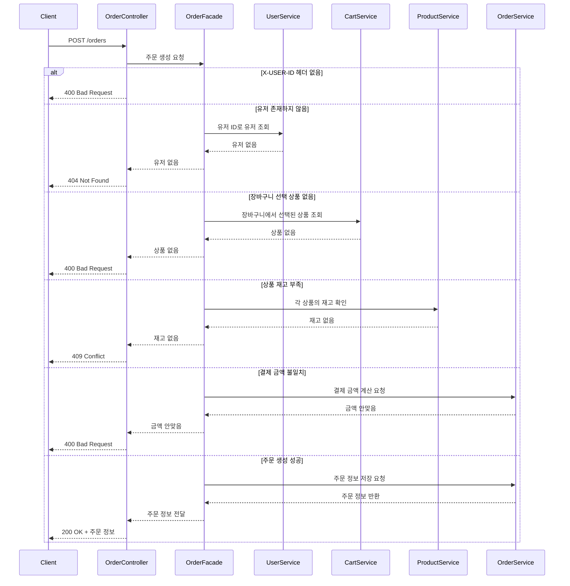
```mermaid
sequenceDiagram
    participant Client
    participant OrderController
    participant OrderFacade
    participant UserService
    participant CartService
    participant ProductService
    participant OrderService

    Client->>OrderController: POST /orders
    OrderController->>OrderFacade: 주문 생성 요청

    alt X-USER-ID 헤더 없음
        OrderController-->>Client: 400 Bad Request
    else 유저 존재하지 않음
        OrderFacade->>UserService: 유저 ID로 유저 조회
        UserService-->>OrderFacade: 유저 없음
        OrderFacade-->>OrderController: 유저 없음
        OrderController-->>Client: 404 Not Found
    else 장바구니 선택 상품 없음
        OrderFacade->>CartService: 장바구니에서 선택된 상품 조회
        CartService-->>OrderFacade: 상품 없음
        OrderFacade-->>OrderController: 상품 없음
        OrderController-->>Client: 400 Bad Request
    else 상품 재고 부족
        OrderFacade->>ProductService: 각 상품의 재고 확인
        ProductService-->>OrderFacade: 재고 없음
        OrderFacade-->>OrderController: 재고 없음
        OrderController-->>Client: 409 Conflict
    else 결제 금액 불일치
        OrderFacade->>OrderService: 결제 금액 계산 요청
        OrderService-->>OrderFacade: 금액 안맞음
        OrderFacade-->>OrderController: 금액 안맞음
        OrderController-->>Client: 400 Bad Request
    else 주문 생성 성공
        OrderFacade->>OrderService: 주문 정보 저장 요청
        OrderService-->>OrderFacade: 주문 정보 반환
        OrderFacade-->>OrderController: 주문 정보 전달
        OrderController-->>Client: 200 OK + 주문 정보
    end
```

# 주문 상세 조회
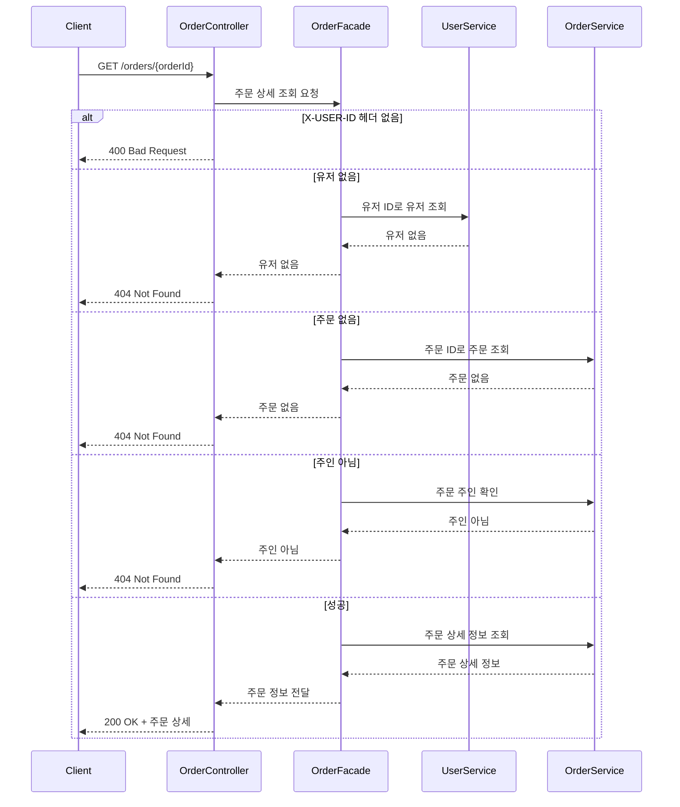
```mermaid
sequenceDiagram
    participant Client
    participant OrderController
    participant OrderFacade
    participant UserService
    participant OrderService

    Client->>OrderController: GET /orders/{orderId}
    OrderController->>OrderFacade: 주문 상세 조회 요청

    alt X-USER-ID 헤더 없음
        OrderController-->>Client: 400 Bad Request
    else 유저 없음
        OrderFacade->>UserService: 유저 ID로 유저 조회
        UserService-->>OrderFacade: 유저 없음
        OrderFacade-->>OrderController: 유저 없음
        OrderController-->>Client: 404 Not Found
    else 주문 없음
        OrderFacade->>OrderService: 주문 ID로 주문 조회
        OrderService-->>OrderFacade: 주문 없음
        OrderFacade-->>OrderController: 주문 없음
        OrderController-->>Client: 404 Not Found
    else 주인 아님
        OrderFacade->>OrderService: 주문 주인 확인
        OrderService-->>OrderFacade: 주인 아님
        OrderFacade-->>OrderController: 주인 아님
        OrderController-->>Client: 404 Not Found
    else 성공
        OrderFacade->>OrderService: 주문 상세 정보 조회
        OrderService-->>OrderFacade: 주문 상세 정보
        OrderFacade-->>OrderController: 주문 정보 전달
        OrderController-->>Client: 200 OK + 주문 상세
    end
```

# 주문 목록 조회
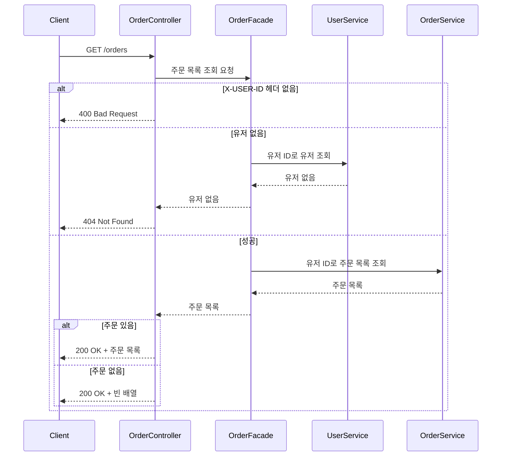
```mermaid
sequenceDiagram
    participant Client
    participant OrderController
    participant OrderFacade
    participant UserService
    participant OrderService

    Client->>OrderController: GET /orders
    OrderController->>OrderFacade: 주문 목록 조회 요청

    alt X-USER-ID 헤더 없음
        OrderController-->>Client: 400 Bad Request
    else 유저 없음
        OrderFacade->>UserService: 유저 ID로 유저 조회
        UserService-->>OrderFacade: 유저 없음
        OrderFacade-->>OrderController: 유저 없음
        OrderController-->>Client: 404 Not Found
    else 성공
        OrderFacade->>OrderService: 유저 ID로 주문 목록 조회
        OrderService-->>OrderFacade: 주문 목록
        OrderFacade-->>OrderController: 주문 목록

        alt 주문 있음
            OrderController-->>Client: 200 OK + 주문 목록
        else 주문 없음
            OrderController-->>Client: 200 OK + 빈 배열
        end
    end
```

# 결제 요청
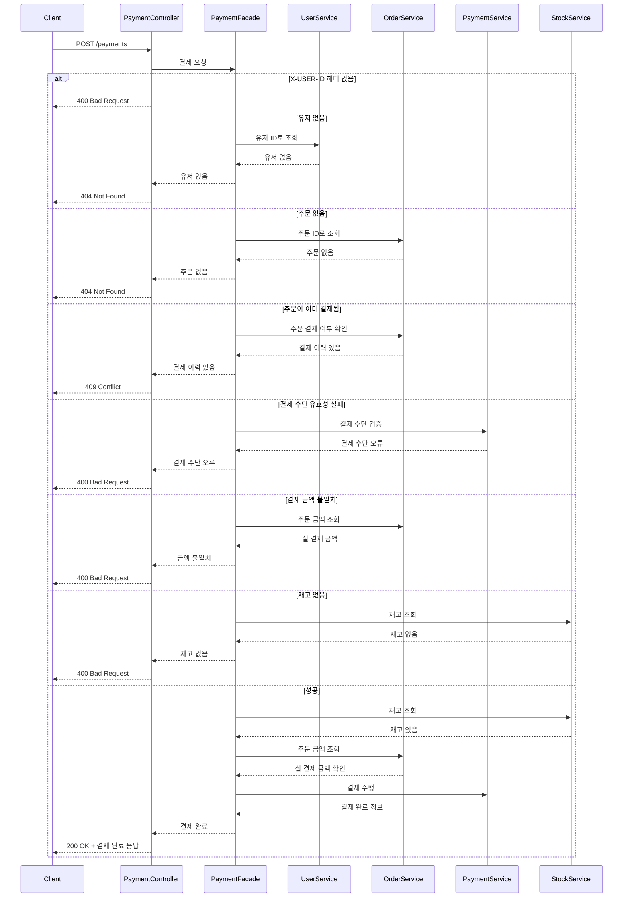
```mermaid
sequenceDiagram
    participant Client
    participant PaymentController
    participant PaymentFacade
    participant UserService
    participant OrderService
    participant PaymentService
    participant StockService

    Client->>PaymentController: POST /payments
    PaymentController->>PaymentFacade: 결제 요청

    alt X-USER-ID 헤더 없음
        PaymentController-->>Client: 400 Bad Request
    else 유저 없음
        PaymentFacade->>UserService: 유저 ID로 조회
        UserService-->>PaymentFacade: 유저 없음
        PaymentFacade-->>PaymentController: 유저 없음
        PaymentController-->>Client: 404 Not Found
    else 주문 없음
        PaymentFacade->>OrderService: 주문 ID로 조회
        OrderService-->>PaymentFacade: 주문 없음
        PaymentFacade-->>PaymentController: 주문 없음
        PaymentController-->>Client: 404 Not Found
    else 주문이 이미 결제됨
        PaymentFacade->>OrderService: 주문 결제 여부 확인
        OrderService-->>PaymentFacade: 결제 이력 있음
        PaymentFacade-->>PaymentController: 결제 이력 있음
        PaymentController-->>Client: 409 Conflict
    else 결제 수단 유효성 실패
        PaymentFacade->>PaymentService: 결제 수단 검증
        PaymentService-->>PaymentFacade: 결제 수단 오류
        PaymentFacade-->>PaymentController: 결제 수단 오류
        PaymentController-->>Client: 400 Bad Request
    else 결제 금액 불일치
        PaymentFacade->>OrderService: 주문 금액 조회
        OrderService-->>PaymentFacade: 실 결제 금액
        PaymentFacade-->>PaymentController: 금액 불일치
        PaymentController-->>Client: 400 Bad Request
    else 재고 없음
        PaymentFacade->>StockService: 재고 조회
        StockService-->>PaymentFacade: 재고 없음
        PaymentFacade-->>PaymentController: 재고 없음
        PaymentController-->>Client: 400 Bad Request
    else 성공
        PaymentFacade->>StockService: 재고 조회
        StockService-->>PaymentFacade: 재고 있음
        PaymentFacade->>OrderService: 주문 금액 조회
        OrderService-->>PaymentFacade: 실 결제 금액 확인
        PaymentFacade->>PaymentService: 결제 수행
        PaymentService-->>PaymentFacade: 결제 완료 정보
        PaymentFacade-->>PaymentController: 결제 완료
        PaymentController-->>Client: 200 OK + 결제 완료 응답
    end
```

# 결제 결과 조회
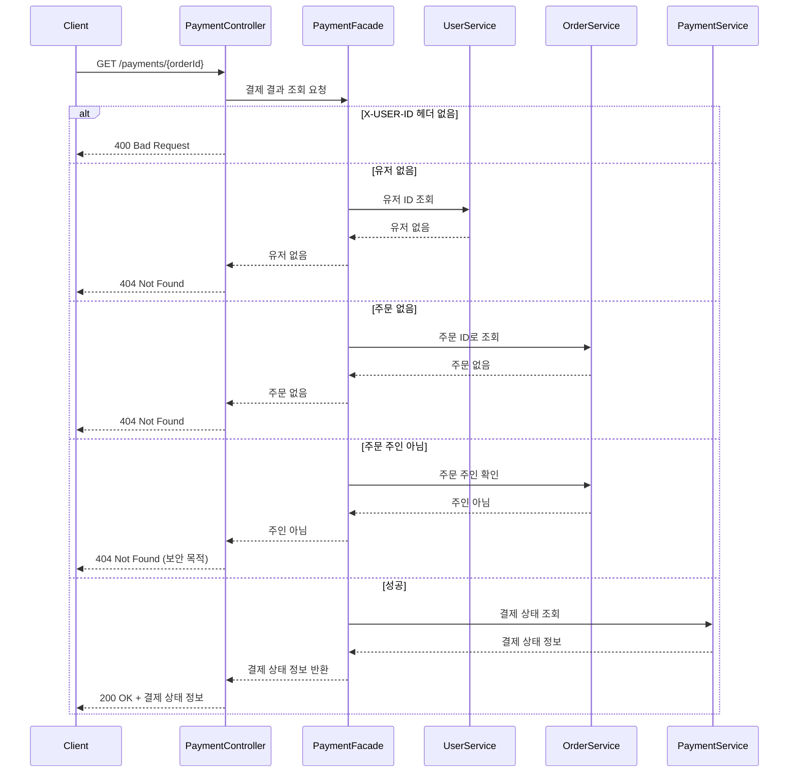
```mermaid
sequenceDiagram
    participant Client
    participant PaymentController
    participant PaymentFacade
    participant UserService
    participant OrderService
    participant PaymentService

    Client->>PaymentController: GET /payments/{orderId}
    PaymentController->>PaymentFacade: 결제 결과 조회 요청

    alt X-USER-ID 헤더 없음
        PaymentController-->>Client: 400 Bad Request
    else 유저 없음
        PaymentFacade->>UserService: 유저 ID 조회
        UserService-->>PaymentFacade: 유저 없음
        PaymentFacade-->>PaymentController: 유저 없음
        PaymentController-->>Client: 404 Not Found
    else 주문 없음
        PaymentFacade->>OrderService: 주문 ID로 조회
        OrderService-->>PaymentFacade: 주문 없음
        PaymentFacade-->>PaymentController: 주문 없음
        PaymentController-->>Client: 404 Not Found
    else 주문 주인 아님
        PaymentFacade->>OrderService: 주문 주인 확인
        OrderService-->>PaymentFacade: 주인 아님
        PaymentFacade-->>PaymentController: 주인 아님
        PaymentController-->>Client: 404 Not Found (보안 목적)
    else 성공
        PaymentFacade->>PaymentService: 결제 상태 조회
        PaymentService-->>PaymentFacade: 결제 상태 정보
        PaymentFacade-->>PaymentController: 결제 상태 정보 반환
        PaymentController-->>Client: 200 OK + 결제 상태 정보
    end
```