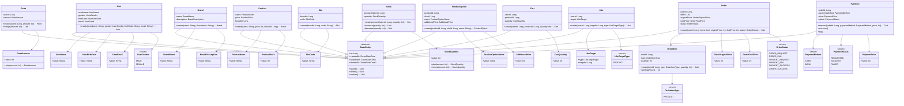

```mermaid
classDiagram

    class BaseEntity {
        <<abstract>>
        +id: Long
        +createdAt: ZonedDateTime
        +updatedAt: ZonedDateTime
        +deletedAt: ZonedDateTime?
        +guard(): Unit
        +delete(): Unit
        +restore(): Unit
    }

    %% 유저 도메인
    User --|> BaseEntity
    User --> UserName
    User --> UserBirthDate
    User --> UserEmail
    User --> UserGender

    class User {
        -userName: UserName
        -gender: UserGender
        -birthDate: UserBirthDate
        -email: UserEmail
        +create(userName: String, gender: UserGender, birthDate: String, email: String): User
    }

    class UserName {
        +value: String
    }
    class UserBirthDate {
        +value: String
    }
    class UserEmail {
        +value: String
    }
    class UserGender {
        <<enum>>
        MALE
        FEMALE
    }

    %% 포인트 도메인
    Point --|> BaseEntity
    Point --> PointAmount
    class Point {
        -userId: Long
        -amount: PointAmount
        +create(userId: Long, amount: Int): Point
        +charge(amount: Int): Unit
    }
    class PointAmount {
        +value: Int
        +plus(amount: Int): PointAmount
    }

    %% 브랜드 도메인
    Brand --|> BaseEntity
    Brand --> BrandName
    Brand --> BrandDescription
    class Brand {
        -name: BrandName
        -description: BrandDescription
        +create(name: String, description: String): Brand
    }
    class BrandName {
        +value: String
    }
    class BrandDescription {
        +value: String
    }

    %% 상품 도메인
    Product --|> BaseEntity
    Product --> ProductName
    Product --> ProductPrice

    class Product {
        -name: ProductName
        -price: ProductPrice
        -brandId: Long
        +create(name: String, price: Int, brandId: Long): Brand
    }
    class ProductName {
        +value: String
    }
    class ProductPrice {
        +value: Int
    }

    ProductOption --|> BaseEntity
    ProductOption --> ProductOptionName
    ProductOption --> AdditionalPrice
    class ProductOption {
        -productId: Long
        -skuId: Long
        -name: ProductOptionName
        -additionalPrice: AdditionalPrice
        +create(productId: Long, skuId: Long, name: String): ProductOption
    }

    class ProductOptionName {
        +value: String
    }
    class AdditionalPrice {
        +value: Int
    }

    Sku --|> BaseEntity
    Sku --> SkuCode
    class Sku {
        -brandId: Long
        -code: SkuCode
        +create(brandId: Long, code: String): Sku
    }
    class SkuCode {
        +value: String
    }

    Stock --|> BaseEntity
    Stock --> StockQuantity
    class Stock {
        -productOptionId: Long
        -quantity: StockQuantity
        +create(productOptionId: Long, quantity: Int): Sku
        +increase(quantity: Int): Unit
        +decrease(quantity: Int): Unit
    }
    class StockQuantity {
        +value: Int
        +plus(amount: Int): StockQuantity
        +minus(amount: Int): StockQuantity
    }

    %% 좋아요 도메인
    Like --|> BaseEntity
    Like --> LikeTarget
    class Like {
        -userId: Long
        -target: LikeTarget
        +create(userId: Long, targetId: Long, type: LikeTargetType): Like
    }
    Like --> LikeTargetType
    class LikeTarget {
        +type: LikeTargetType
        +targetId: Long
    }
    class LikeTargetType {
        <<enum>>
        PRODUCT
    }

    %% 장바구니 도메인
    Cart --|> BaseEntity
    Cart --> CartQuantity
    class Cart {
        -userId: Long
        -productId: Long
        -quantity: CartQuantity
        +create(userId: Long, productId: Long, quantity: Int): Cart
    }
    class CartQuantity {
        +value: Int
    }

    %% 주문 도메인
    Order --|> BaseEntity
    Order --> OrderItem
    Order --> OrderOriginalPrice
    Order --> OrderFinalPrice
    Order --> OrderStatus
    class Order {
        -userId: Long
        -items: List<OrderItem>
        -originalPrice: OrderOriginalPrice
        -totalPrice: OrderFinalPrice
        -status: OrderStatus
        +create(userId: Long, items: List<OrderItem>, originalPrice: Int, finalPrice: Int, status: OrderStatus): Cart
    }
    class OrderOriginalPrice {
        +value: Int
    }
    class OrderFinalPrice {
        +value: Int
    }
    class OrderStatus {
        <<enum>>
        ORDER_REQUEST
        ORDER_FAIL
        PAYMENT_REQUEST
        PAYMENT_FAIL
        PAYMENT_SUCCESS
        ORDER_SUCCESS
        ..
    }

    OrderItem --> OrderItemType
    class OrderItem {
        -itemId: Long
        -type: OrderItemType
        -quantity: Int
        +create(itemId: Long, type: OrderItemType, quantity: Int): Cart
        +getTotalPrice(): Int
    }
    class OrderItemType {
        <<enum>>
        PRODUCT
    }

    %% 결제 도메인
    Payment --|> BaseEntity
    Payment --> PaymentMethod
    Payment --> PaymentStatus
    Payment --> PaymentPrice
    class Payment {
        -orderId: Long
        -paymentMethod: PaymentMethod
        -price: PaymentPrice
        -status: PaymentStatus
        +request(orderId: Long, paymentMethod: PaymentMethod, price: Int): Cart
        +success()
        +fail()
    }
    class PaymentPrice {
        +value: Int
    }
    class PaymentMethod {
        <<enum>>
        CARD
        BANK
    }
    class PaymentStatus {
        <<enum>>
        REQUESTED
        SUCCESS
        FAILED
        ..
    }
```