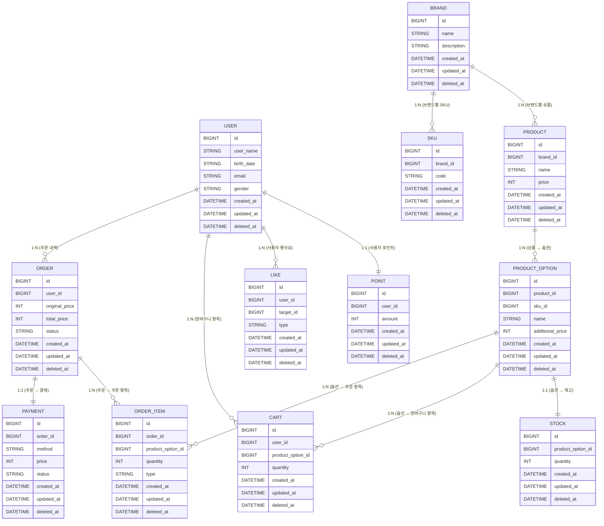

```mermaid
erDiagram

    %% 사용자 도메인
    USER ||--|| POINT : "1:1 (사용자 포인트)"
    USER ||--o{ LIKE : "1:N (사용자 좋아요)"
    USER ||--o{ CART : "1:N (장바구니 항목)"
    USER ||--o{ ORDER : "1:N (주문 내역)"

    USER {
        BIGINT id
        STRING user_name
        STRING birth_date
        STRING email
        STRING gender
        DATETIME created_at
        DATETIME updated_at
        DATETIME deleted_at
    }

    POINT {
        BIGINT id
        BIGINT user_id
        INT amount
        DATETIME created_at
        DATETIME updated_at
        DATETIME deleted_at
    }

    %% 브랜드 도메인
    BRAND ||--o{ PRODUCT : "1:N (브랜드별 상품)"
    BRAND ||--o{ SKU : "1:N (브랜드별 SKU)"

    BRAND {
        BIGINT id
        STRING name
        STRING description
        DATETIME created_at
        DATETIME updated_at
        DATETIME deleted_at
    }

    %% 상품 도메인
    PRODUCT ||--o{ PRODUCT_OPTION : "1:N (상품 → 옵션)"
    PRODUCT_OPTION ||--|| STOCK : "1:1 (옵션 → 재고)"
    PRODUCT_OPTION ||--o{ CART : "1:N (옵션 → 장바구니 항목)"
    PRODUCT_OPTION ||--o{ ORDER_ITEM : "1:N (옵션 → 주문 항목)"

    PRODUCT {
        BIGINT id
        BIGINT brand_id
        STRING name
        INT price
        DATETIME created_at
        DATETIME updated_at
        DATETIME deleted_at
    }

    PRODUCT_OPTION {
        BIGINT id
        BIGINT product_id
        BIGINT sku_id
        STRING name
        INT additional_price
        DATETIME created_at
        DATETIME updated_at
        DATETIME deleted_at
    }

    SKU {
        BIGINT id
        BIGINT brand_id
        STRING code
        DATETIME created_at
        DATETIME updated_at
        DATETIME deleted_at
    }

    STOCK {
        BIGINT id
        BIGINT product_option_id
        INT quantity
        DATETIME created_at
        DATETIME updated_at
        DATETIME deleted_at
    }

    %% 좋아요 도메인
    LIKE {
        BIGINT id
        BIGINT user_id
        BIGINT target_id
        STRING type
        DATETIME created_at
        DATETIME updated_at
        DATETIME deleted_at
    }

    %% 장바구니 도메인
    CART {
        BIGINT id
        BIGINT user_id
        BIGINT product_option_id
        INT quantity
        DATETIME created_at
        DATETIME updated_at
        DATETIME deleted_at
    }

    %% 주문 도메인
    ORDER ||--o{ ORDER_ITEM : "1:N (주문 → 주문 항목)"
    ORDER ||--|| PAYMENT : "1:1 (주문 → 결제)"

    ORDER {
        BIGINT id
        BIGINT user_id
        INT original_price
        INT total_price
        STRING status
        DATETIME created_at
        DATETIME updated_at
        DATETIME deleted_at
    }

    ORDER_ITEM {
        BIGINT id
        BIGINT order_id
        BIGINT product_option_id
        INT quantity
        STRING type
        DATETIME created_at
        DATETIME updated_at
        DATETIME deleted_at
    }

    %% 결제 도메인
    PAYMENT {
        BIGINT id
        BIGINT order_id
        STRING method
        INT price
        STRING status
        DATETIME created_at
        DATETIME updated_at
        DATETIME deleted_at
    }
```