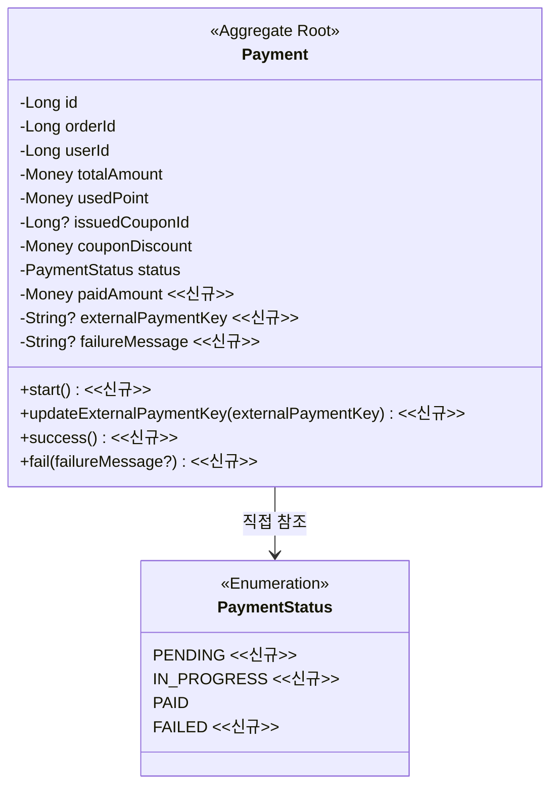
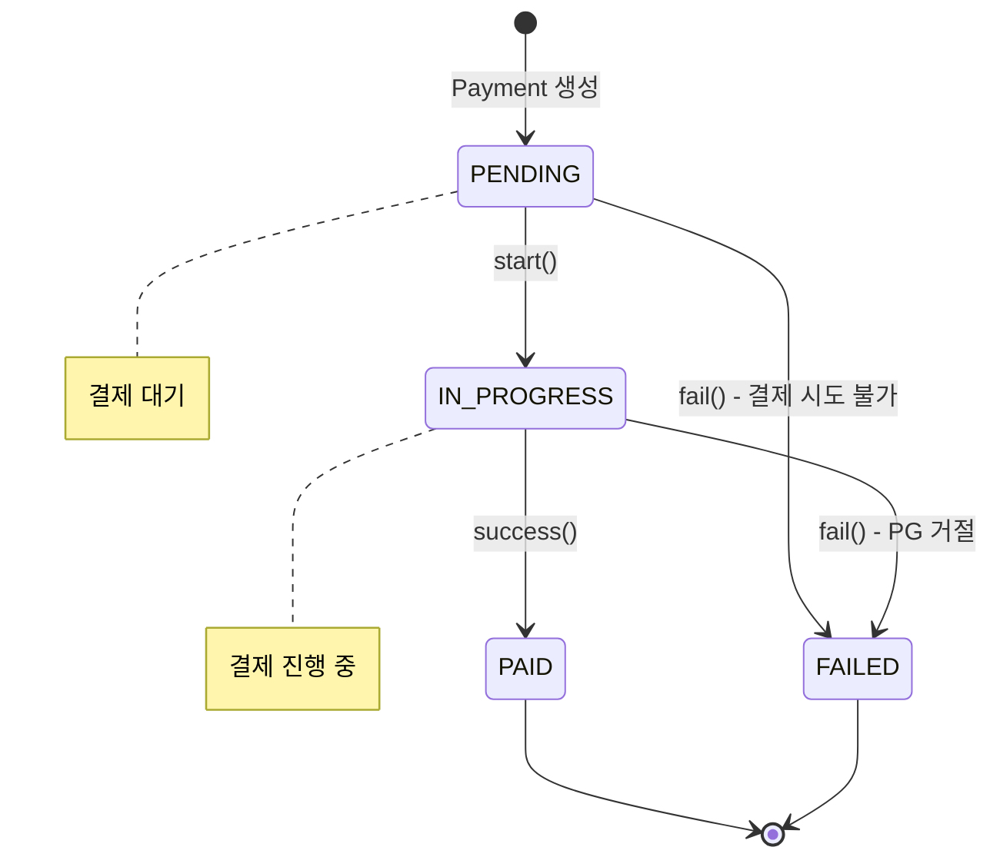
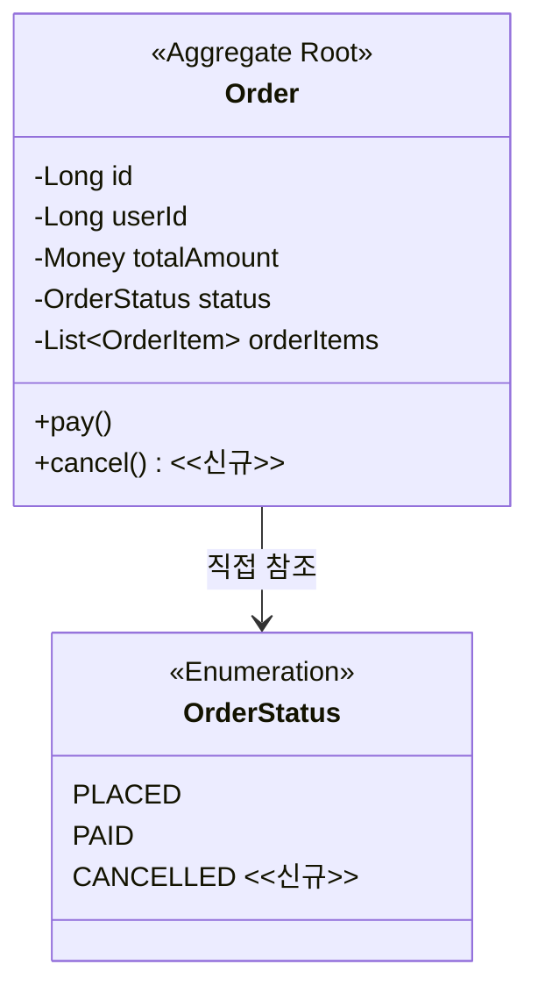
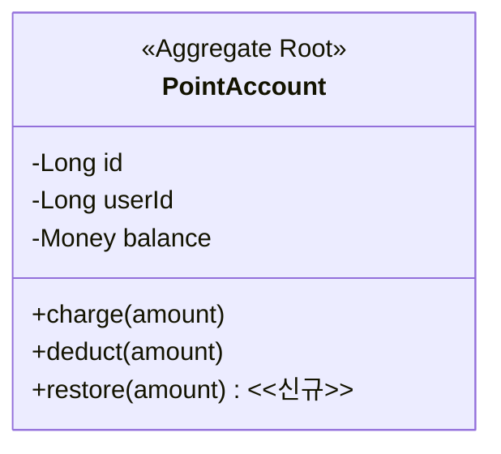
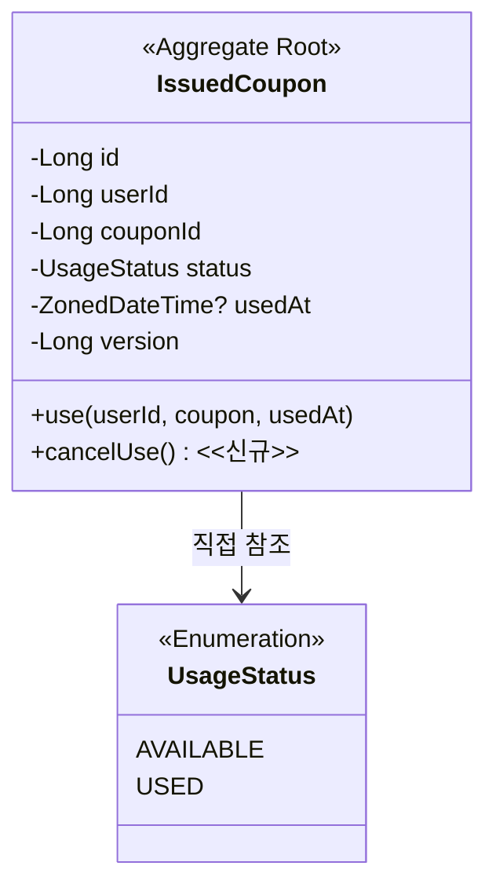
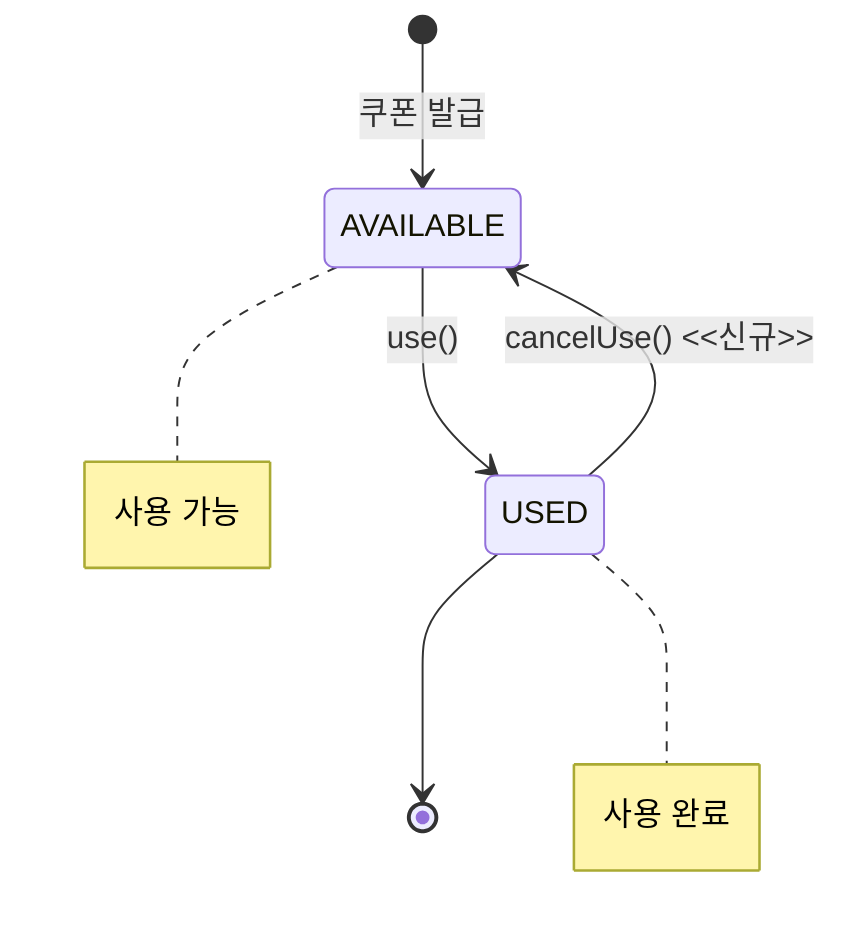

# PG 연동 Resilience 도메인 모델링 문서

## 개요

PG 연동을 위해 변경이 필요한 도메인들을 정리합니다. 변경사항 관점에서 작성하며, 신규 항목은 `<<신규>>`로 표시합니다.

**영향받는 도메인**
- Payment: 상태 확장 및 카드 결제 지원 (핵심 변경)
- Order: 주문 취소 상태 추가
- Point: 포인트 복구 기능 추가
- Coupon: 쿠폰 사용 취소 기능 추가
- Product: 변경 없음 (기존 Stock.increase() 활용)

---

## 1. Payment 도메인 (핵심 변경)

### 1.1 변경 배경

기존에는 포인트로만 결제하여 즉시 PAID 상태로 생성되었습니다. PG 연동으로 인해 비동기 결제를 지원해야 하며, PENDING → IN_PROGRESS → PAID/FAILED 상태 전이가 필요합니다.

### 1.2 클래스 다이어그램

### 1.3 도메인 규칙

**Payment 생성 규칙 (PENDING 상태)**

Payment는 PG 호출 전에 PENDING 상태로 먼저 생성됩니다.

생성 시 검증 규칙:
- `usedPoint >= 0` 이어야 함 (위반 시: "사용 포인트는 0 이상이어야 합니다")
- `paidAmount >= 0` 이어야 함 (위반 시: "카드 결제 금액은 0 이상이어야 합니다")
- `usedPoint + paidAmount + couponDiscount == totalAmount` 이어야 함 (위반 시: "결제 금액이 주문 금액과 일치하지 않습니다")

**Payment.start() 규칙**

- 사전조건: `status == PENDING` (위반 시: "결제 대기 상태에서만 결제를 시작할 수 있습니다")
- 상태 전이: PENDING → IN_PROGRESS

**Payment.updateExternalPaymentKey() 규칙**

- 사전조건: `status == IN_PROGRESS` (위반 시: "결제 진행 중 상태에서만 외부 결제 키를 저장할 수 있습니다")
- 부가 효과: `externalPaymentKey` 저장

**Payment.success() 규칙**

- 사전조건: `status == IN_PROGRESS` (위반 시: "결제 진행 중 상태에서만 성공 처리할 수 있습니다")
- 상태 전이: IN_PROGRESS → PAID

**Payment.fail() 규칙**

- 사전조건: `status == PENDING` 또는 `status == IN_PROGRESS` (위반 시: "이미 처리된 결제입니다")
- 상태 전이: PENDING → FAILED 또는 IN_PROGRESS → FAILED
- 부가 효과: `failureMessage` 저장 (nullable)

### 1.4 상태 다이어그램

### 상태 전이 규칙

| 현재 상태 | 이벤트 | 다음 상태 | 전이 조건 | 부가 효과 |
|----------|--------|----------|----------|----------|
| - | Payment 생성 | PENDING | 금액 검증 통과 | - |
| PENDING | start() | IN_PROGRESS | status == PENDING | - |
| PENDING | fail() | FAILED | status == PENDING | failureMessage 저장 |
| IN_PROGRESS | success() | PAID | status == IN_PROGRESS | - |
| IN_PROGRESS | fail() | FAILED | status == IN_PROGRESS | failureMessage 저장 |

---

## 2. Order 도메인

### 2.1 변경 배경

결제 실패 시 주문을 취소 상태로 변경해야 합니다. Order는 주문의 최종 결과만 관리하고, 결제 진행 상태는 Payment가 담당합니다. 이를 통해 Payment와 Order 간 상태 중복을 방지하고, 향후 재결제나 부분 결제 확장에 유리한 구조를 유지합니다.

### 2.2 클래스 다이어그램

### 2.3 도메인 규칙

**Order.cancel() 규칙**

- 사전조건: `status == PLACED` (위반 시: "주문 대기 상태에서만 취소할 수 있습니다")
- 상태 전이: PLACED → CANCELLED

**향후 과제**: 취소 사유 구분(결제 실패, 사용자 취소, 관리자 취소 등)은 취소 기능 추가 시 설계

---

## 3. Point 도메인

### 3.1 변경 배경

결제 실패 시 차감했던 포인트를 복구해야 합니다. 기존 `charge()`는 "충전"의 의미이므로, 복구를 위한 별도 메서드를 추가합니다.

### 3.2 클래스 다이어그램

### 3.3 도메인 규칙

**PointAccount.restore() 규칙**

- 사전조건: `amount > 0` (위반 시: "복구 금액은 양수여야 합니다")
- 부가 효과: `balance = balance + amount`

---

## 4. Coupon 도메인

### 4.1 변경 배경

결제 실패 시 사용했던 쿠폰을 복구해야 합니다. 기존 `use()`는 AVAILABLE → USED 단방향 전이만 지원했으므로, 역방향 전이를 위한 메서드를 추가합니다.

### 4.2 클래스 다이어그램

### 4.3 도메인 규칙

**IssuedCoupon.cancelUse() 규칙**

- 사전조건: `status == USED` (위반 시: "사용되지 않은 쿠폰입니다")
- 상태 전이: USED → AVAILABLE
- 부가 효과: `usedAt = null`

### 4.4 상태 다이어그램

### 상태 전이 규칙

| 현재 상태 | 이벤트 | 다음 상태 | 전이 조건 | 부가 효과 |
|----------|--------|----------|----------|----------|
| - | 쿠폰 발급 | AVAILABLE | 중복 발급 검증 통과 | - |
| AVAILABLE | use() | USED | status == AVAILABLE | usedAt 기록 |
| USED | cancelUse() | AVAILABLE | status == USED | usedAt = null |

---

## 5. Product 도메인

### 5.1 변경 사항

변경 없음. 결제 실패 시 재고 복구는 기존 `Stock.increase()` 메서드를 그대로 활용합니다.

기존 규칙:
- 사전조건: `amount > 0` (위반 시: "재고 증가량은 0보다 커야 합니다")
