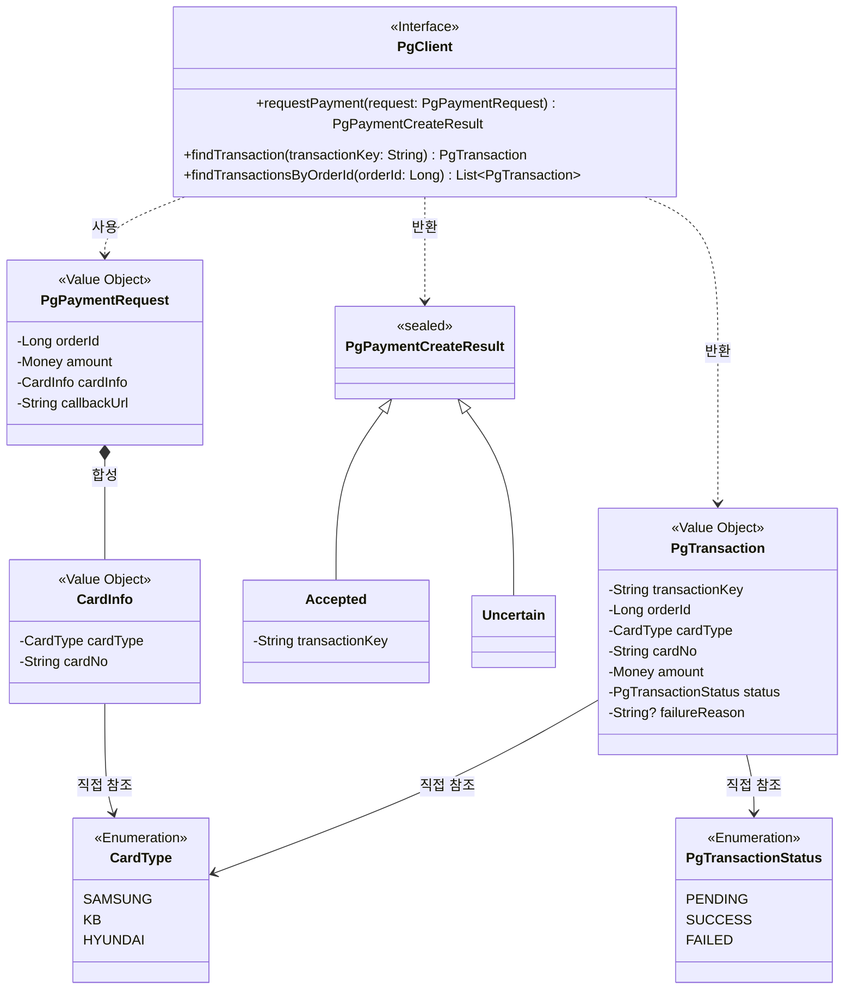
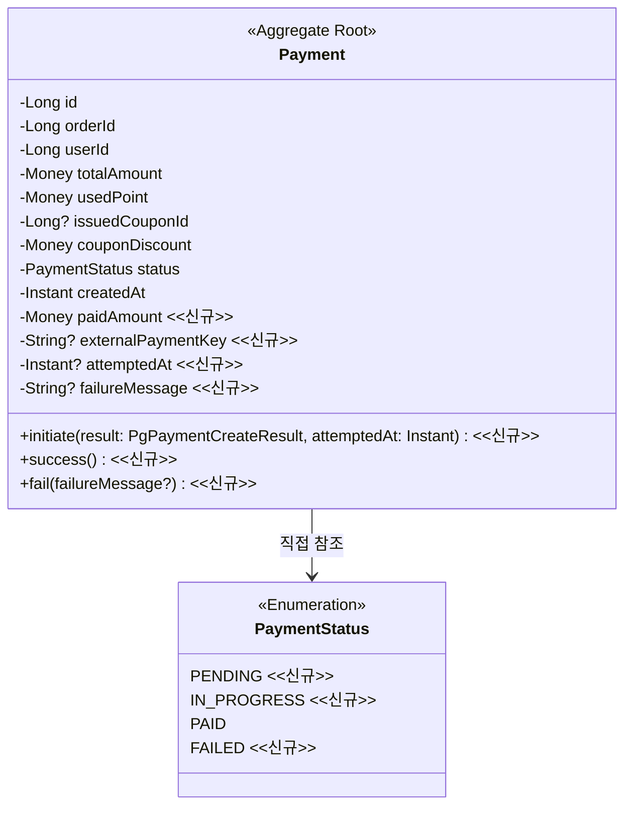
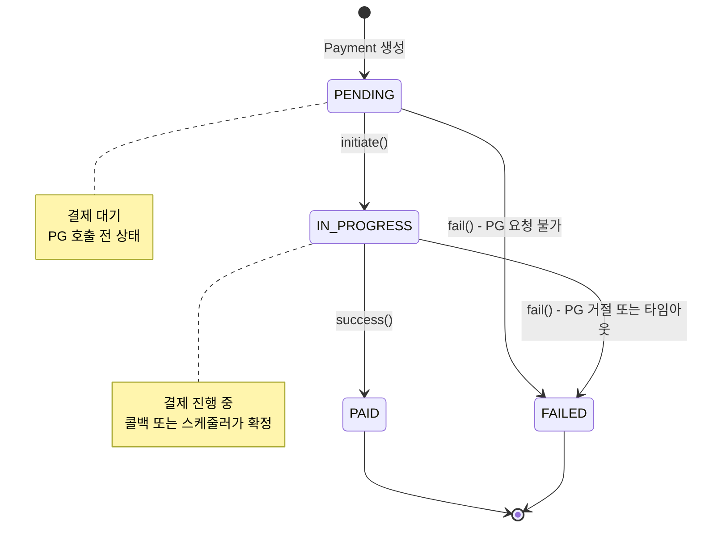
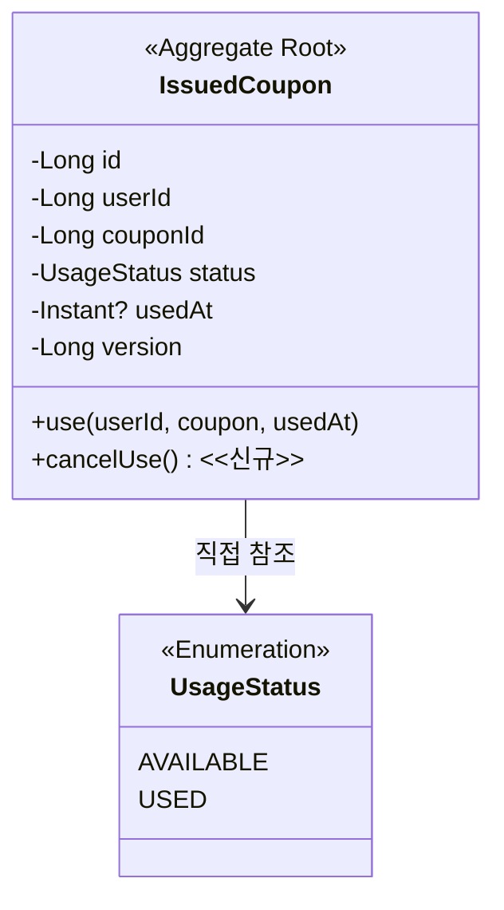

# PG 연동 Resilience 도메인 모델링 문서

## 개요

PG 연동을 위해 변경이 필요한 도메인들을 정리합니다. 변경사항 관점에서 작성하며, 신규 항목은 `<<신규>>`로 표시합니다.

**영향받는 도메인**
- Payment: 상태 확장 및 카드 결제 지원 (핵심 변경)
- Order: 주문 취소 상태 추가
- Point: 포인트 복구 기능 추가
- Coupon: 쿠폰 사용 취소 기능 추가
- Product: 변경 없음 (기존 Stock.increase() 활용)

---

## 1. 공통 정의 <<신규>>

### 1.1 PG Client 추상화

PG 연동을 위한 인터페이스를 도메인 레이어에서 정의합니다. 실제 PG사 구현체는 인프라 레이어에 위치하며, 의존성 역전을 통해 도메인이 인프라에 의존하지 않도록 합니다.

### 1.2 용어 정의

| 용어 | 정의 |
|-----|-----|
| Transaction | PG에서 관리하는 개별 결제 건. transactionKey로 식별 |
| transactionKey | PG가 발급하는 결제 건 고유 식별자. Payment의 externalPaymentKey에 저장 |
| Accepted | PG가 결제 요청을 정상 수신하여 transactionKey를 발급한 상태 |
| Uncertain | Read Timeout 등으로 요청 도달 여부가 불확실한 상태. transactionKey 없음 |

### 1.3 PgClient 규칙

**requestPayment() 규칙**

| 결과 | 조건 | 설명 |
|-----|------|------|
| Accepted | PG가 정상 응답 | transactionKey 포함 |
| Uncertain | Read Timeout, Connection Reset | 요청 도달 여부 불확실, transactionKey 없음 |
| 예외 발생 | 서킷 오픈, Connection Timeout, 500/429 | 요청 미도달 확실, 인프라에서 예외 처리 |

**CardInfo 검증 규칙**

| 필드 | 검증 규칙 |
|-----|----------|
| cardType | SAMSUNG, KB, HYUNDAI 중 하나 |
| cardNo | `xxxx-xxxx-xxxx-xxxx` 형식 (숫자 4자리-4자리-4자리-4자리) |

**findTransactionsByOrderId() 사용 조건**

externalPaymentKey가 없는 경우(Uncertain 상태로 시작한 경우)에만 사용합니다. orderId로 조회하여 amount가 일치하는 확정 건을 찾습니다.

---

## 2. Payment 도메인 (핵심 변경)

### 2.1 변경 배경

기존에는 포인트로만 결제하여 즉시 PAID 상태로 생성되었습니다. PG 연동으로 인해 비동기 결제를 지원해야 하며, PENDING → IN_PROGRESS → PAID/FAILED 상태 전이가 필요합니다.

### 2.2 클래스 다이어그램

### 2.3 도메인 규칙

#### 2.3.1 Payment 생성 규칙

Payment는 PG 호출 전에 PENDING 상태로 먼저 생성됩니다.

**생성 시 검증 규칙**
- `usedPoint >= 0` 이어야 함 (위반 시: "사용 포인트는 0 이상이어야 합니다")
- `paidAmount >= 0` 이어야 함 (위반 시: "카드 결제 금액은 0 이상이어야 합니다")
- `usedPoint + paidAmount + couponDiscount == totalAmount` 이어야 함 (위반 시: "결제 금액이 주문 금액과 일치하지 않습니다")

#### 2.3.2 Payment 상태 전이 규칙

**Payment.initiate(result, attemptedAt) 규칙**
- 사전조건: `status == PENDING` (위반 시: "결제 대기 상태에서만 결제를 개시할 수 있습니다")
- 상태 전이: PENDING → IN_PROGRESS
- 부가 효과:
  - `attemptedAt` 저장
  - `Accepted` → `externalPaymentKey = transactionKey` 저장
  - `Uncertain` → `externalPaymentKey = null` 유지

**Payment.success() 규칙**
- 사전조건: `status == IN_PROGRESS` (위반 시: "결제 진행 중 상태에서만 성공 처리할 수 있습니다")
- 상태 전이: IN_PROGRESS → PAID

**Payment.fail(failureMessage?) 규칙**
- 사전조건: `status == PENDING` 또는 `status == IN_PROGRESS` (위반 시: "이미 처리된 결제입니다")
- 상태 전이: PENDING → FAILED 또는 IN_PROGRESS → FAILED
- 부가 효과: `failureMessage` 저장 (nullable)

#### 2.3.3 결제 확정 규칙 <<신규>>

Application Service(PaymentConfirmationService)가 PG 조회 결과를 해석하여 Payment 상태를 확정합니다. Payment 엔티티는 PG 응답을 직접 알지 못하며, Application Service가 결과를 해석한 후 `success()` 또는 `fail()`을 호출합니다.

**confirmPayment 처리 로직**

| PG 조회 결과 | 경과 시간 | 처리 |
|-------------|----------|------|
| SUCCESS 건 존재 | - | `payment.success()` 호출, externalPaymentKey 저장 |
| FAILED 건만 존재 | - | `payment.fail()` 호출 + 보상 트랜잭션 |
| 조회 결과 없음 | - | `payment.fail()` 호출 + 보상 트랜잭션 (요청 미도달) |
| PENDING 건만 존재 | 5분 미경과 | 상태 유지 (다음 스케줄에 재확인) |
| PENDING 건만 존재 | 5분 경과 | `payment.fail()` 호출 + 보상 트랜잭션 (강제 실패) |

**경과 시간 기준**: `attemptedAt`으로부터 5분

**보상 트랜잭션 순서**

결제 실패 시 Application Service가 다음 순서로 리소스를 복구합니다:
1. `payment.fail(failureMessage)` - 결제 실패 처리
2. `pointAccount.restore(usedPoint)` - 포인트 복구
3. `issuedCoupon.cancelUse()` - 쿠폰 사용 취소 (사용한 경우)
4. `stock.increase(quantity)` - 재고 복구

**externalPaymentKey 조회 전략**

| 조건 | 조회 방식 |
|-----|----------|
| externalPaymentKey 있음 | `pgClient.findTransaction(transactionKey)` 단건 조회 |
| externalPaymentKey 없음 | `pgClient.findTransactionsByOrderId(orderId)` 목록 조회 후 amount 일치 건 탐색 |

### 2.4 상태 다이어그램

### 상태 전이 규칙

| 현재 상태 | 이벤트 | 다음 상태 | 전이 조건 | 부가 효과 |
|----------|--------|----------|----------|----------|
| - | Payment 생성 | PENDING | 금액 검증 통과 | - |
| PENDING | initiate() | IN_PROGRESS | status == PENDING | attemptedAt 저장, externalPaymentKey 저장 (Accepted인 경우) |
| PENDING | fail() | FAILED | status == PENDING | failureMessage 저장 |
| IN_PROGRESS | success() | PAID | status == IN_PROGRESS | - |
| IN_PROGRESS | fail() | FAILED | status == IN_PROGRESS | failureMessage 저장 |

---

## 3. Order 도메인

### 3.1 변경 배경

결제 실패 시 주문을 취소 상태로 변경해야 합니다. Order는 주문의 최종 결과만 관리하고, 결제 진행 상태는 Payment가 담당합니다. 이를 통해 Payment와 Order 간 상태 중복을 방지하고, 향후 재결제나 부분 결제 확장에 유리한 구조를 유지합니다.

### 3.2 클래스 다이어그램

### 3.3 도메인 규칙

**Order.cancel() 규칙**
- 사전조건: `status == PLACED` (위반 시: "주문 대기 상태에서만 취소할 수 있습니다")
- 상태 전이: PLACED → CANCELLED

**향후 과제**: 취소 사유 구분(결제 실패, 사용자 취소, 관리자 취소 등)은 취소 기능 추가 시 설계

---

## 4. Point 도메인

### 4.1 변경 배경

결제 실패 시 차감했던 포인트를 복구해야 합니다. 기존 `charge()`는 "충전"의 의미이므로, 복구를 위한 별도 메서드를 추가합니다.

### 4.2 클래스 다이어그램

### 4.3 도메인 규칙

**PointAccount.restore() 규칙**
- 사전조건: `amount > 0` (위반 시: "복구 금액은 양수여야 합니다")
- 부가 효과: `balance = balance + amount`

---

## 5. Coupon 도메인

### 5.1 변경 배경

결제 실패 시 사용했던 쿠폰을 복구해야 합니다. 기존 `use()`는 AVAILABLE → USED 단방향 전이만 지원했으므로, 역방향 전이를 위한 메서드를 추가합니다.

### 5.2 클래스 다이어그램

### 5.3 도메인 규칙

**IssuedCoupon.cancelUse() 규칙**
- 사전조건: `status == USED` (위반 시: "사용되지 않은 쿠폰입니다")
- 상태 전이: USED → AVAILABLE
- 부가 효과: `usedAt = null`

### 5.4 상태 다이어그램

### 상태 전이 규칙

| 현재 상태 | 이벤트 | 다음 상태 | 전이 조건 | 부가 효과 |
|----------|--------|----------|----------|----------|
| - | 쿠폰 발급 | AVAILABLE | 중복 발급 검증 통과 | - |
| AVAILABLE | use() | USED | status == AVAILABLE | usedAt 기록 |
| USED | cancelUse() | AVAILABLE | status == USED | usedAt = null |

---

## 6. Product 도메인

### 6.1 변경 사항

변경 없음. 결제 실패 시 재고 복구는 기존 `Stock.increase()` 메서드를 그대로 활용합니다.

기존 규칙:
- 사전조건: `amount > 0` (위반 시: "재고 증가량은 0보다 커야 합니다")
