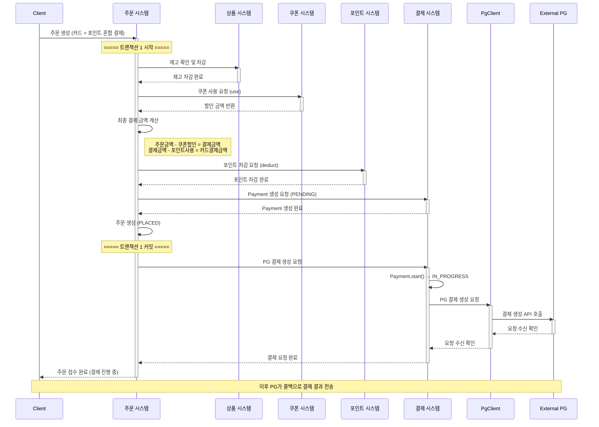
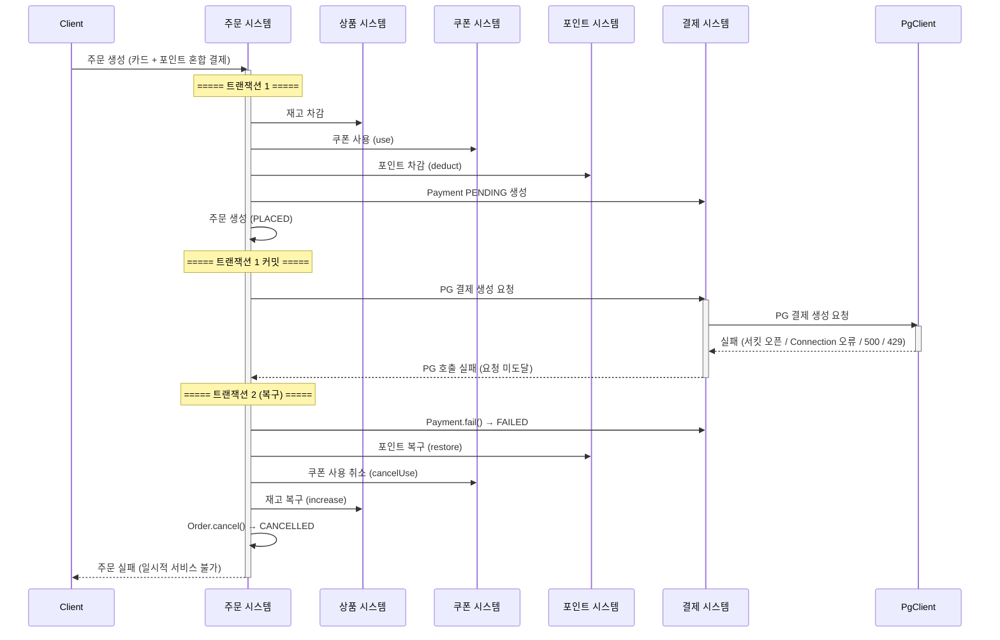
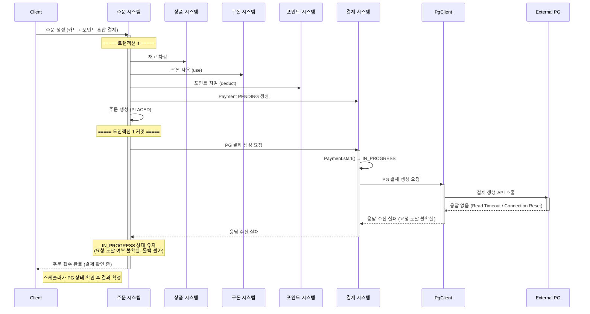
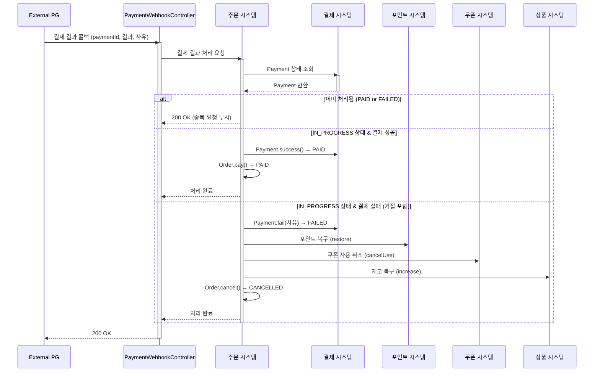
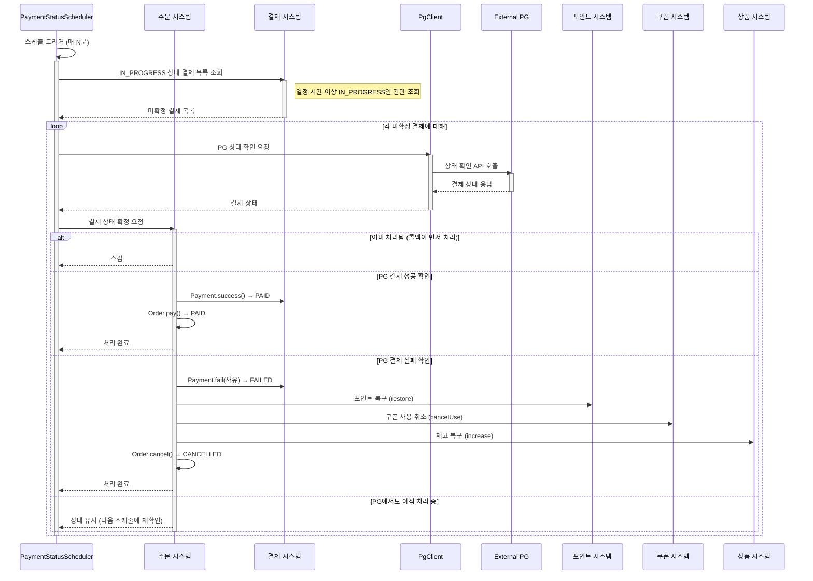
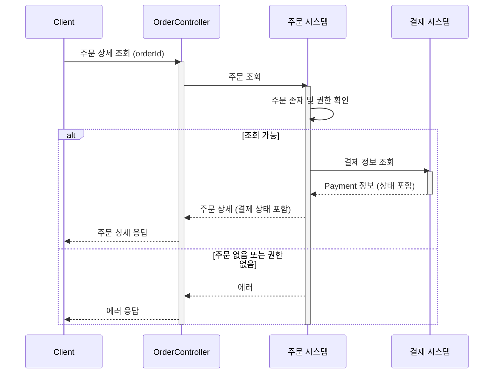

# 솔루션 설계 문서: PG 연동 Resilience

> **Reference Document**: This document outlines the architectural decisions for the Payment Gateway integration resilience strategy.

## 1. 설계 컨텍스트

### 1.1 핵심 해결 과제

외부 시스템(PG) 연동 시 발생하는 장애 및 지연에 대한 대응 체계를 구축해야 합니다. 해결해야 할 핵심 과제는 다음과 같습니다.

첫째, **외부 시스템 의존성 격리**입니다. 외부 PG사의 장애나 지연이 전체 주문 시스템의 마비로 이어지는 것을 방지해야 합니다. Circuit Breaker, Timeout, Retry 등 Resilience 패턴을 적용하여 장애 전파를 차단합니다.

둘째, **비동기 결제 정합성 보장**입니다. PG는 결제 요청에 대해 "수신 확인"만 즉시 응답하고, 실제 결제 결과(성공/실패)는 콜백으로 비동기 전달합니다. 이러한 비동기 특성으로 인해 결제 상태와 주문 상태 간 불일치가 발생할 수 있으므로, 콜백과 스케줄러를 통한 최종 일관성을 보장해야 합니다.

셋째, **운영 가시성 확보**입니다. 장애 상황(Circuit Open, Timeout)을 실시간으로 감지하고 대응할 수 있어야 합니다. Prometheus 메트릭 수집과 Grafana 대시보드를 통한 모니터링 체계를 구축합니다.

### 1.2 현재 아키텍처 영향

현재 시스템의 특성 중 이번 솔루션에 영향을 미치는 요소들은 다음과 같습니다.

첫째, **현재 결제 수단이 포인트로 한정되어 있습니다.** 사전 충전된 포인트로만 결제가 가능하며, 외부 결제 시스템(PG)과의 연동이 없습니다. 따라서 PG 연동을 위한 결제 컴포넌트를 신규 구축해야 합니다.

둘째, **도메인 간 통신이 동기 방식입니다.** 내부 시스템 간 통신은 함수 호출을 사용하고 있습니다. PG 연동 시에도 이 패턴을 유지하되, 외부 HTTP 통신에 대한 Resilience 처리가 추가로 필요합니다.

셋째, **물리적 트랜잭션으로 데이터 일관성을 보장합니다.** 현재는 단일 트랜잭션 내에서 재고 차감, 쿠폰 사용, 포인트 차감을 처리합니다. 그러나 외부 I/O(PG 호출)가 포함되면 트랜잭션 분리가 필요하며, 이로 인해 보상 트랜잭션(복구) 로직이 추가됩니다.

넷째, **동시성 제어에 비관적 락을 사용합니다.** 포인트 차감, 재고 차감 등에서 비관적 락을 사용하고 있습니다. 콜백과 스케줄러가 동시에 같은 결제를 처리하는 상황에서도 동일한 전략을 적용할 수 있습니다.

다섯째, **2개 이상의 인스턴스로 운영 중입니다.** 여러 인스턴스에서 동시에 콜백을 받거나 스케줄러가 실행될 수 있으므로, 중복 처리 방지를 위한 동시성 제어가 필요합니다.

### 1.3 기술 스택 개요

| 영역 | 기술 |
|-----|-----|
| Core | Kotlin, Spring Boot |
| Database | PostgreSQL (Spring Data JPA) |
| HTTP Client | WebClient 또는 OpenFeign |
| Resilience | Resilience4j (CircuitBreaker, Retry, TimeLimiter) |
| Scheduling | Spring Scheduler |
| Monitoring | Prometheus, Grafana |

## 2. 솔루션 대안 분석

### 대안 1: Resilience4j 기반 동기 호출 + 콜백/스케줄러

**설명**: PG API를 동기 HTTP로 호출하되, Resilience4j의 Circuit Breaker, Retry, Timeout을 적용하여 보호합니다. PG는 결제 요청을 수신하면 "요청 수신 확인"만 즉시 응답하고, 실제 결제 결과(성공/실패)는 콜백으로 비동기 전달합니다. 콜백이 오지 않는 경우 스케줄러가 PG 상태 확인 API를 호출하여 상태를 확정합니다.

**문제 해결 방식**: 결제 요청 시 Resilience4j가 PG 호출을 감싸서 Timeout(응답 지연 방지), Retry(일시적 오류 재시도), Circuit Breaker(장애 전파 차단)를 적용합니다. PG가 요청을 수신하면 "결제 진행 중" 상태로 저장하고, 이후 콜백 또는 스케줄러를 통해 최종 상태를 확정합니다.

**장점**:
- 기존 동기 통신 패턴과 일관성 유지
- Resilience4j의 Spring Boot 통합 및 Micrometer를 통한 Prometheus 메트릭 기본 제공
- 새로운 인프라(메시지 큐 등) 없이 기존 HTTP 기반으로 구현 가능
- 구현 복잡도가 적당함

**단점**:
- PG 호출 시점에 스레드가 블로킹됨 (Timeout으로 최대 대기 시간 제한)
- 트랜잭션 경계 설계가 중요함

**아키텍처 영향**: Payments 관련 컴포넌트 추가, PgClient 구현, 주문 흐름에 결제 의존성 추가

### 대안 2: 메시지 큐 기반 완전 비동기 처리

**설명**: 결제 요청을 메시지 큐(Kafka 또는 SQS)에 발행하고, 별도 Consumer가 PG를 호출합니다. 주문 생성과 PG 호출이 완전히 분리되어 장애 격리가 강화됩니다.

**문제 해결 방식**: 주문 요청 시 주문과 결제를 "대기" 상태로 저장하고 메시지를 발행한 뒤 즉시 응답합니다. Payment Consumer가 메시지를 소비하여 PG를 호출하고, 결과에 따라 결제 상태를 업데이트합니다.

**장점**:
- 장애 격리가 완벽함 (PG 장애가 주문 API 응답 시간에 영향 없음)
- 처리량 확장이 용이함 (Consumer 수 조절)
- 실패한 메시지의 DLQ 재처리 패턴이 명확함

**단점**:
- 구현 복잡도가 높음 (메시지 발행/소비, DLQ 처리, 멱등성 보장)
- 새로운 인프라(Kafka/SQS) 운영 부담
- 즉시 결제 결과 확인이 어려움 (폴링 또는 웹소켓 필요)
- 트랜잭션 관리가 복잡함 (Transactional Outbox 패턴 필요)

**아키텍처 영향**: 메시지 큐 인프라 추가, Payment Consumer 서비스 구현, 클라이언트 측 결제 결과 폴링 로직 추가

## 3. 선택된 솔루션

### 3.1 결정 요약

**대안 1: Resilience4j 기반 동기 호출 + 콜백/스케줄러**를 선택합니다.

**선택 이유**:

첫째, 팀의 "ROI 중심" 및 "실용주의" 가치에 부합합니다. Resilience4j는 Spring Boot와 통합이 잘 되어 있어 학습 비용이 낮고, 어노테이션 기반으로 빠르게 적용할 수 있습니다. 새로운 인프라 도입 없이 기존 HTTP 기반 아키텍처에서 구현 가능하므로 운영 부담이 적습니다.

둘째, 기존 시스템의 동기 통신 패턴과 일관성을 유지합니다. 현재 시스템은 동기 함수 호출 방식을 사용하고 있습니다. 이 패턴을 유지하면서 외부 연동 부분에만 Resilience 레이어를 추가하므로 기존 코드 변경이 최소화됩니다.

셋째, 요구사항의 모니터링 요건을 쉽게 충족합니다. Resilience4j는 Micrometer를 통해 Prometheus 메트릭을 기본 제공합니다. Circuit Breaker 상태 변경 이벤트도 제공하므로 별도 구현 없이 모니터링 요건을 충족할 수 있습니다.

넷째, 향후 확장에 유연합니다. 당장은 동기 호출로 시작하되, 트래픽이 증가하면 WebClient 기반 비동기 호출로 전환하거나 메시지 큐 방식으로 점진적 전환이 가능합니다.

### 3.2 트랜잭션 분리 전략

외부 I/O(PG 호출)가 포함된 로직이므로 트랜잭션을 분리합니다. 만약 하나의 트랜잭션에서 모든 것을 처리하면, PG 호출에서 타임아웃 발생 시 전체가 롤백되어 "결제를 시도했다"는 기록 자체가 사라집니다. 스케줄러가 복구할 근거 데이터가 없어지므로, Payment를 PENDING 상태로 먼저 커밋한 뒤 별도로 PG를 호출해야 합니다.

**트랜잭션 1**: 재고 차감 → 쿠폰 사용 → 포인트 차감 → Payment PENDING 생성 → 주문 생성 → 커밋

**트랜잭션 외부**: PG 결제 생성 요청 (Resilience4j 적용)

**트랜잭션 2** (PG 호출 실패 시): Payment FAILED 처리 → 포인트/쿠폰/재고 복구 → 주문 취소

**트랜잭션 3** (콜백 수신 시): 결과에 따라 Payment 상태 업데이트, 실패 시 포인트/쿠폰/재고 복구 및 주문 취소

### 3.3 결제 방식

포인트와 카드 혼합 결제를 지원합니다. 주문금액에서 쿠폰 할인을 적용한 결제금액을 산출하고, 결제금액에서 포인트 사용분을 차감한 나머지를 카드로 결제합니다.

### 3.4 콜백 + 스케줄러 병행

PG 콜백과 스케줄러를 둘 다 지원합니다. PG 콜백이 정상적으로 오면 빠르게 처리하고, 콜백이 유실되거나 지연되는 경우 스케줄러가 보완합니다. 동시 실행으로 인한 중복 처리는 동시성 제어로 해결합니다.

### 3.5 네트워크 오류 분류

PG 호출 시 발생하는 네트워크 오류는 **요청 도달 여부**를 기준으로 분류하여 처리합니다.

**요청 미도달 확실 (롤백 가능)**

서킷 오픈, Connection Timeout, Connection Refused, DNS Resolution Failed, SSL/TLS Handshake Failed, 500/429 응답 등이 해당됩니다. 요청이 PG에서 처리되지 않았음이 확실하므로 즉시 롤백이 가능합니다.

**요청 도달 여부 불확실 (롤백 불가)**

Read Timeout, Connection Reset, Socket Exception 등이 해당됩니다. 요청이 PG에 도달했을 수도 있으므로 롤백하면 이중 결제 위험이 있습니다. IN_PROGRESS 상태를 유지하고 스케줄러가 PG에 상태를 확인합니다.

### 3.6 솔루션 구조

#### 핵심 아키텍처 컴포넌트

**1. 결제 시스템 (Domain Layer)**

결제 도메인을 담당합니다. Payment 엔티티는 결제 상태(PENDING, IN_PROGRESS, PAID, FAILED), 금액, PG 응답 정보를 관리합니다. PaymentMethod는 포인트 결제(POINT), 카드 결제(CARD), 혼합 결제(MIXED)를 구분합니다. PaymentService는 결제 요청, 성공, 실패에 대한 비즈니스 처리와 상태 전이 규칙을 적용합니다.

**2. PgClient (Infrastructure Layer)**

PG API 호출을 담당하는 외부 연동 어댑터입니다. 카드 정보와 금액으로 PG 결제 생성 API를 호출하고, 결제 진행 중 건의 상태를 조회하는 API를 호출합니다. Resilience4j를 적용하여 Circuit Breaker, Retry, Timeout을 처리하고, 요청 성공/실패 카운트와 응답 시간 등 메트릭을 수집합니다.

**3. PaymentStatusScheduler (Infrastructure Layer)**

콜백 미수신 결제의 상태를 확정합니다. 일정 시간 이상 IN_PROGRESS 상태인 결제를 조회하고, PgClient를 통해 PG에 상태 확인을 요청한 뒤, 조회 결과에 따라 주문 시스템을 통해 상태를 확정합니다.

**4. 주문 시스템 (Application Layer)**

주문 흐름 오케스트레이션을 담당합니다. 재고 차감, 쿠폰 적용, 포인트 차감, 결제 요청 순서를 조율하고, 결제 실패 시 포인트 복구(restore), 쿠폰 사용 취소(cancelUse), 재고 복구(increase), 주문 취소(cancel)를 오케스트레이션합니다. 콜백/스케줄러로부터 결제 결과를 받아 주문 상태를 확정합니다.

#### 데이터 흐름

**1. 결제 요청 흐름 (정상 케이스)**

PG는 결제 요청에 대해 "수신 확인"만 즉시 응답합니다. 실제 결제 결과(성공/실패)는 콜백으로 비동기 전달됩니다.

**2-1. 예외 케이스: PG 호출 실패 (요청 미도달 확실)**

서킷 오픈, Connection Timeout, Connection Refused, DNS 실패, 500/429 응답 등 요청이 PG에 도달하지 않았음이 확실한 경우입니다. 즉시 롤백이 가능합니다.

**2-2. 예외 케이스: 응답 수신 실패 (요청 도달 여부 불확실)**

Read Timeout, Connection Reset 등 요청이 PG에 도달했을 수도 있는 경우입니다. 롤백하면 이중 결제 위험이 있으므로 IN_PROGRESS 상태를 유지하고 스케줄러가 확인합니다.

**3. PG 콜백 수신 흐름**

PG가 결제 처리 완료 후 결과(성공/실패)를 콜백으로 전송합니다. 결제 거절(한도 초과, 잘못된 카드 등)도 이 흐름에서 처리됩니다.

**4. 스케줄러 상태 확정 흐름**

콜백이 유실되거나 응답 수신 실패로 요청 도달 여부가 불확실한 경우, 스케줄러가 PG에 상태를 확인하여 결과를 확정합니다.

**5. 주문 상세 조회 흐름**

