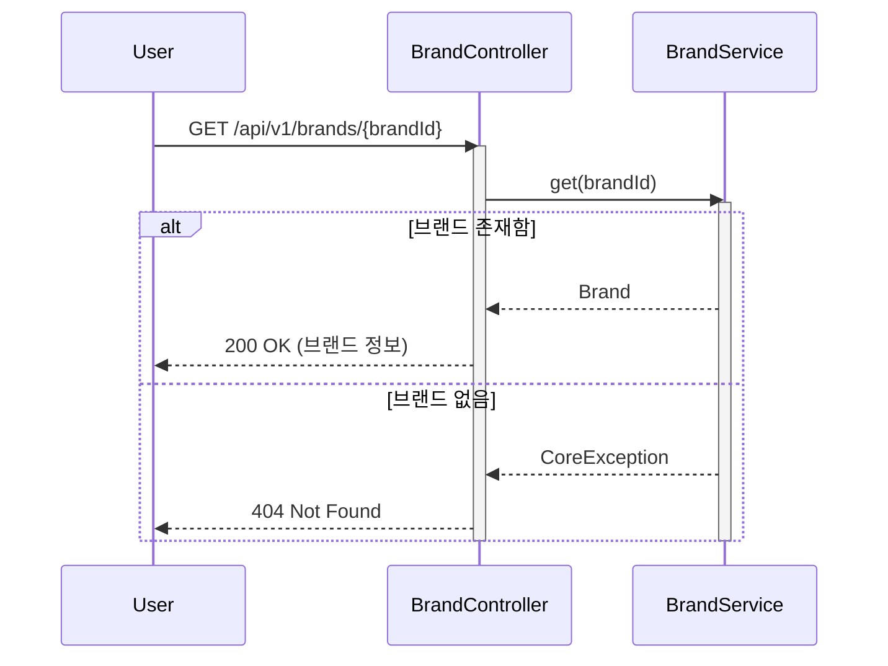
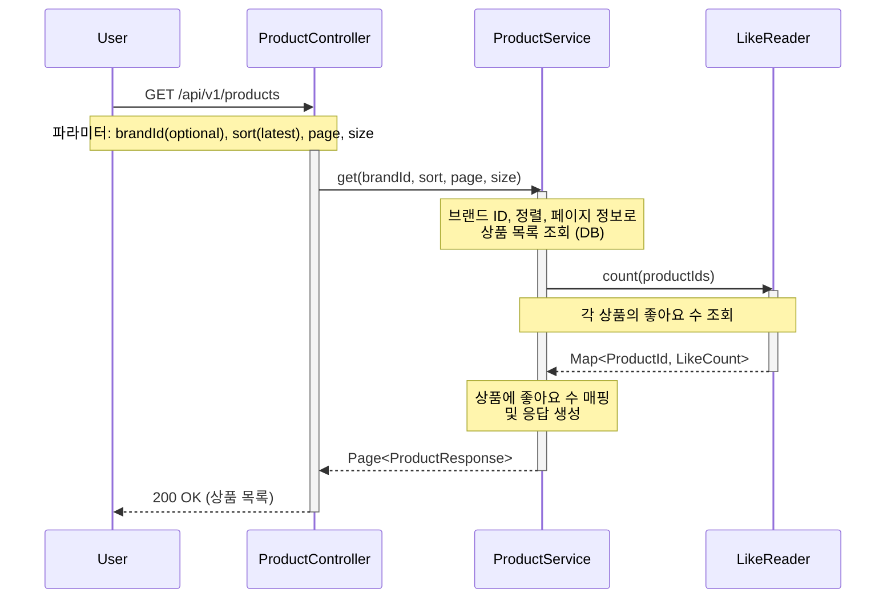
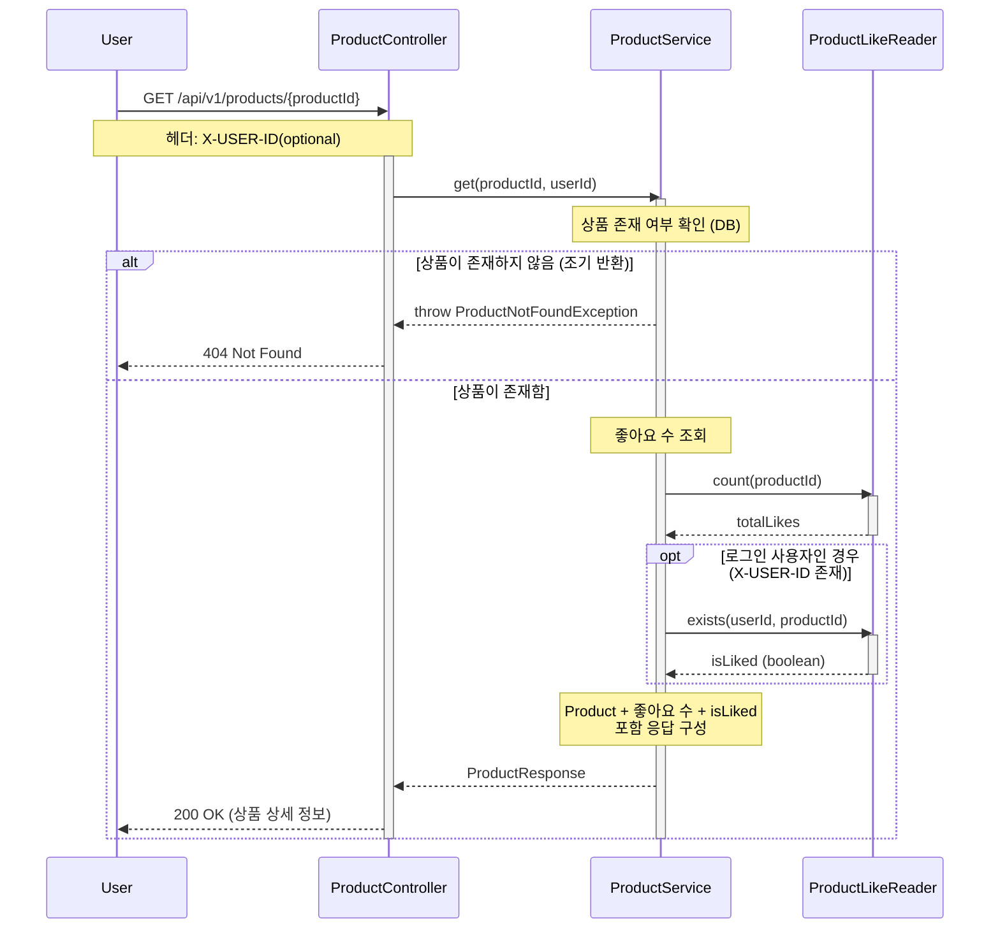
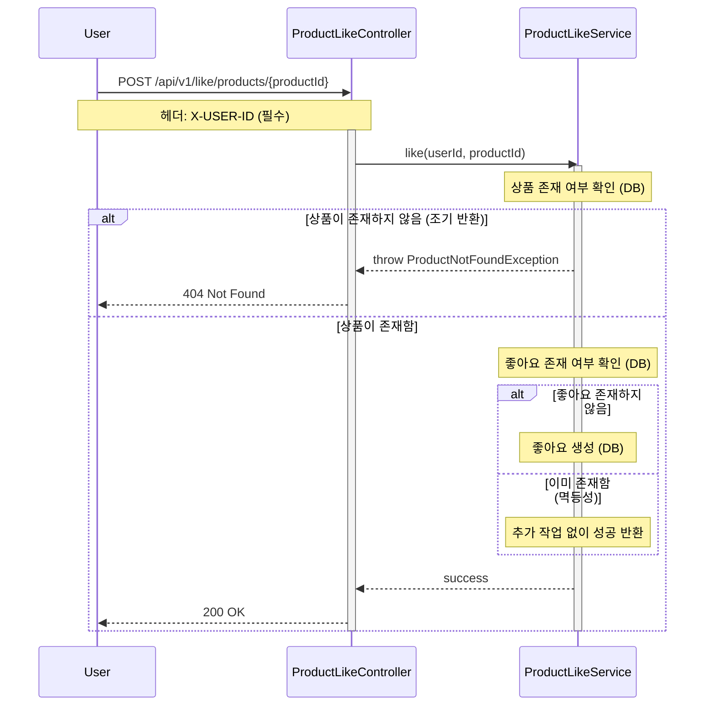
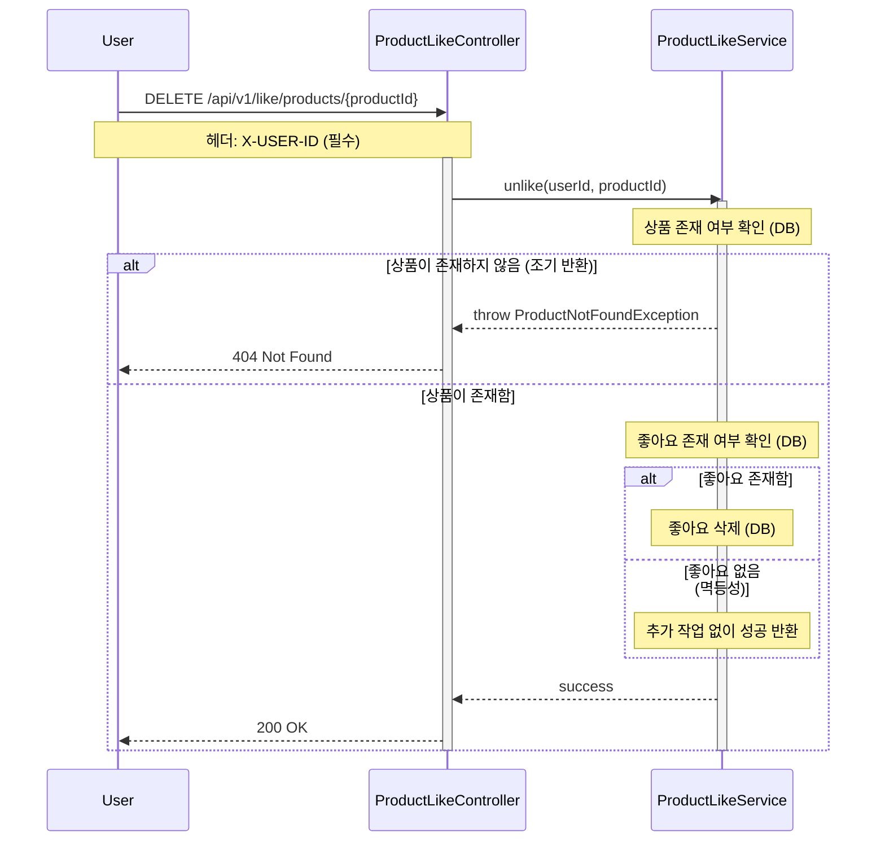
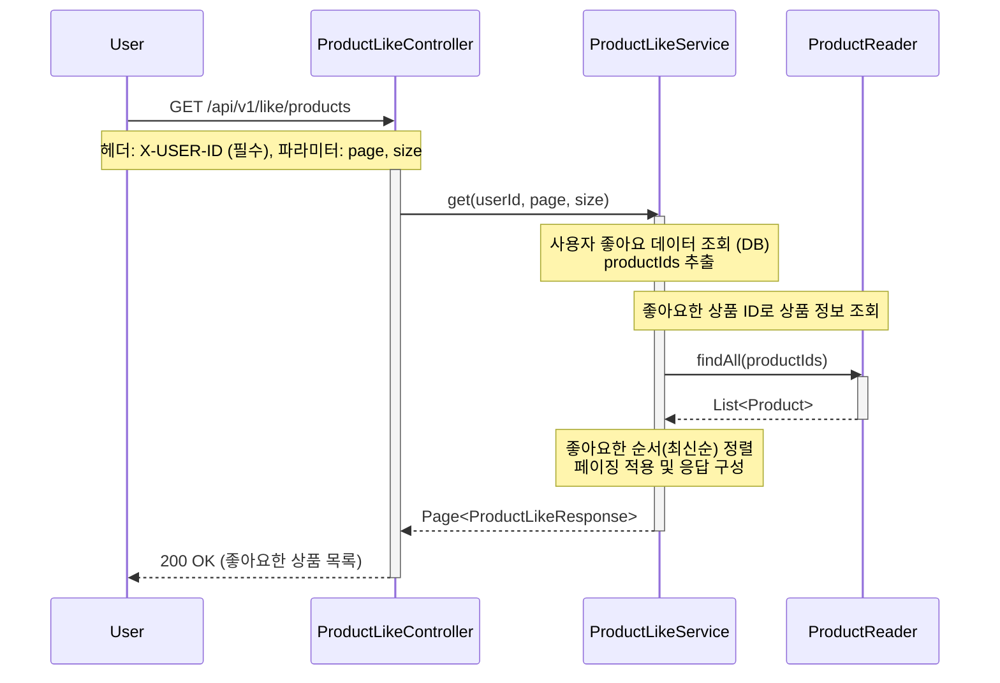
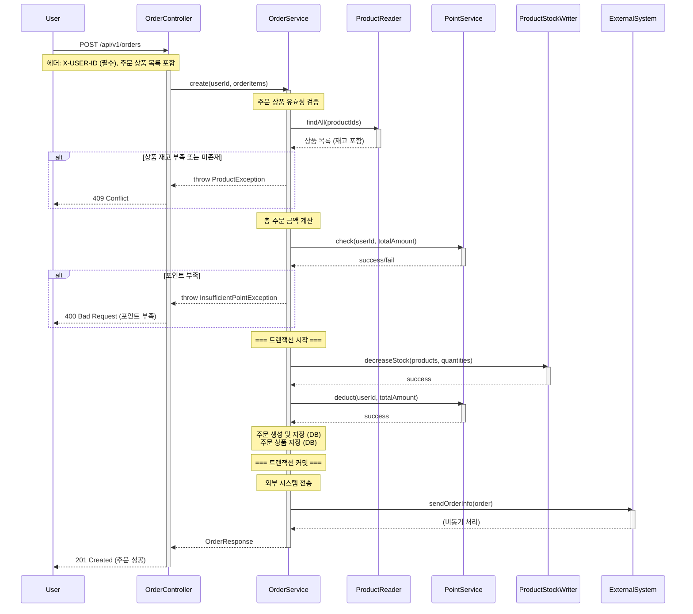
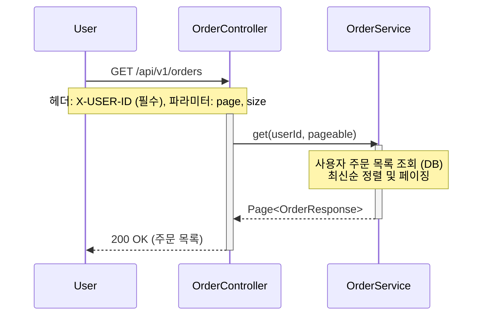
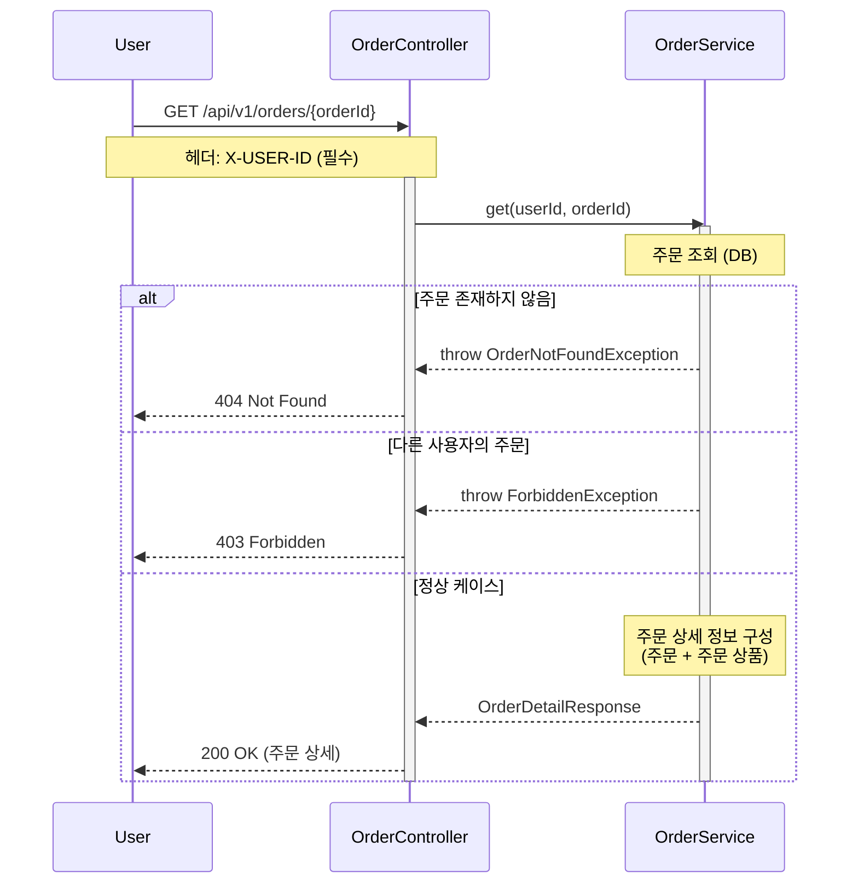

# 시퀀스 다이어그램

## 브랜드 정보 조회

```mermaid

sequenceDiagram
    participant User
    participant BrandController
    participant BrandService

    User->>BrandController: GET /api/v1/brands/{brandId}
    activate BrandController
    BrandController->>BrandService: get(brandId)
    activate BrandService

    alt 브랜드 존재함
        BrandService-->>BrandController: Brand
        BrandController-->>User: 200 OK (브랜드 정보)
    else 브랜드 없음
        BrandService-->>BrandController: CoreException
        BrandController-->>User: 404 Not Found
    end

    deactivate BrandService
    deactivate BrandController

```

## 상품 목록 조회

```mermaid

sequenceDiagram
    participant User
    participant ProductController
    participant ProductService
    participant LikeReader

    User->>ProductController: GET /api/v1/products
    Note over User, ProductController: 파라미터: brandId(optional), sort(latest), page, size
    activate ProductController

    ProductController->>ProductService: get(brandId, sort, page, size)
    activate ProductService

    Note over ProductService: 브랜드 ID, 정렬, 페이지 정보로<br/>상품 목록 조회 (DB)

    ProductService->>LikeReader: count(productIds)
    activate LikeReader
    Note over ProductService, LikeReader: 각 상품의 좋아요 수 조회
    LikeReader-->>ProductService: Map<ProductId, LikeCount>
    deactivate LikeReader

    Note over ProductService: 상품에 좋아요 수 매핑<br/>및 응답 생성

    ProductService-->>ProductController: Page<ProductResponse>
    deactivate ProductService

    ProductController-->>User: 200 OK (상품 목록)
    deactivate ProductController
```

## 상품 상세 정보 조회

```mermaid
sequenceDiagram
    participant User
    participant ProductController
    participant ProductService
    participant ProductLikeReader

    User->>ProductController: GET /api/v1/products/{productId}
    Note over User, ProductController: 헤더: X-USER-ID(optional)
    activate ProductController
    ProductController->>ProductService: get(productId, userId)
    activate ProductService

    Note over ProductService: 상품 존재 여부 확인 (DB)

    alt 상품이 존재하지 않음 (조기 반환)
        ProductService-->>ProductController: throw ProductNotFoundException
        ProductController-->>User: 404 Not Found
    else 상품이 존재함
        Note over ProductService: 좋아요 수 조회
        ProductService->>ProductLikeReader: count(productId)
        activate ProductLikeReader
        ProductLikeReader-->>ProductService: totalLikes
        deactivate ProductLikeReader

        opt 로그인 사용자인 경우 (X-USER-ID 존재)
            ProductService->>ProductLikeReader: exists(userId, productId)
            activate ProductLikeReader
            ProductLikeReader-->>ProductService: isLiked (boolean)
            deactivate ProductLikeReader
        end

        Note over ProductService: Product + 좋아요 수 + isLiked<br/>포함 응답 구성
        ProductService-->>ProductController: ProductResponse
        ProductController-->>User: 200 OK (상품 상세 정보)
    end

    deactivate ProductService
    deactivate ProductController
```

## 상품 좋아요 등록

```mermaid
sequenceDiagram
    participant User
    participant ProductLikeController
    participant ProductLikeService

    User->>ProductLikeController: POST /api/v1/like/products/{productId}
    Note over User, ProductLikeController: 헤더: X-USER-ID (필수)
    activate ProductLikeController
    ProductLikeController->>ProductLikeService: like(userId, productId)
    activate ProductLikeService

    Note over ProductLikeService: 상품 존재 여부 확인 (DB)

    alt 상품이 존재하지 않음 (조기 반환)
        ProductLikeService-->>ProductLikeController: throw ProductNotFoundException
        ProductLikeController-->>User: 404 Not Found
    else 상품이 존재함
        Note over ProductLikeService: 좋아요 존재 여부 확인 (DB)

        alt 좋아요 존재하지 않음
            Note over ProductLikeService: 좋아요 생성 (DB)
        else 이미 존재함 (멱등성)
            Note over ProductLikeService: 추가 작업 없이 성공 반환
        end

        ProductLikeService-->>ProductLikeController: success
        ProductLikeController-->>User: 200 OK
    end

    deactivate ProductLikeService
    deactivate ProductLikeController
```

## 상품 좋아요 취소

```mermaid
sequenceDiagram
    participant User
    participant ProductLikeController
    participant ProductLikeService

    User->>ProductLikeController: DELETE /api/v1/like/products/{productId}
    Note over User, ProductLikeController: 헤더: X-USER-ID (필수)
    activate ProductLikeController
    ProductLikeController->>ProductLikeService: unlike(userId, productId)
    activate ProductLikeService

    Note over ProductLikeService: 상품 존재 여부 확인 (DB)

    alt 상품이 존재하지 않음 (조기 반환)
        ProductLikeService-->>ProductLikeController: throw ProductNotFoundException
        ProductLikeController-->>User: 404 Not Found
    else 상품이 존재함
        Note over ProductLikeService: 좋아요 존재 여부 확인 (DB)

        alt 좋아요 존재함
            Note over ProductLikeService: 좋아요 삭제 (DB)
        else 좋아요 없음 (멱등성)
            Note over ProductLikeService: 추가 작업 없이 성공 반환
        end

        ProductLikeService-->>ProductLikeController: success
        ProductLikeController-->>User: 200 OK
    end

    deactivate ProductLikeService
    deactivate ProductLikeController
```

## 좋아요 한 상품 목록 조회

```mermaid
sequenceDiagram
    participant User
    participant ProductLikeController
    participant ProductLikeService
    participant ProductReader

    User->>ProductLikeController: GET /api/v1/like/products
    Note over User, ProductLikeController: 헤더: X-USER-ID (필수), 파라미터: page, size
    activate ProductLikeController
    ProductLikeController->>ProductLikeService: get(userId, page, size)
    activate ProductLikeService

    Note over ProductLikeService: 사용자 좋아요 데이터 조회 (DB)<br/>productIds 추출

    Note over ProductLikeService, ProductReader: 좋아요한 상품 ID로 상품 정보 조회
    ProductLikeService->>ProductReader: findAll(productIds)
    activate ProductReader
    ProductReader-->>ProductLikeService: List<Product>
    deactivate ProductReader

    Note over ProductLikeService: 좋아요한 순서(최신순) 정렬<br/>페이징 적용 및 응답 구성

    ProductLikeService-->>ProductLikeController: Page<ProductLikeResponse>
    deactivate ProductLikeService
    ProductLikeController-->>User: 200 OK (좋아요한 상품 목록)
    deactivate ProductLikeController
```

## 주문 요청

```mermaid
sequenceDiagram
    participant User
    participant OrderController
    participant OrderService
    participant ProductReader
    participant PointService
    participant ProductStockWriter
    participant ExternalSystem

    User->>OrderController: POST /api/v1/orders
    Note over User, OrderController: 헤더: X-USER-ID (필수), 주문 상품 목록 포함
    activate OrderController
    OrderController->>OrderService: create(userId, orderItems)
    activate OrderService

    Note over OrderService: 주문 상품 유효성 검증
    OrderService->>ProductReader: findAll(productIds)
    activate ProductReader
    ProductReader-->>OrderService: 상품 목록 (재고 포함)
    deactivate ProductReader

    alt 상품 재고 부족 또는 미존재
        OrderService-->>OrderController: throw ProductException
        OrderController-->>User: 409 Conflict
    end

    Note over OrderService: 총 주문 금액 계산
    OrderService->>PointService: check(userId, totalAmount)
    activate PointService
    PointService-->>OrderService: success/fail
    deactivate PointService

    alt 포인트 부족
        OrderService-->>OrderController: throw InsufficientPointException
        OrderController-->>User: 400 Bad Request (포인트 부족)
    end

    Note over OrderService: === 트랜잭션 시작 ===

    OrderService->>ProductStockWriter: decreaseStock(products, quantities)
    activate ProductStockWriter
    ProductStockWriter-->>OrderService: success
    deactivate ProductStockWriter

    OrderService->>PointService: deduct(userId, totalAmount)
    activate PointService
    PointService-->>OrderService: success
    deactivate PointService

    Note over OrderService: 주문 생성 및 저장 (DB)<br/>주문 상품 저장 (DB)

    Note over OrderService: === 트랜잭션 커밋 ===

    Note over OrderService: 외부 시스템 전송
    OrderService->>ExternalSystem: sendOrderInfo(order)
    activate ExternalSystem
    ExternalSystem-->>OrderService: (비동기 처리)
    deactivate ExternalSystem

    OrderService-->>OrderController: OrderResponse
    deactivate OrderService
    OrderController-->>User: 201 Created (주문 성공)
    deactivate OrderController
```

## 주문 목록 조회

```mermaid
sequenceDiagram
    participant User
    participant OrderController
    participant OrderService

    User->>OrderController: GET /api/v1/orders
    Note over User, OrderController: 헤더: X-USER-ID (필수), 파라미터: page, size
    activate OrderController
    OrderController->>OrderService: get(userId, pageable)
    activate OrderService

    Note over OrderService: 사용자 주문 목록 조회 (DB)<br/>최신순 정렬 및 페이징

    OrderService-->>OrderController: Page<OrderResponse>
    deactivate OrderService
    OrderController-->>User: 200 OK (주문 목록)
    deactivate OrderController
```

## 주문 상세 조회

```mermaid
sequenceDiagram
    participant User
    participant OrderController
    participant OrderService

    User->>OrderController: GET /api/v1/orders/{orderId}
    Note over User, OrderController: 헤더: X-USER-ID (필수)
    activate OrderController
    OrderController->>OrderService: get(userId, orderId)
    activate OrderService

    Note over OrderService: 주문 조회 (DB)

    alt 주문 존재하지 않음
        OrderService-->>OrderController: throw OrderNotFoundException
        OrderController-->>User: 404 Not Found
    else 다른 사용자의 주문
        OrderService-->>OrderController: throw ForbiddenException
        OrderController-->>User: 403 Forbidden
    else 정상 케이스
        Note over OrderService: 주문 상세 정보 구성<br/>(주문 + 주문 상품)
        OrderService-->>OrderController: OrderDetailResponse
        OrderController-->>User: 200 OK (주문 상세)
    end

    deactivate OrderService
    deactivate OrderController
```
