# 시퀀스 다이어그램

---

## 0. Payment 상태 다이어그램

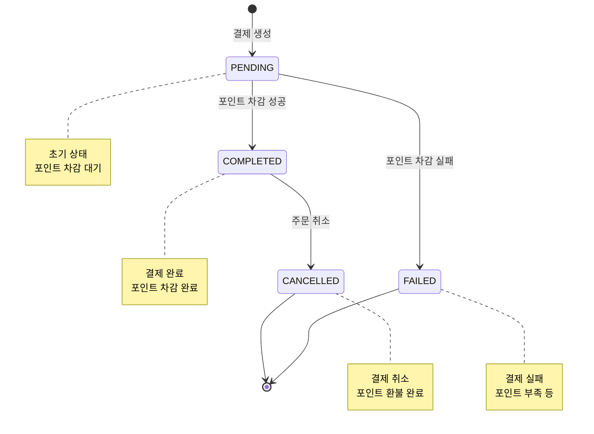
```mermaid
stateDiagram-v2
    [*] --> PENDING: 결제 생성
    PENDING --> COMPLETED: 포인트 차감 성공
    PENDING --> FAILED: 포인트 차감 실패
    COMPLETED --> CANCELLED: 주문 취소

    FAILED --> [*]
    CANCELLED --> [*]

    note right of PENDING
        초기 상태
        포인트 차감 대기
    end note

    note right of COMPLETED
        결제 완료
        포인트 차감 완료
    end note

    note right of FAILED
        결제 실패
        포인트 부족 등
    end note

    note right of CANCELLED
        결제 취소
        포인트 환불 완료
    end note
```

---

## 1. User (회원)

### 1.1 회원 조회

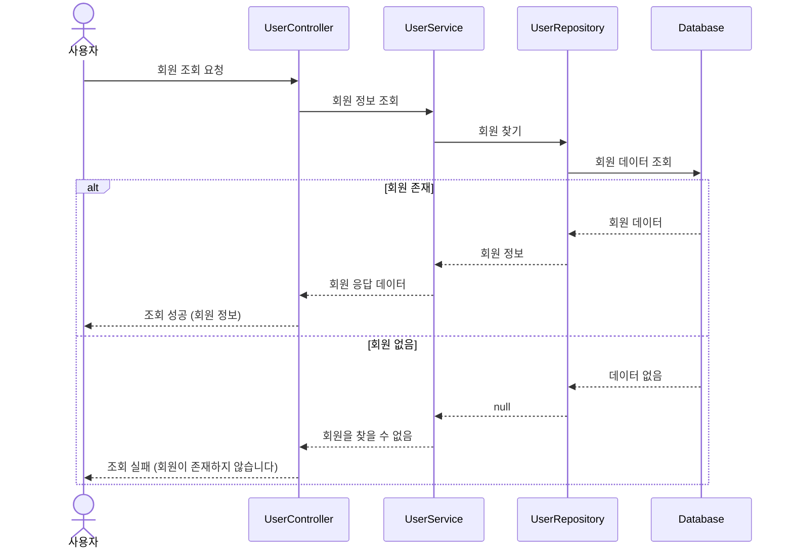
```mermaid
sequenceDiagram
    actor User as 사용자
    participant API as UserController
    participant Service as UserService
    participant Repo as UserRepository
    participant DB as Database

    User->>API: 회원 조회 요청
    API->>Service: 회원 정보 조회
    Service->>Repo: 회원 찾기
    Repo->>DB: 회원 데이터 조회

    alt 회원 존재
        DB-->>Repo: 회원 데이터
        Repo-->>Service: 회원 정보
        Service-->>API: 회원 응답 데이터
        API-->>User: 조회 성공 (회원 정보)
    else 회원 없음
        DB-->>Repo: 데이터 없음
        Repo-->>Service: null
        Service-->>API: 회원을 찾을 수 없음
        API-->>User: 조회 실패 (회원이 존재하지 않습니다)
    end
```

### 1.2 회원 목록 조회

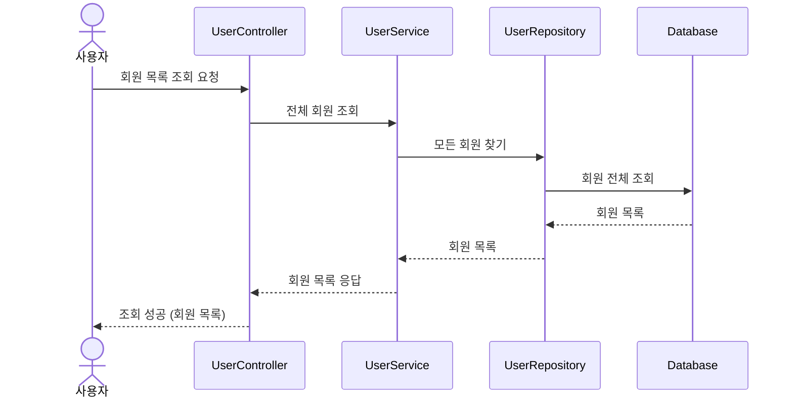
```mermaid
sequenceDiagram
    actor User as 사용자
    participant API as UserController
    participant Service as UserService
    participant Repo as UserRepository
    participant DB as Database

    User->>API: 회원 목록 조회 요청
    API->>Service: 전체 회원 조회
    Service->>Repo: 모든 회원 찾기
    Repo->>DB: 회원 전체 조회
    DB-->>Repo: 회원 목록
    Repo-->>Service: 회원 목록
    Service-->>API: 회원 목록 응답
    API-->>User: 조회 성공 (회원 목록)
```

---

## 2. Point (포인트)

### 2.1 포인트 조회

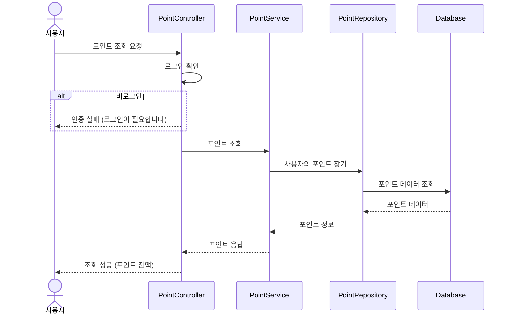
```mermaid
sequenceDiagram
    actor User as 사용자
    participant API as PointController
    participant Service as PointService
    participant Repo as PointRepository
    participant DB as Database

    User->>API: 포인트 조회 요청
    API->>API: 로그인 확인

    alt 비로그인
        API-->>User: 인증 실패 (로그인이 필요합니다)
    end

    API->>Service: 포인트 조회
    Service->>Repo: 사용자의 포인트 찾기
    Repo->>DB: 포인트 데이터 조회
    DB-->>Repo: 포인트 데이터
    Repo-->>Service: 포인트 정보
    Service-->>API: 포인트 응답
    API-->>User: 조회 성공 (포인트 잔액)
```

### 2.2 포인트 충전

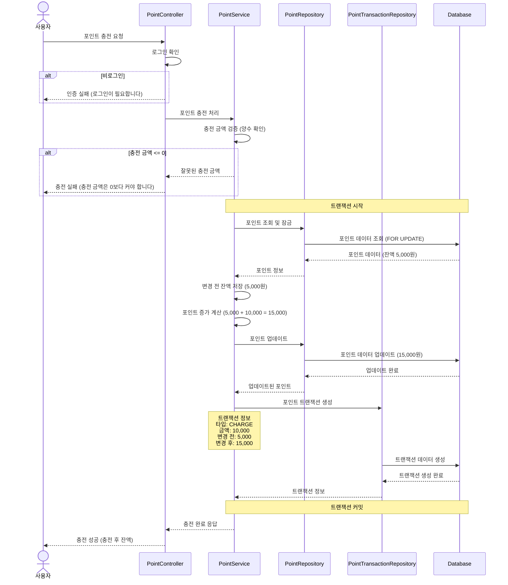
```mermaid
sequenceDiagram
    actor User as 사용자
    participant API as PointController
    participant Service as PointService
    participant PointRepo as PointRepository
    participant TxRepo as PointTransactionRepository
    participant DB as Database

    User->>API: 포인트 충전 요청
    API->>API: 로그인 확인

    alt 비로그인
        API-->>User: 인증 실패 (로그인이 필요합니다)
    end

    API->>Service: 포인트 충전 처리

    Service->>Service: 충전 금액 검증 (양수 확인)

    alt 충전 금액 <= 0
        Service-->>API: 잘못된 충전 금액
        API-->>User: 충전 실패 (충전 금액은 0보다 커야 합니다)
    end

    Note over Service,DB: 트랜잭션 시작

    Service->>PointRepo: 포인트 조회 및 잠금
    PointRepo->>DB: 포인트 데이터 조회 (FOR UPDATE)
    DB-->>PointRepo: 포인트 데이터 (잔액 5,000원)
    PointRepo-->>Service: 포인트 정보

    Service->>Service: 변경 전 잔액 저장 (5,000원)
    Service->>Service: 포인트 증가 계산 (5,000 + 10,000 = 15,000)

    Service->>PointRepo: 포인트 업데이트
    PointRepo->>DB: 포인트 데이터 업데이트 (15,000원)
    DB-->>PointRepo: 업데이트 완료
    PointRepo-->>Service: 업데이트된 포인트

    Service->>TxRepo: 포인트 트랜잭션 생성
    Note over Service: 트랜잭션 정보<br/>타입: CHARGE<br/>금액: 10,000<br/>변경 전: 5,000<br/>변경 후: 15,000
    TxRepo->>DB: 트랜잭션 데이터 생성
    DB-->>TxRepo: 트랜잭션 생성 완료
    TxRepo-->>Service: 트랜잭션 정보

    Note over Service,DB: 트랜잭션 커밋

    Service-->>API: 충전 완료 응답
    API-->>User: 충전 성공 (충전 후 잔액)
```

### 2.3 포인트 트랜잭션 이력 조회

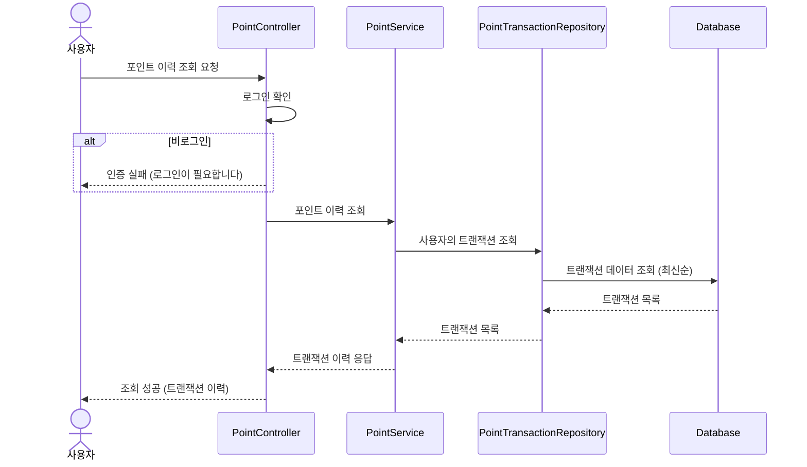
```mermaid
sequenceDiagram
    actor User as 사용자
    participant API as PointController
    participant Service as PointService
    participant Repo as PointTransactionRepository
    participant DB as Database

    User->>API: 포인트 이력 조회 요청
    API->>API: 로그인 확인

    alt 비로그인
        API-->>User: 인증 실패 (로그인이 필요합니다)
    end

    API->>Service: 포인트 이력 조회
    Service->>Repo: 사용자의 트랜잭션 조회
    Repo->>DB: 트랜잭션 데이터 조회 (최신순)
    DB-->>Repo: 트랜잭션 목록
    Repo-->>Service: 트랜잭션 목록
    Service-->>API: 트랜잭션 이력 응답
    API-->>User: 조회 성공 (트랜잭션 이력)
```

---

## 3. Stock (재고)

### 3.1 재고 조회

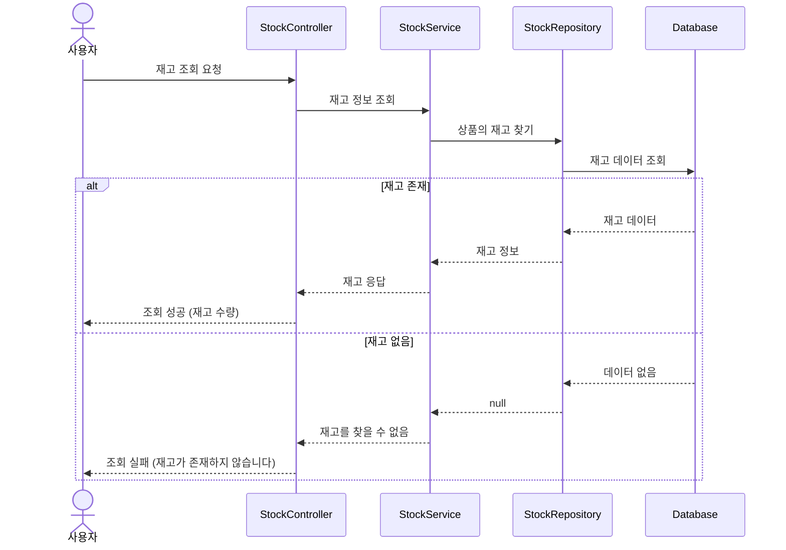
```mermaid
sequenceDiagram
    actor User as 사용자
    participant API as StockController
    participant Service as StockService
    participant Repo as StockRepository
    participant DB as Database

    User->>API: 재고 조회 요청
    API->>Service: 재고 정보 조회
    Service->>Repo: 상품의 재고 찾기
    Repo->>DB: 재고 데이터 조회

    alt 재고 존재
        DB-->>Repo: 재고 데이터
        Repo-->>Service: 재고 정보
        Service-->>API: 재고 응답
        API-->>User: 조회 성공 (재고 수량)
    else 재고 없음
        DB-->>Repo: 데이터 없음
        Repo-->>Service: null
        Service-->>API: 재고를 찾을 수 없음
        API-->>User: 조회 실패 (재고가 존재하지 않습니다)
    end
```

### 3.2 재고 증가

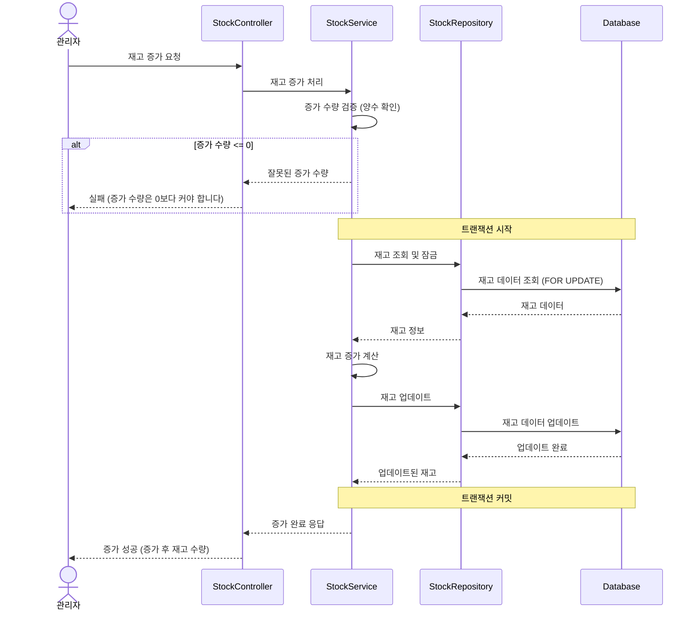
```mermaid
sequenceDiagram
    actor Admin as 관리자
    participant API as StockController
    participant Service as StockService
    participant Repo as StockRepository
    participant DB as Database

    Admin->>API: 재고 증가 요청
    API->>Service: 재고 증가 처리

    Service->>Service: 증가 수량 검증 (양수 확인)

    alt 증가 수량 <= 0
        Service-->>API: 잘못된 증가 수량
        API-->>Admin: 실패 (증가 수량은 0보다 커야 합니다)
    end

    Note over Service,DB: 트랜잭션 시작

    Service->>Repo: 재고 조회 및 잠금
    Repo->>DB: 재고 데이터 조회 (FOR UPDATE)
    DB-->>Repo: 재고 데이터
    Repo-->>Service: 재고 정보

    Service->>Service: 재고 증가 계산
    Service->>Repo: 재고 업데이트
    Repo->>DB: 재고 데이터 업데이트
    DB-->>Repo: 업데이트 완료
    Repo-->>Service: 업데이트된 재고

    Note over Service,DB: 트랜잭션 커밋

    Service-->>API: 증가 완료 응답
    API-->>Admin: 증가 성공 (증가 후 재고 수량)
```

---

## 4. Payment (결제)

### 4.1 결제 생성 (성공)

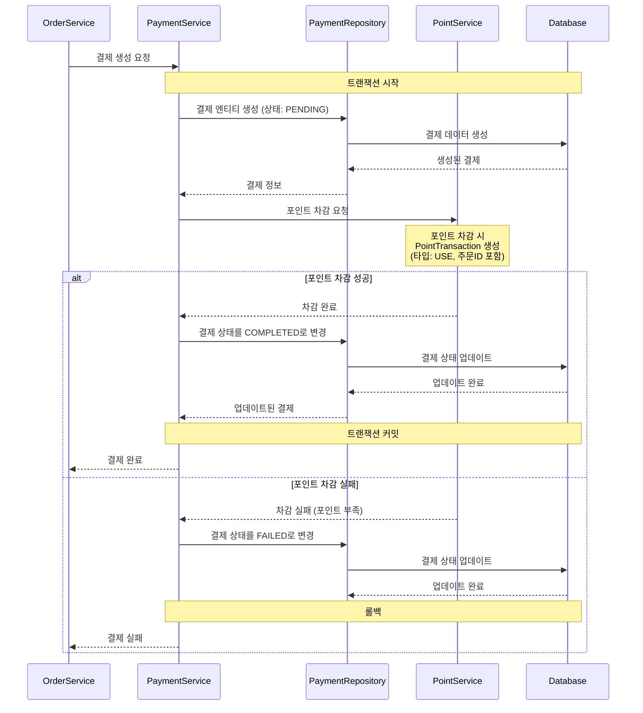
```mermaid
sequenceDiagram
    participant OrderService as OrderService
    participant PaymentService as PaymentService
    participant PaymentRepo as PaymentRepository
    participant PointService as PointService
    participant DB as Database

    OrderService->>PaymentService: 결제 생성 요청

    Note over PaymentService,DB: 트랜잭션 시작

    PaymentService->>PaymentRepo: 결제 엔티티 생성 (상태: PENDING)
    PaymentRepo->>DB: 결제 데이터 생성
    DB-->>PaymentRepo: 생성된 결제
    PaymentRepo-->>PaymentService: 결제 정보

    PaymentService->>PointService: 포인트 차감 요청
    Note over PointService: 포인트 차감 시<br/>PointTransaction 생성<br/>(타입: USE, 주문ID 포함)

    alt 포인트 차감 성공
        PointService-->>PaymentService: 차감 완료
        PaymentService->>PaymentRepo: 결제 상태를 COMPLETED로 변경
        PaymentRepo->>DB: 결제 상태 업데이트
        DB-->>PaymentRepo: 업데이트 완료
        PaymentRepo-->>PaymentService: 업데이트된 결제

        Note over PaymentService,DB: 트랜잭션 커밋

        PaymentService-->>OrderService: 결제 완료
    else 포인트 차감 실패
        PointService-->>PaymentService: 차감 실패 (포인트 부족)
        PaymentService->>PaymentRepo: 결제 상태를 FAILED로 변경
        PaymentRepo->>DB: 결제 상태 업데이트
        DB-->>PaymentRepo: 업데이트 완료

        Note over PaymentService,DB: 롤백

        PaymentService-->>OrderService: 결제 실패
    end
```

### 4.2 결제 취소

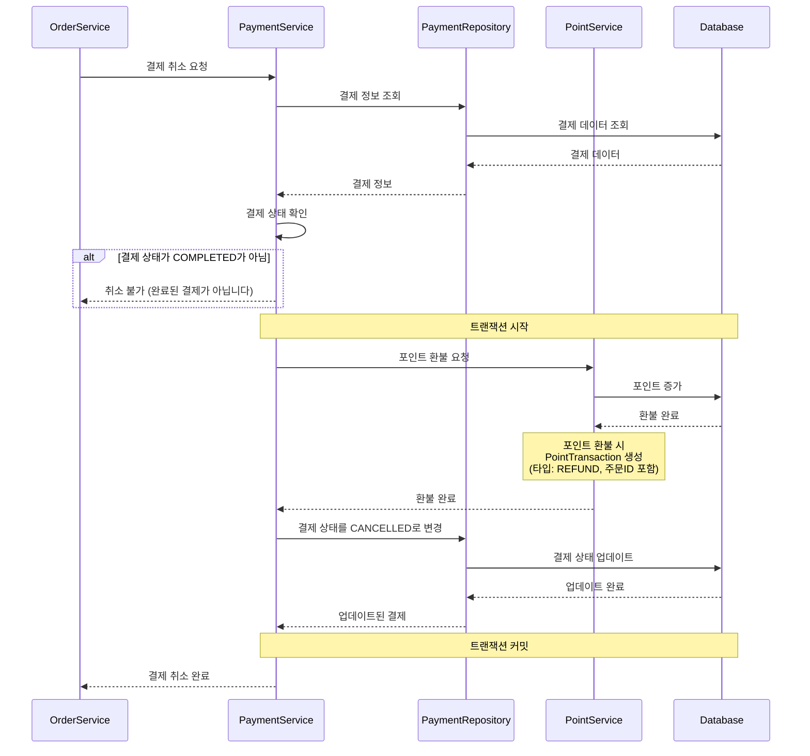
```mermaid
sequenceDiagram
    participant OrderService as OrderService
    participant PaymentService as PaymentService
    participant PaymentRepo as PaymentRepository
    participant PointService as PointService
    participant DB as Database

    OrderService->>PaymentService: 결제 취소 요청

    PaymentService->>PaymentRepo: 결제 정보 조회
    PaymentRepo->>DB: 결제 데이터 조회
    DB-->>PaymentRepo: 결제 데이터
    PaymentRepo-->>PaymentService: 결제 정보

    PaymentService->>PaymentService: 결제 상태 확인

    alt 결제 상태가 COMPLETED가 아님
        PaymentService-->>OrderService: 취소 불가 (완료된 결제가 아닙니다)
    end

    Note over PaymentService,DB: 트랜잭션 시작

    PaymentService->>PointService: 포인트 환불 요청
    PointService->>DB: 포인트 증가
    DB-->>PointService: 환불 완료
    Note over PointService: 포인트 환불 시<br/>PointTransaction 생성<br/>(타입: REFUND, 주문ID 포함)
    PointService-->>PaymentService: 환불 완료

    PaymentService->>PaymentRepo: 결제 상태를 CANCELLED로 변경
    PaymentRepo->>DB: 결제 상태 업데이트
    DB-->>PaymentRepo: 업데이트 완료
    PaymentRepo-->>PaymentService: 업데이트된 결제

    Note over PaymentService,DB: 트랜잭션 커밋

    PaymentService-->>OrderService: 결제 취소 완료
```

---

## 5. 브랜드 조회

### 1.1 브랜드 상세 조회

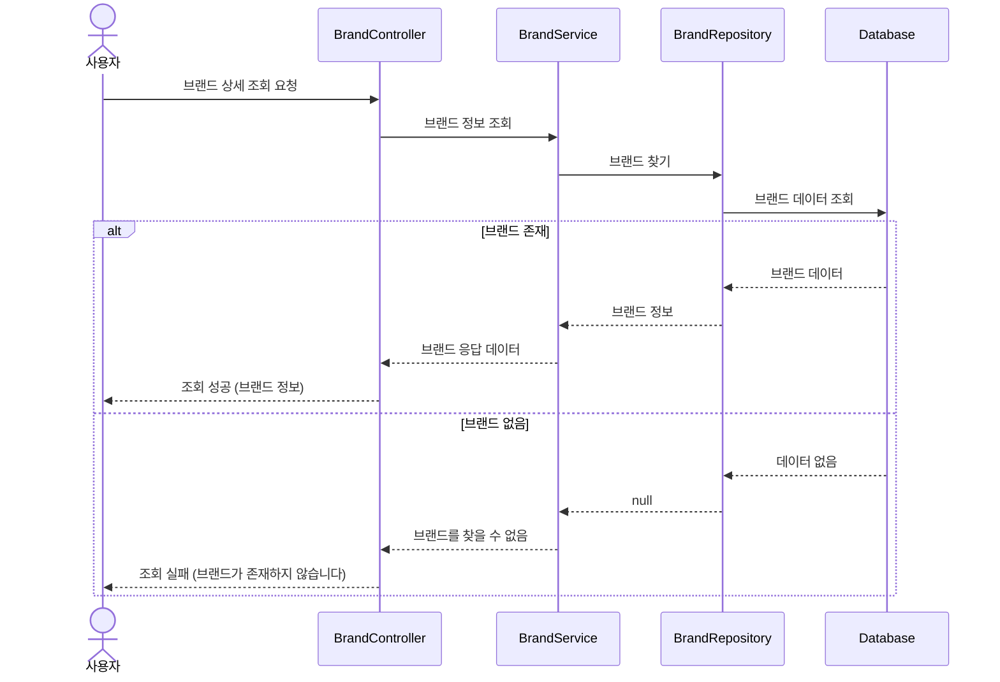
```mermaid
sequenceDiagram
    actor User as 사용자
    participant API as BrandController
    participant Service as BrandService
    participant Repo as BrandRepository
    participant DB as Database

    User->>API: 브랜드 상세 조회 요청
    API->>Service: 브랜드 정보 조회
    Service->>Repo: 브랜드 찾기
    Repo->>DB: 브랜드 데이터 조회

    alt 브랜드 존재
        DB-->>Repo: 브랜드 데이터
        Repo-->>Service: 브랜드 정보
        Service-->>API: 브랜드 응답 데이터
        API-->>User: 조회 성공 (브랜드 정보)
    else 브랜드 없음
        DB-->>Repo: 데이터 없음
        Repo-->>Service: null
        Service-->>API: 브랜드를 찾을 수 없음
        API-->>User: 조회 실패 (브랜드가 존재하지 않습니다)
    end
```

### 1.2 브랜드 목록 조회

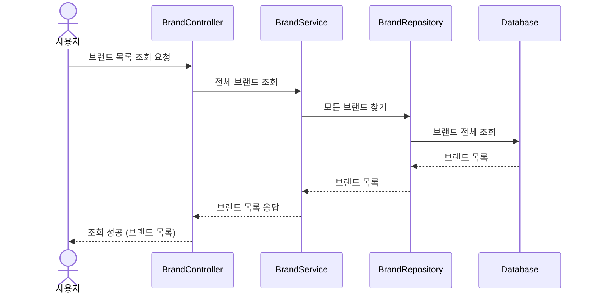
```mermaid
sequenceDiagram
    actor User as 사용자
    participant API as BrandController
    participant Service as BrandService
    participant Repo as BrandRepository
    participant DB as Database

    User->>API: 브랜드 목록 조회 요청
    API->>Service: 전체 브랜드 조회
    Service->>Repo: 모든 브랜드 찾기
    Repo->>DB: 브랜드 전체 조회
    DB-->>Repo: 브랜드 목록
    Repo-->>Service: 브랜드 목록
    Service-->>API: 브랜드 목록 응답
    API-->>User: 조회 성공 (브랜드 목록)
```

---

## 2. 상품 조회

### 2.1 상품 목록 조회

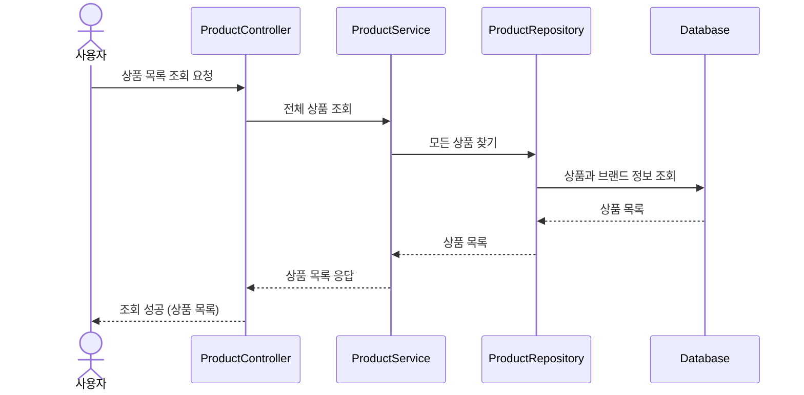
```mermaid
sequenceDiagram
    actor User as 사용자
    participant API as ProductController
    participant Service as ProductService
    participant Repo as ProductRepository
    participant DB as Database

    User->>API: 상품 목록 조회 요청
    API->>Service: 전체 상품 조회
    Service->>Repo: 모든 상품 찾기
    Repo->>DB: 상품과 브랜드 정보 조회
    DB-->>Repo: 상품 목록
    Repo-->>Service: 상품 목록
    Service-->>API: 상품 목록 응답
    API-->>User: 조회 성공 (상품 목록)
```

### 2.2 상품 상세 조회

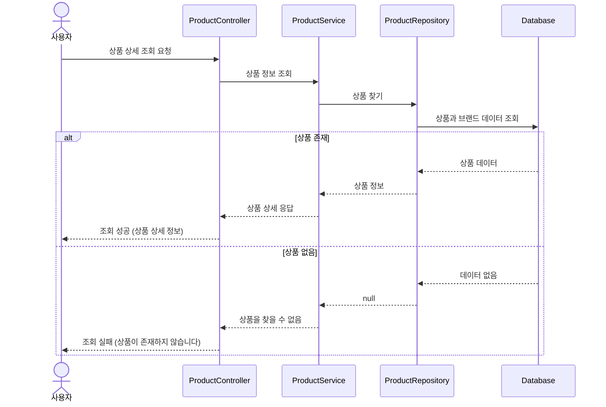
```mermaid
sequenceDiagram
    actor User as 사용자
    participant API as ProductController
    participant Service as ProductService
    participant Repo as ProductRepository
    participant DB as Database

    User->>API: 상품 상세 조회 요청
    API->>Service: 상품 정보 조회
    Service->>Repo: 상품 찾기
    Repo->>DB: 상품과 브랜드 데이터 조회

    alt 상품 존재
        DB-->>Repo: 상품 데이터
        Repo-->>Service: 상품 정보
        Service-->>API: 상품 상세 응답
        API-->>User: 조회 성공 (상품 상세 정보)
    else 상품 없음
        DB-->>Repo: 데이터 없음
        Repo-->>Service: null
        Service-->>API: 상품을 찾을 수 없음
        API-->>User: 조회 실패 (상품이 존재하지 않습니다)
    end
```

---

## 3. 좋아요

### 3.1 좋아요 등록/취소 (토글)

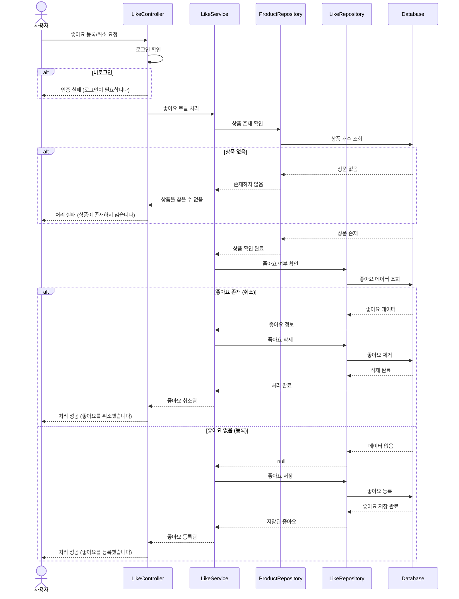
```mermaid
sequenceDiagram
    actor User as 사용자
    participant API as LikeController
    participant Service as LikeService
    participant ProductRepo as ProductRepository
    participant LikeRepo as LikeRepository
    participant DB as Database

    User->>API: 좋아요 등록/취소 요청
    API->>API: 로그인 확인

    alt 비로그인
        API-->>User: 인증 실패 (로그인이 필요합니다)
    end

    API->>Service: 좋아요 토글 처리

    Service->>ProductRepo: 상품 존재 확인
    ProductRepo->>DB: 상품 개수 조회

    alt 상품 없음
        DB-->>ProductRepo: 상품 없음
        ProductRepo-->>Service: 존재하지 않음
        Service-->>API: 상품을 찾을 수 없음
        API-->>User: 처리 실패 (상품이 존재하지 않습니다)
    end

    DB-->>ProductRepo: 상품 존재
    ProductRepo-->>Service: 상품 확인 완료

    Service->>LikeRepo: 좋아요 여부 확인
    LikeRepo->>DB: 좋아요 데이터 조회

    alt 좋아요 존재 (취소)
        DB-->>LikeRepo: 좋아요 데이터
        LikeRepo-->>Service: 좋아요 정보
        Service->>LikeRepo: 좋아요 삭제
        LikeRepo->>DB: 좋아요 제거
        DB-->>LikeRepo: 삭제 완료
        LikeRepo-->>Service: 처리 완료
        Service-->>API: 좋아요 취소됨
        API-->>User: 처리 성공 (좋아요를 취소했습니다)
    else 좋아요 없음 (등록)
        DB-->>LikeRepo: 데이터 없음
        LikeRepo-->>Service: null
        Service->>LikeRepo: 좋아요 저장
        LikeRepo->>DB: 좋아요 등록
        DB-->>LikeRepo: 좋아요 저장 완료
        LikeRepo-->>Service: 저장된 좋아요
        Service-->>API: 좋아요 등록됨
        API-->>User: 처리 성공 (좋아요를 등록했습니다)
    end
```

### 3.2 좋아요한 상품 목록 조회

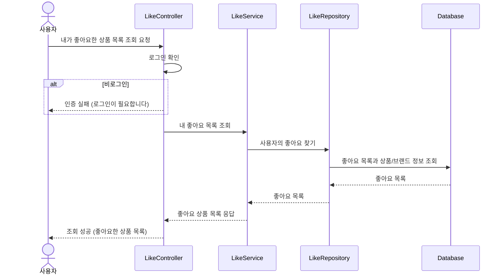
```mermaid
sequenceDiagram
    actor User as 사용자
    participant API as LikeController
    participant Service as LikeService
    participant Repo as LikeRepository
    participant DB as Database

    User->>API: 내가 좋아요한 상품 목록 조회 요청
    API->>API: 로그인 확인

    alt 비로그인
        API-->>User: 인증 실패 (로그인이 필요합니다)
    end

    API->>Service: 내 좋아요 목록 조회
    Service->>Repo: 사용자의 좋아요 찾기
    Repo->>DB: 좋아요 목록과 상품/브랜드 정보 조회
    DB-->>Repo: 좋아요 목록
    Repo-->>Service: 좋아요 목록
    Service-->>API: 좋아요 상품 목록 응답
    API-->>User: 조회 성공 (좋아요한 상품 목록)
```

---

## 4. 주문

### 4.1 주문 생성 (성공 케이스)

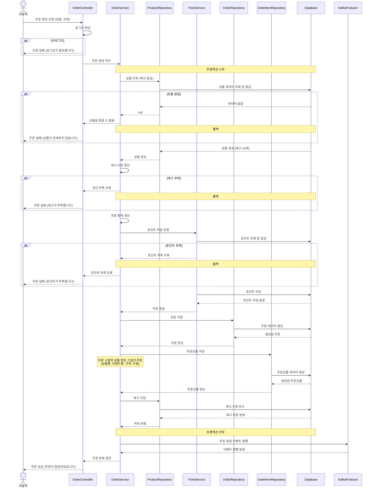
```mermaid
sequenceDiagram
    actor User as 사용자
    participant API as OrderController
    participant Service as OrderService
    participant ProductRepo as ProductRepository
    participant PointService as PointService
    participant OrderRepo as OrderRepository
    participant ItemRepo as OrderItemRepository
    participant DB as Database
    participant Kafka as KafkaProducer

    User->>API: 주문 생성 요청 (상품, 수량)
    API->>API: 로그인 확인

    alt 비로그인
        API-->>User: 인증 실패 (로그인이 필요합니다)
    end

    API->>Service: 주문 생성 처리

    Note over Service,DB: 트랜잭션 시작

    Service->>ProductRepo: 상품 조회 (재고 잠금)
    ProductRepo->>DB: 상품 데이터 조회 및 잠금

    alt 상품 없음
        DB-->>ProductRepo: 데이터 없음
        ProductRepo-->>Service: null
        Service-->>API: 상품을 찾을 수 없음
        Note over Service,DB: 롤백
        API-->>User: 주문 실패 (상품이 존재하지 않습니다)
    end

    DB-->>ProductRepo: 상품 정보 (재고 10개)
    ProductRepo-->>Service: 상품 정보

    Service->>Service: 재고 수량 확인

    alt 재고 부족
        Service-->>API: 재고 부족 오류
        Note over Service,DB: 롤백
        API-->>User: 주문 실패 (재고가 부족합니다)
    end

    Service->>Service: 주문 총액 계산

    Service->>PointService: 포인트 차감 요청
    PointService->>DB: 포인트 조회 및 잠금

    alt 포인트 부족
        PointService-->>Service: 포인트 부족 오류
        Note over Service,DB: 롤백
        Service-->>API: 포인트 부족 오류
        API-->>User: 주문 실패 (포인트가 부족합니다)
    end

    PointService->>DB: 포인트 차감
    DB-->>PointService: 포인트 차감 완료
    PointService-->>Service: 처리 완료

    Service->>OrderRepo: 주문 저장
    OrderRepo->>DB: 주문 데이터 생성
    DB-->>OrderRepo: 생성된 주문
    OrderRepo-->>Service: 주문 정보

    Service->>ItemRepo: 주문상품 저장
    Note over Service: 주문 시점의 상품 정보 스냅샷 저장<br/>(상품명, 브랜드명, 가격, 수량)
    ItemRepo->>DB: 주문상품 데이터 생성
    DB-->>ItemRepo: 생성된 주문상품
    ItemRepo-->>Service: 주문상품 정보

    Service->>ProductRepo: 재고 차감
    ProductRepo->>DB: 재고 수량 감소
    DB-->>ProductRepo: 재고 차감 완료
    ProductRepo-->>Service: 처리 완료

    Note over Service,DB: 트랜잭션 커밋

    Service->>Kafka: 주문 완료 이벤트 발행
    Kafka-->>Service: 이벤트 발행 완료

    Service-->>API: 주문 완료 응답
    API-->>User: 주문 성공 (주문이 완료되었습니다)
```

### 4.2 주문 생성 (재고 부족)

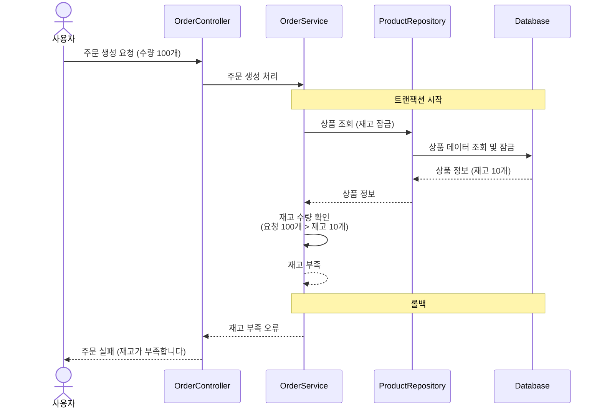
```mermaid
sequenceDiagram
    actor User as 사용자
    participant API as OrderController
    participant Service as OrderService
    participant ProductRepo as ProductRepository
    participant DB as Database

    User->>API: 주문 생성 요청 (수량 100개)
    API->>Service: 주문 생성 처리

    Note over Service,DB: 트랜잭션 시작

    Service->>ProductRepo: 상품 조회 (재고 잠금)
    ProductRepo->>DB: 상품 데이터 조회 및 잠금
    DB-->>ProductRepo: 상품 정보 (재고 10개)
    ProductRepo-->>Service: 상품 정보

    Service->>Service: 재고 수량 확인<br/>(요청 100개 > 재고 10개)
    Service-->>Service: 재고 부족

    Note over Service,DB: 롤백

    Service-->>API: 재고 부족 오류
    API-->>User: 주문 실패 (재고가 부족합니다)
```

### 4.3 주문 생성 (포인트 부족)

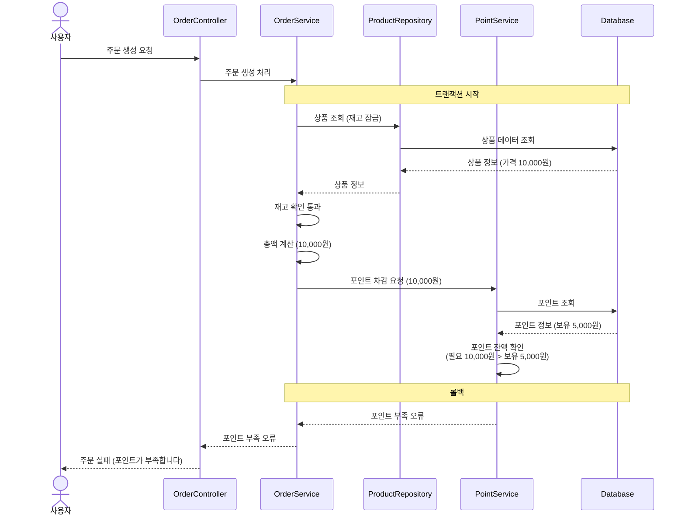
```mermaid
sequenceDiagram
    actor User as 사용자
    participant API as OrderController
    participant Service as OrderService
    participant ProductRepo as ProductRepository
    participant PointService as PointService
    participant DB as Database

    User->>API: 주문 생성 요청
    API->>Service: 주문 생성 처리

    Note over Service,DB: 트랜잭션 시작

    Service->>ProductRepo: 상품 조회 (재고 잠금)
    ProductRepo->>DB: 상품 데이터 조회
    DB-->>ProductRepo: 상품 정보 (가격 10,000원)
    ProductRepo-->>Service: 상품 정보

    Service->>Service: 재고 확인 통과
    Service->>Service: 총액 계산 (10,000원)

    Service->>PointService: 포인트 차감 요청 (10,000원)
    PointService->>DB: 포인트 조회
    DB-->>PointService: 포인트 정보 (보유 5,000원)

    PointService->>PointService: 포인트 잔액 확인<br/>(필요 10,000원 > 보유 5,000원)

    Note over Service,DB: 롤백

    PointService-->>Service: 포인트 부족 오류
    Service-->>API: 포인트 부족 오류
    API-->>User: 주문 실패 (포인트가 부족합니다)
```

### 4.4 주문 목록 조회

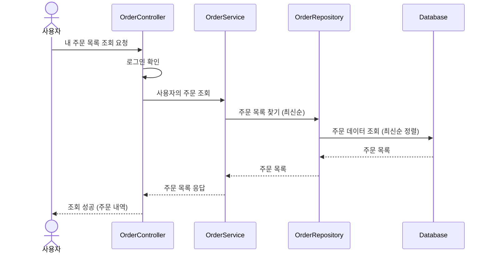
```mermaid
sequenceDiagram
    actor User as 사용자
    participant API as OrderController
    participant Service as OrderService
    participant Repo as OrderRepository
    participant DB as Database

    User->>API: 내 주문 목록 조회 요청
    API->>API: 로그인 확인
    API->>Service: 사용자의 주문 조회
    Service->>Repo: 주문 목록 찾기 (최신순)
    Repo->>DB: 주문 데이터 조회 (최신순 정렬)
    DB-->>Repo: 주문 목록
    Repo-->>Service: 주문 목록
    Service-->>API: 주문 목록 응답
    API-->>User: 조회 성공 (주문 내역)
```

### 4.5 주문 상세 조회

```mermaid
sequenceDiagram
    actor User as 사용자
    participant API as OrderController
    participant Service as OrderService
    participant OrderRepo as OrderRepository
    participant ItemRepo as OrderItemRepository
    participant DB as Database

    User->>API: 주문 상세 조회 요청
    API->>API: 로그인 확인
    API->>Service: 주문 상세 정보 조회

    Service->>OrderRepo: 주문 찾기
    OrderRepo->>DB: 주문 데이터 조회

    alt 주문 없음
        DB-->>OrderRepo: 데이터 없음
        OrderRepo-->>Service: null
        Service-->>API: 주문을 찾을 수 없음
        API-->>User: 조회 실패 (주문이 존재하지 않습니다)
    end

    DB-->>OrderRepo: 주문 정보
    OrderRepo-->>Service: 주문 정보

    Service->>Service: 본인 주문 확인

    alt 다른 사용자의 주문
        Service-->>API: 권한 없음
        API-->>User: 조회 실패 (다른 사용자의 주문입니다)
    end

    Service->>ItemRepo: 주문상품 목록 찾기
    ItemRepo->>DB: 주문상품 데이터 조회
    DB-->>ItemRepo: 주문상품 목록
    ItemRepo-->>Service: 주문상품 목록

    Service-->>API: 주문 상세 응답<br/>(주문 정보 + 주문상품 목록)
    API-->>User: 조회 성공 (주문 상세 정보)
```
