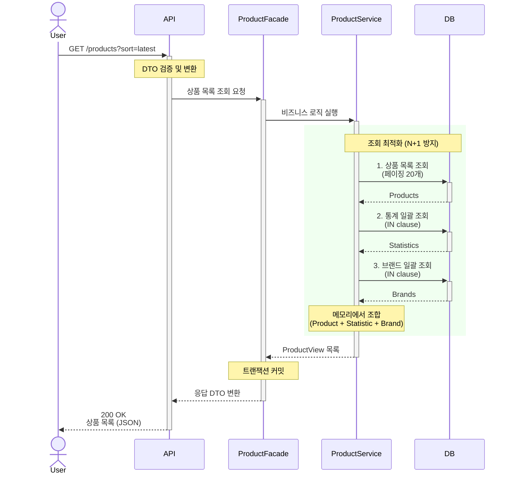
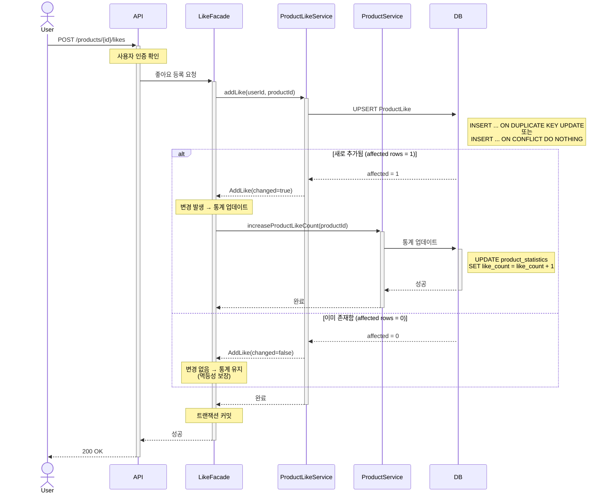
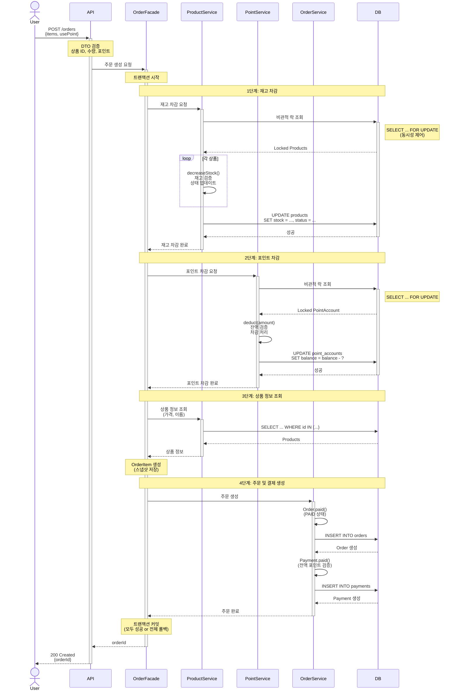

# 시퀀스 다이어그램 (Sequence Diagrams)

본 문서는 감성 이커머스의 핵심 유스케이스에 대한 **시스템 아키텍처 관점**의 상호작용을 시각화합니다.

---

## 1. 상품 목록 조회 (Find Products)

### 1.1 시스템 컨텍스트 다이어그램

---

## 2. 상품 좋아요 등록 (Like Product)

- 특이 사항
    - UPSERT 사용: INSERT ... ON DUPLICATE KEY UPDATE 또는 ON CONFLICT DO NOTHING
    - 반환값 기반 판단: affected rows로 실제 변경 여부 확인
    - 멱등성 보장: 중복 등록 시 통계 증가 없이 성공 응답

---

## 3. 주문 생성 및 결제 (Place Order)

- 특이 사항
    - 재고와 포인트 모두 비관적 락 사용
    - 주문/결제 모두 성공 or 전체 롤백

- 실패 시나리오
    - 재고 부족 → 트랜잭션 롤백 → 400 Bad Request
    - 포인트 부족 → 트랜잭션 롤백 → 400 Bad Request
    - 상품 미존재 → 트랜잭션 롤백 → 400 Bad Request