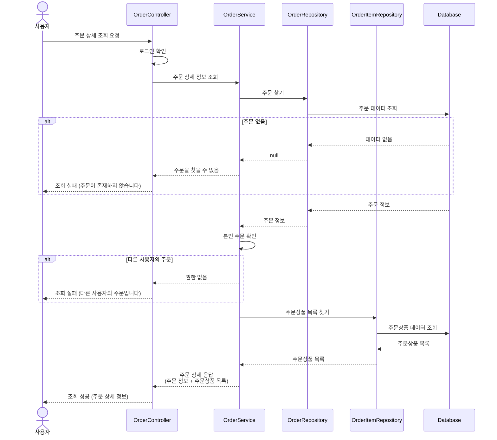

# 시퀀스 다이어그램

---

## 1. 브랜드 조회

### 1.1 브랜드 상세 조회

### 1.2 브랜드 목록 조회

---

## 2. 상품 조회

### 2.1 상품 목록 조회

### 2.2 상품 상세 조회

---

## 3. 좋아요

### 3.1 좋아요 등록/취소 (토글)

### 3.2 좋아요한 상품 목록 조회

---

## 4. 주문

### 4.1 주문 생성 (성공 케이스)

### 4.2 주문 생성 (재고 부족)

### 4.3 주문 생성 (포인트 부족)

### 4.4 주문 목록 조회

### 4.5 주문 상세 조회

