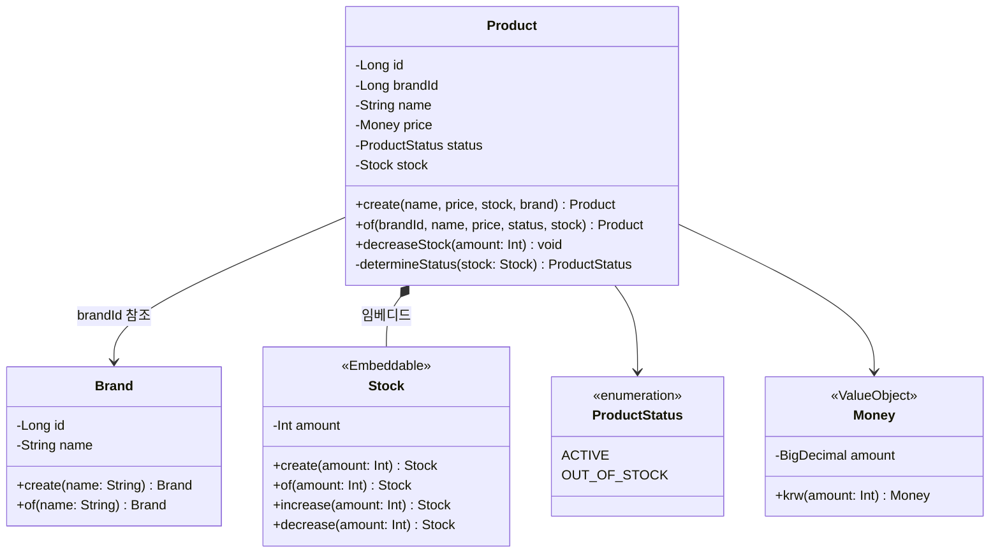
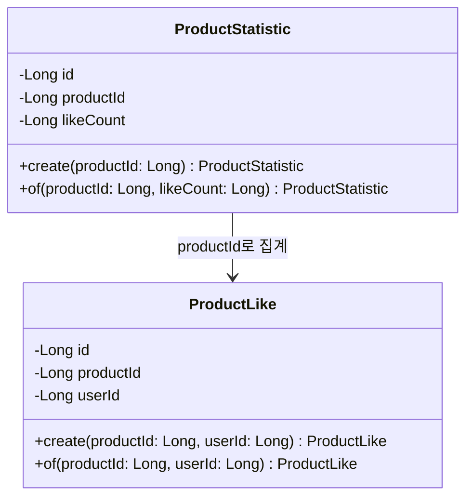
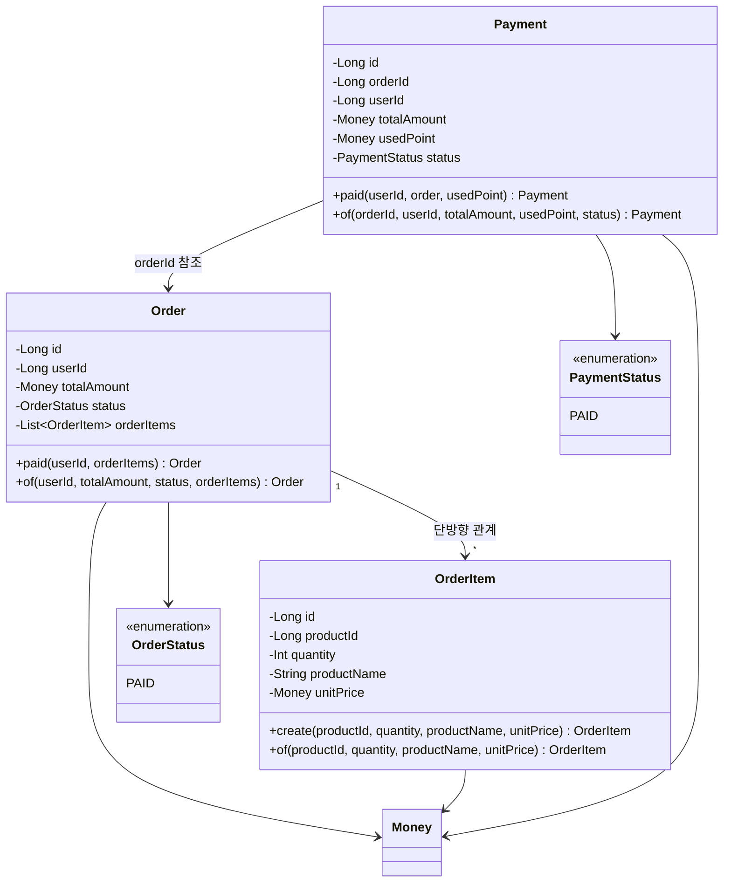
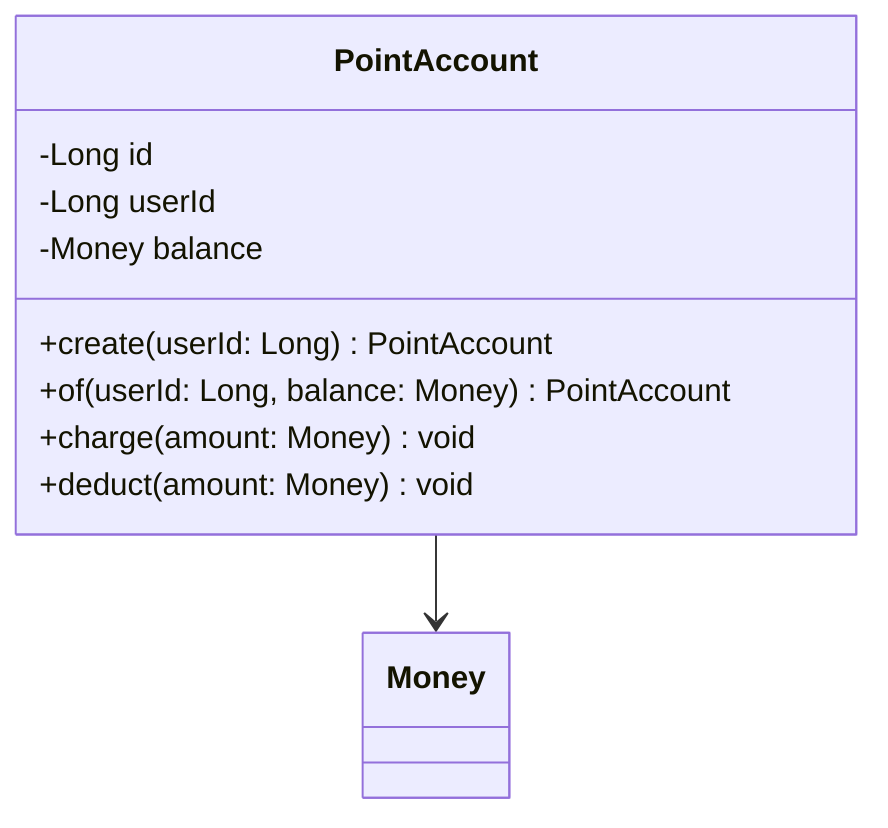

# 클래스 다이어그램 (Class Diagram)

본 문서는 감성 이커머스의 도메인 모델 구조를 시각화합니다.

---

## 1. Products 도메인

**주요 구조:**

- **Brand**: 브랜드 정보 엔티티
- **Product**: 상품 엔티티. 상태 관리 행위(품절/재판매/단종) 포함
- **Stock**: 재고 값 객체 (Embeddable). 차감/증가/소진 확인 행위 포함
- **Money**: 금액 값 객체. 금액 계산 로직 캡슐화
- **ProductStatus**: 상품 상태 열거형

**설계 의도:**

- Product가 Stock을 Embeddable로 포함하여 재고를 직접 관리
- Product의 `decreaseStock()` 메서드로 재고 차감 시 상태도 함께 업데이트

---

## 2. Likes 도메인

**주요 구조:**

- **ProductLike**: 사용자의 상품 좋아요 기록 엔티티
- **ProductStatistic**: 상품별 좋아요 수 집계 엔티티

**설계 의도:**

- ProductLike는 단순한 관계 엔티티로 별도의 비즈니스 로직 없음
- ProductStatistic은 좋아요 수를 집계하여 조회 성능 최적화

---

## 3. Orders 도메인

**주요 구조:**

- **Order**: 주문 엔티티. 주문 생성(paid) 행위 포함
- **OrderItem**: 주문 항목 엔티티. 주문 시점의 상품 정보 스냅샷
- **Payment**: 결제 엔티티. 결제 생성 및 완료 처리 행위 포함
- **OrderStatus**: 주문 상태 열거형 (PAID만 존재)
- **PaymentStatus**: 결제 상태 열거형 (PAID만 존재)

**설계 의도:**

- Order와 OrderItem은 하나의 애그리게이트 (강한 일관성)
- Payment는 독립적인 애그리게이트
- Payment는 전액 포인트 결제만 지원 (usedPoint == totalAmount)

---

## 4. Points 도메인

**주요 구조:**

- **PointAccount**: 포인트 잔액 관리 엔티티. 증가/감소 행위 포함

**설계 의도:**

- PointAccount가 포인트 충전(charge) 및 차감(deduct)을 직접 처리
- 포인트 잔액만 관리하며 이력은 별도로 추적하지 않음
