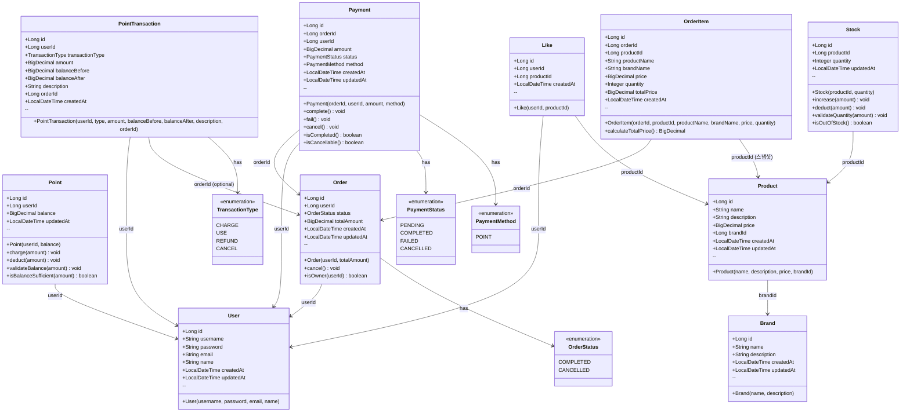

# 클래스 다이어그램

---
# 설계 특징 & 요약

### 1. 단방향 참조 구조
- **컬렉션 참조 제거**: 컬렉션으로 표현하는 매핑을 사용하지 않음

### 2. 객체 참조 최소화
- `Product.brandId` (Long) - Brand 객체 대신 ID 참조
- `Like.userId`, `Like.productId` (Long) - 객체 대신 ID만 보유
- `Order.userId` (Long) - User 객체 대신 ID 참조
- `OrderItem.orderId`, `OrderItem.productId` (Long) - 객체 대신 ID 참조

### 3. 컬렉션 제거
- `Brand`는 `List<Product>` 보유하지 않음
- `Order`는 `List<OrderItem>` 보유하지 않음
- 필요 시 Repository를 통해 조회 (예: `findByBrandId`, `findByOrderId`)

### 4. 스냅샷 패턴
- `OrderItem`은 주문 시점의 상품 정보를 불변으로 관리
- `productId`는 데이터 참고용이며 FK 용도가 아님
- 상품 삭제/수정과 무관하게 주문 내역 보존

## 전체 도메인 모델

---

## 계층별 클래스 구조 (Clean Architecture 기반)

### Controller Layer (interfaces/api)

---

### Facade Layer (application)

---

### Service Layer (domain)

---

### Repository 인터페이스 (domain)

