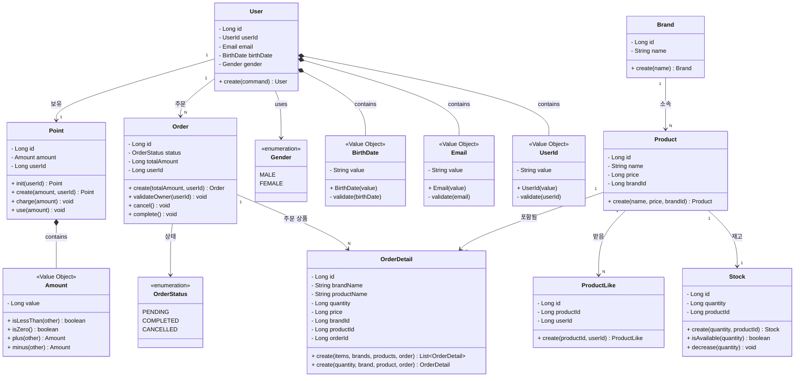

# 클래스 다이어그램

# 설계 의사결정 문서

## 목차

- [1. Stock (재고 관리)](#1-stock-재고-관리)
- [2. ProductLike (상품 좋아요)](#2-productlike-상품-좋아요)
- [3. VO (Value Object)](#3-vo-value-object)

---

## 1. Stock (재고 관리)

### 결정: 비관적 락 사용

#### 낙관적 락의 문제점

**성능 이슈**

- 인기 상품에 동시 주문 100건 발생 시, 재시도 로직(3회)으로 최악의 경우 N × 3 트랜잭션 발생

**정합성 이슈 (Critical)**

- 멀티 서버 환경에서 Lost Update 발생 확인 (k6 테스트 결과)
- 재고 10개 → 주문 12개 성공 (또는 극단적으로 2개만 성공)

#### 비관적 락 선택 이유

- DB 레벨에서 확실한 정합성 보장
- 재시도 로직 불필요로 성능 예측 가능
- 현재 트래픽 규모에서는 정합성이 더 중요

#### 트레이드오프

- 락 대기 발생 가능
- 트래픽 증가 시 Redis 기반 분산 락으로 전환 고려

---

## 2. ProductLike (상품 좋아요)

### 결정 1: Product에서 likeCount 분리

#### 제거 이유

**관심사 분리**

- likeCount는 Product의 본질적 속성이 아닌 사용자 행동 데이터

**락 경합 문제 (Critical)**

- 좋아요 수 업데이트 시 Product 전체 row 락 발생
- 상품 가격 수정(핵심 비즈니스)이 좋아요 때문에 blocking되는 것은 부자연스러움

**확장성**

- 좋아요 관련 기능 추가 시 Product 테이블 복잡도 증가 방지

### 결정 2: 좋아요 수 조회 방식

**초기 설계**

- GROUP BY 집계 쿼리 사용
- 간단하지만 상품 목록 조회 시 매번 집계 연산

**향후 개선 방향 (트래픽 증가 시)**

1. **Step 1**: ProductLikeCount 테이블 추가 (단순 JOIN으로 조회)
2. **Step 2**: Redis 캐시 적용

---

## 3. VO (Value Object)

### 결정: 초기 설계 제외, 필요 시 점진적 추가

**YAGNI 원칙 적용**

- 복잡도를 낮추고 빠른 구현 우선

#### VO 추가 신호

- 동일 검증 로직 반복
- 비즈니스 규칙 명확화
- 도메인 개념 구체화

#### 향후 후보

- Email
- Price
- Quantity 등

---

## 참고

- [6조 정완님 PR 리뷰 댓글](https://github.com/Loopers-dev-lab/loopers-spring-kotlin-template/pull/19#discussion_r2484885921)
