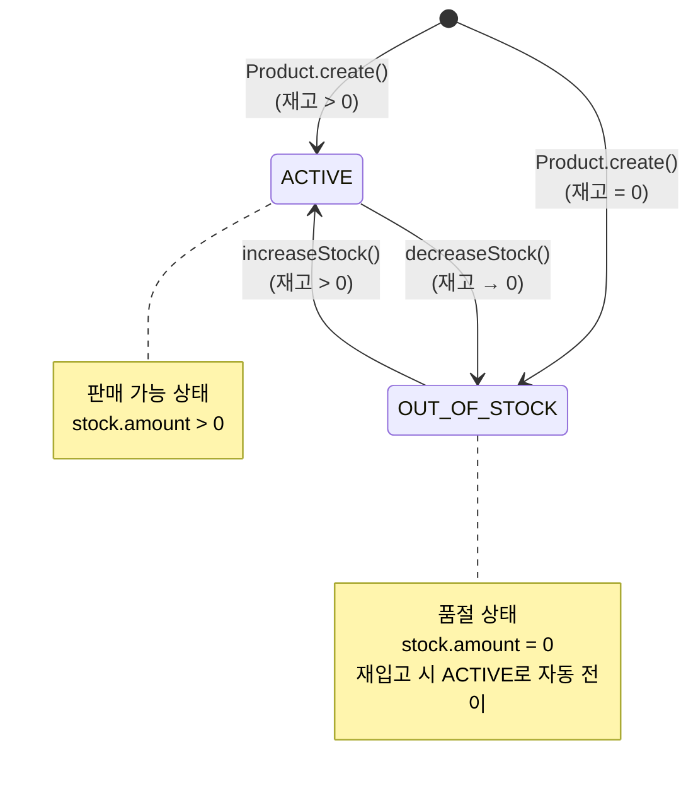
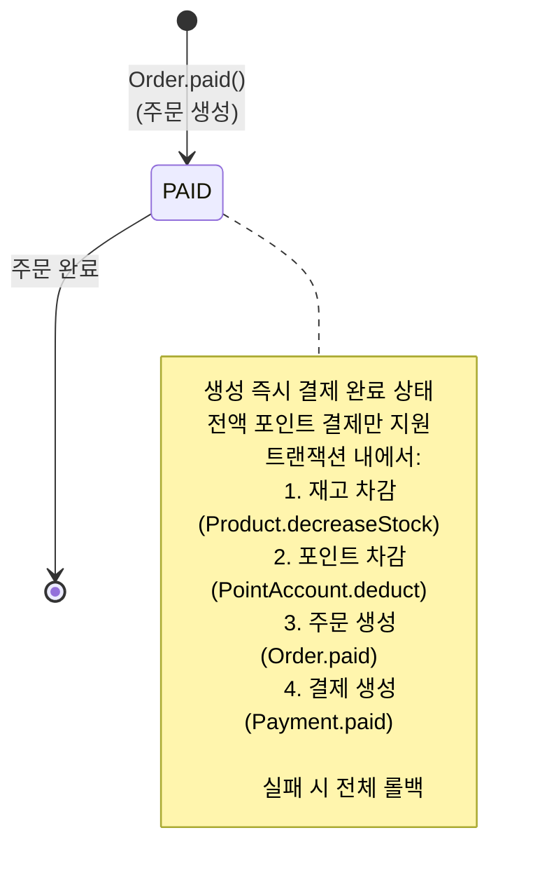
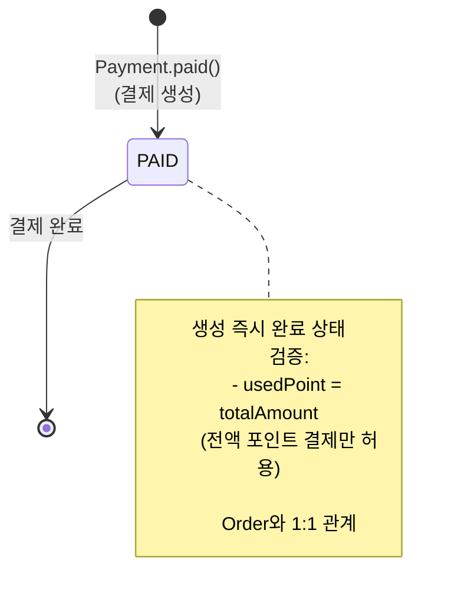

# 상태 다이어그램 (State Diagrams)

본 문서는 감성 이커머스의 핵심 엔티티들의 상태 전이를 시각화합니다.

---

## 1. Product 상태 다이어그램



### 상태 정의

```kotlin
enum class ProductStatus {
    ACTIVE,           // 판매 중
    OUT_OF_STOCK,     // 품절
}
```

### 상태 전이 조건

| 현재 상태        | 이벤트              | 다음 상태        | 전이 조건                    |
|--------------|------------------|--------------|--------------------------|
| -            | Product.create() | ACTIVE       | stock.amount > 0         |
| -            | Product.create() | OUT_OF_STOCK | stock.amount = 0         |
| ACTIVE       | decreaseStock()  | OUT_OF_STOCK | 재고 차감 후 stock.amount = 0 |
| OUT_OF_STOCK | increaseStock()  | ACTIVE       | 재고 증가 후 stock.amount > 0 |

**설계 특징:**

- ✅ **단순성**: 재고 수량만으로 ACTIVE ↔ OUT_OF_STOCK 전이

---

## 2. Order 상태 다이어그램



### 상태 정의

```kotlin
enum class OrderStatus {
    PAID  // 결제 완료 (유일한 상태)
}
```

### 주문 생성 과정

```kotlin
@Transactional
fun createOrder(userId: Long, items: List<OrderItemRequest>, usePoint: Money): Order {
    // 1. 재고 차감
    items.forEach { item ->
        val product = productRepository.findByIdForUpdate(item.productId)
        product.decreaseStock(item.quantity)
        productRepository.save(product)
    }

    // 2. 포인트 차감
    val pointAccount = pointAccountRepository.findByUserIdForUpdate(userId)
    pointAccount.deduct(usePoint)
    pointAccountRepository.save(pointAccount)

    // 3. 주문 생성 (PAID 상태)
    val order = Order.paid(userId, orderItems)
    orderRepository.save(order)

    // 4. 결제 생성 (PAID 상태)
    val payment = Payment.paid(userId, order, usePoint)
    paymentRepository.save(payment)

    return order
}
```

**설계 특징:**

- ⚡ **동기 처리**: 주문 생성 = 결제 완료 (단일 트랜잭션)
- 🔒 **원자성**: 재고/포인트/주문/결제 모두 성공 or 모두 실패
- 💰 **전액 포인트**: 외부 PG 연동 없이 즉시 완료
- ❌ **취소 불가**: 주문 취소, 반품 기능 미지원

**제약사항:**

- 주문 후 취소 불가
- 배송 상태 추적 불가
- 부분 환불 불가
- 구매 확정 개념 없음

---

## 3. Payment 상태 다이어그램



### 상태 정의

```kotlin
enum class PaymentStatus {
    PAID  // 결제 완료 (유일한 상태)
}
```

### 결제 생성 로직

```kotlin
class Payment {
    companion object {
        fun paid(userId: Long, order: Order, usedPoint: Money): Payment {
            // 전액 포인트 검증
            if (usedPoint < Money.ZERO_KRW) {
                throw CoreException(ErrorType.BAD_REQUEST, "사용 포인트는 0 이상이어야 합니다.")
            }

            if (usedPoint != order.totalAmount) {
                throw CoreException(ErrorType.BAD_REQUEST, "사용 포인트가 주문 금액과 일치하지 않습니다.")
            }

            return Payment(
                orderId = order.id,
                userId = userId,
                totalAmount = order.totalAmount,
                usedPoint = usedPoint,
                status = PaymentStatus.PAID  // 생성 즉시 PAID
            )
        }
    }
}
```

**설계 특징:**

- 💰 **전액 포인트**: `usedPoint == totalAmount` 검증
- ⚡ **즉시 완료**: 생성 시점 = 결제 완료
- 🔗 **Order 종속**: Order와 생명주기 동일
- ❌ **PG 없음**: 외부 결제 시스템 연동 없음

**제약사항:**

- 카드/계좌이체 등 외부 결제 수단 미지원
- 결제 실패 상태 없음 (트랜잭션 롤백)
- 부분 결제 불가
- 환불 기능 미지원

