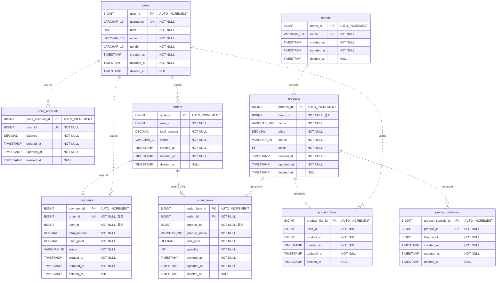

# ERD (Entity Relationship Diagram)

본 문서는 감성 이커머스의 데이터베이스 구조를 정의합니다.

---

## 1. ERD 다이어그램

**관계 표기:**

- **실선 (||--|{)**: FK 제약이 있는 관계 (Order ↔ OrderItem)
- **점선 (||..o{)**: ID로만 참조하는 관계 (FK 제약 없음)

---

## 2. 테이블 상세 정의

### 2.1 Users 도메인

#### users (사용자)

| 컬럼명        | 타입           | 제약                 | 설명                  |
|------------|--------------|--------------------|---------------------|
| user_id    | BIGINT       | PK, AUTO_INCREMENT | 사용자 ID              |
| username   | VARCHAR(10)  | NOT NULL, UNIQUE   | 사용자명 (영문, 숫자)       |
| birth      | DATE         | NOT NULL           | 생년월일                |
| email      | VARCHAR(100) | NOT NULL           | 이메일                 |
| gender     | VARCHAR(10)  | NOT NULL           | 성별 (MALE, FEMALE)   |
| created_at | TIMESTAMP    | NOT NULL           | 생성 시각               |
| updated_at | TIMESTAMP    | NOT NULL           | 수정 시각               |
| deleted_at | TIMESTAMP    | NULL               | 삭제 시각 (Soft Delete) |

**인덱스:**

- PK: user_id
- UK: username

---

### 2.2 Products 도메인

#### brands (브랜드)

| 컬럼명        | 타입           | 제약                 | 설명                  |
|------------|--------------|--------------------|---------------------|
| brand_id   | BIGINT       | PK, AUTO_INCREMENT | 브랜드 ID              |
| name       | VARCHAR(100) | NOT NULL, UNIQUE   | 브랜드 명               |
| created_at | TIMESTAMP    | NOT NULL           | 생성 시각               |
| updated_at | TIMESTAMP    | NOT NULL           | 수정 시각               |
| deleted_at | TIMESTAMP    | NULL               | 삭제 시각 (Soft Delete) |

**인덱스:**

- PK: brand_id
- UK: name

---

#### products (상품)

| 컬럼명        | 타입            | 제약                 | 설명                                      |
|------------|---------------|--------------------|-----------------------------------------|
| product_id | BIGINT        | PK, AUTO_INCREMENT | 상품 ID                                   |
| brand_id   | BIGINT        | NOT NULL           | 브랜드 ID (참조)                             |
| name       | VARCHAR(200)  | NOT NULL           | 상품명                                     |
| price      | DECIMAL(15,2) | NOT NULL           | 가격                                      |
| status     | VARCHAR(20)   | NOT NULL           | 상태 (ACTIVE, OUT_OF_STOCK, DISCONTINUED) |
| stock      | INT           | NOT NULL           | 재고 수량                                   |
| created_at | TIMESTAMP     | NOT NULL           | 생성 시각                                   |
| updated_at | TIMESTAMP     | NOT NULL           | 수정 시각                                   |
| deleted_at | TIMESTAMP     | NULL               | 삭제 시각 (Soft Delete)                     |

**인덱스:**

- PK: product_id
- IDX: (brand_id, price) - 브랜드별 가격 정렬용
- IDX: (brand_id, product_id DESC) - 브랜드별 최신순 조회용

**제약:**

- stock >= 0 (CHECK)

---

### 2.3 Likes 도메인

#### product_likes (상품 좋아요)

| 컬럼명             | 타입        | 제약                 | 설명                  |
|-----------------|-----------|--------------------|---------------------|
| product_like_id | BIGINT    | PK, AUTO_INCREMENT | 좋아요 ID              |
| user_id         | BIGINT    | NOT NULL           | 사용자 ID (참조)         |
| product_id      | BIGINT    | NOT NULL           | 상품 ID (참조)          |
| created_at      | TIMESTAMP | NOT NULL           | 생성 시각               |
| updated_at      | TIMESTAMP | NOT NULL           | 수정 시각               |
| deleted_at      | TIMESTAMP | NULL               | 삭제 시각 (Soft Delete) |

**인덱스:**

- PK: product_like_id
- UK: (user_id, product_id)
- IDX: user_id (내가 좋아요한 목록 조회용)
- IDX: product_id (상품별 좋아요 조회용)

**특이사항:**

- 좋아요 취소에 대해 하드 딜리트로 처리

---

#### product_statistics (상품 통계)

| 컬럼명                  | 타입        | 제약                 | 설명                  |
|----------------------|-----------|--------------------|---------------------|
| product_statistic_id | BIGINT    | PK, AUTO_INCREMENT | 통계 ID               |
| product_id           | BIGINT    | NOT NULL, UNIQUE   | 상품 ID (참조)          |
| like_count           | BIGINT    | NOT NULL           | 좋아요 수               |
| created_at           | TIMESTAMP | NOT NULL           | 생성 시각               |
| updated_at           | TIMESTAMP | NOT NULL           | 수정 시각               |
| deleted_at           | TIMESTAMP | NULL               | 삭제 시각 (Soft Delete) |

**인덱스:**

- PK: product_statistic_id
- UK: product_id
- IDX: (like_count DESC)

**제약:**

- like_count >= 0 (CHECK)

---

### 2.4 Orders 도메인

#### orders (주문)

| 컬럼명          | 타입            | 제약                 | 설명                  |
|--------------|---------------|--------------------|---------------------|
| order_id     | BIGINT        | PK, AUTO_INCREMENT | 주문 ID               |
| user_id      | BIGINT        | NOT NULL           | 사용자 ID (참조)         |
| total_amount | DECIMAL(15,2) | NOT NULL           | 총 주문 금액             |
| status       | VARCHAR(20)   | NOT NULL           | 주문 상태 (PAID)        |
| created_at   | TIMESTAMP     | NOT NULL           | 생성 시각               |
| updated_at   | TIMESTAMP     | NOT NULL           | 수정 시각               |
| deleted_at   | TIMESTAMP     | NULL               | 삭제 시각 (Soft Delete) |

**인덱스:**

- PK: order_id
- IDX: user_id (사용자별 주문 목록 조회용)
- IDX: created_at (최신 주문 조회용)

---

#### order_items (주문 항목)

| 컬럼명           | 타입            | 제약                 | 설명                  |
|---------------|---------------|--------------------|---------------------|
| order_item_id | BIGINT        | PK, AUTO_INCREMENT | 주문 항목 ID            |
| order_id      | BIGINT        | NOT NULL, FK       | 주문 ID               |
| product_id    | BIGINT        | NOT NULL           | 상품 ID (참조)          |
| product_name  | VARCHAR(200)  | NOT NULL           | 상품명 (스냅샷)           |
| unit_price    | DECIMAL(15,2) | NOT NULL           | 단가 (스냅샷)            |
| quantity      | INT           | NOT NULL           | 수량                  |
| created_at    | TIMESTAMP     | NOT NULL           | 생성 시각               |
| updated_at    | TIMESTAMP     | NOT NULL           | 수정 시각               |
| deleted_at    | TIMESTAMP     | NULL               | 삭제 시각 (Soft Delete) |

**인덱스:**

- PK: order_item_id
- FK: order_id → orders(order_id) ON DELETE CASCADE

---

#### payments (결제)

| 컬럼명          | 타입            | 제약                 | 설명                  |
|--------------|---------------|--------------------|---------------------|
| payment_id   | BIGINT        | PK, AUTO_INCREMENT | 결제 ID               |
| order_id     | BIGINT        | NOT NULL, UNIQUE   | 주문 ID (참조)          |
| user_id      | BIGINT        | NOT NULL           | 사용자 ID (참조)         |
| total_amount | DECIMAL(15,2) | NOT NULL           | 총 주문 금액             |
| used_point   | DECIMAL(15,2) | NOT NULL           | 사용 포인트              |
| status       | VARCHAR(20)   | NOT NULL           | 결제 상태 (PAID)        |
| created_at   | TIMESTAMP     | NOT NULL           | 생성 시각               |
| updated_at   | TIMESTAMP     | NOT NULL           | 수정 시각               |
| deleted_at   | TIMESTAMP     | NULL               | 삭제 시각 (Soft Delete) |

**인덱스:**

- PK: payment_id
- UK: order_id
- IDX: user_id (사용자별 결제 이력 조회용)

---

### 2.5 Points 도메인

#### point_accounts (포인트 계좌)

| 컬럼명              | 타입            | 제약                 | 설명                  |
|------------------|---------------|--------------------|---------------------|
| point_account_id | BIGINT        | PK, AUTO_INCREMENT | 포인트 계좌 ID           |
| user_id          | BIGINT        | NOT NULL, UNIQUE   | 사용자 ID (참조)         |
| balance          | DECIMAL(15,2) | NOT NULL           | 포인트 잔액              |
| created_at       | TIMESTAMP     | NOT NULL           | 생성 시각               |
| updated_at       | TIMESTAMP     | NOT NULL           | 수정 시각               |
| deleted_at       | TIMESTAMP     | NULL               | 삭제 시각 (Soft Delete) |

**인덱스:**

- PK: point_account_id
- UK: user_id

**제약:**

- balance >= 0 (CHECK)

---

## 3. 설계 고려사항

### 3.1 동시성 제어

- **products 테이블**: 재고 차감 시 비관적 락(`SELECT ... FOR UPDATE`) 사용

### 3.2 데이터 정합성

- **order_items**: 주문 시점의 상품 정보를 스냅샷으로 저장 (가격 변동 영향 없음)
- **payments**: total_amount == used_point (전액 포인트 결제)

### 3.3 FK 제약 전략

- **Order-OrderItem**: 같은 애그리게이트이므로 FK 유지 (ON DELETE CASCADE)
- **나머지**: 애그리게이트 간 느슨한 결합을 위해 FK 제거, 애플리케이션 레벨에서 참조 무결성 관리

### 3.4 Soft Delete

- 모든 테이블에 deleted_at 컬럼 적용
- 실제 데이터 삭제 대신 deleted_at에 타임스탬프 기록
- 조회 시 deleted_at IS NULL 조건 추가

### 3.5 성능 최적화

- **product_statistics**: 좋아요 수 집계 테이블로 조회 성능 향상
- **인덱스**: 자주 조회되는 컬럼에 인덱스 설정 (created_at, user_id)

### 3.6 확장성

- 모든 ID는 BIGINT 사용으로 대용량 데이터 대비
- DECIMAL(15,2)로 최대 9,999,999,999,999.99까지 금액 처리 가능
