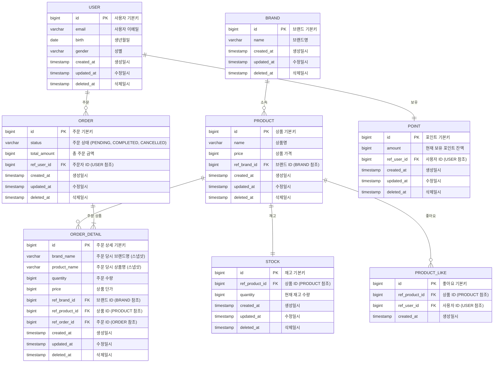

# ERD

# 🗂️ 테이블별 인덱스 & 제약조건

- 물리적 외래키는 생성하지 않고, 애플리케이션에서 검증한다.
- `deleted_at` null 여부로 삭제 여부를 판단한다.

## USER

**제약조건**

- PRIMARY KEY: `id`
- UNIQUE: `email` (이메일 중복 방지)

**인덱스**

- `idx_user_email` (`email`)

---

## BRAND

**제약조건**

- PRIMARY KEY: `id`
- UNIQUE: `name` (브랜드명 중복 방지)

**인덱스**

- `idx_brand_name` (`name`)

---

## PRODUCT

**제약조건**

- PRIMARY KEY: `id`
- FOREIGN KEY: `brand_id` → `BRAND(id)`

**인덱스**

- `idx_product_brand_id` (`brand_id`) - 브랜드별 상품 조회
- `idx_product_name` (`name`) - 상품명 검색
- `idx_product_price` (`price`) - 가격 범위 조회
- `idx_product_created_at` (`created_at DESC`) - 최신순 정렬

---

## STOCK

**제약조건**

- PRIMARY KEY: `id`
- FOREIGN KEY: `product_id` → `PRODUCT(id)`
- UNIQUE: `product_id` (상품당 재고 1개만)

**인덱스**

- `idx_stock_product_id` (`product_id`)

---

## ORDER

**제약조건**

- PRIMARY KEY: `id`
- FOREIGN KEY: `user_id` → `USER(id)`

**인덱스**

- `idx_order_user_id` (`user_id`) - 사용자별 주문 조회
- `idx_order_status` (`status`) - 상태별 주문 조회
- `idx_order_created_at` (`created_at DESC`) - 최신순 정렬
- `idx_order_user_created` (`user_id`, `created_at DESC`) - 복합 인덱스

---

## ORDER_DETAIL

**제약조건**

- PRIMARY KEY: `id`
- FOREIGN KEY: `order_id` → `ORDER(id)`
- FOREIGN KEY: `product_id` → `PRODUCT(id)`
- FOREIGN KEY: `brand_id` → `BRAND(id)`

**인덱스**

- `idx_order_detail_order_id` (`order_id`) - 주문별 상세 조회
- `idx_order_detail_product_id` (`product_id`) - 상품별 주문 이력
- `idx_order_detail_brand_id` (`brand_id`) - 브랜드별 주문 이력

---

## PRODUCT_LIKE

**제약조건**

- PRIMARY KEY: `id`
- FOREIGN KEY: `product_id` → `PRODUCT(id)`
- FOREIGN KEY: `user_id` → `USER(id)`
- UNIQUE: (`user_id`, `product_id`) - 중복 좋아요 방지

**인덱스**

- `idx_product_like_user_id` (`user_id`) - 사용자별 좋아요 목록
- `idx_product_like_product_id` (`product_id`) - 상품별 좋아요 조회

---

## POINT

**제약조건**

- PRIMARY KEY: `id`
- FOREIGN KEY: `user_id` → `USER(id)`
- UNIQUE: `user_id` (사용자당 포인트 계정 1개만)

**인덱스**

- `idx_point_user_id` (`user_id`)

---
