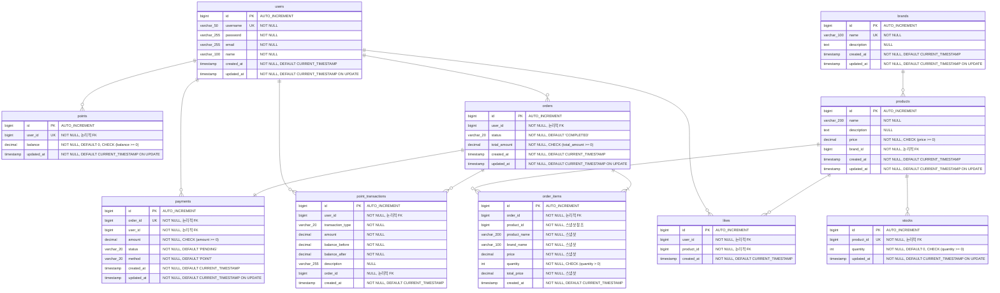

# ERD (Entity Relationship Diagram)

---

## ERD

```mermaid
erDiagram
    users ||--o{ points : ""
    users ||--o{ point_transactions : ""
    users ||--o{ likes : ""
    users ||--o{ orders : ""
    users ||--o{ payments : ""
    brands ||--o{ products : ""
    products ||--o{ stocks : ""
    products ||--o{ likes : ""
    products ||--o{ order_items : ""
    orders ||--|{ order_items : ""
    orders ||--|| payments : ""
    orders ||--o{ point_transactions : ""

    users {
        bigint id PK "AUTO_INCREMENT"
        varchar_50 username UK "NOT NULL"
        varchar_255 password "NOT NULL"
        varchar_255 email "NOT NULL"
        varchar_100 name "NOT NULL"
        timestamp created_at "NOT NULL, DEFAULT CURRENT_TIMESTAMP"
        timestamp updated_at "NOT NULL, DEFAULT CURRENT_TIMESTAMP ON UPDATE"
    }

    points {
        bigint id PK "AUTO_INCREMENT"
        bigint user_id UK "NOT NULL, 논리적 FK"
        decimal balance "NOT NULL, DEFAULT 0, CHECK (balance >= 0)"
        timestamp updated_at "NOT NULL, DEFAULT CURRENT_TIMESTAMP ON UPDATE"
    }

    brands {
        bigint id PK "AUTO_INCREMENT"
        varchar_100 name UK "NOT NULL"
        text description "NULL"
        timestamp created_at "NOT NULL, DEFAULT CURRENT_TIMESTAMP"
        timestamp updated_at "NOT NULL, DEFAULT CURRENT_TIMESTAMP ON UPDATE"
    }

    products {
        bigint id PK "AUTO_INCREMENT"
        varchar_200 name "NOT NULL"
        text description "NULL"
        decimal price "NOT NULL, CHECK (price >= 0)"
        bigint brand_id "NOT NULL, 논리적 FK"
        timestamp created_at "NOT NULL, DEFAULT CURRENT_TIMESTAMP"
        timestamp updated_at "NOT NULL, DEFAULT CURRENT_TIMESTAMP ON UPDATE"
    }

    stocks {
        bigint id PK "AUTO_INCREMENT"
        bigint product_id UK "NOT NULL, 논리적 FK"
        int quantity "NOT NULL, DEFAULT 0, CHECK (quantity >= 0)"
        timestamp updated_at "NOT NULL, DEFAULT CURRENT_TIMESTAMP ON UPDATE"
    }

    likes {
        bigint id PK "AUTO_INCREMENT"
        bigint user_id "NOT NULL, 논리적 FK"
        bigint product_id "NOT NULL, 논리적 FK"
        timestamp created_at "NOT NULL, DEFAULT CURRENT_TIMESTAMP"
    }

    orders {
        bigint id PK "AUTO_INCREMENT"
        bigint user_id "NOT NULL, 논리적 FK"
        varchar_20 status "NOT NULL, DEFAULT 'COMPLETED'"
        decimal total_amount "NOT NULL, CHECK (total_amount >= 0)"
        timestamp created_at "NOT NULL, DEFAULT CURRENT_TIMESTAMP"
        timestamp updated_at "NOT NULL, DEFAULT CURRENT_TIMESTAMP ON UPDATE"
    }

    order_items {
        bigint id PK "AUTO_INCREMENT"
        bigint order_id "NOT NULL, 논리적 FK"
        bigint product_id "NOT NULL, 스냅샷 참조"
        varchar_200 product_name "NOT NULL, 스냅샷"
        varchar_100 brand_name "NOT NULL, 스냅샷"
        decimal price "NOT NULL, 스냅샷"
        int quantity "NOT NULL, CHECK (quantity > 0)"
        decimal total_price "NOT NULL, 스냅샷"
        timestamp created_at "NOT NULL, DEFAULT CURRENT_TIMESTAMP"
    }

    payments {
        bigint id PK "AUTO_INCREMENT"
        bigint order_id UK "NOT NULL, 논리적 FK"
        bigint user_id "NOT NULL, 논리적 FK"
        decimal amount "NOT NULL, CHECK (amount >= 0)"
        varchar_20 status "NOT NULL, DEFAULT 'PENDING'"
        varchar_20 method "NOT NULL, DEFAULT 'POINT'"
        timestamp created_at "NOT NULL, DEFAULT CURRENT_TIMESTAMP"
        timestamp updated_at "NOT NULL, DEFAULT CURRENT_TIMESTAMP ON UPDATE"
    }

    point_transactions {
        bigint id PK "AUTO_INCREMENT"
        bigint user_id "NOT NULL, 논리적 FK"
        varchar_20 transaction_type "NOT NULL"
        decimal amount "NOT NULL"
        decimal balance_before "NOT NULL"
        decimal balance_after "NOT NULL"
        varchar_255 description "NULL"
        bigint order_id "NULL, 논리적 FK"
        timestamp created_at "NOT NULL, DEFAULT CURRENT_TIMESTAMP"
    }
```
