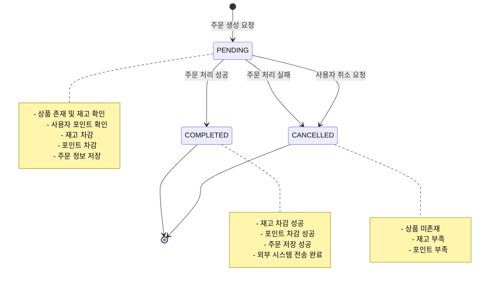

```mermaid
stateDiagram-v2
    [*] --> PENDING: 주문 생성 요청
    PENDING --> COMPLETED: 주문 처리 성공
    PENDING --> CANCELLED: 주문 처리 실패
    PENDING --> CANCELLED: 사용자 취소 요청
    COMPLETED --> [*]
    CANCELLED --> [*]
    note right of PENDING
        - 상품 존재 및 재고 확인
        - 사용자 포인트 확인
        - 재고 차감
        - 포인트 차감
        - 주문 정보 저장
    end note
    note right of COMPLETED
        - 재고 차감 성공
        - 포인트 차감 성공
        - 주문 저장 성공
        - 외부 시스템 전송 완료
    end note
    note right of CANCELLED
        - 상품 미존재
        - 재고 부족
        - 포인트 부족
    end note
```