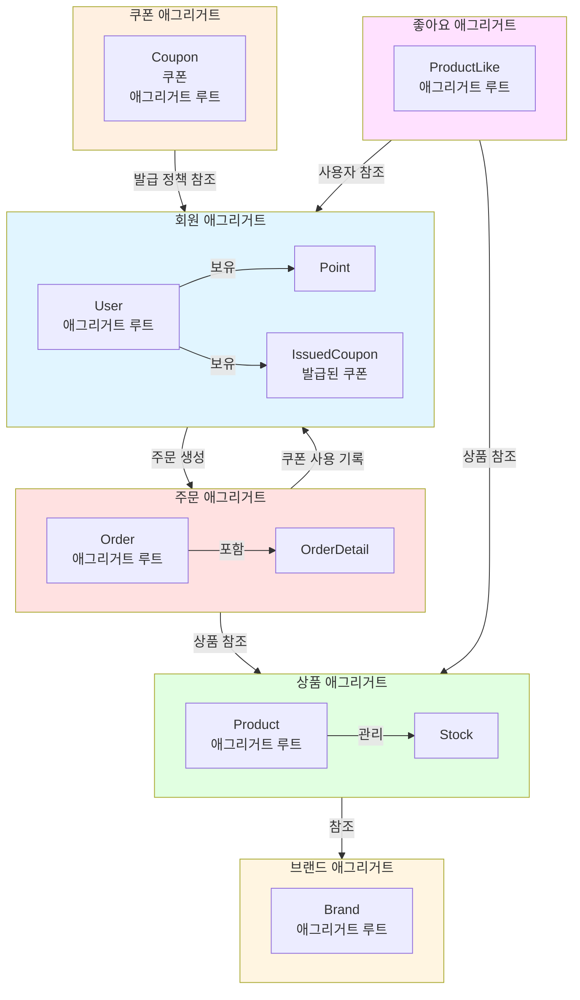

```mermaid
graph TB
    subgraph User_AGG[회원 애그리거트]
        User[User<br/>애그리거트 루트]
        Point[Point]
        IssuedCoupon[IssuedCoupon<br/>발급된 쿠폰]
        User -->|보유| Point
        User -->|보유| IssuedCoupon
    end

    subgraph Coupon_AGG[쿠폰 애그리거트]
        Coupon[Coupon<br/>쿠폰 <br/>애그리거트 루트]
    end

    subgraph Brand_AGG[브랜드 애그리거트]
        Brand[Brand<br/>애그리거트 루트]
    end

    subgraph Product_AGG[상품 애그리거트]
        Product[Product<br/>애그리거트 루트]
        Stock[Stock]
        Product -->|관리| Stock
    end

    subgraph Order_AGG[주문 애그리거트]
        Order[Order<br/>애그리거트 루트]
        OrderDetail[OrderDetail]
        Order -->|포함| OrderDetail
    end

    subgraph Like_AGG[좋아요 애그리거트]
        ProductLike[ProductLike<br/>애그리거트 루트]
    end

    User_AGG -->|주문 생성| Order_AGG
    Coupon_AGG -->|발급 정책 참조| User_AGG
    Order_AGG -->|쿠폰 사용 기록| User_AGG
    Product_AGG -->|참조| Brand_AGG
    Order_AGG -->|상품 참조| Product_AGG
    Like_AGG -->|사용자 참조| User_AGG
    Like_AGG -->|상품 참조| Product_AGG

    style User_AGG fill: #e1f5ff
    style Order_AGG fill: #ffe1e1
    style Product_AGG fill: #e1ffe1
    style Brand_AGG fill: #fff5e1
    style Like_AGG fill: #ffe1ff
    style Coupon_AGG fill: #fff0e1
```