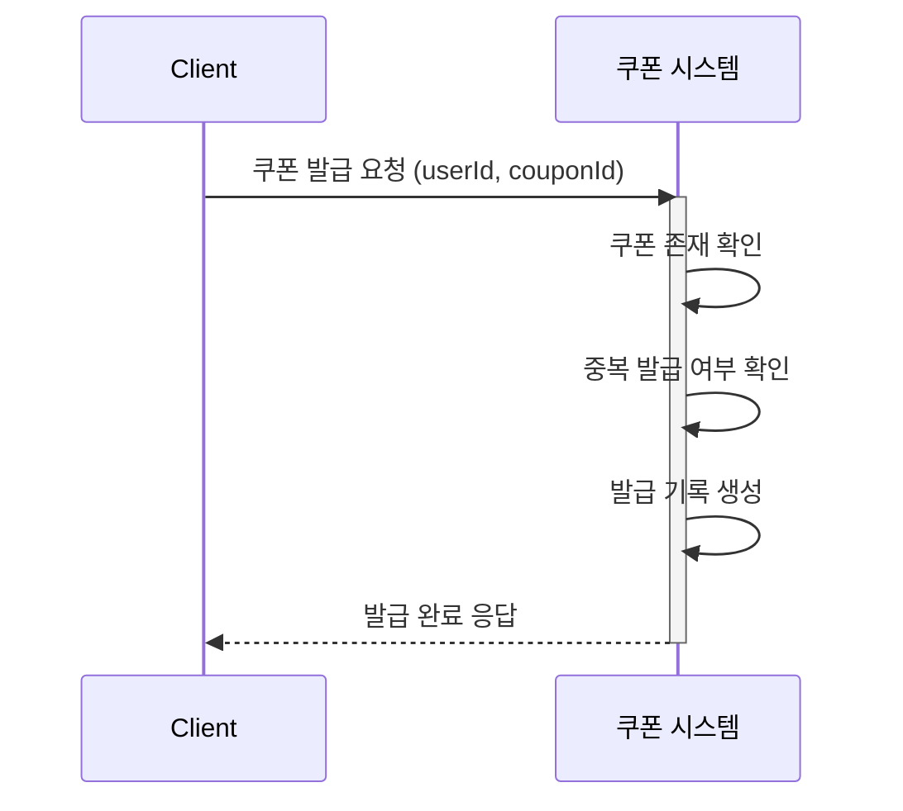
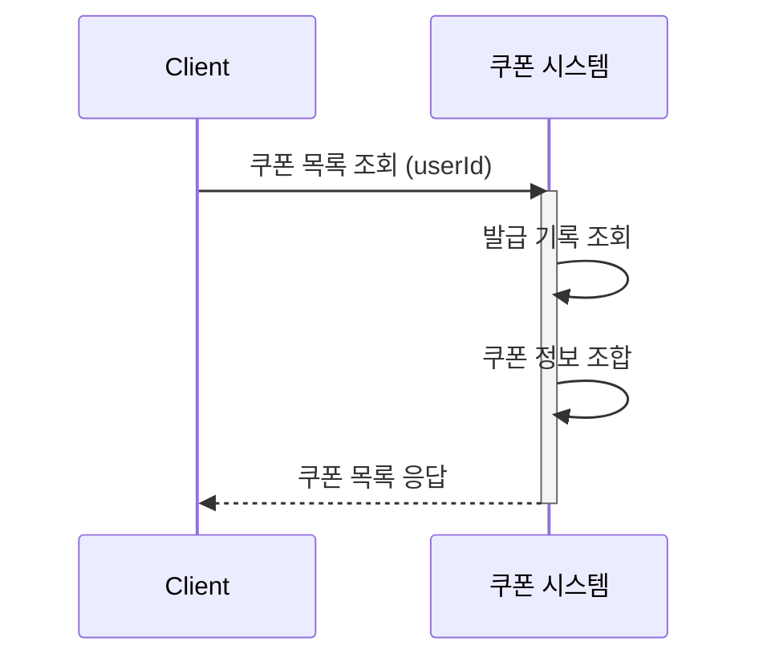
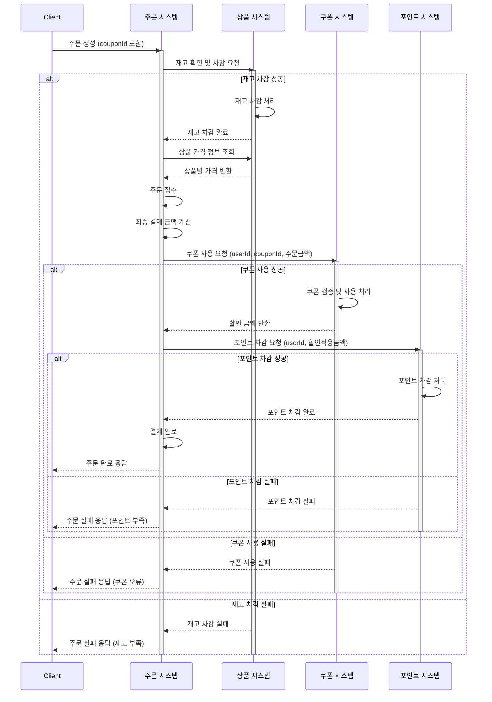

# 솔루션 설계 문서

## 1. 설계 컨텍스트

### 1.1 핵심 해결 과제

- 사용자가 쿠폰을 발급받고 주문 시 할인 혜택을 받을 수 있는 시스템 구현
- 정액/정률 두 가지 할인 방식 지원
- 쿠폰의 중복 발급 및 중복 사용을 방지하여 시스템 안정성 확보
- 포인트와 함께 사용 가능한 유연한 결제 옵션 제공

### 1.2 현재 아키텍처 영향

- Kotlin + Spring Boot 멀티모듈 모놀리식 프로젝트
- Application Layer의 Service(단일 도메인) + Facade(도메인 간 오케스트레이션) 구조
- 도메인 간 동기적 함수 호출로 통신
- 물리적 트랜잭션으로 도메인 간 일관성 보장
- 비관적 락을 사용한 동시성 제어 (포인트 차감, 재고 차감)
- 현재 결제는 사전 충전된 포인트로만 처리
- Service/Facade 간 횡적 의존성 금지 원칙

### 1.3 기술 스택 개요

- 개발 언어: Kotlin (Spring Boot 프레임워크)
- 데이터베이스: PostgreSQL
- ORM: Spring Data JPA
- 배포 환경: Docker, AWS

## 2. 솔루션 대안 분석

### 대안 1: Coupons 도메인 + 주문 흐름에 쿠폰 의존성 추가

- **설명**: 새로운 Coupons 도메인 모듈을 추가하고, 기존 주문 생성 흐름을 확장하여 쿠폰 할인 로직 통합
- **문제 해결 방식**:
    - 주문 시: 재고 차감 → 쿠폰 할인 적용 → 포인트 결제 순서로 처리
    - 주문 흐름에서 쿠폰 시스템을 호출하여 할인 금액 계산
    - 물리적 트랜잭션으로 전체 원자성 보장
- **장점**:
    - 기존 아키텍처 패턴과 완벽히 일치
    - Facade 패턴으로 도메인 간 오케스트레이션 명확
    - 물리적 트랜잭션으로 쿠폰-포인트-주문 원자성 보장
    - 비관적 락으로 중복 사용 방지 (포인트와 동일한 전략)
    - 구현 복잡도 낮음
- **단점**:
    - 주문 처리 로직의 책임 증가 (쿠폰 로직 추가)
    - 트랜잭션 시간 증가 (재고 락 + 쿠폰 락 + 포인트 락)
- **아키텍처 영향**:
    - Coupons 모듈 추가 (도메인 독립성 유지)
    - 주문 흐름 확장 (기존 패턴 유지)

### 대안 2: 결제 도메인 분리

- **설명**: 결제 관련 로직을 별도의 Payments 도메인으로 분리하여 쿠폰과 포인트를 통합 관리
- **문제 해결 방식**:
    - Payments 도메인에서 쿠폰 할인과 포인트 차감을 함께 처리
    - 주문 흐름은 결제 도메인을 호출하여 결제 완료 여부만 확인
- **장점**:
    - 결제 관련 책임 명확히 분리 (SRP)
    - 향후 외부 결제(카드 등) 추가 시 확장 용이
    - Payments 도메인 재사용 가능
- **단점**:
    - 새로운 도메인 추가로 복잡도 상승
    - 현재는 포인트만 있어서 과한 추상화일 수 있음
    - 트랜잭션 관리 포인트 증가
- **아키텍처 영향**:
    - 새로운 Payments 도메인 도입
    - 결제 관련 로직 중앙화

### 대안 3: Coupons를 Orders 서브도메인으로 통합

- **설명**: Coupons를 독립 도메인이 아닌 Orders의 서브도메인으로 관리
- **문제 해결 방식**:
    - Orders 모듈 내에서 쿠폰 발급 및 사용 처리
    - 주문 생성 시 쿠폰 로직을 Orders 내부에서 직접 처리
- **장점**:
    - 도메인 모듈 수 최소화
    - 쿠폰-주문 강한 결합을 구조적으로 표현
    - 구현 가장 단순
- **단점**:
    - Orders 도메인 책임 과다
    - 쿠폰을 다른 곳(이벤트, 멤버십 등)에서 사용 시 제약
    - 도메인 독립성 저하
    - 향후 마이크로서비스 분리 시 어려움
- **아키텍처 영향**:
    - Orders 모듈 비대화
    - 쿠폰 재사용성 제한

## 3. 선택된 솔루션

### 3.1 결정 요약

**대안 1: Coupons 도메인 + 주문 흐름에 쿠폰 의존성 추가**를 선택합니다.

**선택 이유**:

1. 팀의 "ROI 중심" 및 "실용주의" 가치에 부합
    - 기존 Service + Facade 패턴을 그대로 활용하여 학습 비용 최소화
    - 빠른 개발 및 배포 가능
2. 기술적 일관성
    - 포인트와 동일한 비관적 락 전략으로 기술적 일관성 유지
    - 물리적 트랜잭션으로 쿠폰-포인트-주문 원자성 보장
3. 도메인 독립성 유지
    - Coupons를 독립 도메인으로 분리하여 향후 재사용 가능
    - 마이크로서비스 전환 시 모듈 분리 용이
4. 적절한 복잡도
    - 현재는 포인트만 있어서 별도 Payments 도메인은 과함
    - 하지만 쿠폰을 Orders에 종속시키기에는 독립성 측면에서 아쉬움

### 3.2 솔루션 구조

#### 핵심 아키텍처 컴포넌트

**1. 쿠폰 시스템**

- 쿠폰 정의 및 발급 관리
- 사용자별 쿠폰 소유권 및 사용 이력 관리
- 쿠폰 검증 및 할인 금액 계산

**2. 주문 시스템**

- 주문 접수 및 생성
- 재고, 쿠폰, 포인트 간 오케스트레이션
- 최종 결제 금액 계산 및 결제 완료 처리

**3. 상품 시스템**

- 재고 관리 및 차감
- 상품 가격 정보 제공

**4. 포인트 시스템**

- 포인트 잔액 관리 및 차감

#### 데이터 흐름

**1. 쿠폰 발급 흐름**

mermaid

**2. 보유 쿠폰 조회 흐름**

mermaid

**3. 주문 생성 시 쿠폰 사용 흐름**

mermaid

