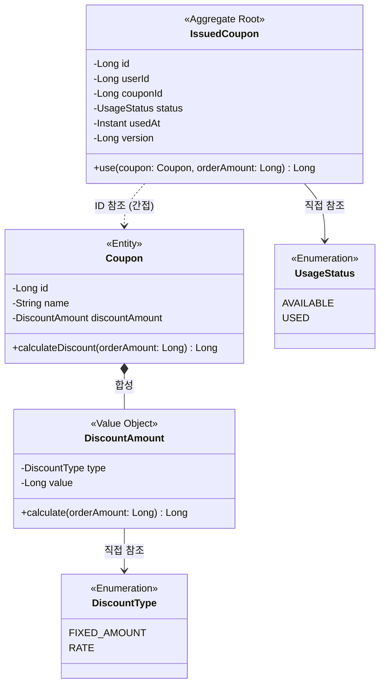
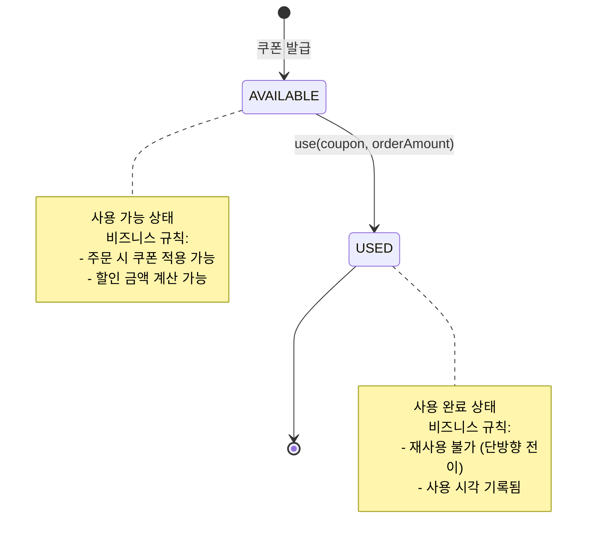

# 쿠폰 도메인 모델링 문서

## 1. 클래스 다이어그램

### 주요 구조

**Aggregate 1: IssuedCoupon**

- Root: IssuedCoupon
- 책임: 쿠폰 사용 처리, 상태 관리

**Aggregate 2: Coupon**

- Root: Coupon
- 구성: Coupon + DiscountAmount (합성)
- 책임: 할인 금액 계산

**설계 의도:**

- IssuedCoupon과 Coupon을 별도 애그리게이트로 분리하여 생명주기 독립성 확보
- IssuedCoupon은 couponId로 간접 참조, 사용 시점에 Coupon 객체 주입
- DiscountAmount를 Coupon에 합성하여 할인 정책 캡슐화

---

## 2. 도메인 규칙

### 2.1 쿠폰 발급 규칙

**중복 발급 방지**

- 동일 사용자는 동일 쿠폰을 중복 발급받을 수 없음
- DB 유니크 제약조건: (user_id, coupon_id)

### 2.2 쿠폰 사용 규칙

**IssuedCoupon.use() 사전조건**

- status == AVAILABLE 이어야 함
- USED 상태에서 use() 호출 시 예외 발생: "이미 사용된 쿠폰입니다"

**상태 전이**

- AVAILABLE → USED (단방향, 되돌릴 수 없음)

**부가 효과**

- usedAt 타임스탬프 기록
- 할인 금액 반환

### 2.3 할인 금액 계산 규칙

**DiscountAmount.calculate() 계산 로직**

|할인 타입|계산 공식|예시|
|---|---|---|
|FIXED_AMOUNT|min(value, orderAmount)|5,000원 쿠폰 + 10,000원 주문 = 5,000원 할인|
|FIXED_AMOUNT|min(value, orderAmount)|5,000원 쿠폰 + 3,000원 주문 = 3,000원 할인|
|RATE|min(orderAmount × value ÷ 100, orderAmount)|10% 쿠폰 + 10,000원 주문 = 1,000원 할인|

**DiscountAmount 불변식**

- value > 0 (할인 값은 양수)
- type == RATE인 경우, value ≤ 100 (할인율은 100% 이하)
- 결과 할인 금액 ≤ 주문 금액

---

## 3. 상태 다이어그램

### 상태 전이 조건

|현재 상태|이벤트|다음 상태|전이 조건|부가 효과|
|---|---|---|---|---|
|-|쿠폰 발급|AVAILABLE|중복 발급 검증 통과|-|
|AVAILABLE|use()|USED|status == AVAILABLE|usedAt 기록, 할인 금액 반환|
|USED|use()|-|❌ 예외 발생|"이미 사용된 쿠폰입니다"|

---

## 4. 도메인 이벤트

현재 요구사항에서는 도메인 이벤트를 사용하지 않습니다.

**이유:**

- 현재는 동기적 함수 호출로 모든 기능 구현 가능
- 알림, 분석 등 이벤트 기반 기능이 요구사항에 없음
- YAGNI 원칙에 따라 필요할 때 추가

**향후 도입 가능한 이벤트:**

- CouponIssued: 쿠폰 발급 시 알림/분석
- CouponUsed: 쿠폰 사용 시 정산/분석