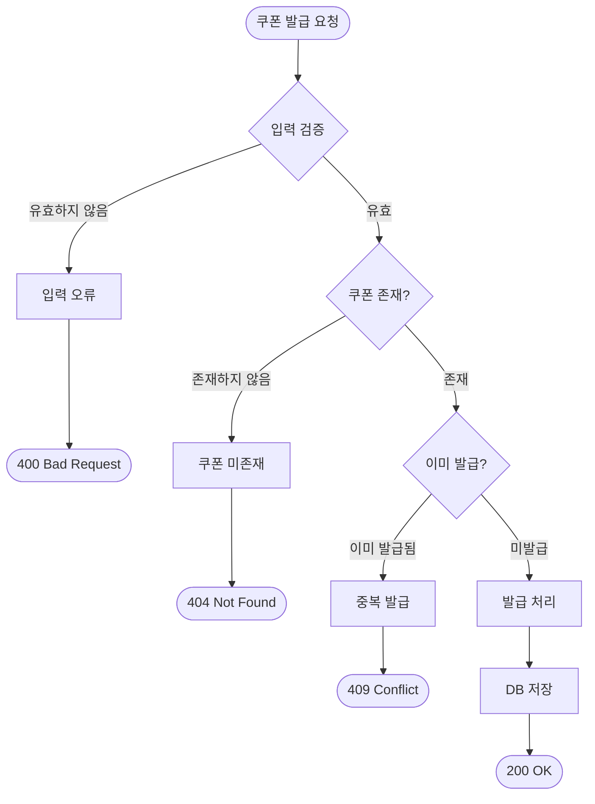
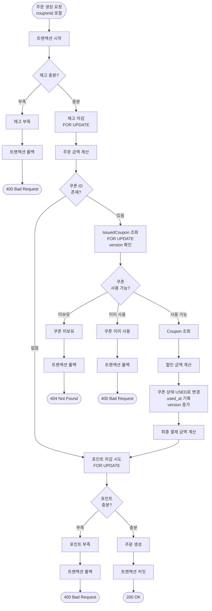
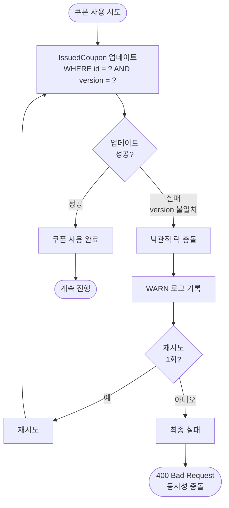

# 쿠폰 시스템 상세 설계 및 구현 계획 문서

## 1. 시스템 플로우차트

### 1.1 쿠폰 발급 플로우



### 1.2 주문 생성 시 쿠폰 사용 - 정상 플로우



### 1.3 주문 생성 시 쿠폰 사용 - 낙관적 락 충돌



## 2. 데이터 모델 설계

### 2.1 테이블 스키마

#### coupon 테이블

```sql
CREATE TABLE coupon (
    id BIGSERIAL PRIMARY KEY,
    name VARCHAR(100) NOT NULL,
    discount_type VARCHAR(20) NOT NULL,
    discount_value BIGINT NOT NULL,
    created_at TIMESTAMPTZ NOT NULL DEFAULT NOW(),
    updated_at TIMESTAMPTZ NOT NULL DEFAULT NOW(),
    deleted_at TIMESTAMPTZ
);
```

**컬럼 설명:**

- `id`: 쿠폰 고유 식별자
- `name`: 쿠폰 이름 (예: "신규 가입 5,000원 할인")
- `discount_type`: 할인 타입 (`FIXED_AMOUNT`, `RATE`)
- `discount_value`: 할인 값 (정액: 5000, 정률: 10)
- `created_at`: 생성 시각
- `updated_at`: 수정 시각
- `deleted_at`: 삭제 시각 (Soft Delete)

#### issued_coupon 테이블

```sql
CREATE TABLE issued_coupon (
    id BIGSERIAL PRIMARY KEY,
    user_id BIGINT NOT NULL,
    coupon_id BIGINT NOT NULL REFERENCES coupon(id),
    status VARCHAR(20) NOT NULL,
    used_at TIMESTAMPTZ,
    version BIGINT NOT NULL DEFAULT 0,
    created_at TIMESTAMPTZ NOT NULL DEFAULT NOW(),
    updated_at TIMESTAMPTZ NOT NULL DEFAULT NOW(),
    deleted_at TIMESTAMPTZ,
    
    -- 중복 발급 방지 (재발급 불가 정책)
    CONSTRAINT uk_user_coupon UNIQUE (user_id, coupon_id)
);
```

**컬럼 설명:**

- `id`: 발급된 쿠폰 고유 식별자
- `user_id`: 사용자 ID
- `coupon_id`: 쿠폰 정의 참조
- `status`: 사용 상태 (`AVAILABLE`, `USED`)
- `used_at`: 사용 시각
- `version`: 낙관적 락 버전
- `created_at`: 발급 시각
- `updated_at`: 수정 시각
- `deleted_at`: 삭제 시각 (Soft Delete)

### 2.2 인덱스 전략

**issued_coupon 테이블:**

- `uk_user_coupon` UNIQUE 제약조건이 `(user_id, coupon_id)` 복합 인덱스를 자동 생성
- 보유 쿠폰 조회 시 선두 컬럼인 `user_id`로 인덱스 활용 가능

## 3. 운영 계획

### 3.1 로깅 전략

낙관적 락 충돌 발생 시 WARN 레벨로 로깅합니다.

```
WARN: OptimisticLockException occurred for issuedCouponId={}, attempt={}
```

**이유:**

- 충돌 발생 빈도를 추적하여 낙관적 락 전략의 적절성을 검증
- 충돌이 빈번하다면 동시성 제어 전략 재검토 필요

### 3.2 주요 실패 시나리오 및 대응 계획

|실패 시나리오|대응 방안|기대 효과|
|---|---|---|
|낙관적 락 충돌|• 최대 1회 재시도<br/>• 실패 시 400 Bad Request 응답|• 일시적 충돌은 자동 해결<br/>• 지속적 충돌은 클라이언트에 명확히 전달|
|재고 부족으로 주문 실패|• 트랜잭션 롤백으로 쿠폰 사용 자동 취소<br/>• 쿠폰 상태 원복 (AVAILABLE)|• 쿠폰 재사용 가능<br/>• 데이터 일관성 유지|
|포인트 부족으로 결제 실패|• 트랜잭션 롤백으로 쿠폰 사용 자동 취소<br/>• 재고 차감도 함께 롤백|• 쿠폰 재사용 가능<br/>• 전체 주문 플로우 원자성 보장|
|중복 발급 시도|• DB UNIQUE 제약조건으로 원천 차단<br/>• 409 Conflict 응답|• 동시 요청에도 안전<br/>• 애플리케이션 로직 오류 방지|

## 4. 설계 결정 공유

### 4.1 주요 설계 결정 및 근거

|설계 결정|근거|
|---|---|
|낙관적 락 사용|• 동일 사용자가 동시에 같은 쿠폰을 사용하는 경우는 거의 없음<br/>• 락 프리는 불가능 (쿠폰 상태 변경이 필요하므로)<br/>• 비관적 락은 과함 (충돌 빈도가 낮아 DB 락의 성능 오버헤드가 불필요)<br/>• 충돌 발생 시 실패하는 것이 올바른 비즈니스 동작|
|UNIQUE 제약조건으로<br/>중복 발급 방지|• DB 레벨에서 원천적으로 차단<br/>• 동시 발급 요청에도 안전<br/>• 비즈니스 핵심 규칙이므로 DB에서 보장|