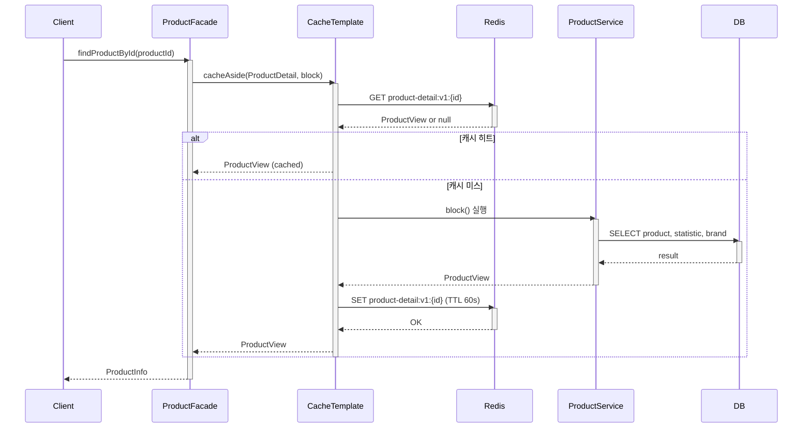
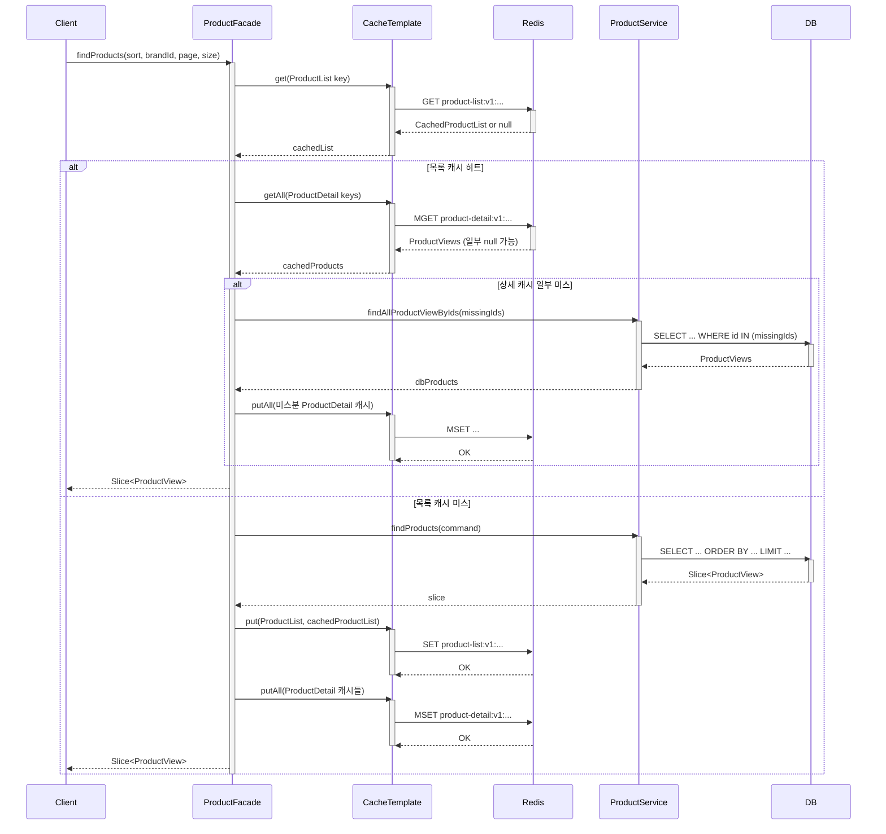
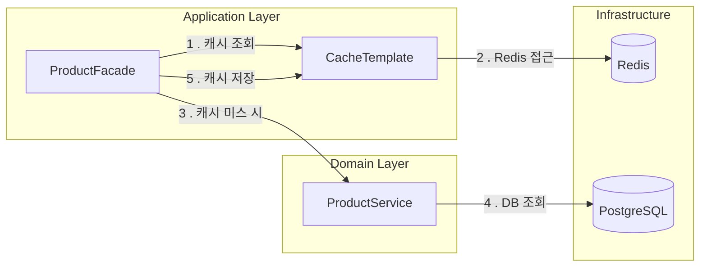
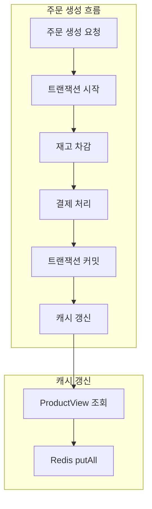
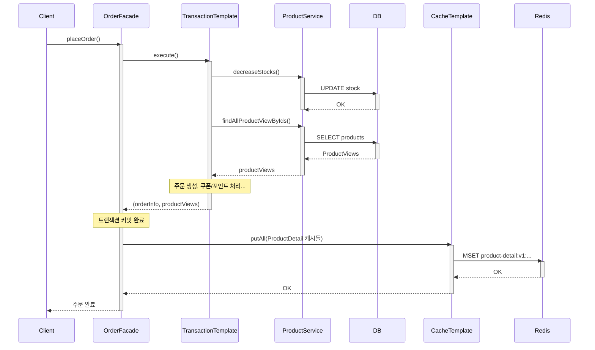
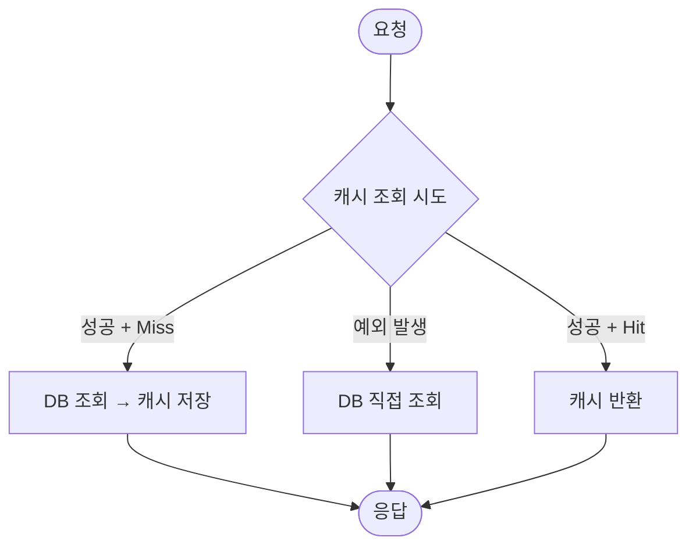

# 상품 캐시 설계 문서

## 1. 설계 컨텍스트

### 1.1 배경

- **목표**: 상품 조회 API의 SLO 달성 (p95 < 100ms)
- **선행 작업**: 인덱스 최적화로 p95 113ms 달성, 추가 개선 필요
- **적용 대상**: 상품 목록 조회, 상품 상세 조회 API

### 1.2 캐시 적용 범위

| 대상               | 캐싱 여부 | 근거                 |
|------------------|-------|--------------------|
| 상품 목록 (page 0-2) | ✅     | 트래픽 96% 커버         |
| 상품 목록 (page 3+)  | ❌     | 트래픽 4%, 캐시 메모리 효율화 |
| 상품 상세            | ✅     | 단일 조회 빈도 높음        |

---

## 2. 캐시 아키텍처

### 2.1 시스템 흐름 (상품 상세 조회)



### 2.2 시스템 흐름 (상품 목록 조회)



**설계 의도:**

- 목록 캐시: ID 목록 + hasNext만 저장 (정렬/필터 결과 보존)
- 상세 캐시: 개별 상품 데이터 저장
- 목록 히트 시 상세 캐시도 활용하여 DB 조회 최소화
- 상세 캐시 미스분만 DB 조회 후 캐싱

### 2.3 캐시 레이어 구조



---

## 3. 캐시 키 명세

### 3.1 키 패턴

| 캐시    | 키 패턴                                             | TTL | 값 타입                                     |
|-------|--------------------------------------------------|-----|------------------------------------------|
| 상품 목록 | `product-list:v1:{sort}:{brandId}:{page}:{size}` | 60초 | `CachedProductList` (상품 ID 목록 + hasNext) |
| 상품 상세 | `product-detail:v1:{productId}`                  | 60초 | `ProductView` (JSON)                     |

### 3.2 키 생성 규칙

**정렬 (sort)** - 필수값

- `LATEST`: 최신순
- `LIKES_DESC`: 좋아요 많은 순
- `PRICE_ASC`: 가격 낮은 순

**필터 (brandId)**

- brandId 숫자를 직접 사용 (예: `123`)
- 값이 없으면: `_`

**키 예시**

| 조건                | 생성되는 키                               |
|-------------------|--------------------------------------|
| 좋아요순, 필터 없음, 1페이지 | `product-list:v1:LIKES_DESC:_:0:20`  |
| 가격순, 브랜드 필터, 2페이지 | `product-list:v1:PRICE_ASC:123:1:20` |
| 상품 ID 12345 상세    | `product-detail:v1:12345`            |

### 3.3 버전 관리

키에 `v1` 접두사를 포함하여 캐시 스키마 변경 시 버전 업그레이드로 대응:

- 스키마 변경 시 `v2`로 전환
- 기존 `v1` 캐시는 TTL 만료로 자연 소멸

### 3.4 향후 필터 확장 계획

```
현재:     product-list:v1:{sort}:{brandId}:{page}:{size}
1차 확장: product-list:v1:{sort}:{brandId}:{name}:{minLike}:{page}:{size}
최종:     product-list:v1:{sort}:{filterHash}:{page}:{size}
```

필터 조건이 늘어나면 키가 길어지므로, 최종적으로는 필터 조건을 해싱하여 단순화할 계획.

---

## 4. 캐시 갱신 전략

### 4.1 갱신 흐름



### 4.2 갱신 매트릭스

| 이벤트           | 발생 위치                      | 갱신 대상                    | 방식              | 지연 허용          |
|---------------|----------------------------|--------------------------|-----------------|----------------|
| 재고 차감 (주문 생성) | `OrderFacade.placeOrder()` | `product-detail:v1:{id}` | 트랜잭션 커밋 후 즉시 갱신 | ❌ (품절 즉시 반영)   |
| 좋아요 토글        | `LikeService.toggle()`     | 없음                       | TTL 만료 대기       | ✅ (1분 지연 허용)   |
| 상품 정보 수정 (향후) | `ProductService.update()`  | `product-detail:v1:{id}` | 즉시 갱신           | ❌ (가격 등 즉시 반영) |

### 4.3 갱신 vs 무효화 선택

| 전략                 | 적용 대상 | 근거                                   |
|--------------------|-------|--------------------------------------|
| 갱신 (Write-through) | 재고 변경 | 트랜잭션 내에서 ProductView 이미 조회, 추가 비용 없음 |
| TTL 기반 (만료 대기)     | 좋아요 수 | 이벤트 빈도 높음, 정확성보다 성능 우선               |

상세 근거는 [6.3 갱신 vs 무효화](#63-갱신-vs-무효화) 참조.

### 4.4 트랜잭션-캐시 연동



**설계 의도:**

- 트랜잭션 롤백 시 캐시가 잘못된 데이터로 갱신되는 것을 방지
- `TransactionTemplate.execute()` 반환 후 캐시 갱신
- 캐시 갱신 실패해도 TTL 60초 후 자연 복구

---

## 5. 장애 대응 전략

### 5.1 Fallback 정책



### 5.2 실패 시나리오 대응

| 실패 시나리오     | 대응 방안                           | 기대 효과              |
|-------------|---------------------------------|--------------------|
| 캐시 미스       | DB 조회 → 캐시 저장 (Cache-aside)     | 다음 요청부터 캐시 활용      |
| Redis 연결 실패 | `runCatching`으로 예외 무시, DB 직접 조회 | 서비스 가용성 유지         |
| 캐시 갱신 실패    | 예외 무시, TTL 만료 후 자연 복구           | 최대 60초 후 최신 데이터 반영 |
| 트랜잭션 롤백     | 캐시 갱신 미실행 (트랜잭션 밖에서 갱신)         | 잘못된 데이터 캐싱 방지      |

### 5.3 RedisCacheTemplate 예외 처리

```kotlin
// 모든 캐시 연산은 runCatching으로 감싸서 예외 시 null/빈 리스트 반환
fun <T> get(cacheKey: CacheKey, typeRef: TypeReference<T>): T? =
    runCatching {
        redisTemplate.opsForValue().get(cacheKey.key)?.let { ... }
    }.getOrNull()
```

**설계 의도:**

- 캐시는 보조 저장소이므로 장애가 서비스 장애로 전파되면 안 됨
- 예외 발생 시 조용히 실패하고 DB로 fallback

---

## 6. 설계 결정 및 근거

### 6.1 TTL 60초 선택

성능 테스트에서 목표 SLO를 넉넉히 달성했기 때문에 캐시를 길게 가져갈 필요가 없었다. TTL을 짧게 유지하면서 어느 정도 실시간성을 보장하는 방향으로 60초를 선택했다.

### 6.2 캐싱 범위 (page 0-2)

page 0-2가 전체 트래픽의 약 96%를 커버할 것으로 추정했다. 나머지 4%를 위해 캐시 메모리를 사용하는 것은 비효율적이라 판단하여 상위 페이지만 캐싱한다.

### 6.3 갱신 vs 무효화

무효화의 주된 목적은 동시성 문제 방지다 (A가 읽고 → B가 수정 → A가 갱신하면 B 데이터 덮어씀).

현재 상황에서 갱신이 안전한 이유:

- 상품/브랜드 수정 기능이 없어서 동시 수정 자체가 발생하지 않음
- command(주문 생성)에서는 캐시 안 쓰고 DB 직접 조회 → stale 데이터로 비즈니스 로직 처리할 일 없음
- 트랜잭션 커밋 ~ 캐시 갱신 사이 딜레이 동안 같은 상품 주문 확률 낮음

향후 상품/브랜드 수정 기능이 추가되면 동시 수정 가능성이 생기므로, 그때는 무효화 전략으로 전환을 검토해야 한다.

### 6.4 Application Layer 캐싱 (과제용)

기존에는 Redis Proxy Repository가 RDB Repository를 감싸는 형태로 캐싱을 구현해왔다. 이번에는 `CacheTemplate`을 만들고 Application Layer(Facade)에서 직접
캐시를 운용하는 방식으로 변경했다.

**선택 이유:**

1. **도메인 간 조합 캐싱**: `ProductView`는 `Product`, `ProductStatistic`, `Brand` 세 도메인 모델을 조합한 결과다. Repository 레벨에서는 이 조합 결과를
   캐싱하기 어렵다.

2. **상황별 캐시 전략 컨트롤**: 목록 조회 시 상세 캐시 활용, 주문 완료 시 즉시 갱신, 좋아요 변경 시 TTL 만료 대기 등 상황마다 다른 전략을 Facade에서 유연하게 컨트롤할 수 있다.

### 6.5 목록-상세 캐시 협력 구조

목록 캐시에는 ID 목록만 저장하고, 실제 상품 데이터는 상세 캐시에서 관리한다.

목록 캐시 히트 시:

1. ID 목록으로 상세 캐시 `getAll` 조회
2. 상세 캐시에서 미스된 상품만 DB 조회
3. 미스분을 상세 캐시에 저장

이 구조의 장점:

- 같은 상품이 여러 목록에 포함되어도 상세 데이터는 한 번만 캐싱
- 주문으로 재고가 변경되면 상세 캐시만 갱신하면 모든 목록에 반영
- DB 조회를 미스분으로 최소화

### 6.6 도메인 모델 직접 캐싱

`ProductView`를 그대로 JSON 직렬화하여 캐싱하고 있다. 별도의 캐시 전용 DTO를 만들지 않았다.

**인지하고 있는 단점:**

- 저장 비효율: 불필요한 필드까지 저장
- 파싱 비효율: 역직렬화 비용 증가
- 버전 관리 위험: 도메인 모델 변경 시 캐시 버전도 올려야 함

**현재 프로젝트에서 감수한 이유:**

- 프로젝트 규모가 작아 별도 캐시 DTO 유지 비용이 더 큼
- TTL 60초로 스키마 변경 시 빠른 자연 복구
- 캐시 키 버전(`v1`)으로 스키마 변경 대응 가능

---

## 7. 적용 결과

### 7.1 성능 개선 효과

| 지표  | 인덱스만     | + 캐시     | 추가 개선율 |
|-----|----------|----------|--------|
| p50 | 13.43ms  | 8.89ms   | 34%    |
| p95 | 113.14ms | 37.76ms  | 67%    |
| p99 | 252.71ms | 117.47ms | 54%    |

### 7.2 SLO 달성 현황

| 지표          | 목표      | 결과       | 달성 |
|-------------|---------|----------|----|
| p50 latency | < 50ms  | 8.89ms   | ✅  |
| p95 latency | < 100ms | 37.76ms  | ✅  |
| p99 latency | < 300ms | 117.47ms | ✅  |

---

## 8. 관련 문서

- [상품 조회 API 성능 최적화 리포트](./상품_조회_API_성능_최적화_리포트.md) - 전체 최적화 과정 및 결과