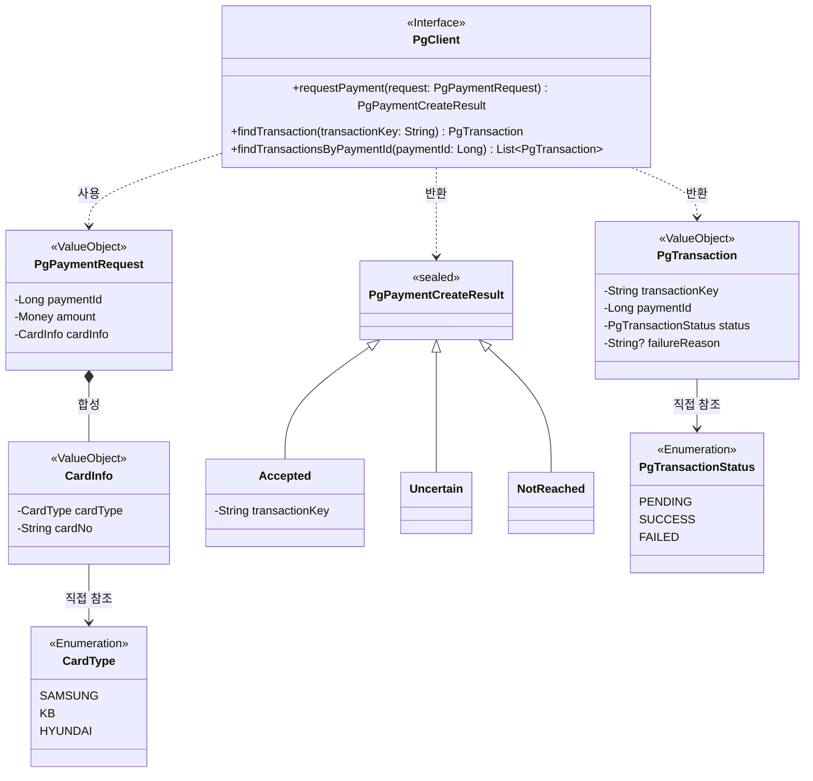
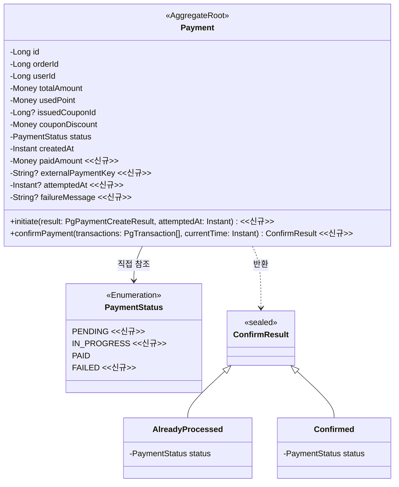
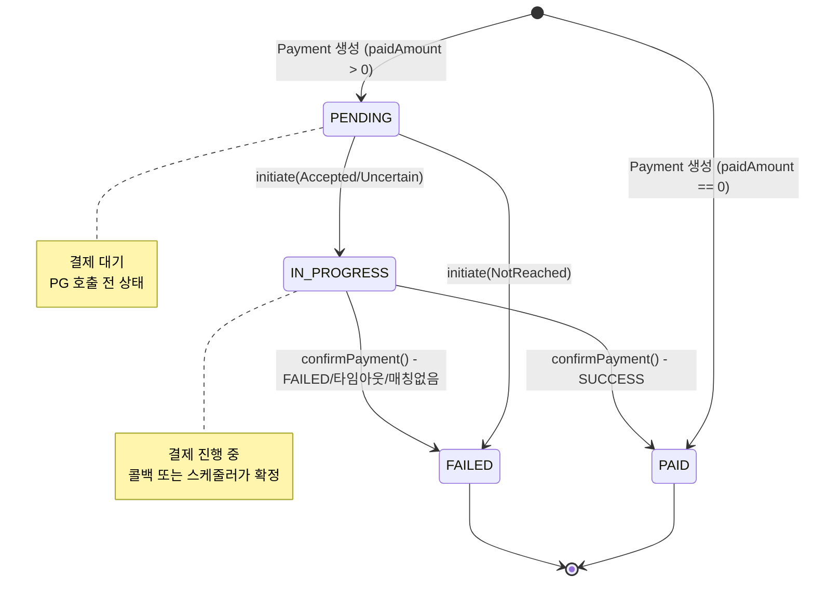
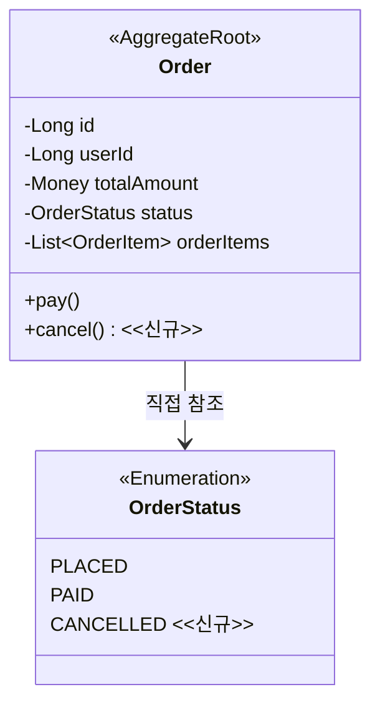
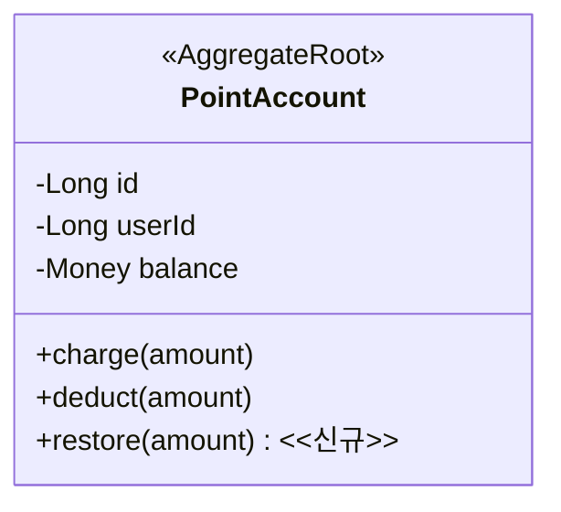
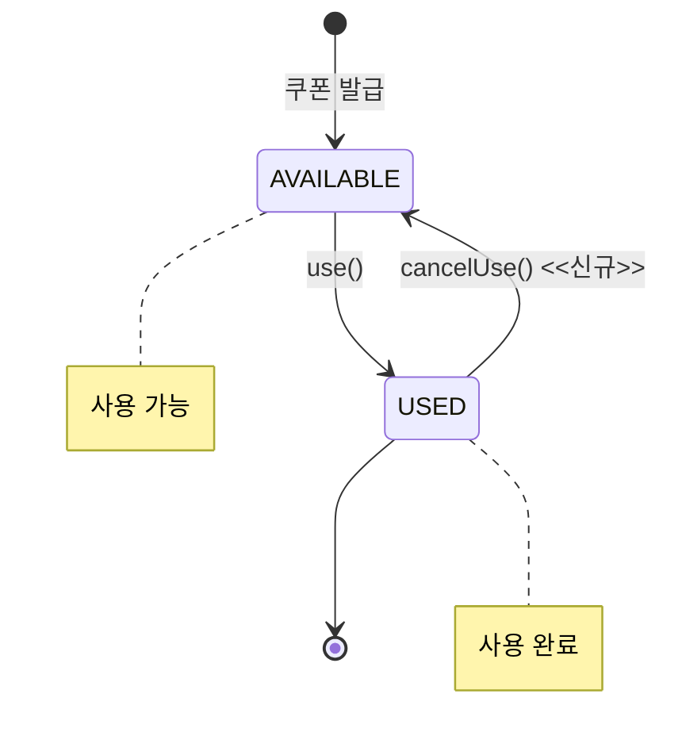

# PG 연동 Resilience 도메인 모델링 문서

## 개요

PG 연동을 위해 변경이 필요한 도메인들을 정리합니다. 변경사항 관점에서 작성하며, 신규 항목은 `<<신규>>`로 표시합니다.

**영향받는 도메인**

- Payment: 상태 확장 및 카드 결제 지원 (핵심 변경)
- Order: 주문 취소 상태 추가
- Point: 포인트 복구 기능 추가
- Coupon: 쿠폰 사용 취소 기능 추가
- Product: 변경 없음 (기존 Stock.increase() 활용)

---

## 1. 공통 정의 <<신규>>

### 1.1 PG Client 추상화

PG 연동을 위한 인터페이스를 도메인 레이어에서 정의합니다. 실제 PG사 구현체는 인프라 레이어에 위치하며, 의존성 역전을 통해 도메인이 인프라에 의존하지 않도록 합니다.

### 1.2 용어 정의

| 용어             | 정의                                                      |
|----------------|---------------------------------------------------------|
| Transaction    | PG에서 관리하는 개별 결제 건. transactionKey로 식별                   |
| transactionKey | PG가 발급하는 결제 건 고유 식별자. Payment의 externalPaymentKey에 저장   |
| Accepted       | PG가 결제 요청을 정상 수신하여 transactionKey를 발급한 상태               |
| Uncertain      | Read Timeout 등으로 요청 도달 여부가 불확실한 상태. transactionKey 없음   |
| NotReached     | 서킷 오픈, Connection Timeout 등으로 요청이 PG에 도달하지 않은 것이 확실한 상태 |

### 1.3 PgClient 규칙

**requestPayment() 규칙**

| 결과         | 조건                                 | 설명                              |
|------------|------------------------------------|---------------------------------|
| Accepted   | PG가 정상 응답                          | transactionKey 포함               |
| Uncertain  | Read Timeout, Connection Reset     | 요청 도달 여부 불확실, transactionKey 없음 |
| NotReached | 서킷 오픈, Connection Timeout, 500/429 | 요청 미도달 확실, 즉시 FAILED 처리         |

**CardInfo 검증 규칙**

| 필드       | 검증 규칙                                         |
|----------|-----------------------------------------------|
| cardType | SAMSUNG, KB, HYUNDAI 중 하나                     |
| cardNo   | `xxxx-xxxx-xxxx-xxxx` 형식 (숫자 4자리-4자리-4자리-4자리) |

**findTransactionsByPaymentId() 사용 조건**

externalPaymentKey가 없는 경우(Uncertain 상태로 시작한 경우)에만 사용합니다. paymentId로 조회하여 매칭되는 확정 건을 찾습니다.

---

## 2. Payment 도메인 (핵심 변경)

### 2.1 변경 배경

기존에는 포인트로만 결제하여 즉시 PAID 상태로 생성되었습니다. PG 연동으로 인해 비동기 결제를 지원해야 하며, PENDING → IN_PROGRESS → PAID/FAILED 상태 전이가 필요합니다.

### 2.2 클래스 다이어그램

### 2.3 도메인 규칙

#### 2.3.1 Payment 생성 규칙

Payment는 PG 호출 전에 PENDING 상태로 먼저 생성됩니다. 단, paidAmount가 0인 경우(포인트+쿠폰으로 전액 결제)는 즉시 PAID 상태로 생성됩니다.

**생성 시 검증 규칙**

- `usedPoint >= 0` 이어야 함 (위반 시: "사용 포인트는 0 이상이어야 합니다")
- `couponDiscount >= 0` 이어야 함 (위반 시: "쿠폰 할인은 0 이상이어야 합니다")
- `paidAmount = totalAmount - usedPoint - couponDiscount` 자동 계산
- `paidAmount >= 0` 이어야 함 (위반 시: "포인트와 쿠폰 할인의 합이 주문 금액을 초과합니다")

**상태 결정 규칙**

- `paidAmount == 0` → PAID (PG 결제 불필요)
- `paidAmount > 0` → PENDING (PG 결제 필요)

#### 2.3.2 Payment 상태 전이 규칙

**Payment.initiate(result, attemptedAt) 규칙**

- 사전조건: `status == PENDING` (위반 시: "결제 대기 상태에서만 결제를 개시할 수 있습니다")
- 부가 효과: `attemptedAt` 저장
- 상태 전이:

| PgPaymentCreateResult | 다음 상태       | externalPaymentKey |
|-----------------------|-------------|--------------------|
| Accepted              | IN_PROGRESS | transactionKey 저장  |
| Uncertain             | IN_PROGRESS | null 유지            |
| NotReached            | FAILED      | null 유지            |

**Payment.confirmPayment(transactions, currentTime) 규칙**

PG 트랜잭션 조회 결과를 기반으로 결제 상태를 확정합니다.

- 멱등성: `status == PAID` 또는 `status == FAILED`이면 `AlreadyProcessed(status)` 반환
- 사전조건: `status == IN_PROGRESS` (위반 시: "결제 진행 중 상태에서만 확정할 수 있습니다")
- 반환값: `ConfirmResult` (AlreadyProcessed 또는 Confirmed)

**트랜잭션 매칭 우선순위**

1. `externalPaymentKey`가 있으면 해당 키와 일치하는 transaction
2. `externalPaymentKey`가 없으면 `paymentId`와 일치하는 transaction

**확정 처리 로직**

| 매칭 결과         | 경과 시간  | 처리                                              |
|---------------|--------|-------------------------------------------------|
| SUCCESS 건 존재  | -      | PAID, externalPaymentKey 저장                     |
| FAILED 건 존재   | -      | FAILED, externalPaymentKey 저장, failureReason 저장 |
| 매칭 건 없음       | -      | FAILED, failureMessage = "매칭되는 PG 트랜잭션이 없습니다"   |
| PENDING 건만 존재 | 5분 미경과 | 상태 유지 (Confirmed 반환하지만 상태 변경 없음)                |
| PENDING 건만 존재 | 5분 경과  | FAILED, failureMessage = "결제 시간 초과"             |

**경과 시간 기준**: `attemptedAt`으로부터 5분 (300초)

#### 2.3.3 결제 확정 후 보상 트랜잭션 <<신규>>

Application Service(PaymentConfirmationService)가 confirmPayment() 호출 후 FAILED 상태인 경우 보상 트랜잭션을 수행합니다.

**보상 트랜잭션 순서**

1. `pointAccount.restore(usedPoint)` - 포인트 복구
2. `issuedCoupon.cancelUse()` - 쿠폰 사용 취소 (사용한 경우)
3. `stock.increase(quantity)` - 재고 복구
4. `order.cancel()` - 주문 취소

**externalPaymentKey 조회 전략**

| 조건                    | 조회 방식                                                             |
|-----------------------|-------------------------------------------------------------------|
| externalPaymentKey 있음 | `pgClient.findTransaction(transactionKey)` 단건 조회                  |
| externalPaymentKey 없음 | `pgClient.findTransactionsByPaymentId(paymentId)` 목록 조회 후 매칭 건 탐색 |

### 2.4 상태 다이어그램

### 상태 전이 규칙

| 현재 상태       | 이벤트                  | 다음 상태       | 전이 조건               | 부가 효과                                 |
|-------------|----------------------|-------------|---------------------|---------------------------------------|
| -           | Payment 생성           | PENDING     | paidAmount > 0      | -                                     |
| -           | Payment 생성           | PAID        | paidAmount == 0     | -                                     |
| PENDING     | initiate(Accepted)   | IN_PROGRESS | status == PENDING   | attemptedAt 저장, externalPaymentKey 저장 |
| PENDING     | initiate(Uncertain)  | IN_PROGRESS | status == PENDING   | attemptedAt 저장                        |
| PENDING     | initiate(NotReached) | FAILED      | status == PENDING   | attemptedAt 저장                        |
| IN_PROGRESS | confirmPayment()     | PAID        | SUCCESS 매칭          | externalPaymentKey 저장                 |
| IN_PROGRESS | confirmPayment()     | FAILED      | FAILED 매칭/타임아웃/매칭없음 | failureMessage 저장                     |
| PAID/FAILED | confirmPayment()     | -           | 멱등성                 | AlreadyProcessed 반환                   |

---

## 3. Order 도메인

### 3.1 변경 배경

결제 실패 시 주문을 취소 상태로 변경해야 합니다. Order는 주문의 최종 결과만 관리하고, 결제 진행 상태는 Payment가 담당합니다. 이를 통해 Payment와 Order 간 상태 중복을 방지하고, 향후
재결제나 부분 결제 확장에 유리한 구조를 유지합니다.

### 3.2 클래스 다이어그램

### 3.3 도메인 규칙

**Order.cancel() 규칙**

- 사전조건: `status == PLACED` (위반 시: "주문 대기 상태에서만 취소할 수 있습니다")
- 상태 전이: PLACED → CANCELLED

**향후 과제**: 취소 사유 구분(결제 실패, 사용자 취소, 관리자 취소 등)은 취소 기능 추가 시 설계

---

## 4. Point 도메인

### 4.1 변경 배경

결제 실패 시 차감했던 포인트를 복구해야 합니다. 기존 `charge()`는 "충전"의 의미이므로, 복구를 위한 별도 메서드를 추가합니다.

### 4.2 클래스 다이어그램

### 4.3 도메인 규칙

**PointAccount.restore() 규칙**

- 사전조건: `amount > 0` (위반 시: "복구 금액은 양수여야 합니다")
- 부가 효과: `balance = balance + amount`

---

## 5. Coupon 도메인

### 5.1 변경 배경

결제 실패 시 사용했던 쿠폰을 복구해야 합니다. 기존 `use()`는 AVAILABLE → USED 단방향 전이만 지원했으므로, 역방향 전이를 위한 메서드를 추가합니다.

### 5.2 클래스 다이어그램

### 5.3 도메인 규칙

**IssuedCoupon.cancelUse() 규칙**

- 사전조건: `status == USED` (위반 시: "사용되지 않은 쿠폰입니다")
- 상태 전이: USED → AVAILABLE
- 부가 효과: `usedAt = null`

### 5.4 상태 다이어그램

### 상태 전이 규칙

| 현재 상태     | 이벤트         | 다음 상태     | 전이 조건               | 부가 효과         |
|-----------|-------------|-----------|---------------------|---------------|
| -         | 쿠폰 발급       | AVAILABLE | 중복 발급 검증 통과         | -             |
| AVAILABLE | use()       | USED      | status == AVAILABLE | usedAt 기록     |
| USED      | cancelUse() | AVAILABLE | status == USED      | usedAt = null |

---

## 6. Product 도메인

### 6.1 변경 사항

변경 없음. 결제 실패 시 재고 복구는 기존 `Stock.increase()` 메서드를 그대로 활용합니다.

기존 규칙:

- 사전조건: `amount > 0` (위반 시: "재고 증가량은 0보다 커야 합니다")