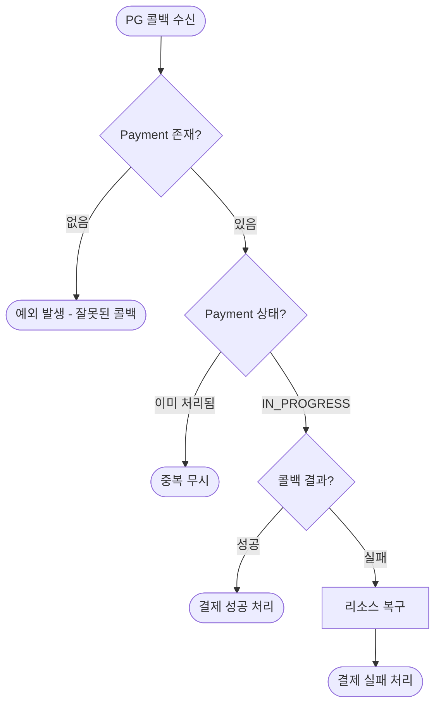
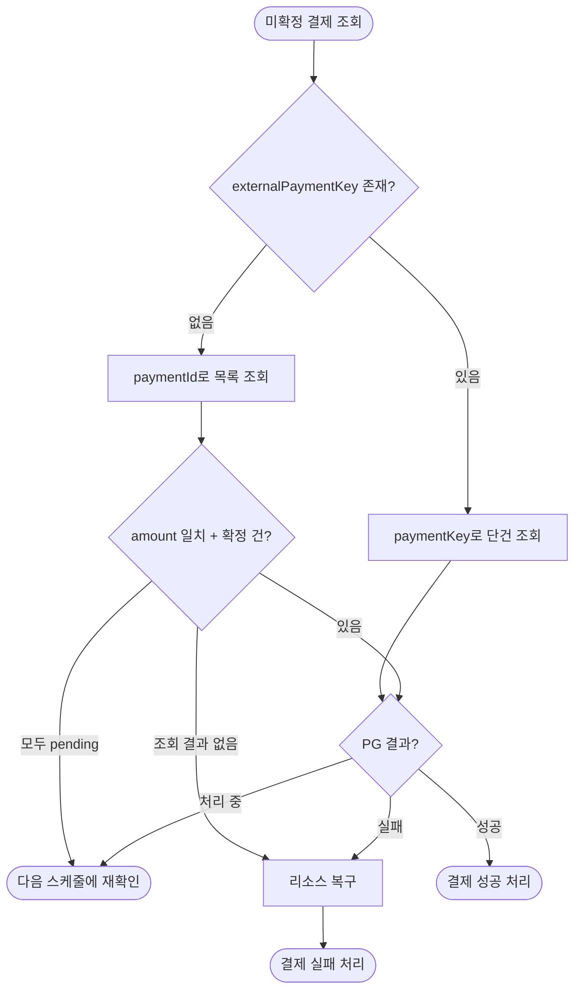

# PG 연동 Resilience 상세 설계 및 구현 계획 문서

## 1. 시스템 플로우차트

### 1.1 카드 결제 요청 플로우


**응답 결과 분류:**

| 분류        | 오류 유형                                                     | 처리                                  |
|-----------|-----------------------------------------------------------|-------------------------------------|
| 수신 확인     | PG 정상 응답                                                  | 정상 진행                               |
| 요청 미도달 확실 | 서킷 오픈, Connection Timeout, Connection Refused, 500/429 응답 | 즉시 롤백 (요청이 PG에 도달 안 함이 확실)          |
| 요청 도달 불확실 | Read Timeout, Connection Reset                            | IN_PROGRESS 유지, 스케줄러가 확인 (이중 결제 위험) |

### 1.2 콜백 처리 플로우



**동시성 제어:** 낙관적 락(version)을 사용합니다. 콜백과 스케줄러가 동시에 같은 결제를 처리하면, 먼저 커밋한 쪽이 성공하고 늦은 쪽은 version 불일치로 실패하여 스킵합니다.

### 1.3 스케줄러 상태 확정 플로우



**조회 조건:** `status = 'IN_PROGRESS'` (모든 IN_PROGRESS 결제를 오래된 것부터 조회)

**PG 조회 로직:**

1. 콜백 처리 시: `externalPaymentKey`로 단건 조회
2. 스케줄러 처리 시: `paymentId`로 목록 조회
    - `amount` 일치 + 성공/실패 확정 건 있음 → 해당 결과로 처리, `externalPaymentKey` 저장
    - 모두 pending 상태 → 5분 미경과 시 다음 스케줄에 재조회, 5분 경과 시 강제 실패 처리
    - 조회 결과 없음 → 실패 처리 (PG에 요청이 도달하지 않았음)

## 2. 데이터 모델 설계

### 2.1 테이블 스키마

#### payment 테이블 변경

```sql
ALTER TABLE payment
    ADD COLUMN paid_amount BIGINT NOT NULL,
    ADD COLUMN external_payment_key VARCHAR(100),
    ADD COLUMN failure_message VARCHAR(500),
    ADD COLUMN attempted_at TIMESTAMP;
```

**컬럼 설명:**

| 컬럼                     | 타입           | 설명                            |
|------------------------|--------------|-------------------------------|
| `paid_amount`          | BIGINT       | 카드 결제 금액 (원 단위)               |
| `external_payment_key` | VARCHAR(100) | PG 결제 식별자 (nullable)          |
| `failure_message`      | VARCHAR(500) | 실패 사유 (nullable)              |
| `attempted_at`         | TIMESTAMP    | 결제 시도 시각 (타임아웃 판단용, nullable) |

**status 컬럼:** 기존 `PAID`에 `PENDING`, `IN_PROGRESS`, `FAILED` 추가 (애플리케이션 enum 변경)

### 2.2 인덱스 전략

```sql
CREATE INDEX idx_payment_status_created_at ON payment (status, created_at);
CREATE UNIQUE INDEX idx_payment_external_payment_key ON payment (external_payment_key);
```

**인덱스 설명:**

| 인덱스                                | 용도                                    |
|------------------------------------|---------------------------------------|
| `idx_payment_status_created_at`    | 스케줄러의 미확정 결제 조회 (오래된 것부터 처리)          |
| `idx_payment_external_payment_key` | 콜백 수신 시 Payment 조회, 중복 저장 방지 (unique) |

## 3. Resilience 전략

### 3.1 Timeout 전략

**pg-payment (결제 요청용):**

| 설정                 | 값  | 근거                        |
|--------------------|----|---------------------------|
| Connection Timeout | 1초 | 연결 자체는 빠르게                |
| Read Timeout       | 1초 | PG 요청 P99 700ms × 1.4배    |
| 주문 API SLO         | 5초 | 재시도 포함 최악 2.7초 + 내부 처리 여유 |

**pg-query (상태 조회용):**

| 설정                 | 값     | 근거              |
|--------------------|-------|-----------------|
| Connection Timeout | 1초    | 연결 자체는 빠르게      |
| Read Timeout       | 500ms | 조회 API는 결제보다 빠름 |

### 3.2 Retry 전략

| 설정        | 값                                                  | 근거                  |
|-----------|----------------------------------------------------|---------------------|
| 최대 재시도 횟수 | 3회                                                 | 총 4회 시도, 성공률 97.4%  |
| 재시도 간격    | 지수 백오프 + 지터 (초기 100ms, 최대 1초)                      | 부하 분산               |
| 재시도 대상    | Connection Timeout, Connection Refused, 500/429 응답 | 요청 미도달, 재시도 안전      |
| 재시도 제외    | Read Timeout                                       | 요청 도달 불확실, 이중 결제 위험 |

**성공률 계산:** 1회 성공률 60%일 때, 4회 시도 시 성공률 = 1 - (0.4)⁴ = 97.4%

**pg-query 설정:** 최대 재시도 1회 (총 2회 시도) - 조회는 결제보다 덜 중요

### 3.3 Circuit Breaker 전략

**데코레이터 순서:** `CircuitBreaker(Retry(PG 호출))` 구조로 구성합니다. Retry가 먼저 실행되고, 재시도를 포함한 최종 결과만 CircuitBreaker에 기록됩니다. 이렇게 설계하는
이유는 두 패턴의 목적이 다르기 때문입니다. Retry는 일시적 오류를 흡수하고, CircuitBreaker는 재시도해도 안 되는 지속적 장애를 감지합니다.

**pg-payment (결제 요청용):**

| 설정                  | 값                                                          | 근거                                         |
|---------------------|------------------------------------------------------------|--------------------------------------------|
| 실패율 임계치             | 30%                                                        | 재시도 후 평시 실패율 6.4%를 감안, 이상 징후 감지            |
| Slow Call 임계치       | 50%                                                        | 절반 이상 느려지면 장애                              |
| Slow Call 기준        | 700ms                                                      | 요청 지연 최대 500ms × 1.3배                      |
| Sliding Window 크기   | 10회                                                        | 통계적 유의미성 확보, 순간적 오류에 과민반응 방지               |
| 최소 호출 수             | 5회                                                         | 최소 샘플 수 확보 후 실패율 계산                        |
| Open → Half-Open 대기 | 5초                                                         | 빠른 복구 확인. Half-Open에서 일부 요청만 통과시키므로 리스크 낮음 |
| Half-Open 허용 호출 수   | 3회                                                         | 복구 판단용 샘플                                  |
| Record Exceptions   | PgRequestNotReachedException, PgResponseUncertainException | 인프라 오류만                                    |

**pg-query (상태 조회용):**

| 설정                | 값     | 근거              |
|-------------------|-------|-----------------|
| 실패율 임계치           | 20%   | 조회는 더 민감하게 감지   |
| Slow Call 기준      | 400ms | 조회 API는 더 빨라야 함 |
| Sliding Window 크기 | 5회    | 조회는 더 적은 샘플로 판단 |
| 최소 호출 수           | 5회    | 최소 샘플 수 확보      |

**빠른 회복 전략 근거:** 서킷이 Open 상태일 때 모든 요청이 즉시 실패 처리됩니다. Open 유지 시간이 길면 PG가 이미 복구됐는데도 불필요하게 사용자에게 실패를 반환하게 됩니다. Half-Open
상태에서는 일부 요청만 PG로 보내고, 실패하면 다시 Open으로, 성공하면 Closed로 전환되므로 빠르게 확인해도 안전합니다.

### 3.4 스케줄러 전략

| 설정            | 값                                   | 근거               |
|---------------|-------------------------------------|------------------|
| 실행 주기         | 1분                                  | 사용자 경험과 PG 부하 균형 |
| 조회 조건         | IN_PROGRESS 상태, created_at 오름차순     | 오래된 결제부터 우선 처리   |
| 페이지 크기        | 20건                                 | 페이지네이션으로 반복 조회   |
| 강제 실패 조건      | IN_PROGRESS + attempted_at 5분 이상 경과 | 도메인에서 타임아웃 판단    |
| PG 상태 확인 실패 시 | 다음 스케줄에 재시도                         |                  |

**처리 방식:** 페이지네이션으로 목록 조회 후 건별 트랜잭션으로 처리합니다. 각 건마다 개별 트랜잭션을 사용하여 낙관적 락 충돌 시 해당 건만 스킵하고 나머지는 계속 진행합니다. 처리된 결제는 상태가 변경되어
다음 조회에서 제외되므로, 항상 page=0으로 조회합니다.

```kotlin
fun checkInProgressPayments() {
    var totalProcessed = 0
    var totalSkipped = 0
    val attemptedIds = mutableSetOf<Long>()

    while (true) {
        val criteria = PaymentCriteria.FindPayments(
            page = 0,
            statuses = listOf(PaymentStatus.IN_PROGRESS),
            sort = PaymentSortType.CREATED_AT_ASC,
        )
        val slice = paymentFacade.findPayments(criteria)

        // 아직 시도하지 않은 결제만 필터링
        val newPayments = slice.content.filter { it.id !in attemptedIds }

        if (newPayments.isEmpty()) break

        for (payment in newPayments) {
            attemptedIds.add(payment.id)
            try {
                paymentFacade.processInProgressPayment(payment.id) // 개별 트랜잭션
                totalProcessed++
            } catch (e: ObjectOptimisticLockingFailureException) {
                log.debug("낙관적 락 충돌 - paymentId: {} (이미 처리됨)", payment.id)
                totalSkipped++
            }
        }
    }

    if (totalProcessed > 0 || totalSkipped > 0) {
        log.info(
            "checkInProgressPayments scheduler end - processed: {}, skipped: {}",
            totalProcessed, totalSkipped
        )
    }
}
```

**PG 조회 로직:**

| 호출 시점   | 조회 방식                     | 처리              |
|---------|---------------------------|-----------------|
| 콜백 처리   | externalPaymentKey로 단건 조회 | 결과에 따라 성공/실패 처리 |
| 스케줄러 처리 | paymentId로 목록 조회          | 아래 분기 참고        |

**스케줄러 paymentId 목록 조회 시 분기:**

| 조회 결과                     | 처리                                     |
|---------------------------|----------------------------------------|
| amount 일치 + 성공/실패 확정 건 있음 | 해당 결과로 처리, externalPaymentKey 저장       |
| 모두 pending 상태             | 5분 미경과 시 다음 스케줄에 재조회, 5분 경과 시 강제 실패 처리 |
| 조회 결과 없음                  | 실패 처리 (PG에 요청 미도달)                     |

## 4. 운영 계획

### 4.1 메트릭 수집 전략

Resilience4j + Spring Boot Actuator + Micrometer 통합으로 자동 수집됩니다.

#### CircuitBreaker 메트릭

| 메트릭                                          | 타입      | 태그          | 설명                                       |
|----------------------------------------------|---------|-------------|------------------------------------------|
| `resilience4j_circuitbreaker_state`          | Gauge   | name, state | 서킷 상태 (closed=1, open=1, half_open=1 등)  |
| `resilience4j_circuitbreaker_calls_total`    | Counter | name, kind  | 호출 수 (successful, failed, not_permitted) |
| `resilience4j_circuitbreaker_buffered_calls` | Gauge   | name, kind  | 버퍼된 호출 수 (successful, failed)            |
| `resilience4j_circuitbreaker_failure_rate`   | Gauge   | name        | 실패율 (%)                                  |
| `resilience4j_circuitbreaker_slow_call_rate` | Gauge   | name        | 느린 호출 비율 (%)                             |
| `resilience4j_circuitbreaker_slow_calls`     | Gauge   | name, kind  | 느린 호출 수 (successful, failed)             |

#### Retry 메트릭

| 메트릭                              | 타입      | 태그         | 설명       |
|----------------------------------|---------|------------|----------|
| `resilience4j_retry_calls_total` | Counter | name, kind | 재시도 호출 수 |

**kind 태그 값:**

- `successful_without_retry`: 재시도 없이 성공
- `successful_with_retry`: 재시도 후 성공
- `failed_without_retry`: 재시도 없이 실패
- `failed_with_retry`: 재시도 후에도 실패

#### 메트릭 조회 방법

```bash
# Actuator 메트릭 엔드포인트
GET /actuator/metrics/resilience4j.circuitbreaker.state
GET /actuator/metrics/resilience4j.circuitbreaker.calls
GET /actuator/metrics/resilience4j.retry.calls

# Prometheus 엔드포인트 (micrometer-registry-prometheus 의존성 필요)
GET /actuator/prometheus
```

#### 주요 모니터링 쿼리 (Prometheus)

```promql
# 서킷 상태 확인 (1이면 해당 상태)
resilience4j_circuitbreaker_state{name="pg-payment", state="open"}

# 실패율 추이
resilience4j_circuitbreaker_failure_rate{name="pg-payment"}

# 분당 실패 호출 수
increase(resilience4j_circuitbreaker_calls_total{name="pg-payment", kind="failed"}[1m])

# 재시도 후에도 실패한 비율
resilience4j_retry_calls_total{name="pg-payment", kind="failed_with_retry"}
  / resilience4j_retry_calls_total{name="pg-payment"}
```

### 4.2 로깅 전략

| 상황       | 로그 레벨 | 포맷                                                                     |
|----------|-------|------------------------------------------------------------------------|
| 서킷 상태 변경 | WARN  | `[PG Payment CircuitBreaker] 상태 전환: {from} → {to}`                     |
| Retry 발생 | WARN  | `[PG Payment Retry] 재시도 #{n} - 대기: {ms}ms, 원인: {message}`              |
| 스케줄러 완료  | INFO  | `checkInProgressPayments scheduler end - processed: {n}, skipped: {n}` |
| 낙관적 락 충돌 | DEBUG | `낙관적 락 충돌 - paymentId: {id} (이미 처리됨)`                                  |
| PG 연결 실패 | WARN  | `PG 연결 실패, 다음 스케줄에 재시도 - paymentId: {id}`                              |

### 4.3 주요 실패 시나리오 및 대응 계획

| 실패 시나리오                  | 대응 방안                    | 기대 효과                 |
|--------------------------|--------------------------|-----------------------|
| 서킷 오픈 상태에서 결제 요청         | 즉시 실패 반환, 리소스 복구         | 장애 전파 차단, 요청 미도달 확실   |
| PG 요청 실패 - 재시도 후 최종 실패   | 즉시 실패 반환, 리소스 복구         | 요청 미도달 확실, 사용자 재시도 유도 |
| PG 응답 불확실 (Read Timeout) | IN_PROGRESS 유지, 스케줄러가 확인 | 이중 결제 방지              |
| 콜백 미수신                   | 스케줄러가 PG 상태 확인 후 확정      | 최종 일관성 보장             |
| 콜백/스케줄러 동시 처리            | 낙관적 락(version)으로 중복 방지   | 데이터 정합성 유지            |

## 5. 설계 결정 공유

### 5.1 주요 설계 결정 및 근거

| 설계 결정                             | 근거                                                                                                  |
|-----------------------------------|-----------------------------------------------------------------------------------------------------|
| 요청 미도달 확실 시 즉시 롤백                 | 서킷 오픈, Connection Timeout, 500/429 등은 PG에 요청이 안 갔음이 확실. 스케줄러가 확인해도 "해당 결제 없음"이므로 즉시 롤백하고 사용자 재시도 유도 |
| 요청 도달 불확실 시 IN_PROGRESS 유지        | Read Timeout, Connection Reset 등은 요청이 갔을 수도 있음. 롤백 시 이중 결제 위험. 스케줄러가 PG에 상태 확인                      |
| externalPaymentKey는 PG 응답 수신 시 저장 | PG가 응답으로 paymentKey를 주는 방식. Read Timeout 시 key 없이 IN_PROGRESS 유지, 스케줄러가 paymentId로 조회 후 저장          |
| 콜백은 단건 조회, 스케줄러는 목록 조회            | 콜백은 externalPaymentKey가 확실히 있으므로 단건 조회. 스케줄러는 key가 없을 수 있어 paymentId로 목록 조회                         |
| IN_PROGRESS 5분 경과 시 강제 실패         | 고객이 화면에서 결과를 대기 중. 스케줄러 5회 조회에도 미확정이면 비정상으로 판단, 리소스 복구 후 실패 처리                                      |
| 재시도 3회 (총 4회 시도)                  | 40% 실패율에서 97.4% 성공률 달성. 100건 중 2~3건 실패 수준                                                           |
| Read Timeout 시 재시도 제외             | 요청 도달 여부 불확실, 이중 결제 위험 방지. 스케줄러가 상태 확인                                                              |
| 낙관적 락 (version)                   | 콜백/스케줄러 동시 처리 시 먼저 커밋한 쪽이 성공, 늦은 쪽은 스킵. DB 락을 오래 잡지 않아 커넥션 풀 고갈 방지                                  |
| 스케줄러 건별 트랜잭션 처리                   | 100건을 한 트랜잭션으로 처리하면 낙관적 락 충돌 시 전체 롤백. 건별 처리로 충돌 건만 스킵하고 나머지 계속 진행                                   |
| CircuitBreaker(Retry()) 데코레이터 순서  | Retry가 먼저 실행되어 일시적 오류를 흡수하고, 최종 결과만 서킷에 기록. 서킷은 재시도해도 안 되는 지속적 장애만 감지                               |
| 서킷 실패율 임계치 30%                    | 재시도 후 최종 실패율 6.4%가 서킷에 기록됨. 이 기준으로 이상 징후 감지                                                         |
| 서킷 Open → Half-Open 5초            | 빠른 복구 확인. Half-Open에서 일부 요청만 통과시켜 복구 여부 판단하므로 리스크 낮음                                                |
| 서킷 윈도우/최소호출 설정 (10회/5회)           | 통계적 유의미성 확보. 순간적 오류에 과민반응하지 않으면서 장애는 빠르게 감지                                                         |
| pg-query 별도 설정                    | 조회는 결제보다 빠르고 덜 중요. 더 짧은 타임아웃, 더 민감한 서킷 설정 적용                                                        |
| Resilience4j 자동 메트릭 활용            | Spring Boot Actuator 통합으로 별도 코드 없이 메트릭 수집. Prometheus/Grafana 연동 용이                                 |