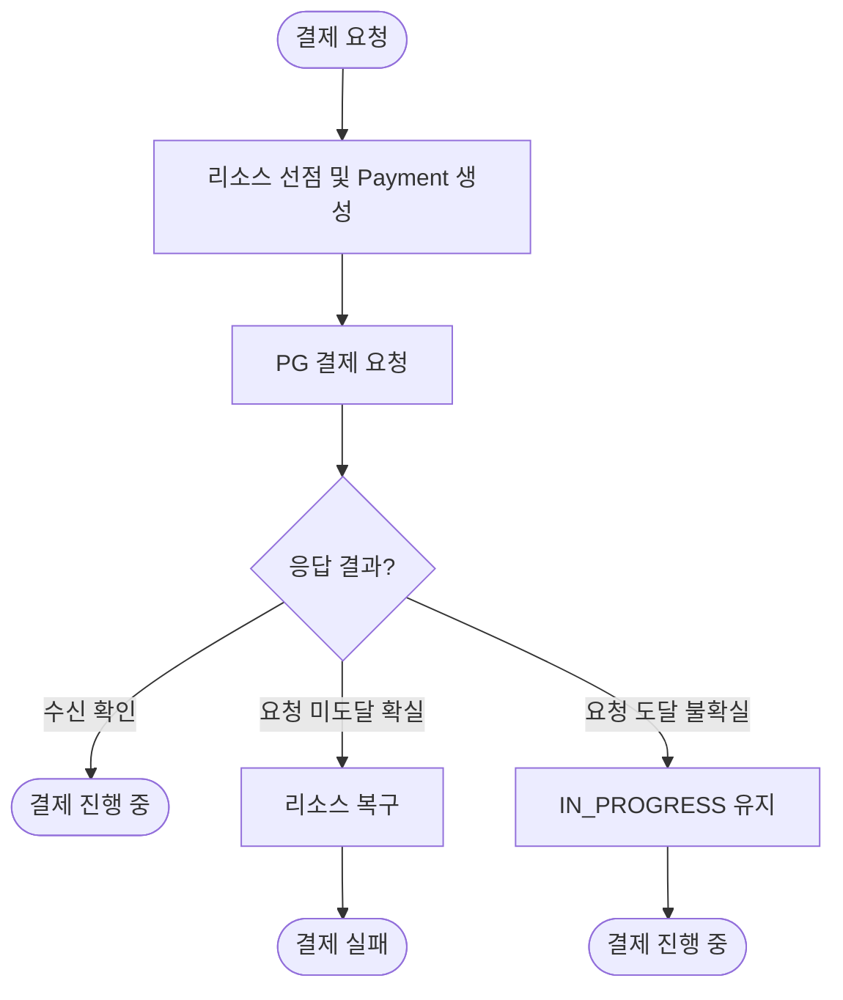
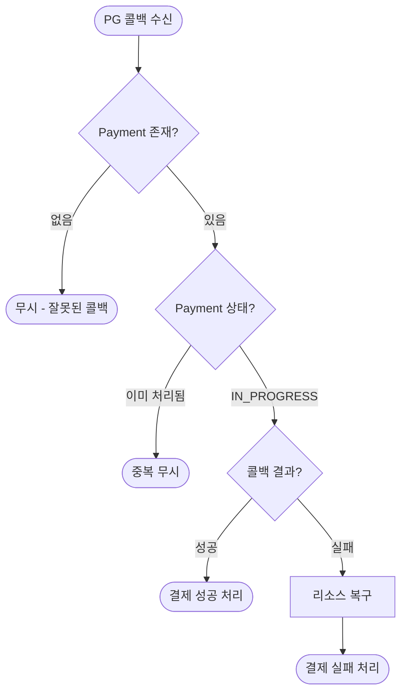
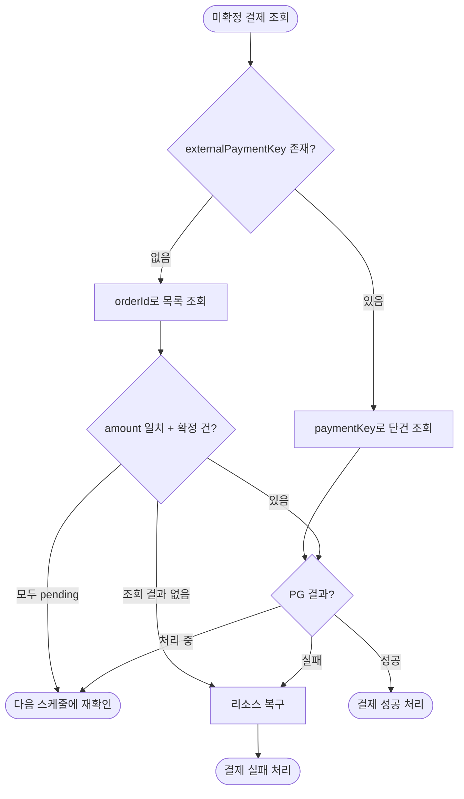

# PG 연동 Resilience 상세 설계 및 구현 계획 문서

## 1. 시스템 플로우차트

### 1.1 카드 결제 요청 플로우



**응답 결과 분류:**

| 분류 | 오류 유형 | 처리 |
|-----|---------|------|
| 수신 확인 | PG 정상 응답 | 정상 진행 |
| 요청 미도달 확실 | 서킷 오픈, Connection Timeout, Connection Refused, 500/429 응답 | 즉시 롤백 (요청이 PG에 도달 안 함이 확실) |
| 요청 도달 불확실 | Read Timeout, Connection Reset | IN_PROGRESS 유지, 스케줄러가 확인 (이중 결제 위험) |

### 1.2 콜백 처리 플로우



**동시성 제어:** 낙관적 락(version)을 사용합니다. 콜백과 스케줄러가 동시에 같은 결제를 처리하면, 먼저 커밋한 쪽이 성공하고 늦은 쪽은 version 불일치로 실패하여 스킵합니다.

### 1.3 스케줄러 상태 확정 플로우



**조회 조건:** `status = 'IN_PROGRESS' AND updated_at < NOW() - INTERVAL '1 minute'`

**PG 조회 로직:**
1. `externalPaymentKey`가 있으면 해당 키로 단건 조회
2. `externalPaymentKey`가 없으면 `orderId`로 목록 조회
   - `amount` 일치 + 성공/실패 확정 건 있음 → 해당 결과로 처리, `externalPaymentKey` 저장
   - 모두 pending 상태 → 다음 스케줄에 재조회
   - 조회 결과 없음 → 실패 처리 (PG에 요청이 도달하지 않았음)

## 2. 데이터 모델 설계

### 2.1 테이블 스키마

#### payment 테이블 변경

```sql
ALTER TABLE payment
    ADD COLUMN paid_amount BIGINT NOT NULL,
    ADD COLUMN external_payment_key VARCHAR(100),
    ADD COLUMN failure_message VARCHAR(500);
```

**컬럼 설명:**

| 컬럼 | 타입 | 설명 |
|-----|------|------|
| `paid_amount` | BIGINT | 카드 결제 금액 (원 단위) |
| `external_payment_key` | VARCHAR(100) | PG 결제 식별자 (nullable) |
| `failure_message` | VARCHAR(500) | 실패 사유 (nullable) |

**status 컬럼:** 기존 `PAID`에 `PENDING`, `IN_PROGRESS`, `FAILED` 추가 (애플리케이션 enum 변경)

### 2.2 인덱스 전략

```sql
CREATE INDEX idx_payment_status_updated_at ON payment (status, updated_at);
CREATE UNIQUE INDEX idx_payment_external_payment_key ON payment (external_payment_key) WHERE external_payment_key IS NOT NULL;
```

**인덱스 설명:**

| 인덱스 | 용도 |
|-------|------|
| `idx_payment_status_updated_at` | 스케줄러의 미확정 결제 조회 (분 단위 실행) |
| `idx_payment_external_payment_key` | 콜백 수신 시 Payment 조회, 중복 저장 방지 |

## 3. Resilience 전략

### 3.1 Timeout 전략

| 설정 | 값 | 근거 |
|-----|-----|------|
| Connection Timeout | 1초 | 연결 자체는 빠르게 |
| Read Timeout | 1초 | PG 요청 P99 500ms × 2배 |
| 주문 API SLO | 5초 | 재시도 포함 최악 2.7초 + 내부 처리 여유 |

### 3.2 Retry 전략

| 설정 | 값 | 근거 |
|-----|-----|------|
| 최대 재시도 횟수 | 3회 | 총 4회 시도, 성공률 97.4% |
| 재시도 간격 | 지수 백오프 + 지터 (초기 100ms, 최대 1초) | 부하 분산 |
| 재시도 대상 | Connection Timeout, Connection Refused, 500/429 응답 | 요청 미도달, 재시도 안전 |
| 재시도 제외 | Read Timeout | 요청 도달 불확실, 이중 결제 위험 |

**성공률 계산:** 1회 성공률 60%일 때, 4회 시도 시 성공률 = 1 - (0.4)⁴ = 97.4%

### 3.3 Circuit Breaker 전략

**데코레이터 순서:** `CircuitBreaker(Retry(PG 호출))` 구조로 구성합니다. Retry가 먼저 실행되고, 재시도를 포함한 최종 결과만 CircuitBreaker에 기록됩니다. 이렇게 설계하는 이유는 두 패턴의 목적이 다르기 때문입니다. Retry는 일시적 오류를 흡수하고, CircuitBreaker는 재시도해도 안 되는 지속적 장애를 감지합니다.

| 설정 | 값 | 근거 |
|-----|-----|------|
| 실패율 임계치 | 30% | 재시도 후 평시 실패율 6.4%를 감안, 이상 징후 감지 |
| Slow Call 임계치 | 50% | 절반 이상 느려지면 장애 |
| Slow Call 기준 | 700ms | 요청 지연 최대 500ms × 1.3배 |
| Sliding Window 크기 | 10회 | 통계적 유의미성 확보, 순간적 오류에 과민반응 방지 |
| 최소 호출 수 | 5회 | 최소 샘플 수 확보 후 실패율 계산 |
| Open → Half-Open 대기 | 5초 | 빠른 복구 확인. Half-Open에서 일부 요청만 통과시키므로 리스크 낮음 |
| Half-Open 허용 호출 수 | 3회 | 복구 판단용 샘플 |
| Record Exceptions | ConnectException, TimeoutException, 5xx 응답 | 인프라 오류만 |
| Ignore Exceptions | PG 비즈니스 오류 (한도초과, 잘못된 카드) | 사용자 문제, 서킷 트리거 제외 |

**빠른 회복 전략 근거:** 서킷이 Open 상태일 때 모든 요청이 즉시 실패 처리됩니다. Open 유지 시간이 길면 PG가 이미 복구됐는데도 불필요하게 사용자에게 실패를 반환하게 됩니다. Half-Open 상태에서는 일부 요청만 PG로 보내고, 실패하면 다시 Open으로, 성공하면 Closed로 전환되므로 빠르게 확인해도 안전합니다.

### 3.4 스케줄러 전략

| 설정 | 값 | 근거 |
|-----|-----|------|
| 실행 주기 | 1분 | 사용자 경험과 PG 부하 균형 |
| 조회 조건 | IN_PROGRESS이고 updated_at이 1분 이상 경과 | 처리 지연 최대 5초 + 콜백 지연 여유 |
| 배치 크기 | 100건 | 한 번에 너무 많이 처리하지 않도록 |
| 강제 실패 조건 | IN_PROGRESS 5분 이상 경과 | 스케줄러 5회 조회에도 미확정이면 비정상. 고객 대기 시간 고려 |
| PG 상태 확인 실패 시 | 다음 스케줄에 재시도 | |

**처리 방식:** 목록 조회 후 건별 트랜잭션으로 처리합니다. 각 건마다 개별 트랜잭션을 사용하여 낙관적 락 충돌 시 해당 건만 스킵하고 나머지는 계속 진행합니다.

```kotlin
fun processInProgressPayments() {
    val paymentIds = paymentRepository.findInProgressPaymentIds() // 락 없이 ID만 조회
    
    paymentIds.forEach { paymentId ->
        try {
            paymentProcessor.process(paymentId) // 개별 트랜잭션
        } catch (e: OptimisticLockingFailureException) {
            log.info("Payment already processed by callback. paymentId={}", paymentId)
        }
    }
}
```

**PG 조회 로직:**

| 조건 | 조회 방식 | 처리 |
|-----|----------|------|
| externalPaymentKey 있음 | paymentKey로 단건 조회 | 결과에 따라 성공/실패 처리 |
| externalPaymentKey 없음 | orderId로 목록 조회 | 아래 분기 참고 |

**orderId 목록 조회 시 분기:**

| 조회 결과 | 처리 |
|----------|------|
| amount 일치 + 성공/실패 확정 건 있음 | 해당 결과로 처리, externalPaymentKey 저장 |
| 모두 pending 상태 | 5분 미경과 시 다음 스케줄에 재조회, 5분 경과 시 강제 실패 처리 |
| 조회 결과 없음 | 실패 처리 (PG에 요청 미도달) |

**스케줄러 로깅:**

| 시점 | 로그 레벨 | 포맷 |
|-----|----------|------|
| 시작 | INFO | `PaymentStatusScheduler started. target_count={n}` |
| 강제 실패 처리 | WARN | `Payment forced to fail due to timeout. paymentId={}, elapsed={minutes}m` |

## 4. 운영 계획

### 4.1 메트릭 수집 전략

#### 애플리케이션 레벨 (직접 기록)

PgClient와 스케줄러에서 Micrometer를 사용하여 기록합니다.

| 메트릭 | 타입 | 태그 | 용도 |
|-------|------|------|------|
| `pg_request_latency_seconds` | Timer | result (success/failure) | PG 응답 시간 분포 확인, Timeout 최적화 |
| `pg_request_total` | Counter | result, error (예외 타입) | 성공/실패 비율 추적 |
| `payment_in_progress_count` | Gauge | - | 미확정 결제 건수 추이, 쌓이면 콜백/PG 이상 신호 |

```kotlin
fun requestPayment(...): PgResponse {
    val sample = Timer.start(meterRegistry)
    
    return try {
        val response = callPgApi(...)
        sample.stop(meterRegistry.timer("pg_request_latency_seconds", "result", "success"))
        meterRegistry.counter("pg_request_total", "result", "success").increment()
        response
    } catch (e: Exception) {
        sample.stop(meterRegistry.timer("pg_request_latency_seconds", "result", "failure"))
        meterRegistry.counter("pg_request_total", "result", "failure", "error", e.javaClass.simpleName).increment()
        throw e
    }
}
```

#### 자동 수집 (Resilience4j + Micrometer)

Spring Boot 통합 시 자동 노출됩니다.

| 메트릭 | 설명 |
|-------|------|
| `resilience4j_circuitbreaker_state` | 서킷 상태 |
| `resilience4j_circuitbreaker_failure_rate` | 실패율 |
| `resilience4j_retry_calls_total` | 재시도 횟수 |

### 4.2 로깅 전략

| 상황 | 로그 레벨 | 포맷 |
|-----|----------|------|
| 서킷 상태 변경 | INFO | `CircuitBreaker state changed: {from} -> {to}` |
| 서킷 OPEN | WARN | `CircuitBreaker opened. reason={failureRate}%, lastException={exceptionType}` |
| Retry 발생 | WARN | `PG request retry. attempt={n}, reason={exceptionType}` |

### 4.3 알림 전략

| 알림 조건 | 설정 |
|----------|------|
| 서킷 OPEN 전환 | 즉시 알림 |

### 4.4 주요 실패 시나리오 및 대응 계획

| 실패 시나리오 | 대응 방안 | 기대 효과 |
|--------------|----------|----------|
| 서킷 오픈 상태에서 결제 요청 | 즉시 실패 반환, 리소스 복구 | 장애 전파 차단, 요청 미도달 확실 |
| PG 요청 실패 - 재시도 후 최종 실패 | 즉시 실패 반환, 리소스 복구 | 요청 미도달 확실, 사용자 재시도 유도 |
| PG 응답 불확실 (Read Timeout) | IN_PROGRESS 유지, 스케줄러가 확인 | 이중 결제 방지 |
| 콜백 미수신 | 스케줄러가 PG 상태 확인 후 확정 | 최종 일관성 보장 |
| 콜백/스케줄러 동시 처리 | 비관적 락(FOR UPDATE)으로 중복 방지 | 데이터 정합성 유지 |

## 5. 설계 결정 공유

### 5.1 주요 설계 결정 및 근거

| 설계 결정 | 근거 |
|----------|------|
| 요청 미도달 확실 시 즉시 롤백 | 서킷 오픈, Connection Timeout, 500/429 등은 PG에 요청이 안 갔음이 확실. 스케줄러가 확인해도 "해당 결제 없음"이므로 즉시 롤백하고 사용자 재시도 유도 |
| 요청 도달 불확실 시 IN_PROGRESS 유지 | Read Timeout, Connection Reset 등은 요청이 갔을 수도 있음. 롤백 시 이중 결제 위험. 스케줄러가 PG에 상태 확인 |
| externalPaymentKey는 PG 응답 수신 시 저장 | PG가 응답으로 paymentKey를 주는 방식. Read Timeout 시 key 없이 IN_PROGRESS 유지, 스케줄러가 orderId로 조회 후 저장 |
| 스케줄러 조회 시 orderId 폴백 | externalPaymentKey 없으면 orderId로 목록 조회. amount 일치 + 확정 건으로 매칭, 결과 없으면 미도달로 판단하여 실패 처리 |
| IN_PROGRESS 5분 경과 시 강제 실패 | 고객이 화면에서 결과를 대기 중. 스케줄러 5회 조회에도 미확정이면 비정상으로 판단, 리소스 복구 후 실패 처리 |
| 재시도 3회 (총 4회 시도) | 40% 실패율에서 97.4% 성공률 달성. 100건 중 2~3건 실패 수준 |
| Read Timeout 시 재시도 제외 | 요청 도달 여부 불확실, 이중 결제 위험 방지. 스케줄러가 상태 확인 |
| 낙관적 락 (version) | 콜백/스케줄러 동시 처리 시 먼저 커밋한 쪽이 성공, 늦은 쪽은 스킵. DB 락을 오래 잡지 않아 커넥션 풀 고갈 방지 |
| 스케줄러 건별 트랜잭션 처리 | 100건을 한 트랜잭션으로 처리하면 낙관적 락 충돌 시 전체 롤백. 건별 처리로 충돌 건만 스킵하고 나머지 계속 진행 |
| CircuitBreaker(Retry()) 데코레이터 순서 | Retry가 먼저 실행되어 일시적 오류를 흡수하고, 최종 결과만 서킷에 기록. 서킷은 재시도해도 안 되는 지속적 장애만 감지 |
| 서킷 실패율 임계치 30% | 재시도 후 최종 실패율 6.4%가 서킷에 기록됨. 이 기준으로 이상 징후 감지 |
| 서킷 Open → Half-Open 5초 | 빠른 복구 확인. Half-Open에서 일부 요청만 통과시켜 복구 여부 판단하므로 리스크 낮음 |
| 서킷 윈도우/최소호출 설정 (10회/5회) | 통계적 유의미성 확보. 순간적 오류에 과민반응하지 않으면서 장애는 빠르게 감지 |
| PG 비즈니스 오류 서킷 제외 | 한도초과/잘못된 카드는 사용자 문제, 시스템 장애 아님. 서킷 트리거에서 제외 |
| PG latency 메트릭 직접 수집 | 첫 배포이므로 데이터 수집 우선. 실측 기반 Timeout/서킷 설정 최적화 목적 |
