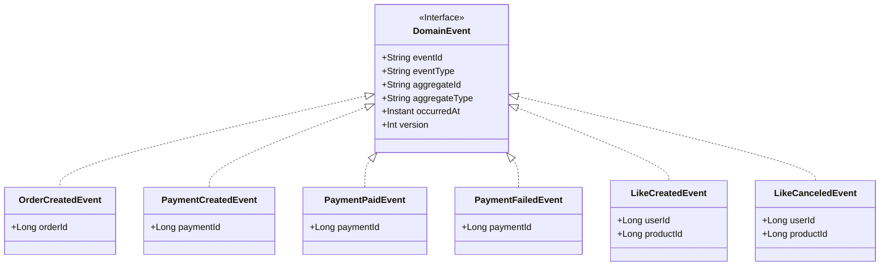
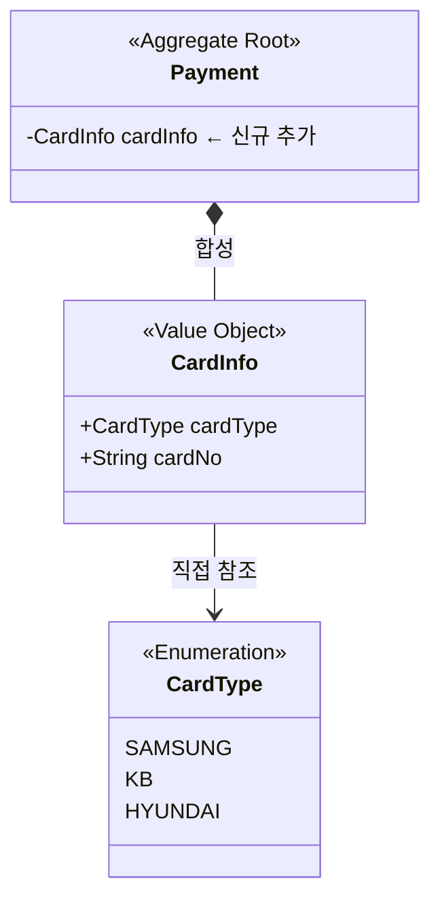
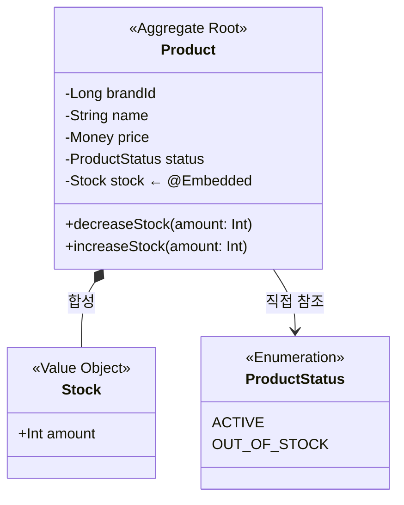
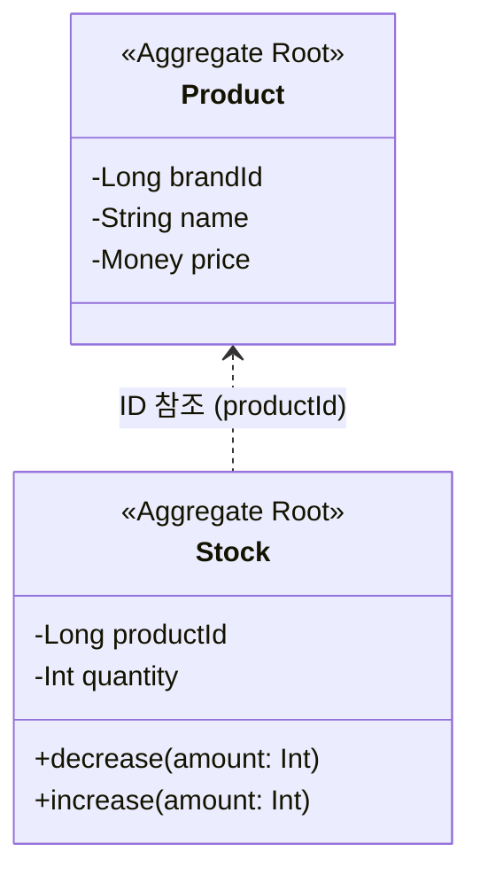
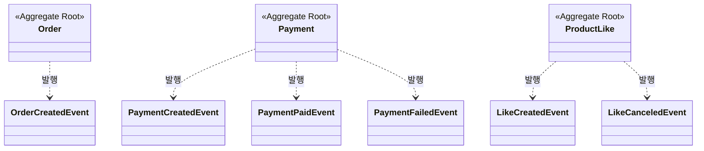

# 이벤트 기반 트랜잭션 분리 - 도메인 모델링 문서

> 이 문서는 주문-결제, 좋아요-집계 로직의 트랜잭션 분리를 위한 도메인 이벤트 설계를 다룹니다.
> 기존 도메인 구조의 변경사항과 새로 추가되는 이벤트를 중심으로 작성되었습니다.

## 1. 클래스 다이어그램

### 1.1 도메인 이벤트

### 1.2 Payment 변경사항

### 1.3 Product/Stock 분리

**AS-IS (현재)**

**TO-BE (변경 후)**

**변경 사유**

Product 조회 시 Stock이 같은 row에서 함께 로드되어 1차 캐시에 저장됩니다. BEFORE_COMMIT 리스너에서 FOR UPDATE 조회해도 1차 캐시에서 반환되어 비관적 락이 무력화됩니다.

Stock을 별도 엔티티로 분리하면 가격 조회 시 Product만 로드되고, 재고 차감 시점에 Stock을 별도로 조회하여 락을 정상적으로 획득할 수 있습니다.

**변경 요약**

| 항목 | AS-IS | TO-BE |
|------|-------|-------|
| Stock 위치 | Product 내 @Embedded | 별도 엔티티 (별도 테이블) |
| ProductStatus | Product에 포함 | 제거 (재고 조회로 대체) |
| 재고 차감 | Product.decreaseStock() | Stock.decrease() |
| 재고 복구 | Product.increaseStock() | Stock.increase() |

### 1.4 이벤트 발행 관계

### 주요 구조

**DomainEvent 인터페이스**

모든 도메인 이벤트의 공통 계약입니다. eventId로 중복 처리를 방지하고, version으로 스키마 호환성을 관리합니다. `support.event` 패키지에 위치합니다.

**제로 페이로드 원칙**

Order, Payment 도메인의 이벤트는 Aggregate 식별자만 포함합니다. 리스너는 해당 ID로 필요한 정보를 직접 조회하여 처리합니다. 이 방식은 이벤트 스키마를 단순하게 유지하고, 리스너가 항상 최신 상태의 데이터로 작업할 수 있게 합니다.

**Like 이벤트 예외**

LikeCanceledEvent는 삭제 후 발행되어 productLikeId로 조회가 불가능하므로, userId와 productId를 페이로드에 포함합니다. 일관성을 위해 LikeCreatedEvent도 동일한 페이로드를 사용합니다.

**Payment 변경사항**

CardInfo(Value Object)를 추가하여 카드 정보를 저장합니다. CardInfo는 CardType(카드사)과 cardNo(카드번호)를 포함합니다.

**Product/Stock 분리**

기존 Product에 @Embedded로 포함된 Stock을 별도 Aggregate로 분리합니다. 이를 통해 상품 정보 조회와 재고 관리의 1차 캐시 충돌을 방지하고, 비관적 락이 정상적으로 동작하도록 합니다. ProductStatus는 제거하고 재고 조회로 대체합니다.

---

## 2. 도메인 규칙

### 2.1 CardInfo 규칙

**CardInfo 불변식**

| 규칙 | 내용 |
|------|------|
| cardNo 형식 | `XXXX-XXXX-XXXX-XXXX` (숫자 16자리, 하이픈 구분) |
| cardType | SAMSUNG, KB, HYUNDAI 중 하나 |
| 필수 여부 | paidAmount > 0인 경우 필수, paidAmount = 0인 경우 null 허용 |

### 2.2 Stock 규칙

**Stock 불변식**

| 규칙 | 내용 |
|------|------|
| quantity | 0 이상 (재고는 음수가 될 수 없음) |

**decrease() 사전조건**

| 조건 | 위반 시 |
|------|--------|
| amount > 0 | "재고 감소량은 0보다 커야 합니다" |
| quantity >= amount | "재고가 부족합니다" |

**increase() 사전조건**

| 조건 | 위반 시 |
|------|--------|
| amount > 0 | "재고 증가량은 0보다 커야 합니다" |

### 2.3 이벤트 발행 규칙

**이벤트 발행 주체**

이벤트는 Application Service에서 발행합니다. Aggregate 저장 후 ApplicationEventPublisher를 통해 이벤트를 발행합니다.

**Order 도메인**

| 이벤트 | 발행 시점 | 사전조건 | 페이로드 |
|--------|----------|----------|----------|
| OrderCreatedEvent | Order 생성 후 (TX1 내) | Order가 PLACED 상태로 생성됨 | orderId |

**Payment 도메인**

| 이벤트 | 발행 시점 | 사전조건 | 페이로드 |
|--------|----------|----------|----------|
| PaymentCreatedEvent | Payment PENDING 생성 후 (TX1 내) | Payment가 PENDING 상태로 생성됨 | paymentId |
| PaymentPaidEvent | Payment PAID 전환 후 | confirmPayment() 결과가 Paid, 또는 initiate() 시 NotRequired(0원 결제) | paymentId |
| PaymentFailedEvent | Payment FAILED 전환 후 | initiate() 결과가 NotReached, 또는 confirmPayment() 결과가 Failed | paymentId |

**Like 도메인**

| 이벤트 | 발행 시점 | 사전조건 | 페이로드 |
|--------|----------|----------|----------|
| LikeCreatedEvent | ProductLike 생성 후 | 동일 userId + productId 조합이 존재하지 않음 | userId, productId |
| LikeCanceledEvent | ProductLike 삭제 후 | 해당 ProductLike가 존재함 | userId, productId |

### 2.4 이벤트 공통 규칙

**DomainEvent 필드 생성 규칙**

| 필드 | 생성 규칙 |
|------|----------|
| eventId | UUID로 고유 식별자 생성 |
| eventType | 이벤트 클래스명 (e.g., "OrderCreatedEvent") |
| aggregateId | 해당 Aggregate의 ID를 String으로 변환 |
| aggregateType | "Order", "Payment", "ProductLike" 중 하나 |
| occurredAt | 이벤트 생성 시점의 Instant |
| version | 스키마 버전 1로 시작 |

**리스너 타입별 특성**

| 리스너 타입 | 트랜잭션 관계 | 실패 시 영향 | 사용 케이스 |
|-------------|---------------|--------------|-------------|
| BEFORE_COMMIT | 동일 트랜잭션 | 발행자 트랜잭션도 롤백 | 재고 차감, 리소스 복구 |
| AFTER_COMMIT | 별도 트랜잭션 | 발행자 트랜잭션 영향 없음 | PG 요청 |
| AFTER_COMMIT + ASYNC | 별도 스레드 | 발행자 트랜잭션 영향 없음 | 주문 완료, 집계 업데이트, 데이터 플랫폼 전송 |

---

## 3. 상태 다이어그램

상태 전환 로직은 기존과 동일하며, 이벤트 발행 시점은 도메인 규칙(2.3절)에서 정의합니다.

---

## 4. 도메인 이벤트

### 4.1 이벤트 목록

| 이벤트 | 발행 도메인 | 트리거 | 페이로드 |
|--------|-------------|--------|----------|
| OrderCreatedEvent | Order | Order 생성 후 | orderId |
| PaymentCreatedEvent | Payment | Payment PENDING 생성 후 | paymentId |
| PaymentPaidEvent | Payment | Payment PAID 전환 후 | paymentId |
| PaymentFailedEvent | Payment | Payment FAILED 전환 후 | paymentId |
| LikeCreatedEvent | Like | ProductLike 생성 후 | userId, productId |
| LikeCanceledEvent | Like | ProductLike 삭제 후 | userId, productId |

### 4.2 이벤트 구독 관계

| 이벤트 | 리스너 타입 | 구독자 | 처리 내용 |
|--------|-------------|--------|-----------|
| OrderCreatedEvent | BEFORE_COMMIT | ProductService | 재고 차감 |
| PaymentCreatedEvent | AFTER_COMMIT | PaymentService | PG 결제 생성 요청 |
| PaymentPaidEvent | AFTER_COMMIT + ASYNC | OrderService | 주문 완료 |
| PaymentPaidEvent | AFTER_COMMIT + ASYNC | DataPlatformService | 데이터 플랫폼 전송 |
| PaymentFailedEvent | BEFORE_COMMIT | OrderService | 주문 취소 |
| PaymentFailedEvent | BEFORE_COMMIT | PointService | 포인트 복구 |
| PaymentFailedEvent | BEFORE_COMMIT | CouponService | 쿠폰 복구 |
| PaymentFailedEvent | BEFORE_COMMIT | ProductService | 재고 복구 |
| LikeCreatedEvent | AFTER_COMMIT + ASYNC | ProductStatisticService | 좋아요 집계 +1 |
| LikeCanceledEvent | AFTER_COMMIT + ASYNC | ProductStatisticService | 좋아요 집계 -1 |
