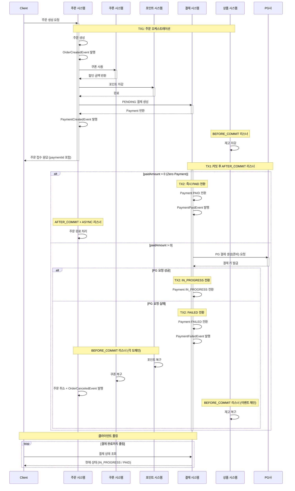
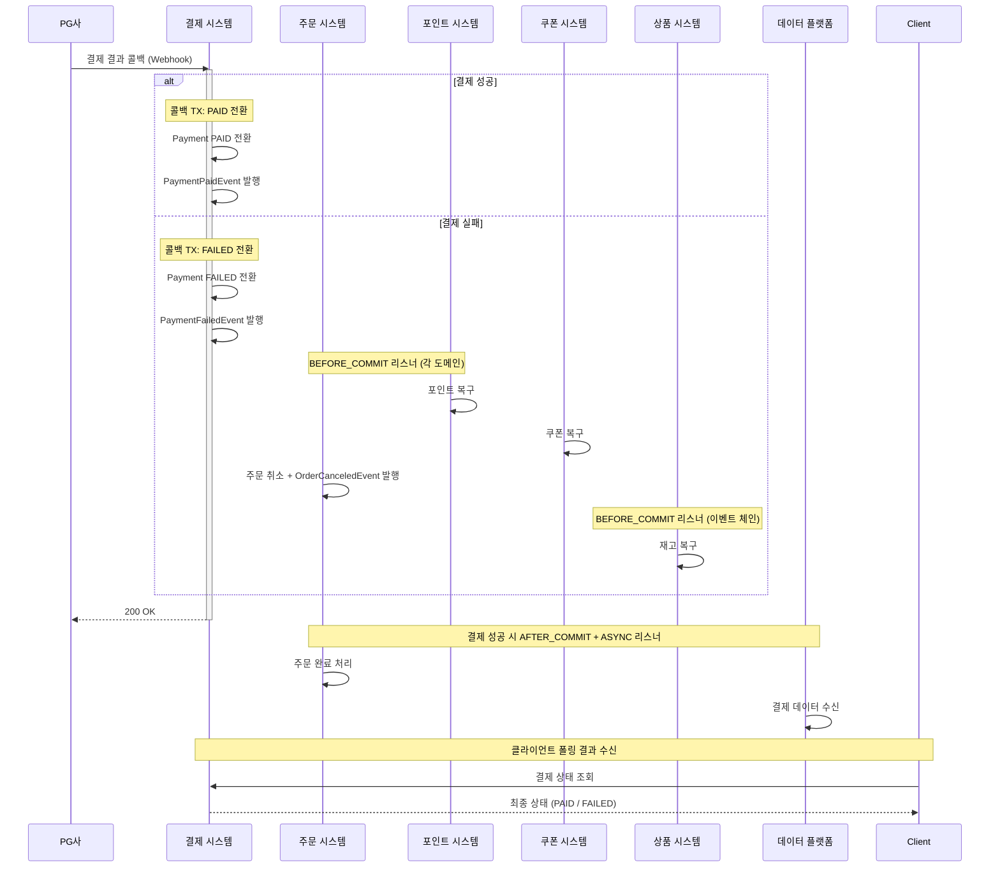
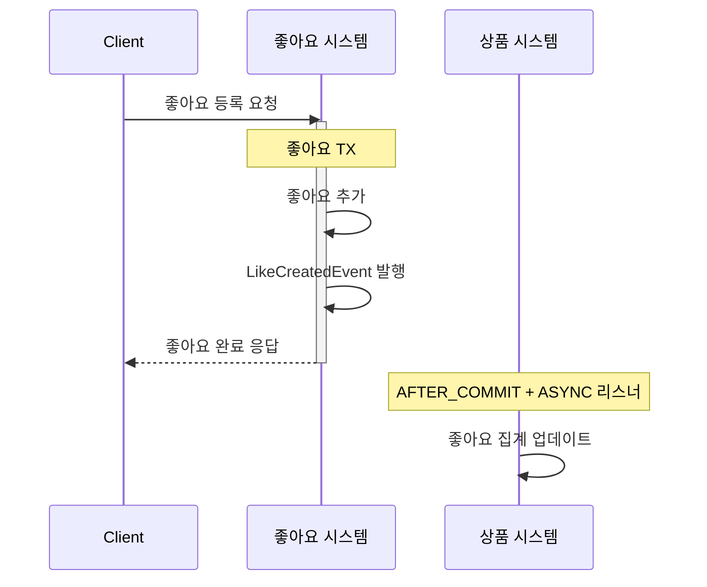

# 솔루션 설계 문서

## 1. 설계 컨텍스트

### 1.1 핵심 해결 과제

현재 주문-결제, 좋아요-집계 로직이 하나의 트랜잭션에 강하게 결합되어 있어 다음과 같은 문제가 발생한다.

- 외부 I/O(PG 결제 등)가 메인 트랜잭션에 포함되어 장애 전파 위험 존재
- 부가 로직(집계, 로깅 등) 실패 시 핵심 로직도 함께 롤백될 수 있음
- TX1(리소스 할당) → PG 결제 요청이 동기 결합되어 사용자 응답이 블로킹됨
- 리소스 복구 로직이 동기로 처리되어 복구 실패 시 전체 요청에 영향

이벤트 기반으로 주요 로직과 부가 로직의 트랜잭션 경계를 분리하여 시스템 안정성과 응답성을 향상시킨다.

### 1.2 현재 아키텍처 영향

- Kotlin + Spring Boot 멀티모듈 모놀리식 프로젝트
- Application Layer의 Service(단일 도메인) + Facade(도메인 간 오케스트레이션) 구조
- 도메인 간 동기적 함수 호출로 통신
- 물리적 트랜잭션으로 도메인 간 일관성 보장
- TransactionTemplate 기반 물리적 트랜잭션 관리
- 비관적 락을 사용한 동시성 제어 (포인트 차감, 재고 차감)
- 현재 이벤트 기반 패턴 미적용 (ApplicationEventPublisher, @TransactionalEventListener 미사용)
- Kafka 인프라 구축되어 있으나 commerce-api에서 미활용

### 1.3 기술 스택 개요

- 개발 언어: Kotlin (Spring Boot 프레임워크)
- 데이터베이스: PostgreSQL
- ORM: Spring Data JPA
- 배포 환경: Docker, AWS (싱글 인스턴스)
- 이벤트 처리: Spring Application Events (@TransactionalEventListener)

## 2. 솔루션 대안 분석

### 대안 1: Spring Application Events (@TransactionalEventListener)

- **설명**: Spring의 내장 이벤트 시스템을 활용하여 트랜잭션 커밋 전/후에 이벤트를 발행하고, 리스너에서 부가 로직을 처리
- **문제 해결 방식**:
    - TX1 커밋 후 AFTER_COMMIT 리스너에서 PG 결제 요청 처리
    - 결제 실패 시 BEFORE_COMMIT 리스너에서 각 도메인별 리소스 복구
    - 좋아요 집계는 AFTER_COMMIT + ASYNC로 비동기 처리
- **장점**:
    - 기존 인프라 변경 없이 즉시 적용 가능
    - Spring 내장 기능으로 학습 비용 낮음
    - 단일 애플리케이션 내에서 간단하게 구현 가능
    - @Async와 조합하여 비동기 처리 용이
- **단점**:
    - 서버 다운 시 메모리에 있던 이벤트 유실 가능
    - 멀티 인스턴스 환경에서 이벤트가 발행된 인스턴스에서만 처리
    - 이벤트 재처리(retry) 메커니즘 직접 구현 필요
- **아키텍처 영향**:
    - commerce-api 내에 이벤트 클래스와 리스너 추가
    - 기존 모듈 구조 변경 없음

### 대안 2: Kafka 기반 이벤트 발행

- **설명**: 기존 Kafka 인프라를 활용하여 도메인 이벤트를 Kafka 토픽으로 발행하고, commerce-streamer에서 처리
- **문제 해결 방식**:
    - TX1 커밋 후 KafkaTemplate으로 order-created 토픽에 메시지 발행
    - commerce-streamer에서 PG 결제 요청 처리
    - 결제 결과도 Kafka를 통해 후속 처리
- **장점**:
    - 메시지 영속성 보장으로 이벤트 유실 위험 낮음
    - 멀티 인스턴스 환경에서 컨슈머 그룹으로 부하 분산 가능
    - 재처리, 모니터링 등 운영 도구 풍부
- **단점**:
    - 트랜잭션 커밋과 Kafka 발행 사이 원자성 미보장
    - 네트워크 레이턴시로 인한 지연 발생
    - commerce-api에 Kafka 의존성 추가 필요
    - 현재 싱글 인스턴스 환경에서 과한 복잡도
- **아키텍처 영향**:
    - commerce-api에 Kafka Producer 설정 추가
    - commerce-streamer에 비즈니스 로직 컨슈머 추가
    - 서비스 간 의존성 증가

### 대안 3: Transactional Outbox Pattern + Kafka

- **설명**: 이벤트를 같은 트랜잭션 내에서 Outbox 테이블에 저장하고, 별도 프로세스가 Kafka로 발행
- **문제 해결 방식**:
    - 도메인 트랜잭션과 이벤트 저장이 원자적으로 처리
    - Debezium CDC 또는 Polling 방식으로 Outbox 테이블을 읽어 Kafka로 발행
- **장점**:
    - 트랜잭션과 이벤트 발행의 원자성 보장 (At-least-once delivery)
    - 이벤트 유실이 구조적으로 방지
    - 감사 로그로도 활용 가능
- **단점**:
    - Outbox 테이블 및 발행 프로세스 구현 필요
    - CDC 도구(Debezium) 도입 시 인프라 복잡도 증가
    - 현재 요구사항 대비 과도한 복잡도
- **아키텍처 영향**:
    - 새로운 Outbox 테이블 및 관련 인프라 필요
    - CDC 도입 시 추가 인프라 운영 부담

## 3. 선택된 솔루션

### 3.1 결정 요약

**대안 1: Spring Application Events (@TransactionalEventListener)**를 선택한다.

**선택 이유**:

1. 팀의 "ROI 중심" 및 "실용주의" 가치에 부합
    - 기존 Spring 인프라만으로 즉시 구현 가능
    - 싱글 인스턴스 환경에서 Kafka 등 외부 의존성 추가는 오버엔지니어링
2. 적절한 복잡도
    - 현재 트래픽 수준에서 메시지큐의 영속성 보장은 과한 요구사항
    - 이미 트랜잭션이 분리된 상태에서 OOM 등으로 끊기면 어차피 끊기는 상황
    - 이벤트 리스너 시작/끝 로깅으로 모니터링 가능
3. 확장 가능성 확보
    - 향후 트래픽 증가 시 이벤트 발행 부분만 Kafka로 교체 가능
    - 리스너 로직은 재사용 가능
4. 학습 비용 최소화
    - Spring 내장 기능으로 팀원들이 쉽게 이해하고 유지보수 가능

**알려진 리스크 및 대응 계획**:

Spring Event는 인메모리 방식이므로 OOM 등으로 인한 서버 다운 시 이벤트가 유실되어 자원(재고/포인트/쿠폰)이 PENDING 상태로 잠길 수 있다. 현재는 발생 가능성이 낮고 이벤트 리스너의 시작/끝 로깅으로 모니터링하되, 추후 해당 이슈 발생 시 **일정 시간 이상 PENDING 상태인 자원을 정리하는 Recovery Batch를 도입**하여 해결한다.

### 3.2 솔루션 구조

#### 핵심 아키텍처 컴포넌트

**1. 주문 시스템**

- 주문 접수 및 생성
- 주문 완료/취소 상태 관리
- OrderCreatedEvent, OrderCanceledEvent 발행
- PaymentFailedEvent 구독하여 주문 취소 처리

**2. 결제 시스템**

- PENDING 결제 생성
- PG 결제 생성(준비) 요청 및 IN_PROGRESS 전환
- 콜백 처리 및 PAID/FAILED 전환
- PaymentCreatedEvent, PaymentFailedEvent, PaymentPaidEvent 발행

**3. 상품 시스템**

- 재고 차감 및 복구
- 상품 가격 정보 제공
- OrderCreatedEvent 구독하여 재고 차감
- OrderCanceledEvent 구독하여 재고 복구

**4. 포인트 시스템**

- 포인트 차감 및 복구
- PaymentFailedEvent 구독하여 포인트 복구

**5. 쿠폰 시스템**

- 쿠폰 사용 및 복구
- PaymentFailedEvent 구독하여 쿠폰 복구

**6. 좋아요 시스템**

- 좋아요 등록/취소
- LikeCreatedEvent, LikeCanceledEvent 발행
- 이벤트 리스너에서 집계 업데이트

#### 이벤트 설계

**주문-결제 플로우 (결제 등록)**

| 이벤트 | 발행 시점 | 리스너 타입 | 처리 내용 |
|--------|-----------|-------------|-----------|
| `OrderCreatedEvent` | TX1 내 (주문 생성 후) | BEFORE_COMMIT | 재고 차감 (상품 시스템) |
| `PaymentCreatedEvent` | TX1 내 (결제 생성 후) | AFTER_COMMIT | PG 결제 생성 요청 (결제 시스템) |
| `PaymentFailedEvent` | TX2 내 (PG 요청 실패 시) | BEFORE_COMMIT | 포인트/쿠폰 복구, 주문 취소 |
| `OrderCanceledEvent` | TX2 내 (주문 취소 시) | BEFORE_COMMIT | 재고 복구 (상품 시스템) |

**결제 콜백 플로우**

| 이벤트 | 발행 시점 | 리스너 타입 | 처리 내용 |
|--------|-----------|-------------|-----------|
| `PaymentPaidEvent` | 콜백 TX 내 (성공 시) | AFTER_COMMIT + ASYNC | 주문 완료, 데이터 플랫폼 전송 |
| `PaymentFailedEvent` | 콜백 TX 내 (실패 시) | BEFORE_COMMIT | 포인트/쿠폰 복구, 주문 취소 |
| `OrderCanceledEvent` | 콜백 TX 내 (주문 취소 시) | BEFORE_COMMIT | 재고 복구 (상품 시스템) |

**좋아요-집계 플로우**

| 이벤트 | 발행 시점 | 리스너 타입 | 처리 내용 |
|--------|-----------|-------------|-----------|
| `LikeCreatedEvent` / `LikeCanceledEvent` | 좋아요 TX 내 | AFTER_COMMIT + ASYNC | 좋아요 집계 업데이트 |

**공통**

| 이벤트 | 발행 시점 | 리스너 타입 | 처리 내용 |
|--------|-----------|-------------|-----------|
| 유저 행동 이벤트 | 각 TX 내 | AFTER_COMMIT + ASYNC | 행동 로깅 |

#### 데이터 흐름

**1. 주문 생성 및 결제 등록 플로우**

**2. PG 콜백 처리 플로우**

**3. 좋아요 처리 플로우**

