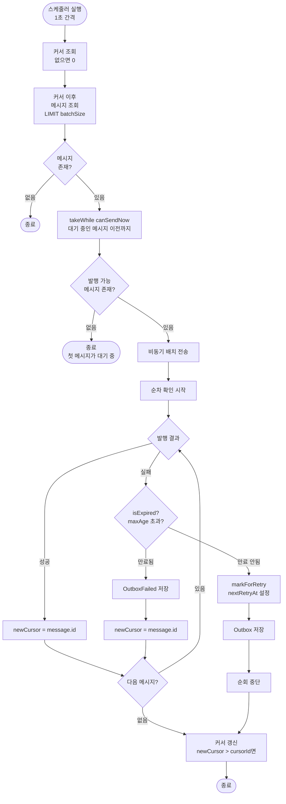
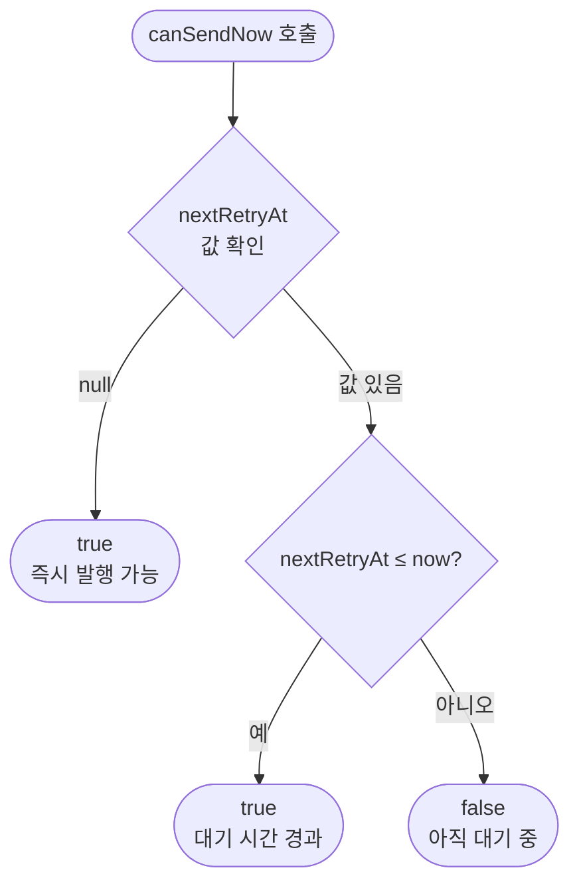
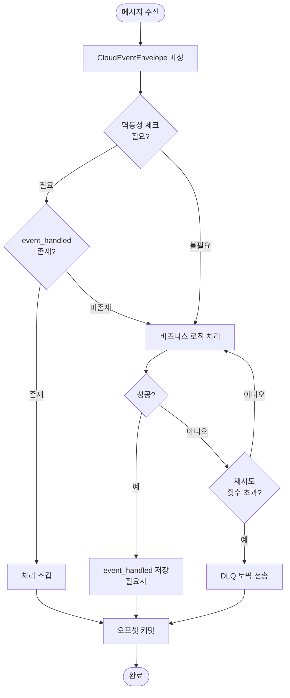

# Kafka 기반 이벤트 파이프라인 상세 설계 문서

> **Round 8**: Transactional Outbox Pattern + Kafka Consumer

---

## 1. 이벤트 아키텍처 설계

### 1.1 모델 격리 전략 (Two-Envelope Strategy)

**"도메인은 인프라(Kafka/JSON)를 몰라야 한다"**는 대원칙을 지키기 위해 봉투(Envelope)를 두 계층으로 분리한다.

| 계층                     | 역할                        | 특징                               |
|------------------------|---------------------------|----------------------------------|
| **Domain Event**       | 순수 비즈니스 사실 표현             | 인프라 의존성 없음, 애플리케이션 내부 표준 객체      |
| **CloudEventEnvelope** | Kafka 발행/Outbox 저장용 전송 봉투 | CloudEvents 스펙 참고, 실용성 위해 커스터마이징 |

**분리의 이점:**

- 향후 JSON을 Avro나 Protobuf로 교체해도 도메인 로직 수정 불필요
- 도메인 로직 테스트 시 무거운 직렬화 객체 없이 간단한 객체로 테스트 가능

### 1.2 Domain Event 설계

Domain Event는 "무슨 일이 일어났는가"만 순수하게 표현한다.

`eventType`(예: `loopers.order.paid.v1`)이나 `topic`(예: `order-events`)은 인프라 관심사이므로 Domain Event가 알 필요가 없다.

**Domain Event 목록:**

| 이벤트                  | 페이로드                       | 발생 시점      |
|----------------------|----------------------------|------------|
| OrderPaidEventV1     | orderId, paymentId, amount | 주문 결제 완료 시 |
| LikeCreatedEventV1   | userId, productId          | 상품 좋아요 시   |
| LikeCanceledEventV1  | userId, productId          | 좋아요 취소 시   |
| ProductViewedEventV1 | productId, userId          | 상품 조회 시    |
| StockDepletedEventV1 | productId                  | 재고 소진 시    |

### 1.3 CloudEventEnvelope 설계

메시지를 담는 "택배 상자"로, CloudEvents 스펙을 참고하되 실용성을 위해 커스터마이징했다.

| 필드              | 포맷                                   | 예시                      | 설명                |
|-----------------|--------------------------------------|-------------------------|-------------------|
| `id`            | UUID                                 | `550e8400-e29b-...`     | 이벤트 고유 식별자        |
| `type`          | `{company}.{domain}.{action}.v{ver}` | `loopers.order.paid.v1` | 이벤트 타입 및 버전       |
| `source`        | `{application-name}`                 | `commerce-api`          | 발행 서비스명           |
| `aggregateType` | `{Domain}`                           | `Order`                 | Aggregate Root 타입 |
| `aggregateId`   | `{id}`                               | `123`                   | Aggregate Root ID |
| `time`          | ISO 8601                             | `2024-01-15T10:30:00Z`  | 이벤트 발생 시각         |
| `payload`       | JSON                                 | `{"orderId": 123, ...}` | 직렬화된 이벤트 데이터      |

> `correlationId`는 현재 YAGNI 원칙에 따라 제외. 비즈니스 플로우 추적이 필요해지면 추가 예정.

### 1.4 이벤트 타입 및 토픽 결정

이벤트 타입에서 토픽을 컨벤션 기반으로 도출한다:

```
loopers.order.paid.v1 → order-events
loopers.like.created.v1 → like-events
loopers.product.viewed.v1 → product-events
```

**토픽 목록:**

| 토픽명            | 파티션 수 | 포함 이벤트                                  |
|----------------|-------|-----------------------------------------|
| order-events   | 3     | OrderPaidEventV1                        |
| like-events    | 3     | LikeCreatedEventV1, LikeCanceledEventV1 |
| product-events | 3     | ProductViewedEventV1                    |
| stock-events   | 3     | StockDepletedEventV1                    |

> **⚠️ 토픽 관리 방침**
>
> 이 프로젝트에서는 애플리케이션 코드 내에서 토픽을 생성하지 않는다.
> 토픽 생성 및 설정(파티션 수, 리텐션 등)은 별도의 인프라 관리 도구에서 수행할 예정이다.
> - 개발 환경: docker-compose 또는 Kafka CLI로 수동 생성
> - 운영 환경: IaC(Terraform, Strimzi Operator 등) 또는 Kafka 관리 콘솔에서 관리

---

## 2. 시스템 플로우차트

### 2.1 Producer: 순서 보장 Relay 플로우

> **핵심 원칙**: 실패한 메시지 이후의 메시지는 해당 메시지가 성공하거나 만료될 때까지 발행되지 않음 (HOL blocking)



### 2.2 canSendNow 판단 로직



### 2.3 Consumer: 이벤트 처리 플로우



---

## 3. 데이터 모델 설계

### 3.1 테이블 구조

#### outbox 테이블 (Append-only)

| 컬럼             | 타입           | 설명                                         |
|----------------|--------------|---------------------------------------------|
| id             | BIGSERIAL    | PK, 발행 순서 보장용                               |
| event_id       | VARCHAR(36)  | CloudEvent ID (UUID)                        |
| event_type     | VARCHAR(100) | 이벤트 타입 (예: `loopers.order.paid.v1`)        |
| source         | VARCHAR(50)  | 발행 서비스명 (예: `commerce-api`)                |
| aggregate_type | VARCHAR(50)  | Aggregate 타입 (예: `Order`)                   |
| aggregate_id   | VARCHAR(50)  | Aggregate ID (Kafka 파티션 키)                  |
| payload        | TEXT         | JSON 직렬화된 이벤트 데이터                          |
| next_retry_at  | TIMESTAMPTZ  | null이면 즉시 발행 가능, 값이 있으면 해당 시각 이후 발행 |
| created_at     | TIMESTAMPTZ  | 생성 시각                                      |

#### outbox_cursor 테이블

| 컬럼                | 타입          | 설명                |
|-------------------|-------------|-------------------|
| id                | INT         | PK (항상 1)         |
| last_processed_id | BIGINT      | 마지막 처리된 outbox.id |
| updated_at        | TIMESTAMPTZ | 갱신 시각             |

#### outbox_failed 테이블 (영구 실패 기록용)

> **역할 변경**: 재시도 대상이 아닌 영구 보관용으로 변경. 모니터링/알림 용도로 사용.

| 컬럼             | 타입           | 설명              |
|----------------|--------------|-----------------|
| id             | BIGSERIAL    | PK              |
| event_id       | VARCHAR(36)  | CloudEvent ID   |
| event_type     | VARCHAR(100) | 이벤트 타입          |
| source         | VARCHAR(50)  | 발행 서비스명         |
| aggregate_type | VARCHAR(50)  | Aggregate 타입    |
| aggregate_id   | VARCHAR(50)  | Aggregate ID    |
| payload        | TEXT         | JSON 페이로드       |
| error_message  | TEXT         | 마지막 에러 메시지      |
| failed_at      | TIMESTAMPTZ  | 실패 시각           |

#### event_handled 테이블 (멱등성 보장)

| 컬럼              | 타입           | 설명                                     |
|-----------------|--------------|----------------------------------------|
| id              | BIGSERIAL    | PK                                     |
| idempotency_key | VARCHAR(100) | `{consumerGroup}:{eventId}` 형식, UNIQUE |
| created_at      | TIMESTAMPTZ  | 처리 시각                                  |

### 3.2 인덱스 전략

| 테이블           | 인덱스                        | 용도       |
|---------------|----------------------------|----------|
| event_handled | UNIQUE `(idempotency_key)` | 중복 처리 방지 |

> - PK, UNIQUE 제약조건의 자동 생성 인덱스는 별도 명시하지 않음
> - outbox_failed는 재시도 대상이 아니므로 별도 인덱스 불필요

---

## 4. Consumer 설계

### 4.1 Consumer 그룹 구성

| Consumer                  | 구독 토픽          | 역할             |
|---------------------------|----------------|----------------|
| ProductLikeEventConsumer  | like-events    | 상품 좋아요 수 집계    |
| ProductOrderEventConsumer | order-events   | 상품 판매량 집계      |
| ProductViewEventConsumer  | product-events | 상품 조회수 집계      |
| ProductStockEventConsumer | stock-events   | 재고 소진 시 캐시 무효화 |

### 4.2 멱등성 처리 전략

| Consumer                  | 멱등성 방식            | 이유                  |
|---------------------------|-------------------|---------------------|
| ProductOrderEventConsumer | event_handled 테이블 | 판매량 중복 집계 방지 필수     |
| ProductViewEventConsumer  | event_handled 테이블 | 조회수 중복 집계 방지 필수     |
| ProductLikeEventConsumer  | 배치 내 중복 제거만       | DB UPSERT로 최종 상태 보장 |
| ProductStockEventConsumer | 없음                | 캐시 무효화는 동작 자체가 멱등   |

### 4.3 에러 처리

- **재시도**: DefaultErrorHandler로 최대 3회 재시도 (1초 간격)
- **DLQ**: 재시도 실패 시 `{원본토픽}.DLT` 토픽으로 전송
- **DLQ 토픽**: `order-events.DLT`, `like-events.DLT`, `product-events.DLT`, `stock-events.DLT`

---

## 5. 운영 계획

### 5.1 로깅 전략

| 상황           | 레벨    | 로그 포맷                                              |
|--------------|-------|----------------------------------------------------|
| 릴레이 완료       | INFO  | `[OutboxRelayScheduler] relay completed: success={}, failed={}, lastOffset={}` |
| 메시지 만료       | WARN  | `Message expired: id={}, createdAt={}, moving to failed` |
| 재시도 예약       | INFO  | `Message marked for retry: id={}, nextRetryAt={}`  |
| 멱등성 스킵       | DEBUG | `Event already handled: type={}, id={}, action={}` |
| DLQ 전송       | WARN  | `Sending to DLQ: topic={}, error={}`               |

> 평상시 활동이 있을 때만 INFO 로그 기록. 만료 시 WARN 레벨로 알림.

### 5.2 OutboxRelayProperties 설정

```yaml
outbox:
  relay:
    batch-size: 100              # 한 번에 조회할 메시지 수
    send-timeout-seconds: 5      # Kafka 전송 타임아웃
    retry-interval-seconds: 10   # 실패 시 재시도 대기 시간
    max-age-minutes: 5           # 메시지 만료 시간 (이후 OutboxFailed로 이동)
```

| 설정                     | 기본값  | 설명                                |
|------------------------|------|-----------------------------------|
| batch-size             | 100  | 한 번에 조회할 메시지 수                    |
| send-timeout-seconds   | 5    | Kafka 전송 타임아웃 (초)                 |
| retry-interval-seconds | 10   | 실패 시 재시도 대기 시간 (초)                |
| max-age-minutes        | 5    | 메시지 만료 시간 (분), 이후 OutboxFailed로 이동 |

### 5.3 Kafka 설정 요약

**Producer:**

- `acks=all`: 모든 replica 복제 확인
- `enable.idempotence=true`: 중복 발행 방지
- `retries=3`: 프레임워크 레벨 재시도

**Consumer:**

- `enable-auto-commit=false`: 수동 오프셋 관리
- `auto-offset-reset=latest`: 오프셋 유실 시 최신부터
- `max-poll-records=100`: 배치 사이즈

**Broker:**

- `min.insync.replicas=2`: 최소 2개 replica 복제 보장

### 5.4 주요 실패 시나리오 및 대응 계획

| 실패 시나리오            | 대응 방안                                                           | 기대 효과                     |
|--------------------|----------------------------------------------------------------|---------------------------|
| Kafka 브로커 일시 장애    | 메시지에 nextRetryAt 설정 (10초 후) → 다음 스케줄에서 재시도                       | 순서 보장하며 자동 복구             |
| 개별 메시지 발행 실패       | nextRetryAt 설정 → Outbox 테이블에서 직접 재시도                            | 실패 메시지 유실 방지, 순서 보장       |
| 5분 경과 후에도 실패       | OutboxFailed로 이동 → 커서 진행 → 후속 메시지 처리 재개                         | HOL blocking 해소, 모니터링 용이  |
| 순서 보장 필요 (HOL)     | 실패 메시지 이후 메시지는 대기 → 성공 또는 만료 시 처리                               | 동일 aggregate 이벤트 순서 보장    |
| 분산 환경 동시 실행        | @SchedulerLock으로 단일 인스턴스만 실행                                    | 중복 발행 방지                  |
| Consumer 처리 실패     | DefaultErrorHandler 재시도 후 DLQ 토픽 전송                             | 정상 메시지 처리 지속, 실패 메시지 격리   |
| Consumer 멱등성 체크 실패 | 예외 발생 → 재시도 → DLQ                                               | 데이터 정합성 보호                |

---

## 6. 설계 결정 공유

### 6.1 이벤트 아키텍처 결정

| 설계 결정                           | 근거                                                   |
|---------------------------------|------------------------------------------------------|
| Two-Envelope 전략                 | 도메인은 인프라를 몰라야 함. 직렬화 포맷 변경 시 도메인 코드 수정 불필요. 테스트 용이   |
| topic을 DB에 저장하지 않음              | event_type에서 파생 가능. 저장 공간 절약, 컨벤션 기반 일관성 유지          |
| partitionKey로 aggregateId 직접 사용 | 별도 메서드 없이 단순하게. 대부분의 경우 적합                           |
| correlationId 제외 (YAGNI)        | 현재 불필요. 필요 시 추가 예정                                   |
| JSON 직렬화                        | 초기 단계 디버깅 용이, 스키마 관리 오버헤드 감소. 성능 이슈 시 Protobuf 전환 가능 |

### 6.2 Outbox 패턴 결정

| 설계 결정                  | 근거                                                                |
|------------------------|-------------------------------------------------------------------|
| 순서 보장 (HOL blocking)   | Debezium 스타일. 실패 메시지 이후 메시지는 대기 → 동일 aggregate 이벤트 순서 보장         |
| 시간 기반 만료 (maxAge)      | 5분 경과 시 OutboxFailed로 이동 → HOL blocking 해소, 후속 메시지 처리 재개         |
| Outbox에서 직접 재시도        | 실패 시 nextRetryAt 설정 → OutboxFailed 분리 없이 간단한 재시도 로직             |
| 단일 스케줄러 (1초 간격)        | 2개 스케줄러 → 1개로 통합. 복잡도 감소, 순서 보장 로직 단순화                          |
| 비동기 배치 전송 + 순차 확인      | 병렬 전송으로 성능 확보, 순차 확인으로 순서 보장 양립                                 |
| 커서 기반 추적 + Append-only | 상태 컬럼 방식 대비 단순. UPDATE 최소화 (nextRetryAt만), 락 경합 감소              |
| OutboxFailed 영구 보관     | 재시도 대상 아님. 모니터링/알림 용도로만 사용, 수동 개입 필요 시 활용                       |
| @ConfigurationProperties | 시간 관련 값 외부화 → 환경별 설정 변경 용이, 테스트에서 짧은 값 사용 가능                   |

### 6.3 Consumer 결정

| 설계 결정                    | 근거                                                      |
|--------------------------|---------------------------------------------------------|
| Consumer 서킷브레이커 제거       | DefaultErrorHandler가 재시도/DLQ 처리. Kafka 다운 시 애초에 수신 불가   |
| auto.offset.reset=latest | 오프셋 유실은 7일 이상 미사용 의미. earliest로 대량 재처리 자동 시작은 위험        |
| 멱등성 체크 이벤트별 차별화          | 판매량/조회수만 event_handled 사용. 좋아요는 UPSERT, 캐시무효화는 동작 자체 멱등 |
| idempotency_key 단일 컬럼    | `{consumerGroup}:{eventId}` 형식으로 단순화                    |
| Consumer 이벤트 유형별 분리      | 단일 책임 원칙, 독립적 스케일링 가능                                   |
| event_handled 7일 보관      | Kafka retention(7일) 이후 같은 이벤트 재수신 불가. 그 이상 보관 불필요       |
| DLQ 토픽별 분리               | 실패 이벤트 유형 명확 구분, 독립적 재처리 가능                             |
| 토픽 파티션 수 3개              | 보수적 시작. 파티션은 늘릴 수 있지만 줄일 수 없음                           |
| min.insync.replicas=2    | acks=all과 함께 최소 2개 replica 보장. 1개 브로커 장애까지 허용           |