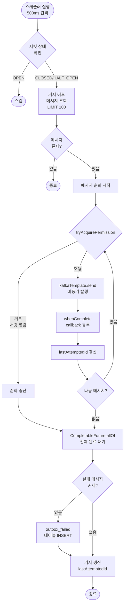
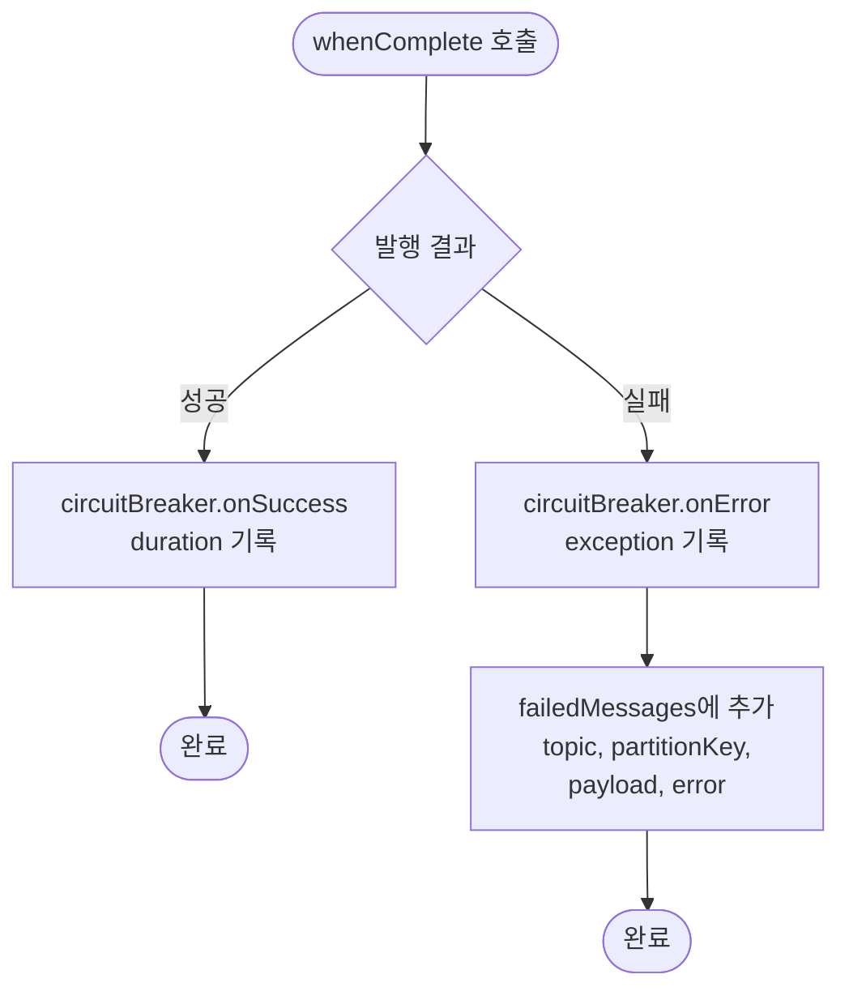
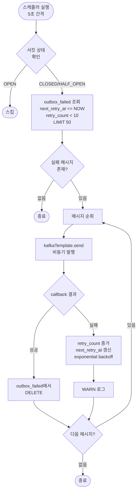
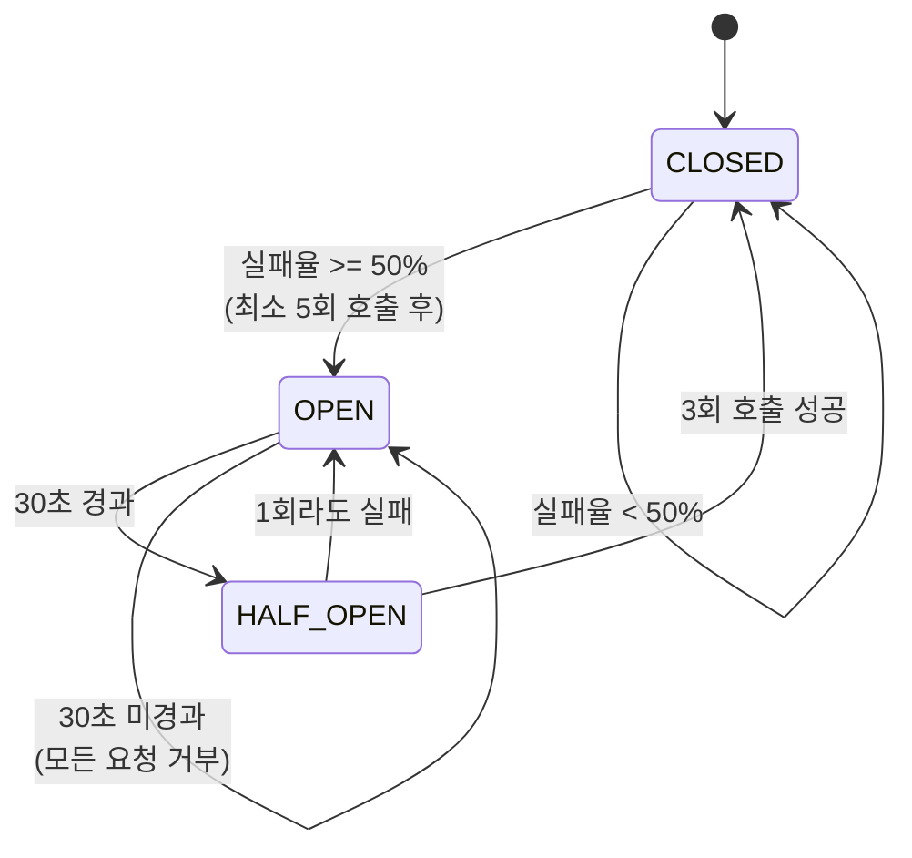
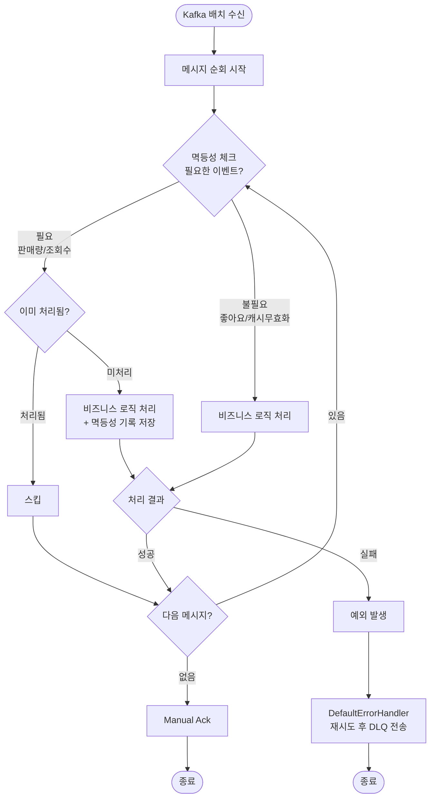
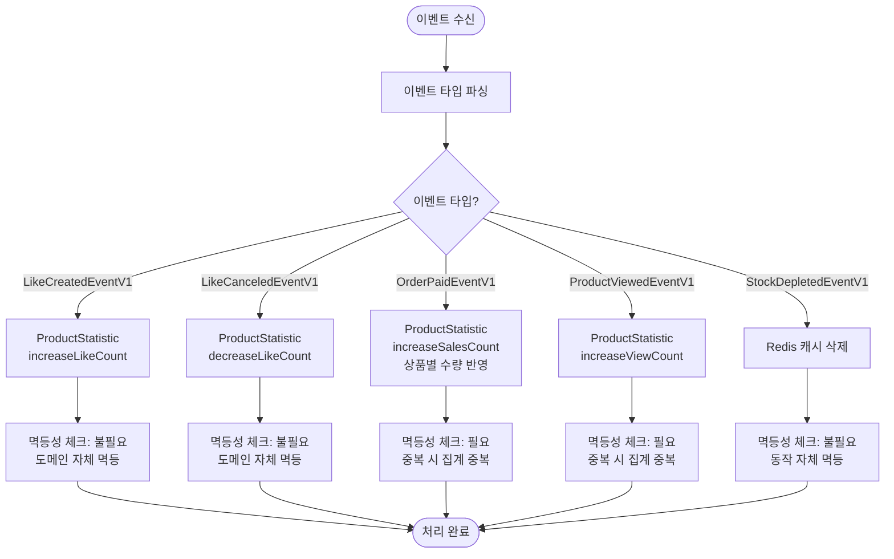

# Kafka 기반 이벤트 파이프라인 상세 설계 및 구현 계획 문서

> **Round 8**: Transactional Outbox Pattern + Kafka Consumer

## 1. 이벤트 아키텍처 설계

### 1.1 모델 격리 전략 (Two-Envelope Strategy)

**"도메인은 인프라(Kafka/JSON)를 몰라야 한다"**는 대원칙을 지키기 위해 봉투(Envelope)를 두 계층으로 분리한다.

**Domain Event (Kotlin Data Class)**는 순수 비즈니스 사실만 표현하며, 인프라 의존성이 없다. 애플리케이션 내부에서 사용하는 표준 객체이다.

**CloudEventEnvelope (Transport Envelope)**는 Kafka로 발행하거나 Outbox DB에 저장할 때 사용하는 전송용 봉투이다.

이렇게 분리하면 향후 JSON을 Avro나 Protobuf로 교체하더라도 도메인 로직은 수정할 필요가 없고, 도메인 로직 테스트 시 무거운 직렬화 객체 없이 간단한 Kotlin 객체로 테스트 가능하다.

### 1.2 Domain Event 설계

Domain Event는 "무슨 일이 일어났는가"만 순수하게 표현한다. `eventType`(예: `loopers.order.created.v1`)이나 `topic`(예: `order-events`)은 인프라 관심사이므로 Domain Event가 알 필요가 없다.

```kotlin
// support/event/DomainEvent.kt
sealed interface DomainEvent {
    val occurredAt: Instant
}

// domain/order/OrderCreatedEventV1.kt
data class OrderCreatedEventV1(
    val orderId: Long,
    val userId: Long,
    val totalAmount: Long,
    override val occurredAt: Instant = Instant.now(),
) : DomainEvent

// domain/payment/PaymentPaidEventV1.kt
data class PaymentPaidEventV1(
    val paymentId: Long,
    val orderId: Long,
    val amount: Long,
    override val occurredAt: Instant = Instant.now(),
) : DomainEvent

// domain/like/LikeCreatedEventV1.kt
data class LikeCreatedEventV1(
    val userId: Long,
    val productId: Long,
    override val occurredAt: Instant = Instant.now(),
) : DomainEvent

// domain/product/ProductViewedEventV1.kt
data class ProductViewedEventV1(
    val productId: Long,
    val userId: Long,
    override val occurredAt: Instant = Instant.now(),
) : DomainEvent
```

`sealed interface`를 사용하면 `EventTypeResolver`에서 `when` 표현식 사용 시 새 이벤트 추가를 누락하면 컴파일 에러가 발생하여 안전하다.

### 1.3 CloudEventEnvelope 설계

메시지를 담는 "택배 상자"로, CloudEvents 스펙을 참고하되 실용성을 위해 커스터마이징했다.

```kotlin
// support/outbox/CloudEventEnvelope.kt
data class CloudEventEnvelope(
    /** 이벤트 식별자 (UUID) */
    val id: String,
    
    /** 이벤트 타입 - "{company}.{domain}.{action}.v{version}" */
    val type: String,
    
    /** 이벤트 발행 서비스 (application name) */
    val source: String,
    
    /** Aggregate 타입 (예: Order, Payment) */
    val aggregateType: String,
    
    /** Aggregate ID */
    val aggregateId: String,
    
    /** 이벤트 발생 시각 */
    val time: Instant,
    
    /** 직렬화된 이벤트 페이로드 (JSON) */
    val payload: String,
)
```

**필드 설명:**

| 필드 | 포맷 | 예시 | 설명 |
|-----|------|-----|------|
| `id` | UUID | `550e8400-e29b-41d4-a716-446655440000` | 이벤트 고유 식별자 |
| `type` | `{company}.{domain}.{action}.v{ver}` | `loopers.order.created.v1` | 이벤트 타입 및 버전 |
| `source` | `{application-name}` | `commerce-api` | Spring `application.name`과 일치 |
| `aggregateType` | `{Domain}` | `Order` | Aggregate Root 타입 |
| `aggregateId` | `{id}` | `123` | Aggregate Root ID |

`correlationId`는 현재 YAGNI 원칙에 따라 제외했다. 비즈니스 플로우 추적이 필요해지면 추가할 예정이다.

### 1.4 Resolver 및 Factory

`eventType`과 `topic` 결정은 Resolver 클래스에서 담당한다.

#### EventTypeResolver

Domain Event 클래스를 eventType 문자열로 매핑한다. `sealed interface` + `when`으로 새 이벤트 추가 시 컴파일 타임 검증이 가능하다.

```kotlin
// support/outbox/EventTypeResolver.kt
object EventTypeResolver {
    fun resolve(event: DomainEvent): String = when (event) {
        // Order
        is OrderCreatedEventV1 -> "loopers.order.created.v1"
        is OrderCanceledEventV1 -> "loopers.order.canceled.v1"
        // Payment
        is PaymentCreatedEventV1 -> "loopers.payment.created.v1"
        is PaymentPaidEventV1 -> "loopers.payment.paid.v1"
        is PaymentFailedEventV1 -> "loopers.payment.failed.v1"
        // Like
        is LikeCreatedEventV1 -> "loopers.like.created.v1"
        is LikeCanceledEventV1 -> "loopers.like.canceled.v1"
        // Product
        is ProductViewedEventV1 -> "loopers.product.viewed.v1"
    }
}
```

#### TopicResolver

eventType에서 topic을 도출한다. 컨벤션 기반으로 매핑 테이블 없이 동작한다.

```kotlin
// support/outbox/TopicResolver.kt
object TopicResolver {
    // loopers.order.created.v1 → order-events
    // loopers.payment.paid.v1 → payment-events
    fun resolve(eventType: String): String {
        val domain = eventType.split(".").getOrNull(1)
            ?: throw IllegalArgumentException("Invalid event type format: $eventType")
        return "$domain-events"
    }
}
```

#### CloudEventEnvelopeFactory

Domain Event를 CloudEventEnvelope로 변환한다. ObjectMapper 의존성이 있으므로 infrastructure 레이어에 위치한다.

```kotlin
// infrastructure/outbox/CloudEventEnvelopeFactory.kt
@Component
class CloudEventEnvelopeFactory(
    @Value("\${spring.application.name}")
    private val source: String,
    private val objectMapper: ObjectMapper,
) {
    fun create(
        event: DomainEvent,
        aggregateType: String,
        aggregateId: String,
    ): CloudEventEnvelope {
        val eventType = EventTypeResolver.resolve(event)
        
        return CloudEventEnvelope(
            id = UUID.randomUUID().toString(),
            type = eventType,
            source = source,
            aggregateType = aggregateType,
            aggregateId = aggregateId,
            time = event.occurredAt,
            payload = objectMapper.writeValueAsString(event),
        )
    }
}
```

## 2. 시스템 플로우차트

### 2.1 Producer: 메인 릴레이 플로우



### 2.2 Producer: Callback 처리 플로우



### 2.3 Producer: 실패 재처리 플로우



### 2.4 Producer: 서킷브레이커 상태 전이



### 2.5 Consumer: 메인 처리 플로우



### 2.6 Consumer: 이벤트 타입별 처리 분기



---

## 3. 데이터 모델 설계

### 3.1 테이블 스키마

Outbox 관련 테이블들은 도메인 엔티티가 아닌 인프라 데이터이므로 BaseEntity를 상속하지 않고, 필요한 필드만 직접 정의한다.

#### outbox 테이블

CloudEventEnvelope 구조에 맞춰 설계하여, Kafka 발행 시 필요한 모든 메타데이터를 저장한다.

```sql
CREATE TABLE outbox (
    id BIGSERIAL PRIMARY KEY,
    event_id VARCHAR(36) NOT NULL,
    event_type VARCHAR(100) NOT NULL,
    source VARCHAR(100) NOT NULL,
    aggregate_type VARCHAR(100) NOT NULL,
    aggregate_id VARCHAR(255) NOT NULL,
    payload JSONB NOT NULL,
    created_at TIMESTAMPTZ NOT NULL DEFAULT NOW()
);
```

**컬럼 설명:**

- `id`: 메시지 순서 보장을 위한 PK (커서로 사용)
- `event_id`: 이벤트 고유 식별자 (UUID)
- `event_type`: 이벤트 타입 (예: `loopers.order.created.v1`)
- `source`: 발행 서비스명 (예: `commerce-api`)
- `aggregate_type`: 집계 루트 타입 (예: `Order`, `Payment`)
- `aggregate_id`: 집계 루트 ID (Kafka 파티션 키로도 사용)
- `payload`: 이벤트 페이로드 (JSON)
- `created_at`: 이벤트 발생 시각

`topic`은 `event_type`에서 파생 가능하므로 별도로 저장하지 않는다. (`loopers.order.created.v1` → `order-events`)

#### outbox_cursor 테이블

```sql
CREATE TABLE outbox_cursor (
    id BIGSERIAL PRIMARY KEY,
    last_processed_id BIGINT NOT NULL,
    created_at TIMESTAMPTZ NOT NULL DEFAULT NOW()
);

INSERT INTO outbox_cursor (last_processed_id) VALUES (0);
```

**컬럼 설명:**

- `id`: PK (BIGSERIAL)
- `last_processed_id`: 마지막으로 처리 시도한 outbox.id
- `created_at`: 생성 시각

Append-only 구조로 설계하여 UPDATE 없이 INSERT만 수행한다. 조회 시 `ORDER BY created_at DESC LIMIT 1`로 최신 커서를 가져온다. 히스토리가 보존되어 디버깅에 유용하고 락 경합이 제거된다.

#### outbox_failed 테이블

발행 실패한 메시지를 저장한다. CloudEventEnvelope의 모든 정보를 포함하여 재시도 시 outbox 재조회가 불필요하다.

```sql
CREATE TABLE outbox_failed (
    id BIGSERIAL PRIMARY KEY,
    event_id VARCHAR(36) NOT NULL,
    event_type VARCHAR(100) NOT NULL,
    source VARCHAR(100) NOT NULL,
    aggregate_type VARCHAR(100) NOT NULL,
    aggregate_id VARCHAR(255) NOT NULL,
    payload JSONB NOT NULL,
    retry_count INT NOT NULL DEFAULT 0,
    last_error TEXT,
    failed_at TIMESTAMPTZ NOT NULL DEFAULT NOW(),
    next_retry_at TIMESTAMPTZ NOT NULL DEFAULT NOW()
);
```

**컬럼 설명:**

- `id`: 실패 레코드 PK
- `event_id` ~ `payload`: CloudEventEnvelope 정보 전체 저장
- `retry_count`: 재시도 횟수
- `last_error`: 마지막 에러 메시지
- `failed_at`: 최초 실패 시각
- `next_retry_at`: 다음 재시도 가능 시각 (exponential backoff)

#### event_handled 테이블

```sql
CREATE TABLE event_handled (
    id BIGSERIAL PRIMARY KEY,
    aggregate_type VARCHAR(100) NOT NULL,
    aggregate_id VARCHAR(255) NOT NULL,
    action VARCHAR(100) NOT NULL,
    handled_at TIMESTAMPTZ NOT NULL DEFAULT NOW(),
    
    CONSTRAINT uk_event_handled UNIQUE (aggregate_type, aggregate_id, action)
);
```

**컬럼 설명:**

- `id`: PK
- `aggregate_type`: 집계 루트 타입 (예: `Order`, `ProductView`)
- `aggregate_id`: 집계 루트 ID
- `action`: 처리 액션 (예: `SALES_COUNT_INCREASED`, `VIEW_COUNT_INCREASED`)
- `handled_at`: 처리 시각

**멱등성 키 설계:**

| 이벤트 | aggregate_type | aggregate_id | action |
|-------|---------------|--------------|--------|
| OrderPaidEventV1 | `Order` | `{orderId}` | `SALES_COUNT_INCREASED` |
| ProductViewedEventV1 | `ProductView` | `{productId}_{eventId}` | `VIEW_COUNT_INCREASED` |

조회수의 경우 동일 상품을 여러 번 조회하면 각각 카운트되어야 하므로, `eventId`를 포함하여 구분한다.

#### product_statistic 테이블 (컬럼 추가)

```sql
ALTER TABLE product_statistic 
    ADD COLUMN sales_count BIGINT NOT NULL DEFAULT 0,
    ADD COLUMN view_count BIGINT NOT NULL DEFAULT 0;
```

기존 `like_count`에 `sales_count`, `view_count` 컬럼을 추가한다. DEFAULT 0이므로 기존 데이터에 영향 없다.

### 3.2 인덱스 전략

PK, UNIQUE 제약조건이 자동 생성하는 인덱스 외에 추가로 필요한 인덱스만 정의한다.

```sql
-- outbox_failed: 재시도 대상 조회용 부분 인덱스
CREATE INDEX idx_outbox_failed_retry 
    ON outbox_failed(next_retry_at) 
    WHERE retry_count < 10;

-- outbox_cursor: 최신 커서 조회용
CREATE INDEX idx_outbox_cursor_created_at 
    ON outbox_cursor(created_at DESC);
```

`idx_outbox_failed_retry`는 재시도 대상 조회 쿼리(`WHERE next_retry_at <= NOW() AND retry_count < 10`)를 위한 부분 인덱스이다. 재시도 포기된 레코드(retry_count >= 10)는 인덱스에서 제외되어 효율적이다.

### 3.3 데이터 보관 정책

| 테이블 | 보관 기간 | 정리 방식 |
|-------|----------|----------|
| outbox_cursor | 7일 | 배치 DELETE (최신 1건 제외) |
| event_handled | 7일 | 배치 DELETE |

Kafka retention이 7일이므로, 그 이후에는 같은 이벤트가 다시 올 일이 없다. 7일 이상 지난 레코드는 배치로 정리한다.

---

## 4. Kafka 설정

### 4.1 Producer 설정

| 설정 | 값 | 이유 |
|-----|-----|------|
| `acks` | `all` | 모든 ISR 복제 완료 후 응답, 메시지 유실 방지 |
| `enable.idempotence` | `true` | Producer 재시도 시 중복 방지 |
| `retries` | `3` | Kafka Producer 레벨 재시도 (이후 outbox_failed로) |
| `retry.backoff.ms` | `1000` | 재시도 간격 1초 |
| `delivery.timeout.ms` | `120000` | 전체 전송 타임아웃 2분 |
| `request.timeout.ms` | `30000` | 단일 요청 타임아웃 30초 |
| `max.in.flight.requests.per.connection` | `5` | idempotence=true일 때 최대값, 순서 보장 |
| `linger.ms` | `5` | 배치 대기 시간 5ms |

### 4.2 Consumer 설정

| 설정 | 값 | 이유 |
|-----|-----|------|
| `enable.auto.commit` | `false` | Manual ACK 사용 |
| `max.poll.records` | `100` | 한 번에 가져오는 최대 레코드 수 |
| `session.timeout.ms` | `30000` | 세션 타임아웃 30초 |
| `heartbeat.interval.ms` | `10000` | 하트비트 간격 (session.timeout의 1/3) |
| `max.poll.interval.ms` | `300000` | 처리 타임아웃 5분 |
| `auto.offset.reset` | `latest` | 오프셋 없으면 새 메시지부터, 과거 재처리는 수동 조정 |

### 3.3 브로커/토픽 레벨 설정

| 설정 | 값 | 이유 |
|-----|-----|------|
| 브로커 개수 | 3 | Replication Factor 3 충족, 1개 장애 허용 |
| `min.insync.replicas` | 2 | acks=all과 함께 최소 2개 replica 복제 보장 |
| `default.replication.factor` | 3 | 토픽 기본 복제 계수 |

### 3.4 Topic 설정

| 토픽 | 파티션 수 | Replication Factor | Retention | Partition Key |
|-----|----------|-------------------|-----------|---------------|
| `like-events` | 3 | 3 | 7일 | productId |
| `order-events` | 3 | 3 | 7일 | orderId |
| `product-view-events` | 3 | 3 | 7일 | productId |
| `stock-events` | 3 | 3 | 7일 | productId |
| `like-events.dlq` | 1 | 3 | 30일 | - |
| `order-events.dlq` | 1 | 3 | 30일 | - |
| `product-view-events.dlq` | 1 | 3 | 30일 | - |
| `stock-events.dlq` | 1 | 3 | 30일 | - |

파티션 수는 모든 토픽 3개로 통일했다. 초기에는 보수적으로 시작하고 필요 시 확장한다 (파티션은 늘릴 수 있지만 줄일 수 없음). DLQ는 토픽별로 분리하여 어떤 이벤트 유형이 실패했는지 명확히 구분하고, 재처리 시에도 독립적으로 처리 가능하다.

---

## 5. 구현 코드

### 5.1 Entity 클래스

Outbox 관련 Entity들은 도메인 엔티티가 아닌 이벤트 발행을 위한 인프라성 도메인이다. JPA 의존성이 있지만 "발행할 이벤트"라는 도메인적 의미가 있으므로 support 레이어에 위치한다.

#### Outbox Entity

CloudEventEnvelope 구조에 맞춰 모든 메타데이터를 저장한다.

```kotlin
// support/outbox/Outbox.kt
@Entity
@Table(name = "outbox")
class Outbox(
    @Id
    @GeneratedValue(strategy = GenerationType.IDENTITY)
    val id: Long = 0,

    @Column(name = "event_id", nullable = false, length = 36)
    val eventId: String,

    @Column(name = "event_type", nullable = false, length = 100)
    val eventType: String,

    @Column(name = "source", nullable = false, length = 100)
    val source: String,

    @Column(name = "aggregate_type", nullable = false, length = 100)
    val aggregateType: String,

    @Column(name = "aggregate_id", nullable = false)
    val aggregateId: String,

    @Column(name = "payload", nullable = false, columnDefinition = "jsonb")
    val payload: String,

    @Column(name = "created_at", nullable = false, updatable = false)
    val createdAt: Instant = Instant.now(),
) {
    companion object {
        fun from(envelope: CloudEventEnvelope): Outbox = Outbox(
            eventId = envelope.id,
            eventType = envelope.type,
            source = envelope.source,
            aggregateType = envelope.aggregateType,
            aggregateId = envelope.aggregateId,
            payload = envelope.payload,
            createdAt = envelope.time,
        )
    }
}
```

#### OutboxCursor Entity

```kotlin
// support/outbox/OutboxCursor.kt
@Entity
@Table(name = "outbox_cursor")
class OutboxCursor(
    @Id
    @GeneratedValue(strategy = GenerationType.IDENTITY)
    val id: Long = 0,

    @Column(name = "last_processed_id", nullable = false)
    val lastProcessedId: Long,

    @Column(name = "created_at", nullable = false, updatable = false)
    val createdAt: Instant = Instant.now(),
) {
    companion object {
        fun create(lastProcessedId: Long): OutboxCursor = OutboxCursor(
            lastProcessedId = lastProcessedId,
        )
    }
}
```

#### OutboxFailed Entity

CloudEventEnvelope의 모든 정보를 저장하여 재시도 시 outbox 재조회가 불필요하다.

```kotlin
// support/outbox/OutboxFailed.kt
@Entity
@Table(
    name = "outbox_failed",
    indexes = [
        Index(
            name = "idx_outbox_failed_retry",
            columnList = "next_retry_at",
        ),
    ],
)
class OutboxFailed(
    @Id
    @GeneratedValue(strategy = GenerationType.IDENTITY)
    val id: Long = 0,

    @Column(name = "event_id", nullable = false, length = 36)
    val eventId: String,

    @Column(name = "event_type", nullable = false, length = 100)
    val eventType: String,

    @Column(name = "source", nullable = false, length = 100)
    val source: String,

    @Column(name = "aggregate_type", nullable = false, length = 100)
    val aggregateType: String,

    @Column(name = "aggregate_id", nullable = false)
    val aggregateId: String,

    @Column(name = "payload", nullable = false, columnDefinition = "jsonb")
    val payload: String,

    @Column(name = "retry_count", nullable = false)
    var retryCount: Int = 0,

    @Column(name = "last_error", columnDefinition = "text")
    var lastError: String,

    @Column(name = "failed_at", nullable = false, updatable = false)
    val failedAt: Instant = Instant.now(),

    @Column(name = "next_retry_at", nullable = false)
    var nextRetryAt: Instant = Instant.now(),
) {
    /** Exponential backoff: 1초, 2초, 4초, 8초, ... 최대 5분 */
    fun incrementRetryCount(error: String) {
        retryCount++
        lastError = error
        val backoffSeconds = minOf(300L, 1L shl (retryCount - 1))
        nextRetryAt = Instant.now().plusSeconds(backoffSeconds)
    }

    companion object {
        fun from(outbox: Outbox, error: String): OutboxFailed = OutboxFailed(
            eventId = outbox.eventId,
            eventType = outbox.eventType,
            source = outbox.source,
            aggregateType = outbox.aggregateType,
            aggregateId = outbox.aggregateId,
            payload = outbox.payload,
            lastError = error,
        )
    }
}
```

#### EventHandled Entity

```kotlin
// support/outbox/EventHandled.kt
@Entity
@Table(
    name = "event_handled",
    uniqueConstraints = [
        UniqueConstraint(
            name = "uk_event_handled",
            columnNames = ["aggregate_type", "aggregate_id", "action"],
        ),
    ],
)
class EventHandled(
    @Id
    @GeneratedValue(strategy = GenerationType.IDENTITY)
    val id: Long = 0,

    @Column(name = "aggregate_type", nullable = false, length = 100)
    val aggregateType: String,

    @Column(name = "aggregate_id", nullable = false)
    val aggregateId: String,

    @Column(name = "action", nullable = false, length = 100)
    val action: String,

    @Column(name = "handled_at", nullable = false, updatable = false)
    val handledAt: ZonedDateTime = ZonedDateTime.now(),
) {
    companion object {
        fun create(
            aggregateType: String,
            aggregateId: String,
            action: String,
        ): EventHandled = EventHandled(
            aggregateType = aggregateType,
            aggregateId = aggregateId,
            action = action,
        )
    }
}
```

### 5.2 Repository 인터페이스

Repository 인터페이스는 support 레이어에 위치한다.

```kotlin
// support/outbox/OutboxRepository.kt
interface OutboxRepository {
    fun save(outbox: Outbox): Outbox
    fun findAllByIdGreaterThanOrderByIdAsc(cursorId: Long, limit: Int): List<Outbox>
}

// support/outbox/OutboxCursorRepository.kt
interface OutboxCursorRepository {
    fun save(cursor: OutboxCursor): OutboxCursor
    fun findLatest(): OutboxCursor?
}

// support/outbox/OutboxFailedRepository.kt
interface OutboxFailedRepository {
    fun save(failed: OutboxFailed): OutboxFailed
    fun saveAll(failedList: List<OutboxFailed>): List<OutboxFailed>
    fun findRetryable(limit: Int): List<OutboxFailed>
    fun delete(failed: OutboxFailed)
}

// support/outbox/EventHandledRepository.kt
interface EventHandledRepository {
    fun save(eventHandled: EventHandled): EventHandled
    fun existsByAggregateTypeAndAggregateIdAndAction(
        aggregateType: String,
        aggregateId: String,
        action: String,
    ): Boolean
}
```

### 5.3 JPA Repository 인터페이스

JPA Repository는 infrastructure 레이어에 위치한다.

```kotlin
// infrastructure/outbox/OutboxJpaRepository.kt
@Repository
interface OutboxJpaRepository : JpaRepository<Outbox, Long> {
    fun findAllByIdGreaterThanOrderByIdAsc(cursorId: Long, pageable: Pageable): List<Outbox>
}

// infrastructure/outbox/OutboxCursorJpaRepository.kt
@Repository
interface OutboxCursorJpaRepository : JpaRepository<OutboxCursor, Long> {
    fun findFirstByOrderByCreatedAtDesc(): OutboxCursor?
}

// infrastructure/outbox/OutboxFailedJpaRepository.kt
@Repository
interface OutboxFailedJpaRepository : JpaRepository<OutboxFailed, Long> {
    fun findAllByNextRetryAtLessThanEqualAndRetryCountLessThanOrderByNextRetryAtAsc(
        now: Instant,
        maxRetryCount: Int,
        pageable: Pageable,
    ): List<OutboxFailed>
}

// infrastructure/outbox/EventHandledJpaRepository.kt
@Repository
interface EventHandledJpaRepository : JpaRepository<EventHandled, Long> {
    fun existsByAggregateTypeAndAggregateIdAndAction(
        aggregateType: String,
        aggregateId: String,
        action: String,
    ): Boolean
}
```

### 5.4 RDB Repository 구현체

Repository 구현체는 infrastructure 레이어에 위치한다.

```kotlin
// infrastructure/outbox/OutboxRdbRepository.kt
@Repository
class OutboxRdbRepository(
    private val outboxJpaRepository: OutboxJpaRepository,
) : OutboxRepository {

    @Transactional
    override fun save(outbox: Outbox): Outbox {
        return outboxJpaRepository.save(outbox)
    }

    @Transactional(readOnly = true)
    override fun findAllByIdGreaterThanOrderByIdAsc(cursorId: Long, limit: Int): List<Outbox> {
        return outboxJpaRepository.findAllByIdGreaterThanOrderByIdAsc(
            cursorId,
            PageRequest.of(0, limit),
        )
    }
}

// infrastructure/outbox/OutboxCursorRdbRepository.kt
@Repository
class OutboxCursorRdbRepository(
    private val outboxCursorJpaRepository: OutboxCursorJpaRepository,
) : OutboxCursorRepository {

    @Transactional
    override fun save(cursor: OutboxCursor): OutboxCursor {
        return outboxCursorJpaRepository.save(cursor)
    }

    @Transactional(readOnly = true)
    override fun findLatest(): OutboxCursor? {
        return outboxCursorJpaRepository.findFirstByOrderByCreatedAtDesc()
    }
}

// infrastructure/outbox/OutboxFailedRdbRepository.kt
@Repository
class OutboxFailedRdbRepository(
    private val outboxFailedJpaRepository: OutboxFailedJpaRepository,
) : OutboxFailedRepository {

    companion object {
        private const val MAX_RETRY_COUNT = 10
    }

    @Transactional
    override fun save(failed: OutboxFailed): OutboxFailed {
        return outboxFailedJpaRepository.save(failed)
    }

    @Transactional
    override fun saveAll(failedList: List<OutboxFailed>): List<OutboxFailed> {
        return outboxFailedJpaRepository.saveAll(failedList)
    }

    @Transactional(readOnly = true)
    override fun findRetryable(limit: Int): List<OutboxFailed> {
        return outboxFailedJpaRepository.findAllByNextRetryAtLessThanEqualAndRetryCountLessThanOrderByNextRetryAtAsc(
            Instant.now(),
            MAX_RETRY_COUNT,
            PageRequest.of(0, limit),
        )
    }

    @Transactional
    override fun delete(failed: OutboxFailed) {
        outboxFailedJpaRepository.delete(failed)
    }
}

// infrastructure/outbox/EventHandledRdbRepository.kt
@Repository
class EventHandledRdbRepository(
    private val eventHandledJpaRepository: EventHandledJpaRepository,
) : EventHandledRepository {

    @Transactional
    override fun save(eventHandled: EventHandled): EventHandled {
        return eventHandledJpaRepository.save(eventHandled)
    }

    @Transactional(readOnly = true)
    override fun existsByAggregateTypeAndAggregateIdAndAction(
        aggregateType: String,
        aggregateId: String,
        action: String,
    ): Boolean {
        return eventHandledJpaRepository.existsByAggregateTypeAndAggregateIdAndAction(
            aggregateType,
            aggregateId,
            action,
        )
    }
}
```

### 5.5 Outbox Relayer (핵심 로직)

OutboxRelayer는 KafkaTemplate, CircuitBreaker 등 인프라 의존성이 있으므로 infrastructure 레이어에 위치한다.

```kotlin
// infrastructure/outbox/OutboxRelayer.kt
@Component
class OutboxRelayer(
    private val kafkaTemplate: KafkaTemplate<String, String>,
    private val outboxRepository: OutboxRepository,
    private val outboxCursorRepository: OutboxCursorRepository,
    private val outboxFailedRepository: OutboxFailedRepository,
    private val circuitBreakerRegistry: CircuitBreakerRegistry,
) {
    private val log = LoggerFactory.getLogger(javaClass)
    private val circuitBreaker = circuitBreakerRegistry.circuitBreaker("outbox-relay")

    companion object {
        private const val BATCH_SIZE = 100
        private const val RETRY_BATCH_SIZE = 50
        private const val SEND_TIMEOUT_SECONDS = 30L
    }

    /**
     * 메인 릴레이: 새 메시지 발행
     * - 500ms 간격 폴링
     * - 비동기 배치 처리
     * - 서킷 열리면 즉시 중단
     */
    @Scheduled(fixedDelay = 500)
    @SchedulerLock(name = "outbox-relay-main", lockAtMostFor = "PT30S")
    fun relayNewMessages() {
        // 서킷 열려있으면 스킵
        if (circuitBreaker.state == CircuitBreaker.State.OPEN) return

        val currentCursor = outboxCursorRepository.findLatest()?.lastProcessedId ?: 0L
        val messages = outboxRepository.findAllByIdGreaterThanOrderByIdAsc(currentCursor, BATCH_SIZE)
        if (messages.isEmpty()) return

        val failedMessages = ConcurrentLinkedQueue<OutboxFailed>()
        val futures = mutableListOf<CompletableFuture<SendResult<String, String>>>()
        var lastAttemptedId: Long? = null

        // 메시지 순회하며 비동기 발행
        for (outbox in messages) {
            val topic = TopicResolver.resolve(outbox.eventType)
            val future = sendWithCircuitBreaker(topic, outbox.aggregateId, outbox.payload)

            // 서킷 열리면 여기서 중단
            if (future == null) {
                log.warn("Circuit opened at message id={}, stopping batch", outbox.id)
                break
            }

            lastAttemptedId = outbox.id
            futures.add(
                future.whenComplete { _, ex ->
                    if (ex != null) {
                        failedMessages.add(OutboxFailed.from(outbox, ex.message ?: "Unknown"))
                    }
                },
            )
        }

        // 시도한 게 없으면 종료
        if (futures.isEmpty()) return

        // 전체 완료 대기
        try {
            CompletableFuture.allOf(*futures.toTypedArray())
                .orTimeout(SEND_TIMEOUT_SECONDS, TimeUnit.SECONDS)
                .join()
        } catch (ex: Exception) {
            log.warn("Batch send timeout or error", ex)
        }

        // 실패한 것들 저장
        if (failedMessages.isNotEmpty()) {
            outboxFailedRepository.saveAll(failedMessages.toList())
        }

        // 커서 갱신 (마지막으로 시도한 메시지까지)
        outboxCursorRepository.save(OutboxCursor.create(lastAttemptedId!!))
    }

    /**
     * 실패 재처리: outbox_failed 테이블에서 재시도
     * - 5초 간격 폴링
     * - 비동기 처리, callback으로 결과 핸들링
     */
    @Scheduled(fixedDelay = 5000)
    @SchedulerLock(name = "outbox-relay-retry", lockAtMostFor = "PT60S")
    fun retryFailedMessages() {
        // 서킷 열려있으면 스킵
        if (circuitBreaker.state == CircuitBreaker.State.OPEN) return

        val failedList = outboxFailedRepository.findRetryable(RETRY_BATCH_SIZE)
        if (failedList.isEmpty()) return

        failedList.forEach { failed ->
            val topic = TopicResolver.resolve(failed.eventType)
            sendWithCircuitBreaker(topic, failed.aggregateId, failed.payload)?.whenComplete { _, ex ->
                if (ex != null) {
                    failed.incrementRetryCount(ex.message ?: "Unknown")
                    outboxFailedRepository.save(failed)
                    log.warn("Retry failed: id={}, attempt={}", failed.id, failed.retryCount)
                } else {
                    outboxFailedRepository.delete(failed)
                }
            }
        }
    }

    /**
     * 서킷브레이커로 감싼 Kafka send
     * - tryAcquirePermission으로 서킷 상태 확인
     * - callback에서 onSuccess/onError로 결과 기록
     */
    private fun sendWithCircuitBreaker(
        topic: String,
        partitionKey: String,
        payload: String,
    ): CompletableFuture<SendResult<String, String>>? {
        // 서킷 열려있으면 permission 거부
        if (!circuitBreaker.tryAcquirePermission()) {
            return null
        }

        val start = System.nanoTime()
        return kafkaTemplate.send(topic, partitionKey, payload)
            .whenComplete { _, ex ->
                val duration = System.nanoTime() - start
                if (ex != null) {
                    circuitBreaker.onError(duration, TimeUnit.NANOSECONDS, ex)
                } else {
                    circuitBreaker.onSuccess(duration, TimeUnit.NANOSECONDS)
                }
            }
    }
}
```

### 5.6 Resilience4j 이벤트 모니터링

```kotlin
@Configuration
class OutboxResilienceConfig(
    private val circuitBreakerRegistry: CircuitBreakerRegistry
) {
    private val log = LoggerFactory.getLogger(javaClass)

    @PostConstruct
    fun registerEventListeners() {
        circuitBreakerRegistry.circuitBreaker("outbox-relay").eventPublisher.apply {
            // 상태 전환 (CLOSED → OPEN, OPEN → HALF_OPEN 등)
            onStateTransition { event ->
                log.warn(
                    "[outbox-relay CB] 상태 전환: {} → {}",
                    event.stateTransition.fromState,
                    event.stateTransition.toState
                )
            }

            // 실패율 임계치 초과 (OPEN 전환 직전)
            onFailureRateExceeded { event ->
                log.error(
                    "[outbox-relay CB] 실패율 임계치 초과: {}%",
                    event.failureRate
                )
            }
        }
    }
}
```

### 5.7 설정 파일

```yaml
# application.yml

spring:
  kafka:
    producer:
      acks: all
      retries: 3
      properties:
        retry.backoff.ms: 1000
        delivery.timeout.ms: 120000
        request.timeout.ms: 30000
        enable.idempotence: true
        max.in.flight.requests.per.connection: 5
        linger.ms: 5
    consumer:
      enable-auto-commit: false
      max-poll-records: 100
      properties:
        session.timeout.ms: 30000
        heartbeat.interval.ms: 10000
        max.poll.interval.ms: 300000
      auto-offset-reset: latest

resilience4j:
  circuitbreaker:
    instances:
      outbox-relay:
        sliding-window-type: COUNT_BASED
        sliding-window-size: 10
        minimum-number-of-calls: 5
        failure-rate-threshold: 50
        wait-duration-in-open-state: 30s
        permitted-number-of-calls-in-half-open-state: 3
        record-exceptions:
          - org.apache.kafka.common.errors.TimeoutException
          - org.apache.kafka.common.errors.NotLeaderOrFollowerException
          - org.apache.kafka.common.errors.NetworkException
```

---

## 6. 운영 계획

### 6.1 로깅 전략

| 상황 | 레벨 | 로그 포맷 |
|-----|------|----------|
| 서킷 상태 전환 | WARN | `[outbox-relay CB] 상태 전환: {} → {}` |
| 실패율 임계치 초과 | ERROR | `[outbox-relay CB] 실패율 임계치 초과: {}%` |
| 배치 중 서킷 열림 | WARN | `Circuit opened at message id={}, stopping batch` |
| 재시도 실패 | WARN | `Retry failed: id={}, attempt={}` |
| 멱등성 스킵 | DEBUG | `Event already handled: type={}, id={}, action={}` |
| DLQ 전송 | WARN | `Sending to DLQ: topic={}, error={}` |

평상시 INFO 로그는 남기지 않고, 재시도 실패 또는 서킷 상태 변경 시에만 WARN/ERROR 레벨로 기록한다.

### 6.2 주요 실패 시나리오 및 대응 계획

| 실패 시나리오 | 대응 방안 | 기대 효과 |
|--------------|----------|----------|
| Kafka 브로커 일시 장애 | 서킷브레이커 OPEN → 30초 대기 → HALF_OPEN에서 재시도 | 장애 중 불필요한 요청 차단, 자동 복구 |
| 개별 메시지 발행 실패 | outbox_failed 테이블에 저장 → 별도 스케줄러가 exponential backoff로 재시도 | 실패 메시지 유실 방지, 모니터링 용이 |
| 메시지 크기 초과 등 영구 실패 | retry_count >= 10 도달 시 재시도 중단, 테이블에 보존 | 수동 확인 후 조치 가능 |
| 릴레이 중 서킷 열림 | 현재 메시지에서 중단, 커서는 마지막 시도 지점까지만 갱신 | 미시도 메시지 유실 방지 |
| 분산 환경 동시 실행 | @SchedulerLock으로 단일 인스턴스만 실행 | 중복 발행 방지 |
| Consumer 처리 실패 | DefaultErrorHandler 재시도 후 DLQ 토픽 전송 | 정상 메시지 처리 지속, 실패 메시지 격리 |
| Consumer 멱등성 체크 실패 | 예외 발생 → 재시도 → DLQ | 데이터 정합성 보호 |

---

## 7. 설계 결정 공유

### 7.1 주요 설계 결정 및 근거

#### 이벤트 아키텍처

| 설계 결정 | 근거 |
|----------|------|
| Two-Envelope 전략 (Domain Event + CloudEventEnvelope 분리) | 도메인은 인프라(Kafka/JSON)를 몰라야 함. 직렬화 포맷 변경 시 도메인 코드 수정 불필요. 테스트 시 무거운 직렬화 객체 없이 간단한 Kotlin 객체로 테스트 가능 |
| `sealed interface DomainEvent` | `when` 표현식에서 exhaustive check 가능. 새 이벤트 추가 시 EventTypeResolver 매핑 누락하면 컴파일 에러 발생하여 안전 |
| eventType/topic은 별도 Resolver 클래스에서 결정 | Domain Event와 Entity 모두 인프라 라우팅 로직을 몰라야 함. Resolver로 분리하여 단일 책임 원칙 준수 |
| topic을 DB에 저장하지 않음 | event_type에서 파생 가능 (`loopers.order.created.v1` → `order-events`). 저장 공간 절약, 컨벤션 기반으로 일관성 유지 |
| partitionKey로 aggregateId 직접 사용 | 별도 메서드/필드 없이 단순하게. 대부분의 경우 aggregateId가 파티션 키로 적합 |
| correlationId 제외 (YAGNI) | 현재 필요하지 않음. 비즈니스 플로우 추적이 필요해지면 추가 예정 |
| JSON 직렬화 (Protobuf 대신) | 초기 단계에서 디버깅 용이, 스키마 관리 오버헤드 감소. 성능 이슈 발생 시 Protobuf 전환 가능하도록 설계됨 |
| Outbox Entity/Repository 인터페이스는 support 레이어 | "발행할 이벤트"라는 도메인적 의미가 있음. JPA 의존성 있지만 기존 프로젝트 패턴과 일관성 유지 |
| JPA/RDB Repository, Relayer, Factory는 infrastructure 레이어 | 실제 인프라 의존성(JPA, Kafka, ObjectMapper) 있는 구현체는 infrastructure에 위치 |

#### Outbox 패턴

| 설계 결정 | 근거 |
|----------|------|
| 비동기 배치 처리 (`whenComplete`) | 순차 `get()` 대기 시 첫 번째가 느리면 전체 지연됨. callback 방식으로 각 메시지 완료 즉시 처리하여 효율적 |
| 커서(offset) 기반 추적 + Append-only | 상태(status) 컬럼 방식 대비 단순함. 메시지별 UPDATE 불필요, INSERT만으로 히스토리 보존 및 락 경합 제거 |
| `outbox_failed` 테이블 분리 | Kafka 장애 시 Kafka DLQ로 보내는 건 불가능. DB 테이블로 관리하면 쿼리로 모니터링/재처리 용이 |
| `outbox_failed`에 CloudEventEnvelope 정보 전체 저장 | 재시도 시 outbox 테이블 재조회 불필요. outbox 정리해도 재시도에 영향 없음 |
| 서킷브레이커 `tryAcquirePermission` 패턴 | 어노테이션 방식은 동기 메서드에 적합. 비동기 `send()`는 수동으로 permission 획득 + 결과 기록 필요 |
| 서킷 열릴 때 커서 미갱신 | 서킷 열려서 send 안 된 메시지는 "실패"가 아닌 "미시도". 다음 스케줄에 다시 조회되어야 함 |
| 애플리케이션 레벨 retry 없음 | Kafka Producer 자체에 retries 설정 있음. 그 retry도 실패하면 진짜 문제이므로 outbox_failed로 이동 |
| 메인/재처리 스케줄러 분리 | 메인(500ms)은 빠른 처리, 재처리(5초)는 느린 주기. 역할 분리로 명확함 |
| `@SchedulerLock` 사용 | SELECT FOR UPDATE 대신 ShedLock으로 분산 환경 동시성 제어. 더 명시적이고 타임아웃 관리 용이 |

#### Consumer 및 Kafka 설정

| 설계 결정 | 근거 |
|----------|------|
| Consumer 서킷브레이커 제거 | Spring Kafka DefaultErrorHandler가 재시도/DLQ 처리. Kafka 다운 시 애초에 메시지 수신 불가 |
| `auto.offset.reset=latest` | 오프셋 유실은 7일 이상 미사용 의미. earliest로 대량 재처리 자동 시작은 오히려 위험. 과거 재처리 필요 시 수동 오프셋 조정 |
| 멱등성 체크 이벤트별 차별화 | 판매량/조회수만 event_handled 사용. 좋아요는 도메인 자체 멱등(unique 제약), 캐시무효화는 동작 자체 멱등 |
| event_handled 7일 보관 | Kafka retention(7일) 이후 같은 이벤트 재수신 불가. 그 이상 보관은 불필요한 저장 비용 |
| DLQ 토픽별 분리 | 어떤 이벤트 유형이 실패했는지 명확히 구분. 재처리 시에도 독립적으로 처리 가능 |
| 토픽 파티션 수 3개 통일 | 초기에는 보수적으로 시작. 파티션은 늘릴 수 있지만 줄일 수 없음. 필요 시 확장 |
| `min.insync.replicas=2` | acks=all과 함께 사용하여 최소 2개 replica 복제 보장. 1개 브로커 장애까지 허용, 2개 이상 장애 시 쓰기 거부로 데이터 유실 방지 |
