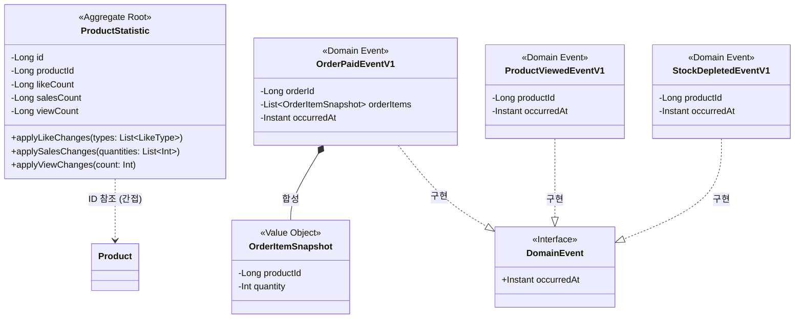

# ProductStatistic 도메인 모델링 문서

> **Round 8**: Kafka 기반 이벤트 파이프라인

## 1. 클래스 다이어그램

### 주요 구조

**Aggregate: ProductStatistic**

ProductStatistic은 상품별 메트릭(좋아요 수, 판매량, 조회수)을 집계하는 독립 Aggregate이다. Product와 별도 생명주기를 가지며, productId로 간접 참조한다. 배치 처리에 최적화된 메서드 설계를 사용한다:
- `applyLikeChanges(types)`: 좋아요 등록/취소 타입 리스트를 받아 일괄 적용
- `applySalesChanges(quantities)`: 주문 상품별 수량 리스트를 받아 일괄 적용
- `applyViewChanges(count)`: 조회수를 일괄 증가

**Domain Events**

OrderPaidEventV1은 결제 완료 시 발행되며, 판매량 집계를 위해 OrderItemSnapshot 목록을 포함한다. ProductViewedEventV1은 상품 상세 조회 시 발행되며, 조회수 집계에 사용된다. StockDepletedEventV1은 재고 소진 시 발행되며, 상품 캐시 무효화에 사용된다. 기존 LikeCreatedEventV1, LikeCanceledEventV1은 좋아요 집계에 사용된다.

---

## 2. 도메인 규칙

### 2.1 생성 규칙

**ProductStatistic.create(productId: Long)**

상품 생성 시 ProductStatistic도 함께 생성되며, 모든 메트릭 초기값은 0이다.

| 필드 | 초기값 |
|------|--------|
| likeCount | 0 |
| salesCount | 0 |
| viewCount | 0 |

### 2.2 좋아요 변경 규칙

**applyLikeChanges(types: List\<LikeType\>)**

배치로 수신된 좋아요 이벤트들을 일괄 적용한다.

**동작**

- CREATED 타입은 +1, CANCELED 타입은 -1로 합산
- `likeCount = maxOf(0, likeCount + delta)`로 음수 방지

**예외**

- 없음 (음수 보정으로 안전 처리)

### 2.3 판매량 변경 규칙

**applySalesChanges(quantities: List\<Int\>)**

주문 완료 시 상품별 판매 수량을 일괄 적용한다.

**동작**

- `salesCount += quantities.sumOf { it.toLong() }`

### 2.4 조회수 변경 규칙

**applyViewChanges(count: Int)**

배치로 수신된 조회 이벤트들의 개수만큼 조회수를 증가시킨다.

**동작**

- `viewCount += count`

### 2.5 불변식

ProductStatistic의 모든 메트릭은 항상 0 이상이어야 한다.

- likeCount ≥ 0
- salesCount ≥ 0
- viewCount ≥ 0

---

## 3. 상태 다이어그램

ProductStatistic은 별도의 상태 전이가 없고 메트릭 값만 변경되므로 상태 다이어그램을 생략한다.

---

## 4. 도메인 이벤트

### 현재 사용 여부

사용한다. Kafka 기반 이벤트 파이프라인 구축이 이번 라운드의 핵심 목표이며, Transactional Outbox Pattern을 통해 이벤트를 발행하고 commerce-streamer 모듈에서 소비하여 메트릭을 집계한다.

### 이벤트 목록

**발행 측**

| 이벤트명 | 발행 주체 | 트리거 조건 |
|----------|-----------|-------------|
| LikeCreatedEventV1 | LikeService | 좋아요 등록 성공 후 |
| LikeCanceledEventV1 | LikeService | 좋아요 취소 성공 후 |
| OrderPaidEventV1 | PaymentFacade | 결제 완료 처리 후 |
| ProductViewedEventV1 | ProductFacade | 상품 상세 조회 시 |
| StockDepletedEventV1 | StockService | Stock.decrease() 후 quantity == 0일 때 |

**소비 측**

| 이벤트명 | 소비 주체 | 처리 내용 |
|----------|-----------|-----------|
| LikeCreatedEventV1 | ProductLikeEventConsumer | ProductStatistic.applyLikeChanges() 호출 |
| LikeCanceledEventV1 | ProductLikeEventConsumer | ProductStatistic.applyLikeChanges() 호출 |
| OrderPaidEventV1 | ProductOrderEventConsumer | ProductStatistic.applySalesChanges() 호출 (상품별) |
| ProductViewedEventV1 | ProductViewEventConsumer | ProductStatistic.applyViewChanges() 호출 |
| StockDepletedEventV1 | ProductStockEventConsumer | 상품 캐시 무효화 |

**페이로드**

| 이벤트명 | 필드 | 설명 |
|----------|------|------|
| LikeCreatedEventV1 | userId, productId, occurredAt | 기존 구조 유지 |
| LikeCanceledEventV1 | userId, productId, occurredAt | 기존 구조 유지 |
| OrderPaidEventV1 | orderId, orderItems(productId, quantity), occurredAt | 상품별 수량 스냅샷 포함 |
| ProductViewedEventV1 | productId, occurredAt | 조회된 상품 식별 |
| StockDepletedEventV1 | productId, occurredAt | 재고 소진된 상품 식별 |

참고: 발행과 소비는 독립적으로 개발/테스트/배포될 수 있음. 이벤트 페이로드가 둘을 연결하는 계약.
