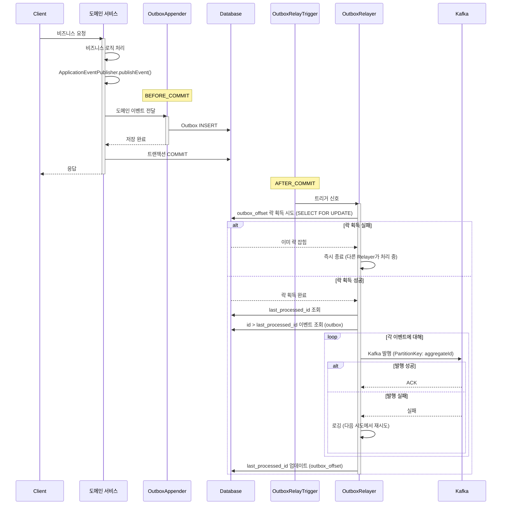
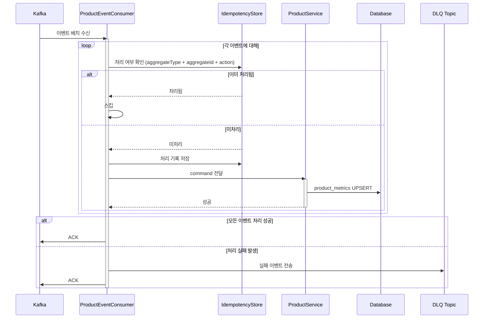
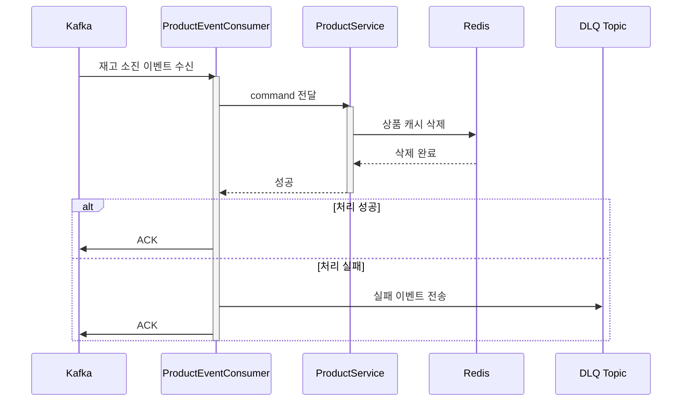
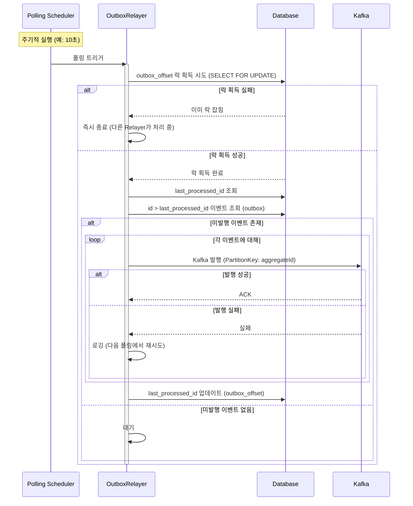

# 솔루션 설계 문서

> **Round 8**: Kafka 기반 이벤트 파이프라인

## 1. 설계 컨텍스트

### 1.1 핵심 해결 과제

이벤트 배치 처리를 위해 Kafka를 이벤트 소싱 채널로 활용하여 streamer 모듈에서 처리할 수 있는 구조가 필요하다. 현재 시스템은 Spring Application Events + @Async 방식으로 이벤트를 처리하고 있어 이벤트 유실 가능성이 있고, 실패 시 복구 메커니즘이 없다.

Transactional Outbox Pattern을 통해 도메인 트랜잭션과 이벤트 발행의 원자성을 확보하고, 네트워크 장애나 Kafka 일시 장애 상황에서도 이벤트 유실을 방지해야 한다. 좋아요 수, 판매량, 조회수 등의 Metrics를 이벤트 기반으로 정확하게 집계하며, commerce-api와 streamer 모듈을 분리하여 독립적 스케일링과 향후 Consumer 확장이 용이한 구조를 구축한다.

### 1.2 현재 아키텍처 영향

프로젝트는 Kotlin + Spring Boot 멀티모듈 모놀리식 구조로, commerce-api와 commerce-streamer 모듈이 이미 분리되어 있다. Application Layer의 Service(단일 도메인) + Facade(도메인 간 오케스트레이션) 구조를 사용하며, Service/Facade 간 횡적 의존성 금지 원칙을 따른다.

현재 이벤트 처리는 Spring Application Events를 사용하고 있으며, @TransactionalEventListener(AFTER_COMMIT) + @Async 방식으로 동작한다. 이 방식은 트랜잭션 커밋 후 비동기 처리되어 이벤트 유실 가능성이 있고, 실패 시 단순 로깅만 수행하여 복구 메커니즘이 없다.

Kafka 모듈(modules/kafka)이 이미 존재하며, 배치 리스너와 manual ACK 설정이 구성되어 있다. ProductStatistic 엔티티에는 현재 likeCount만 존재하여 salesCount, viewCount 추가가 필요하다.

### 1.3 기술 스택 개요

개발 언어는 Kotlin이며 Spring Boot 프레임워크를 사용한다. 데이터베이스는 PostgreSQL이고 ORM으로 Spring Data JPA를 사용한다. 메시지 브로커는 Kafka이며, 캐시는 Redis를 사용한다. 배포 환경은 Docker와 AWS이다.

## 2. 솔루션 대안 분석

### 대안 1: Pure Polling

스케줄러가 주기적으로 Outbox 테이블을 폴링하여 미발행 이벤트를 Kafka로 발행하는 방식이다. 도메인 트랜잭션 내에서 비즈니스 로직 처리와 함께 Outbox 테이블에 이벤트를 INSERT하고, 별도 스케줄러가 주기적으로(예: 1초) 미발행 이벤트를 조회하여 Kafka로 발행한다.

장점으로는 구현이 단순하고 이해하기 쉬우며 Spring @Scheduled + JPA로 충분하다. 추가 인프라 없이 기존 스택만으로 구현 가능하고, 디버깅과 모니터링이 용이하다.

단점으로는 폴링 주기만큼의 지연이 발생하고(1초 폴링이면 평균 0.5초 지연), DB 폴링으로 인한 부하가 있어 인덱스 최적화가 필요하다.

아키텍처 영향으로는 commerce-api에 OutboxRepository, OutboxPublisher가 추가되고, 기존 도메인 이벤트 발행 로직이 수정된다.

### 대안 2: Relayer Trigger + Polling Fallback

AFTER_COMMIT 시점에 Relayer에게 신호를 보내 즉시 처리를 트리거하고, Polling은 백업으로만 동작하는 방식이다. 도메인 트랜잭션 내에서 Outbox 테이블에 이벤트를 INSERT하고, AFTER_COMMIT에서 Relayer에게 트리거 신호를 보낸다. Relayer는 신호를 받으면 Outbox를 조회하여 순서대로 Kafka로 발행하고, 이벤트가 없을 때까지 반복한다. Polling은 트리거가 누락된 경우를 대비한 fallback으로 동작한다.

장점으로는 정상 상황에서 지연이 최소화되고(즉시 발행), Kafka 장애 시에도 이벤트 유실이 없다(Outbox + Polling 백업). Relayer가 순차적으로 처리하므로 순서 보장이 가능하고, 배치로 처리할 수 있어 IO가 효율적이다.

단점으로는 Pure Polling보다 구현 복잡도가 높고, Polling Publisher가 여전히 필요하다(백업용).

아키텍처 영향으로는 OutboxAppender, OutboxRelayer, OutboxRelayTrigger 컴포넌트가 추가된다.

### 대안 3: CDC (Debezium)

Debezium이 PostgreSQL의 WAL(Write-Ahead Log)을 구독하여 Outbox 테이블 변경을 실시간으로 감지하고 Kafka로 발행하는 방식이다. 도메인 트랜잭션 내에서 Outbox 테이블에 이벤트를 INSERT하고, Debezium Connector가 WAL 변경을 감지하여 즉시 Kafka로 발행한다.

장점으로는 실시간에 가까운 이벤트 발행(밀리초 단위 지연)이 가능하고, DB 폴링 부하가 없다(WAL 기반). Debezium이 검증된 솔루션이며 스케일링이 용이하다.

단점으로는 Debezium + Kafka Connect 인프라 추가가 필요하고, 학습 비용 및 운영 복잡도가 증가한다. PostgreSQL logical replication 설정이 필요하고, 장애 상황 디버깅이 상대적으로 어렵다.

아키텍처 영향으로는 Kafka Connect + Debezium Connector 인프라가 추가되고, PostgreSQL logical replication이 활성화된다.

## 3. 선택된 솔루션

### 3.1 결정 요약

**대안 2: Relayer Trigger + Polling Fallback** 방식을 선택한다.

선택 이유는 다음과 같다. 첫째, 팀의 "ROI 중심" 및 "실용주의" 가치에 부합한다. Debezium 같은 추가 인프라 없이 기존 Spring + PostgreSQL 스택만으로 구현 가능하고, 팀 내 숙련도가 있는 기술로 빠르게 개발할 수 있다.

둘째, 이벤트 유실 방지와 순서 보장이라는 핵심 요구사항을 충족한다. 도메인 트랜잭션과 Outbox INSERT가 하나의 트랜잭션으로 원자성이 보장되고, Relayer가 순차적으로 처리하므로 PartitionKey 기반 순서 보장이 가능하다.

셋째, 지연 최소화와 IO 효율성을 동시에 달성한다. 트리거 방식으로 정상 상황에서 즉시 처리되고, Relayer가 배치로 처리할 수 있어 Kafka IO가 효율적이다.

넷째, 장애 복원력이 확보된다. Kafka 일시 장애 시에도 Outbox에 이벤트가 남아있고, Polling Fallback이 복구 역할을 한다.

### 3.2 솔루션 구조

#### 핵심 아키텍처 컴포넌트

**1. Outbox 시스템 (commerce-api)**

Outbox 시스템은 도메인 이벤트를 안전하게 저장하고 Kafka로 릴레이하는 역할을 담당한다. OutboxAppender는 BEFORE_COMMIT 시점에 도메인 이벤트를 Outbox 테이블에 저장한다. OutboxRelayTrigger는 AFTER_COMMIT 시점에 Relayer에게 트리거 신호를 보낸다. OutboxRelayer는 트리거 신호를 받거나 Polling으로 동작하여 Outbox에서 미발행 이벤트를 조회하고 Kafka로 발행한다. Outbox Offset은 상태 컬럼 없이 마지막 처리 위치(last_processed_id)만 추적하여 append-only 구조를 유지한다.

동시성 제어를 위해 OutboxRelayer는 실행 시 outbox_offset 테이블에 락(SELECT ... FOR UPDATE)을 잡는다. 락이 이미 잡혀있으면 다른 Relayer는 즉시 종료하고, 이미 실행 중인 Relayer가 처리하도록 위임한다. 이를 통해 여러 트랜잭션이 동시에 AFTER_COMMIT 트리거를 발생시켜도 순서가 보장된다.

Kafka 발행 시 PartitionKey(aggregateId)를 지정하여 동일 엔티티의 이벤트가 동일 파티션으로 전송되도록 한다. 이를 통해 동일 엔티티에 대한 이벤트 순서가 보장된다.

**2. Kafka Consumers (commerce-streamer)**

Kafka Consumer는 도메인 관점으로 구성한다. ProductEventConsumer는 상품 도메인 관련 이벤트를 처리하며 like-events, order-events, product-view-events, stock-events 토픽을 구독한다. Consumer는 IdempotencyStore를 의존하여 중복 처리를 방지하고, ProductService에 command를 전달한다.

**3. 멱등성 보장 시스템 (Consumer 전용)**

IdempotencyStore는 Consumer에서 중복 처리를 방지한다. Producer 측은 Outbox Offset(커서) 방식으로 중복 발행을 방지하므로 별도의 멱등성 체크가 불필요하다. 중복 발행이 발생하더라도 Consumer에서 걸러지므로 At-least-once 발행, Exactly-once 처리가 보장된다. IdempotencyStore 구현체는 테이블, Redis, 스레드로컬 등 상황에 맞게 선택할 수 있다.

멱등성 체크는 eventId가 아닌 aggregateType + aggregateId + action 기준으로 수행한다. 이를 통해 같은 의미의 이벤트가 다른 eventId로 발행되더라도 중복 처리를 방지할 수 있다.

이벤트별 멱등성 전략은 다음과 같다. 좋아요 등록/취소는 도메인 자체가 멱등하므로(unique 제약) 별도 체크가 불필요하다. 재고 소진 캐시 무효화는 동작 자체가 멱등하므로(여러 번 삭제해도 결과 동일) 별도 체크가 불필요하다. 주문 완료 판매량 집계와 상품 조회 조회수 집계는 중복 이벤트 시 집계가 중복 반영되므로 IdempotencyStore 체크가 필요하다.

**4. 에러 처리 시스템**

처리 실패 메시지는 DLQ(Dead Letter Queue) 토픽으로 전송한다.

#### 데이터 흐름

**1. 이벤트 발행 흐름 (Producer)**

**2. 판매량/조회수 집계 흐름 (Consumer - 멱등성 체크 필요)**

**3. 캐시 무효화 흐름 (Consumer - 멱등성 체크 불필요)**

**4. Polling Fallback 흐름 (Producer 백업)**

