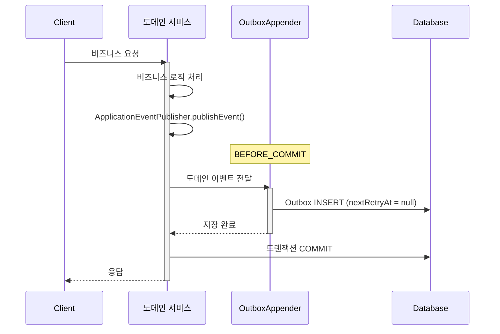
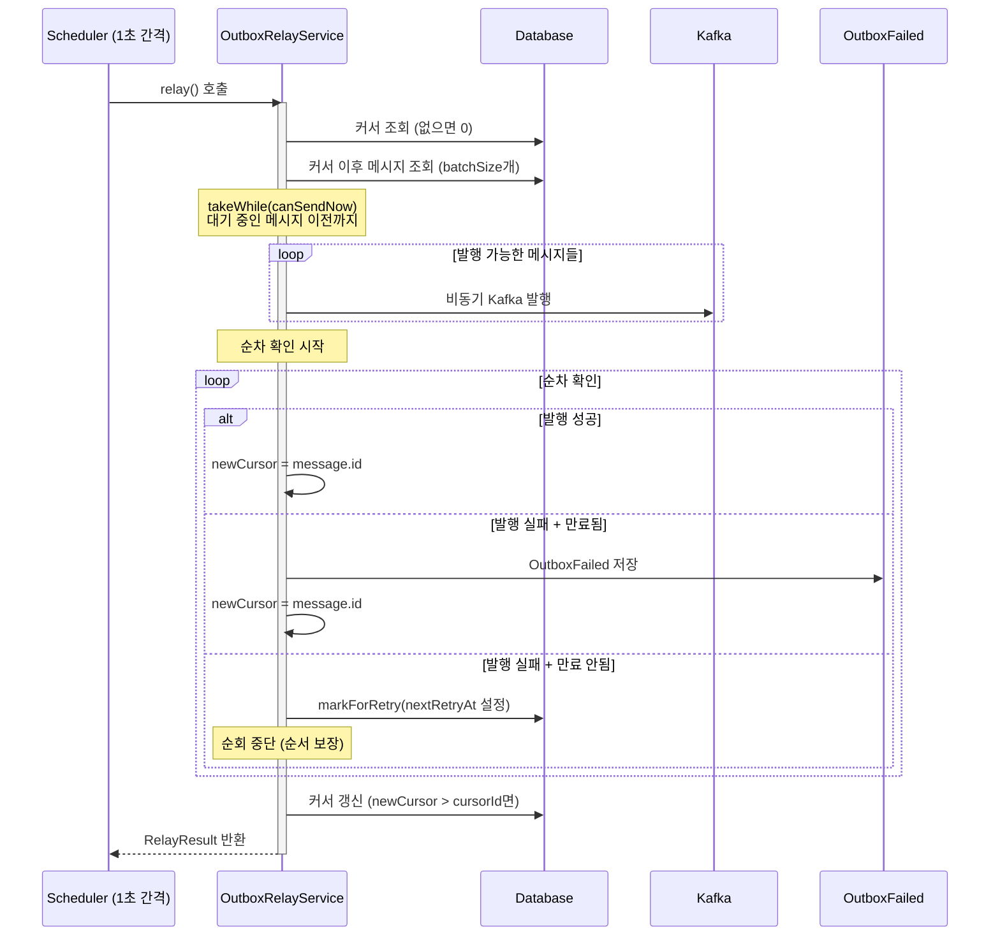
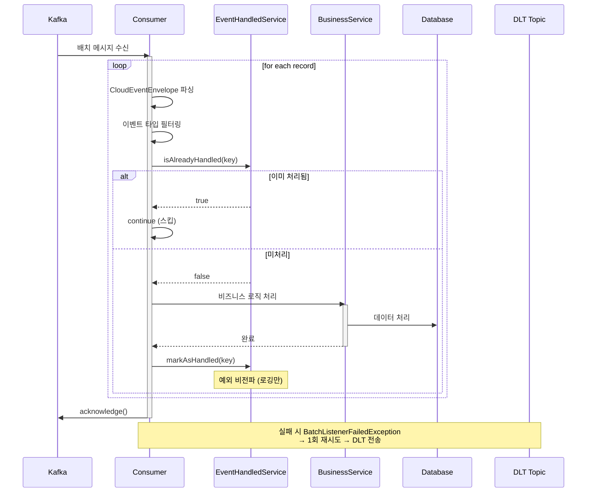
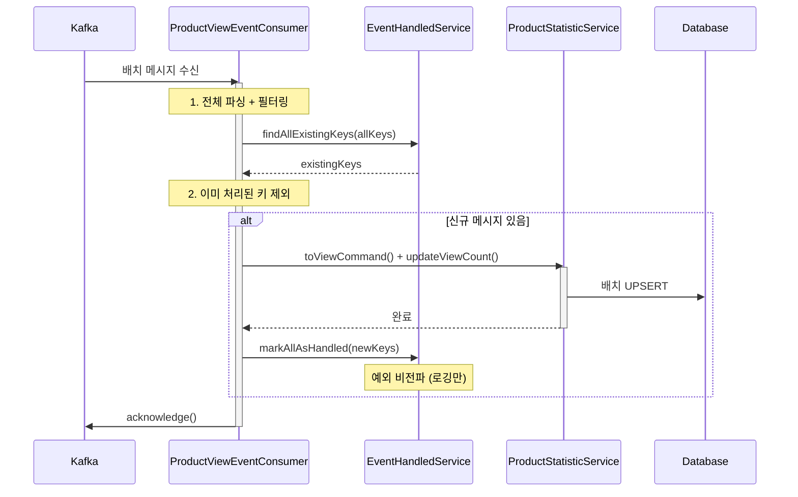
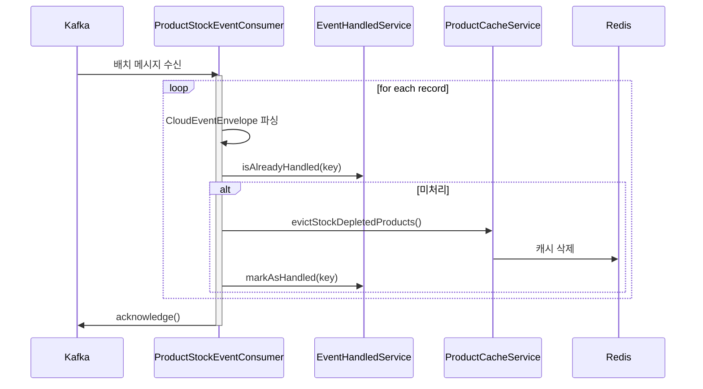

# 솔루션 설계 문서

> **Round 8**: Kafka 기반 이벤트 파이프라인

## 1. 설계 컨텍스트

### 1.1 핵심 해결 과제

이벤트 배치 처리를 위해 Kafka를 이벤트 소싱 채널로 활용하여 streamer 모듈에서 처리할 수 있는 구조가 필요하다. 현재 시스템은 Spring Application Events + @Async 방식으로
이벤트를 처리하고 있어 이벤트 유실 가능성이 있고, 실패 시 복구 메커니즘이 없다.

Transactional Outbox Pattern을 통해 도메인 트랜잭션과 이벤트 발행의 원자성을 확보하고, 네트워크 장애나 Kafka 일시 장애 상황에서도 이벤트 유실을 방지해야 한다. 좋아요 수, 판매량,
조회수 등의 Metrics를 이벤트 기반으로 정확하게 집계하며, commerce-api와 streamer 모듈을 분리하여 독립적 스케일링과 향후 Consumer 확장이 용이한 구조를 구축한다.

### 1.2 현재 아키텍처 영향

프로젝트는 Kotlin + Spring Boot 멀티모듈 모놀리식 구조로, commerce-api와 commerce-streamer 모듈이 이미 분리되어 있다. Application Layer의 Service(단일
도메인) + Facade(도메인 간 오케스트레이션) 구조를 사용하며, Service/Facade 간 횡적 의존성 금지 원칙을 따른다.

현재 이벤트 처리는 Spring Application Events를 사용하고 있으며, @TransactionalEventListener(AFTER_COMMIT) + @Async 방식으로 동작한다. 이 방식은 트랜잭션
커밋 후 비동기 처리되어 이벤트 유실 가능성이 있고, 실패 시 단순 로깅만 수행하여 복구 메커니즘이 없다.

Kafka 모듈(modules/kafka)이 이미 존재하며, 배치 리스너와 manual ACK 설정이 구성되어 있다. ProductStatistic 엔티티에는 현재 likeCount만 존재하여 salesCount,
viewCount 추가가 필요하다.

### 1.3 기술 스택 개요

개발 언어는 Kotlin이며 Spring Boot 프레임워크를 사용한다. 데이터베이스는 Mysql이고 ORM으로 Spring Data JPA를 사용한다. 메시지 브로커는 Kafka이며, 캐시는 Redis를 사용한다.
배포 환경은 Docker와 AWS이다.

## 2. 솔루션 대안 분석

### 대안 1: 상태관리 방식 (Status-based)

Outbox 테이블에 status 컬럼을 두어 각 이벤트의 발행 상태를 개별적으로 추적하는 방식이다. 도메인 트랜잭션 내에서 Outbox에 PENDING 상태로 INSERT하고, Relayer가 PENDING
이벤트를 조회하여 Kafka 발행 후 PUBLISHED로 UPDATE한다.

**장점:**

- 개별 이벤트 상태 추적 가능 (PENDING, PUBLISHED, FAILED)
- 실패 이벤트만 선별하여 재시도 가능
- 모니터링/디버깅 용이 (상태별 count 조회)

**단점:**

- 발행마다 UPDATE 쿼리 필요 (write amplification)
- status 컬럼 인덱스 관리 필요
- 상태 전이 로직 복잡도 증가

**아키텍처 영향:**

- Outbox 테이블에 status, published_at 컬럼 추가
- 상태 전이 로직 구현 필요

### 대안 2: 커서 방식 (Cursor/Offset-based)

Outbox 테이블은 상태 없이 append-only로 유지하고, 별도의 offset 테이블에서 마지막 처리 위치만 추적하는 방식이다. Relayer가 `id > last_processed_id` 조건으로 미발행
이벤트를 조회하고, 발행 완료 후 offset만 업데이트한다.

**장점:**

- Outbox 테이블은 INSERT only (쓰기 성능 최적화)
- 구조가 단순함 (상태 전이 로직 없음)
- Kafka log 철학과 유사 (offset 기반)
- 인덱스는 PK만으로 충분

**단점:**

- 개별 이벤트 상태 추적 어려움
- 중간 실패 시 해당 지점부터 전체 재시도
- 실패 이벤트만 골라서 재처리 불가

**아키텍처 영향:**

- outbox_offset 테이블 추가
- Outbox 테이블은 단순 구조 유지

### 대안 3: CDC (Debezium)

Debezium이 Mysql의 WAL(Write-Ahead Log)을 구독하여 Outbox 테이블 변경을 실시간으로 감지하고 Kafka로 발행하는 방식이다. 도메인 트랜잭션 내에서 Outbox 테이블에 이벤트를
INSERT하고, Debezium Connector가 WAL 변경을 감지하여 즉시 Kafka로 발행한다.

장점으로는 실시간에 가까운 이벤트 발행(밀리초 단위 지연)이 가능하고, DB 폴링 부하가 없다(WAL 기반). Debezium이 검증된 솔루션이며 스케일링이 용이하다.

단점으로는 Debezium + Kafka Connect 인프라 추가가 필요하고, 학습 비용 및 운영 복잡도가 증가한다. Mysql logical replication 설정이 필요하고, 장애 상황 디버깅이 상대적으로
어렵다.

아키텍처 영향으로는 Kafka Connect + Debezium Connector 인프라가 추가되고, Mysql logical replication이 활성화된다.

## 3. 선택된 솔루션

### 3.1 결정 요약

**대안 2: 커서 방식 (Cursor/Offset-based)**을 선택한다.

**선택 이유:**

1**쓰기 성능 최적화**

- Outbox 테이블은 INSERT only로 write amplification 없음
- 고트래픽 상황에서 UPDATE 부하 회피

### 3.2 솔루션 구조

#### 핵심 아키텍처 컴포넌트

**1. Outbox 시스템 (commerce-api)**

Outbox 시스템은 도메인 이벤트를 안전하게 저장하고 Kafka로 릴레이하는 역할을 담당한다.

- **OutboxAppender**: BEFORE_COMMIT 시점에 도메인 이벤트를 Outbox 테이블에 저장
- **OutboxRelayService**: 스케줄러에 의해 주기적으로 실행되어 미발행 이벤트를 Kafka로 발행
- **OutboxRelayScheduler**: 1초 간격으로 `OutboxRelayService.relay()`를 호출
- **OutboxRelayProperties**: Relay 관련 설정값 (@ConfigurationProperties)
- **Outbox Cursor**: 상태 컬럼 없이 마지막 처리 위치(last_processed_id)만 추적하여 append-only 구조 유지

**순서 보장 메커니즘 (Debezium 스타일):**

- 실패한 메시지는 Outbox 테이블에서 `nextRetryAt`을 설정하여 직접 재시도
- 실패 메시지 이후의 메시지는 해당 메시지가 성공하거나 만료될 때까지 발행되지 않음 (HOL blocking)
- 설정된 시간(maxAge, 기본 5분) 경과 후 OutboxFailed로 이동하여 후속 메시지가 진행될 수 있게 함

Kafka 발행 시 PartitionKey(aggregateId)를 지정하여 동일 엔티티의 이벤트가 동일 파티션으로 전송되도록 한다.

> **⚠️ 싱글 인스턴스 기준 설계**
>
> 현재 설계는 싱글 인스턴스 환경을 기준으로 한다. 멀티 인스턴스 환경에서는 @SchedulerLock으로 단일 인스턴스만 실행되도록 한다.

**2. Kafka Consumers (commerce-streamer)**

Kafka Consumer는 이벤트 유형별로 분리하여 구성한다:

| Consumer | 토픽 | 처리 방식 | 역할 |
|----------|-----|---------|------|
| `ProductLikeEventConsumer` | like-events | Sequential | 좋아요 집계 처리 |
| `ProductOrderEventConsumer` | order-events | Sequential | 판매량 집계 처리 |
| `ProductViewEventConsumer` | product-events | **Batch** | 조회수 집계 처리 (고빈도) |
| `ProductStockEventConsumer` | stock-events | Sequential | 캐시 무효화 처리 |

각 Consumer는 `EventHandledService`를 통해 멱등성을 보장하고, 비즈니스 서비스에 command를 전달한다.

**3. 멱등성 보장 시스템 (Consumer 전용)**

`EventHandledService`는 Consumer에서 중복 처리를 방지한다. Producer 측은 Outbox Offset(커서) 방식으로 중복 발행을 방지하므로 별도의 멱등성 체크가 불필요하다. 중복
발행이 발생하더라도 Consumer에서 걸러지므로 At-least-once 발행, Exactly-once 처리가 보장된다.

멱등성 체크는 `idempotency_key` 단일 컬럼으로 수행하며 이벤트별 차별화된 멱등성 전략을 사용한다.

- 주문 완료: `{group}:{aggregateType}:{aggregateId}:{action}` 키로 DB 기반 멱등성 체크
- 상품 조회: `{group}:{eventId}` 키로 DB 기반 멱등성 체크
- 좋아요: `{group}:{eventId}` 키로 DB 기반 멱등성 체크
- 재고소진: `{group}:{eventId}` 키로 DB 기반 멱등성 체크

이벤트별 멱등성 전략은 다음과 같다:

- **좋아요 등록/취소**: 멱등성 체크 없이 바로 적용 (배치 내 중복만 제거)
- **재고 소진 캐시 무효화**: 동작 자체가 멱등하므로 별도 체크 불필요
- **주문 완료 판매량 집계**: event_handled 테이블로 중복 체크 필요
- **상품 조회 조회수 집계**: event_handled 테이블로 중복 체크 필요

**스펙 리팩토링 변경 사항**:
- **Sequential Processing** (Stock/Like/Order): record-by-record 순차 처리, Spring Kafka 표준 패턴 준수
- **Batch Processing** (ProductView): 배치 단위 일괄 처리, 고빈도 이벤트 최적화 (배치 내 deduplicate 로직 제거됨)
- 모든 Consumer가 `EventHandledService`를 통해 멱등성을 보장

**4. 에러 처리 시스템**

- **재시도**: DefaultErrorHandler로 1회 재시도 (1초 간격, `FixedBackOff(1000L, 1L)`)
- **RetryListener**: 재시도 실패/복구 시 로깅
- **DLT 전송**: 재시도 실패 시 `{원본토픽}.DLT` 토픽으로 전송

#### 데이터 흐름

**1. 이벤트 발행 흐름 (Producer)**

**2. Relay 흐름 (스케줄러 기반)**

**3. Sequential Processing 흐름 (Stock/Like/Order Consumer)**

**4. Batch Processing 흐름 (ProductView Consumer)**

**5. 캐시 무효화 흐름 (ProductStock Consumer - Sequential)**

