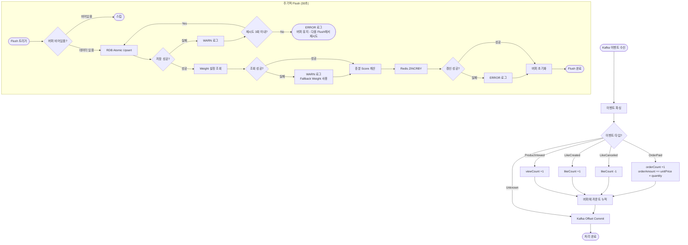
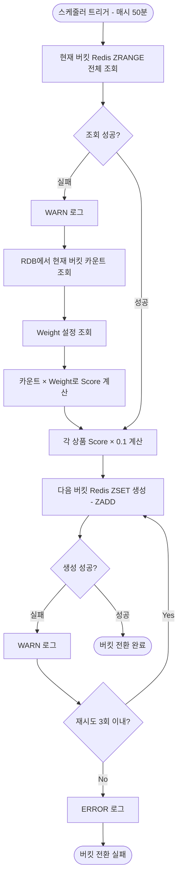
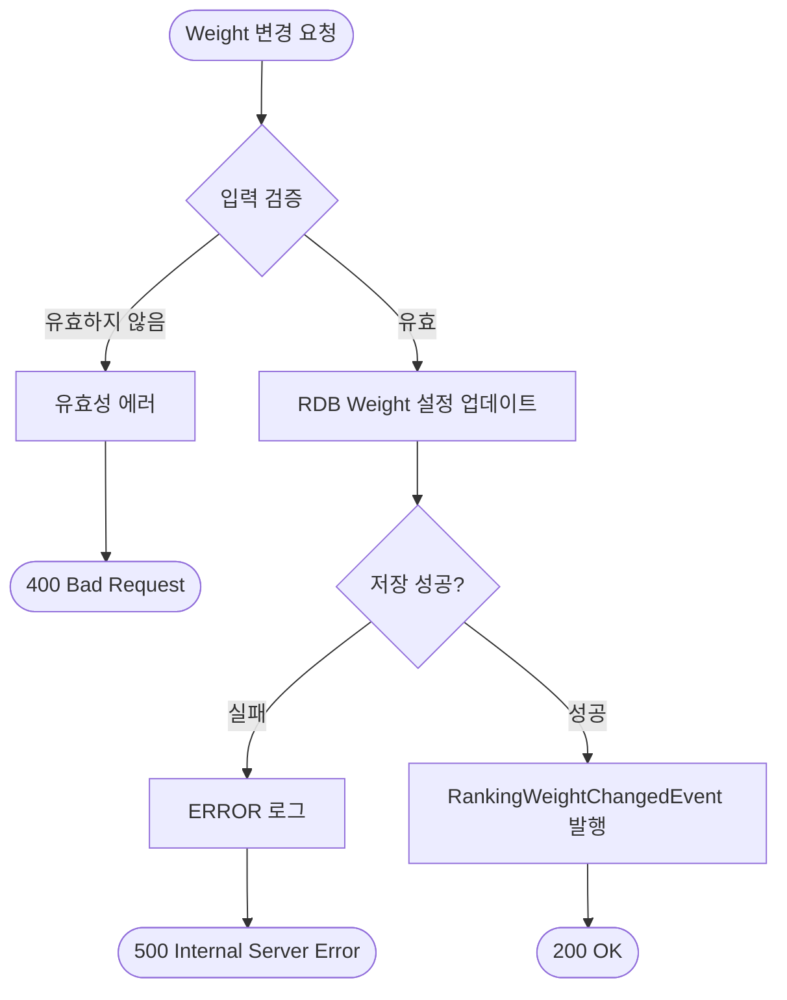
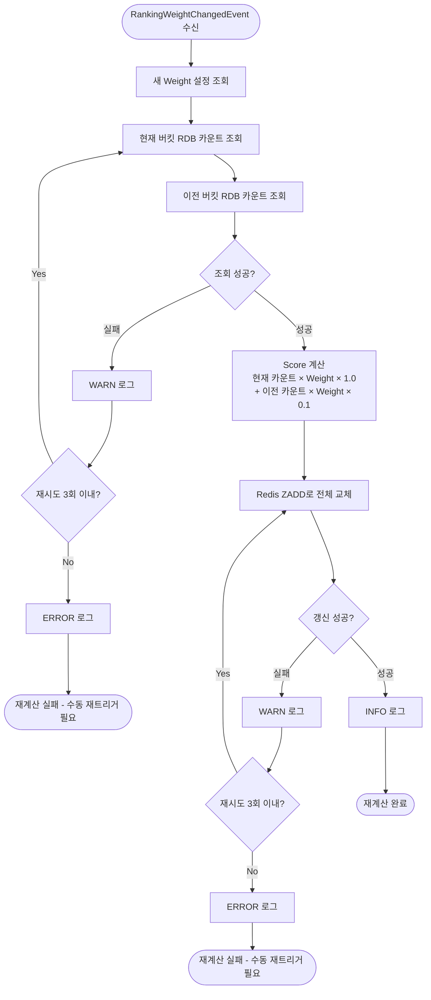

# 랭킹 시스템 상세 설계 및 구현 계획 문서

## 1. 시스템 플로우차트

### 1.1 이벤트 수집 및 집계 플로우

commerce-streamer가 Kafka 이벤트를 수신하여 메모리 버퍼에 누적하고, 주기적으로 RDB와 Redis에 반영하는 플로우입니다.



### 1.2 버킷 전환 플로우

매시 50분에 실행되어 현재 버킷의 Score에 Decay Factor(0.1)를 적용하고 다음 버킷을 준비하는 플로우입니다.



### 1.3 Weight 변경 플로우 (commerce-api)

관리자가 Weight를 변경하면 RDB에 저장하고 이벤트를 발행하여 비동기로 재계산을 트리거하는 플로우입니다.



### 1.4 Score 재계산 플로우 (commerce-streamer)

RankingWeightChangedEvent를 수신하여 RDB 카운트 기반으로 전체 Score를 재계산하는 플로우입니다.



### 1.5 랭킹 조회 플로우 (US-1, US-2)

랭킹 조회는 Redis ZSET 기반의 단순 조회이므로 별도 플로우차트 없이 설명합니다.

**US-1 인기 상품 랭킹 조회**: Redis ZREVRANGE 명령으로 상위 N개 상품 ID와 Score를 조회한 후, 상품 정보를 조합하여 반환합니다. 상품 정보는 기존 상품 상세 캐시(`product-detail:v1:{productId}`)를 활용하고, 캐시 미스 시 DB에서 조회합니다.

**US-2 상품 순위 확인**: Redis ZREVRANK 명령으로 특정 상품의 순위를 조회합니다. 랭킹에 없는 상품은 null을 반환합니다. 순위는 상품 상세 캐시에 포함하지 않고 별도로 조회합니다. 상품 캐시 TTL(60초)과 랭킹 갱신 주기(30초)가 다르고, ZREVRANK 조회가 O(log N)으로 충분히 빠르기 때문입니다.

## 2. 데이터 모델 설계

### 2.1 테이블 스키마

#### ranking_weight 테이블 (Append-only)

```sql
CREATE TABLE ranking_weight (
    id BIGINT AUTO_INCREMENT PRIMARY KEY,
    view_weight DECIMAL(3,2) NOT NULL,
    like_weight DECIMAL(3,2) NOT NULL,
    order_weight DECIMAL(3,2) NOT NULL,
    created_at DATETIME NOT NULL DEFAULT NOW(),
    updated_at DATETIME NOT NULL DEFAULT NOW(),
    deleted_at DATETIME
);
```

**컬럼 설명:**

- `id`: PK
- `view_weight`: 조회 가중치 (0.00 ~ 1.00)
- `like_weight`: 좋아요 가중치 (0.00 ~ 1.00)
- `order_weight`: 주문 가중치 (0.00 ~ 1.00)
- `created_at`: 생성 시각
- `updated_at`: 수정 시각 (Base Entity)
- `deleted_at`: 삭제 시각 (Base Entity)

**조회 방식:**

```sql
SELECT * FROM ranking_weight 
WHERE deleted_at IS NULL 
ORDER BY created_at DESC 
LIMIT 1;
```

#### product_hourly_metric 테이블

```sql
CREATE TABLE product_hourly_metric (
    id BIGINT AUTO_INCREMENT PRIMARY KEY,
    stat_hour DATETIME NOT NULL,
    product_id BIGINT NOT NULL,
    view_count BIGINT NOT NULL DEFAULT 0,
    like_count BIGINT NOT NULL DEFAULT 0,
    order_count BIGINT NOT NULL DEFAULT 0,
    order_amount DECIMAL(15,2) NOT NULL DEFAULT 0,
    created_at DATETIME NOT NULL DEFAULT NOW(),
    updated_at DATETIME NOT NULL DEFAULT NOW(),
    deleted_at DATETIME,
    
    CONSTRAINT uk_stat_hour_product UNIQUE (stat_hour, product_id)
);
```

**컬럼 설명:**

- `id`: PK
- `stat_hour`: 시간 버킷 (정시 단위, 예: 2025-01-15 14:00:00)
- `product_id`: 상품 ID
- `view_count`: 조회 횟수
- `like_count`: 좋아요 횟수 (음수 가능 - 취소 시)
- `order_count`: 주문 건수 (향후 분석용)
- `order_amount`: 주문 금액 합계 (unitPrice × quantity 누적, Score 계산용)
- `created_at`: 생성 시각
- `updated_at`: 수정 시각

### 2.2 인덱스 전략

`UK (stat_hour, product_id)` 유니크 제약조건 하나로 충분합니다.

| 쿼리 패턴 | 인덱스 활용 |
|----------|------------|
| Atomic Upsert (ON CONFLICT) | UK 활용 |
| Weight 변경 시 재계산 (WHERE stat_hour = ?) | UK 선두 컬럼 활용 |

### 2.3 Redis ZSET 설계

| 항목 | 값 |
|------|-----|
| Key 패턴 | `ranking:products:{yyyyMMddHH}` (예: `ranking:products:2025011514`) |
| TTL | 2시간 |
| Member | productId (Long → String) |
| Score | 계산된 인기도 |

**Score 계산식:**

```
viewCount × viewWeight + likeCount × likeWeight + orderAmount × orderWeight
```

**TTL 2시간 설정 이유**: 현재 버킷과 이전 버킷(Decay 계산용)을 커버하고, 이후 자동 삭제되어 별도 정리 작업이 불필요합니다.

## 3. 운영 계획

### 3.1 로깅 전략

| 상황 | 레벨 | 로그 메시지 예시 |
|------|------|-----------------|
| RDB Upsert 재시도 | WARN | `RDB upsert retry attempt={}, statHour={}, productCount={}` |
| RDB Upsert 최종 실패 | ERROR | `RDB upsert failed after 3 retries, statHour={}, buffer retained` |
| Redis ZINCRBY 실패 | ERROR | `Redis ZINCRBY failed, statHour={}, buffer cleared, data may be lost` |
| Weight 조회 실패 (fallback) | WARN | `Weight fetch failed, using fallback weights` |
| Redis ZRANGE 실패 (버킷 전환) | WARN | `Redis ZRANGE failed, falling back to RDB calculation` |
| Redis ZADD 재시도 (버킷 전환) | WARN | `Bucket transition ZADD retry attempt={}` |
| Redis ZADD 최종 실패 (버킷 전환) | ERROR | `Bucket transition failed after 3 retries` |
| Weight 변경 | INFO | `RankingWeight updated, view={}, like={}, order={}` |
| Score 재계산 완료 | INFO | `Score recalculation completed, productCount={}` |
| Score 재계산 실패 | ERROR | `Score recalculation failed, manual re-trigger required` |

### 3.2 주요 실패 시나리오 및 대응 계획

| 실패 시나리오 | 대응 방안 | 기대 효과 |
|--------------|----------|----------|
| RDB Upsert 실패 | 재시도 3회, 실패 시 버퍼 유지 | 다음 flush에서 자동 복구 |
| Redis ZINCRBY 실패 | 로그 후 버퍼 초기화 | 과집계 방지, 약간의 누락 허용 |
| Weight 조회 실패 | Fallback Weight 사용 (view=0.1, like=0.2, order=0.6) | 서비스 중단 없이 계속 동작 |
| 버킷 전환 Redis 조회 실패 | RDB 카운트로 Score 유추 | cold start 방지 |
| 버킷 전환 Redis 쓰기 실패 | 재시도 3회, 실패 시 로그 | 다음 스케줄에서 복구 |
| Score 재계산 실패 | 로그 후 수동 재트리거 | Weight 재변경으로 복구 |

## 4. 설계 결정 공유

### 4.1 주요 설계 결정 및 근거

| 설계 결정 | 근거 |
|----------|------|
| RDB 우선 저장 + Redis best-effort | RDB가 source of truth (Weight 변경 시 재계산 기준), 과집계보다 누락이 나음, 랭킹은 "대략적인 인기도"이므로 엄격한 정합성 불필요 |
| Flush 주기 30초 | 10초는 DB I/O 부담, 1분은 실시간성 저하, 30초가 균형점 |
| 버킷 전환 매시 50분 | 1000개 상품 기준 1초 이내 완료, 현재 버킷에 더 많은 이벤트 반영 후 Decay 적용 |
| Redis 실패 시 RDB fallback | 빈 상태 시작보다 유추된 Score라도 있는 게 사용자 경험에 유리, cold start 방지 |
| Weight 변경 동기 + 비동기 분리 | API 응답 속도 보장, 재계산은 상품 수에 비례하므로 백그라운드 처리가 적절 |
| 현재 + 이전 버킷만 재계산 | 0.1^2 = 0.01로 2시간 전 데이터는 영향 미미, 단순함 우선 |
| orderCount + orderAmount 둘 다 저장 | Score 계산에는 orderAmount 사용, orderCount는 향후 분석용으로 보존 |
| UK (stat_hour, product_id) 단일 | Atomic Upsert와 시간대별 조회 모두 커버, 인덱스 중복 방지 |
| Fallback Weight (view=0.1, like=0.2, order=0.6) | 주문이 가장 강한 구매 의도 시그널, 조회는 가장 약함 |
| ZSET TTL 2시간 | 현재 버킷 + 이전 버킷 커버, 자동 정리로 관리 부담 최소화 |
| 순위는 상품 캐시와 분리 조회 | 상품 캐시 TTL(60초)과 랭킹 갱신 주기(30초)가 다름, ZREVRANK O(log N)으로 별도 조회해도 충분히 빠름 |
| ranking_weight Append-only | 변경 이력 추적으로 "어떤 Weight일 때 전환율이 좋았는지" 분석 가능, 롤백 용이 |
