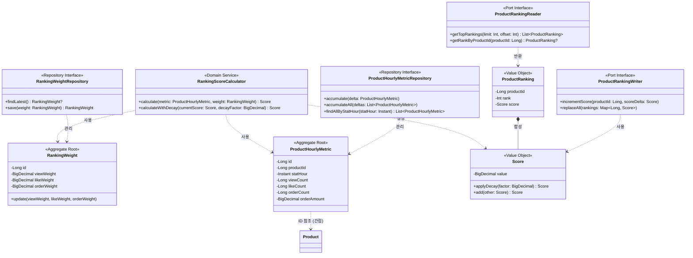

# 랭킹 도메인 모델링 문서

## 1. 클래스 다이어그램



### 주요 구조

**Aggregate 1: RankingWeight**

- Root: RankingWeight
- Repository: RankingWeightRepository
- 책임: 랭킹 가중치 설정 관리, 변경 시 유효성 검증
- 단일 인스턴스로 운영 (시스템 설정)

**Aggregate 2: ProductHourlyMetric**

- Root: ProductHourlyMetric
- Repository: ProductHourlyMetricRepository
- 책임: 시간 버킷별 상품 행동 카운트 저장
- 복합 유니크 키: (productId, statHour)

**Domain Service: RankingScoreCalculator**

- 책임: Score 계산 로직 캡슐화
- 순수 계산 로직만 포함, 외부 의존성 없음

**Port Interface: ProductRankingReader / ProductRankingWriter**

- 책임: 외부 캐시 저장소(Redis)와의 통신 추상화
- Reader: 랭킹 조회
- Writer: 랭킹 갱신

**설계 의도:**

- RankingWeight와 ProductHourlyMetric은 서로 직접 참조하지 않음. Score 계산이 필요할 때 RankingScoreCalculator가 둘을 조합
- Repository(RDB 영속화)와 Port(외부 캐시 통신)를 분리하여 인프라 기술 추상화

### Value Object 불변식

| Value Object | 불변식 | 비고 |
|--------------|--------|------|
| Score | value ≥ 0 | 음수 Score는 비즈니스적으로 무의미 |
| ProductRanking | rank ≥ 1 | 순위는 1부터 시작 |
| RankingWeight.viewWeight | 0 ≤ value ≤ 1 | 생성자/update 시 검증 |
| RankingWeight.likeWeight | 0 ≤ value ≤ 1 | 생성자/update 시 검증 |
| RankingWeight.orderWeight | 0 ≤ value ≤ 1 | 생성자/update 시 검증 |

### Repository/Port 인터페이스

도메인 관점에서 필요한 연산을 비즈니스 용어로 정의한다. 구현 상세(SQL, 캐시 명령어)는 detailed-design 참조.

**RankingWeightRepository**

| 메서드 | 비즈니스 의미 |
|--------|-------------|
| findLatest() | 현재 적용 중인 Weight 설정 조회 |
| save(weight) | Weight 설정 저장 (Append-only) |

**ProductHourlyMetricRepository**

| 메서드 | 비즈니스 의미 |
|--------|-------------|
| accumulate(delta) | 단일 상품의 행동 카운트를 원자적으로 누적 |
| accumulateAll(deltas) | 여러 상품의 행동 카운트를 일괄 누적 |
| findAllByStatHour(statHour) | 특정 시간 버킷의 모든 상품 metric 조회 |

**ProductRankingReader**

| 메서드 | 비즈니스 의미 |
|--------|-------------|
| getTopRankings(limit, offset) | Score 기준 상위 N개 상품 랭킹 조회 |
| getRankByProductId(productId) | 특정 상품의 현재 순위 조회 |

**ProductRankingWriter**

| 메서드 | 비즈니스 의미 |
|--------|-------------|
| incrementScore(productId, delta) | 특정 상품의 Score를 증분 갱신 |
| replaceAll(rankings) | 전체 랭킹을 새 Score로 교체 |

---

## 2. 도메인 규칙

### 2.1 Weight 관리 규칙

**RankingWeight 불변식**

- viewWeight, likeWeight, orderWeight는 모두 0 이상 1 이하
- 범위를 벗어나는 값으로 생성/수정 시 예외 발생: "Weight는 0과 1 사이여야 합니다"

**RankingWeight.update() 사전조건**

- 모든 Weight 값이 0 ≤ value ≤ 1 범위 내

### 2.2 카운트 누적 규칙

**ProductHourlyMetric 유니크 제약**

- (productId, statHour) 조합은 유일
- DB 레벨 유니크 제약으로 보장

**카운트 증분 규칙**

- viewCount, likeCount, orderCount는 양수/음수 증분 모두 허용
- 좋아요 취소 시 likeCount가 음수가 될 수 있음 (정상 케이스)
- 예: 14시에 좋아요 → 15시에 취소 → 15시 버킷 likeCount = -1

### 2.3 Score 계산 규칙

**기본 Score 계산**

| 공식 |
|------|
| viewCount × viewWeight + likeCount × likeWeight + orderAmount × orderWeight |

**계산 예시**

| viewCount | likeCount | orderAmount | viewWeight | likeWeight | orderWeight | Score |
|-----------|-----------|-------------|------------|------------|-------------|-------|
| 100 | 10 | 5000 | 0.1 | 0.3 | 0.6 | 3016.0 |
| 50 | -2 | 3000 | 0.1 | 0.3 | 0.6 | 1804.4 |

**버킷 전환 시 Decay 적용**

| 항목 | 값 |
|------|-----|
| Decay Factor | 0.1 (고정값) |
| 새 버킷 초기 Score | 이전 버킷 최종 Score × 0.1 |

- 정시가 되면 새 버킷 시작
- 이전 버킷의 Score에 0.1을 곱한 값을 base로 적용
- 이후 해당 버킷에서 발생하는 이벤트는 × 1.0으로 반영

### 2.4 Domain Service 사용 규칙

**RankingScoreCalculator 메서드 관계**

| 상황 | 사용 메서드 | 설명 |
|------|------------|------|
| 주기적 flush 시 | calculate(metric, weight) | 현재 버킷 metric의 증분을 Score로 변환 |
| 버킷 전환 시 | calculateWithDecay(prevScore, 0.1) | 이전 버킷 Score를 감쇠시켜 다음 버킷 초기값 생성 |
| Weight 변경 시 재계산 | calculate() + calculateWithDecay() 조합 | 이전 버킷 metric으로 prevScore 계산 → decay 적용 → 현재 metric으로 최종 Score |

**조합 예시 - Weight 변경 시 재계산:**

```
1. prevScore = calculate(이전 버킷 metric, 새 Weight)  // 저장 안 함
2. decayedPrev = calculateWithDecay(prevScore, 0.1)
3. currentScore = calculate(현재 버킷 metric, 새 Weight) + decayedPrev
4. Redis에 currentScore 저장
```

### 2.5 랭킹 조회 규칙

**순위 반환 규칙**

- 랭킹에 존재하는 상품: 순위(1부터 시작)와 Score 함께 반환
- 랭킹에 없는 상품: 순위 null 반환

---

## 3. 상태 다이어그램

해당 없음.

**이유:**

- RankingWeight: 상태 전이 없음 (값 변경만 존재)
- ProductHourlyMetric: 상태 전이 없음 (카운트 누적만 존재)
- Rankings 도메인은 "집계와 계산" 중심으로 상태 머신이 필요한 엔티티가 없음

---

## 4. 도메인 이벤트

### 현재 사용 여부

**사용함** - RankingWeightChangedEvent 1개

**이유:**

- Weight 변경 → Score 재계산을 동기로 처리하면 API 응답 지연 발생 (상품 수에 비례)
- 비동기 이벤트로 분리하여 API 응답 속도 보장
- 기존 Outbox 패턴 활용으로 구현 부담 최소화

### 이벤트 목록

**발행 측:**

| 이벤트명 | 발행 주체 | 트리거 조건 |
|---------|---------|------------|
| RankingWeightChangedEvent | RankingWeightService | Weight 설정 변경 성공 후 |

**소비 측:**

| 이벤트명 | 소비 주체 | 처리 내용 |
|---------|---------|---------|
| RankingWeightChangedEvent | RankingRecalculationConsumer (commerce-streamer) | 전체 Score 재계산 트리거 |

**페이로드:**

| 이벤트명 | 필드 | 설명 |
|---------|-----|-----|
| RankingWeightChangedEvent | weightId, viewWeight, likeWeight, orderWeight, changedAt | Weight 식별 및 새 설정값 |

참고: 발행과 소비는 독립적으로 개발/테스트/배포될 수 있음. 이벤트 페이로드가 둘을 연결하는 계약.
