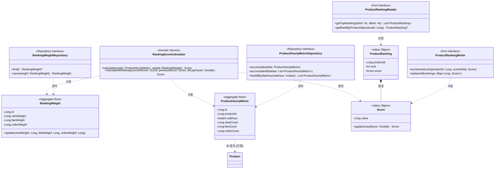

# 랭킹 도메인 모델링 문서

## 1. 클래스 다이어그램

### 주요 구조

**Aggregate 1: RankingWeight**

- Root: RankingWeight
- Repository: RankingWeightRepository
- 책임: 랭킹 가중치 설정 관리, 변경 시 유효성 검증
- 단일 인스턴스로 운영 (시스템 설정)

**Aggregate 2: ProductHourlyMetric**

- Root: ProductHourlyMetric
- Repository: ProductHourlyMetricRepository
- 책임: 시간 버킷별 상품 행동 카운트 저장
- 복합 유니크 키: (productId, statHour)

**Domain Service: RankingScoreCalculator**

- 책임: Score 계산 로직 캡슐화
- 순수 계산 로직만 포함, 외부 의존성 없음

**Port Interface: ProductRankingReader / ProductRankingWriter**

- 책임: Redis ZSET과의 통신 추상화
- Reader: 랭킹 조회 (ZREVRANGE, ZREVRANK)
- Writer: 랭킹 갱신 (ZINCRBY, ZADD)

**설계 의도:**

- RankingWeight와 ProductHourlyMetric은 서로 직접 참조하지 않음. Score 계산이 필요할 때 RankingScoreCalculator가 둘을 조합
- ProductHourlyMetricRepository.accumulate()는 Atomic Upsert(INSERT ... ON CONFLICT DO UPDATE)로 구현하여 동시성 이슈 없이 카운트 누적
- Repository(RDB 영속화)와 Port(Redis 통신)를 분리하여 인프라 기술 추상화

---

## 2. 도메인 규칙

### 2.1 Weight 관리 규칙

**RankingWeight 불변식**

- viewWeight, likeWeight, orderWeight는 모두 0 이상 1 이하
- 범위를 벗어나는 값으로 생성/수정 시 예외 발생: "Weight는 0과 1 사이여야 합니다"

**RankingWeight.update() 사전조건**

- 모든 Weight 값이 0 ≤ value ≤ 1 범위 내

### 2.2 카운트 누적 규칙

**ProductHourlyMetric 유니크 제약**

- (productId, statHour) 조합은 유일
- DB 레벨 유니크 제약으로 보장

**카운트 증분 규칙**

- viewCount, likeCount, orderCount는 양수/음수 증분 모두 허용
- 좋아요 취소 시 likeCount가 음수가 될 수 있음 (정상 케이스)
- 예: 14시에 좋아요 → 15시에 취소 → 15시 버킷 likeCount = -1

**Atomic Upsert 구현**

- INSERT ... ON CONFLICT (product_id, stat_hour) DO UPDATE SET count = count + delta
- 동시성 이슈 없이 카운트 누적

### 2.3 Score 계산 규칙

**기본 Score 계산**

| 공식 |
|------|
| viewCount × viewWeight + likeCount × likeWeight + orderCount × orderWeight |

**계산 예시**

| viewCount | likeCount | orderCount | viewWeight | likeWeight | orderWeight | Score |
|-----------|-----------|------------|------------|------------|-------------|-------|
| 100 | 10 | 5 | 0.1 | 0.3 | 0.6 | 16.0 |
| 50 | -2 | 3 | 0.1 | 0.3 | 0.6 | 6.2 |

**버킷 전환 시 Decay 적용**

| 항목 | 값 |
|------|-----|
| Decay Factor | 0.1 (고정값) |
| 새 버킷 초기 Score | 이전 버킷 최종 Score × 0.1 |

- 정시가 되면 새 버킷 시작
- 이전 버킷의 Score에 0.1을 곱한 값을 base로 적용
- 이후 해당 버킷에서 발생하는 이벤트는 × 1.0으로 반영

### 2.4 랭킹 조회 규칙

**순위 반환 규칙**

- 랭킹에 존재하는 상품: 순위(1부터 시작)와 Score 함께 반환
- 랭킹에 없는 상품: 순위 null 반환

---

## 3. 상태 다이어그램

해당 없음.

**이유:**

- RankingWeight: 상태 전이 없음 (값 변경만 존재)
- ProductHourlyMetric: 상태 전이 없음 (카운트 누적만 존재)
- Rankings 도메인은 "집계와 계산" 중심으로 상태 머신이 필요한 엔티티가 없음

---

## 4. 도메인 이벤트

현재 요구사항에서는 도메인 이벤트를 사용하지 않습니다.

**이유:**

- Rankings 도메인은 다른 도메인 이벤트를 소비하는 쪽 (ProductViewedEventV1, LikeCreatedEventV1 등)
- Weight 변경 → Score 재계산은 동기적 처리로 충분
- YAGNI 원칙에 따라 필요할 때 추가

**향후 도입 가능한 이벤트:**

- RankingWeightChangedEvent: 관리자 알림, 감사 로그 필요 시
- RankingUpdatedEvent: 랭킹 변동을 외부 시스템(추천 엔진 등)에 알려야 할 때
