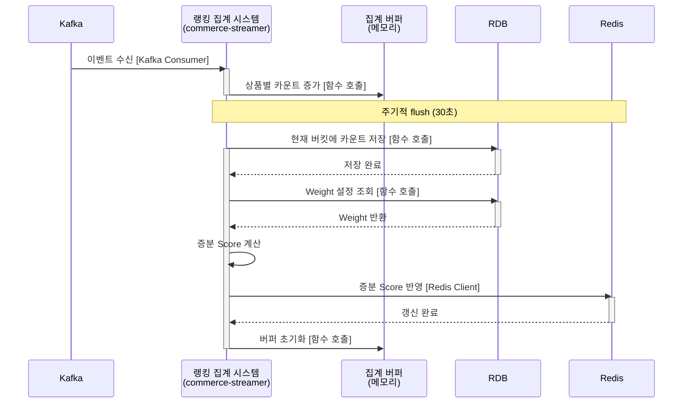
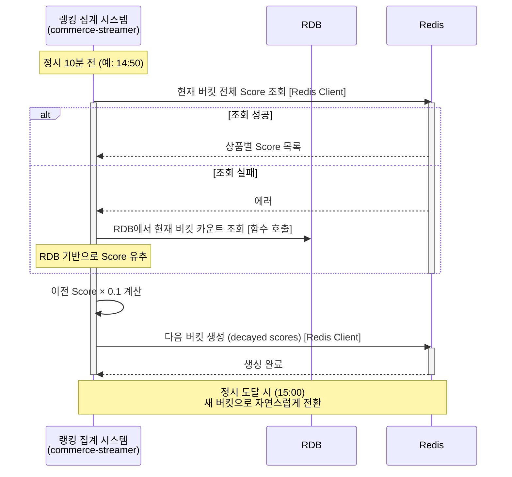
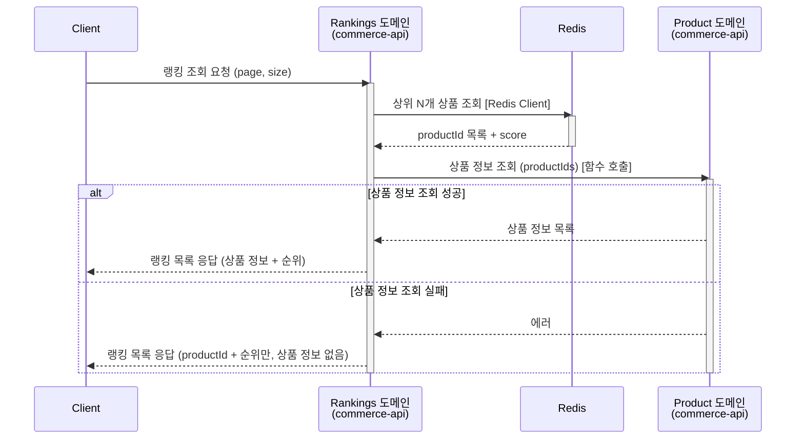
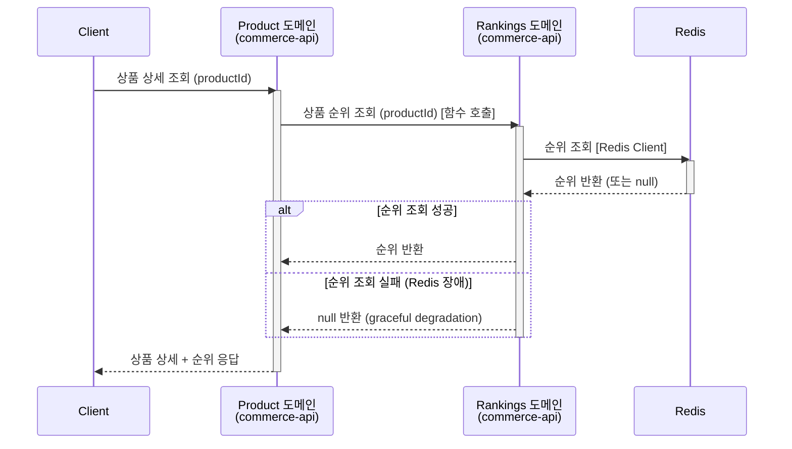
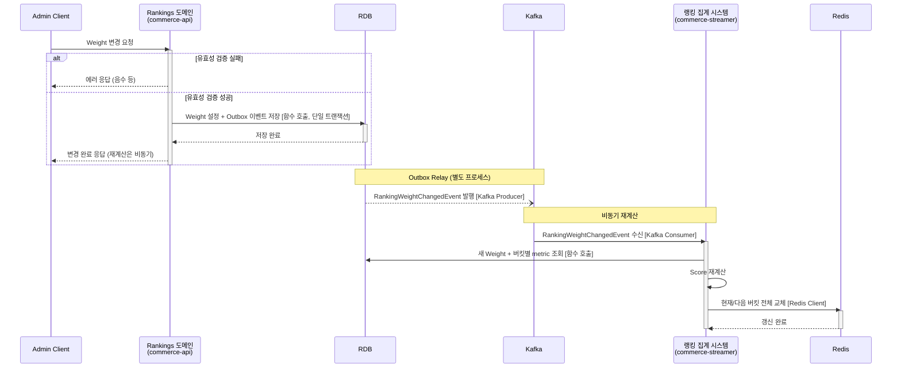

# 솔루션 설계 문서: 랭킹 시스템

## 1. 설계 컨텍스트

### 1.1 핵심 해결 과제

- 사용자 행동(조회, 좋아요, 주문)을 종합하여 인기 상품 랭킹 제공
- 구매자가 인기 상품을 쉽게 탐색할 수 있도록 실시간 랭킹 조회 지원
- 관리자가 항목별 Weight를 실시간으로 조절하여 최적의 랭킹 정책 탐색 가능
- 인기 상품 노출을 통한 구매 전환율 향상

### 1.2 현재 아키텍처 영향

- Kotlin + Spring Boot 멀티모듈 모놀리식 프로젝트 (commerce-api, commerce-streamer)
- Application Layer의 Service(단일 도메인) + Facade(도메인 간 오케스트레이션) 구조
- Transactional Outbox 패턴으로 도메인 이벤트를 Kafka로 발행하는 파이프라인 구축됨
- 랭킹에 필요한 이벤트(ProductViewedEventV1, LikeCreatedEventV1, OrderPaidEventV1)가 이미 발행 중
- Redis 모듈 존재

### 1.3 기술 스택 개요

- 개발 언어: Kotlin (Spring Boot 프레임워크)
- 데이터베이스: PostgreSQL (RDB)
- 캐시: Redis
- 메시지 큐: Kafka
- ORM: Spring Data JPA

## 2. 솔루션 대안 분석

### 대안 1: commerce-streamer에서 집계 + Redis 직접 관리

- **설명**: commerce-streamer가 Kafka에서 이벤트를 소비하여 Redis에 직접 Score를 업데이트한다. commerce-api의 Rankings 도메인은 Redis를 조회만 한다.
- **문제 해결 방식**: 이벤트 발생 시 Redis의 해당 상품 Score를 Weight 기반으로 증감하고, Weight 변경 시 전체 Score를 재계산한다.
- **장점**:
    - 실시간성이 높음 (이벤트 발생 즉시 Score 반영)
    - 조회 성능 최적화
    - 기존 Outbox → Kafka 파이프라인 활용
- **단점**:
    - Score 재계산 시 원본 데이터 필요 (Redis에는 최종 Score만 존재)
    - Weight 변경 시 전체 재계산을 위한 별도 저장소 필요
    - 이벤트 유실 시 복구 어려움
- **아키텍처 영향**: commerce-streamer에 Kafka Consumer 추가, commerce-api에 Rankings 도메인 추가

### 대안 2: commerce-api에서 집계 + RDB 기반 Score 관리

- **설명**: commerce-api 내에서 이벤트를 수신하여 RDB에 행동 카운트를 저장하고, 조회 시점에 Score를 계산하거나 주기적으로 Redis에 캐싱한다.
- **문제 해결 방식**: Rankings 도메인이 Spring Application Event로 이벤트 수신하고, 상품별 행동 카운트를 RDB에 저장한다. 주기적으로 Score를 계산하여 Redis에 캐싱한다.
- **장점**:
    - Weight 변경 시 재계산 용이 (원본 카운트 보존)
    - 데이터 정합성 관리 용이 (RDB ACID)
    - Kafka 의존성 없이 구현 가능
- **단점**:
    - 실시간성 떨어짐 (캐시 갱신 주기에 의존)
    - Application Event는 프로세스 내부에서만 동작 (인스턴스 간 동기화 이슈)
    - 조회 시점 계산은 성능 문제 발생 가능
- **아키텍처 영향**: commerce-api에 Rankings 도메인 추가, 행동 카운트 테이블 및 캐싱 스케줄러 추가

### 대안 3: commerce-streamer에서 집계 + RDB 원본 + Redis 캐시 (하이브리드)

- **설명**: commerce-streamer가 Kafka 이벤트를 소비하여 RDB에 행동 카운트를 저장하고, 주기적으로 Score를 계산하여 Redis에 캐싱한다. Pre-aggregated 패턴을 적용한다.
- **문제 해결 방식**: commerce-streamer가 이벤트 소비 후 RDB에 카운트 저장하고, 스케줄러가 주기적으로 Score 계산하여 Redis를 갱신한다. Weight 변경 시 즉시 전체 재계산을 트리거한다.
- **장점**:
    - Weight 변경 시 재계산 용이 (원본 카운트 보존)
    - 이벤트 유실 시에도 RDB에서 복구 가능
    - Kafka 기반으로 인스턴스 간 동기화 문제 없음
    - 조회 성능 최적화 (Redis 캐시)
- **단점**:
    - 실시간성은 스케줄러 주기에 의존 (수 분 지연 허용하므로 OK)
    - 저장소 이중화 (RDB + Redis)
    - 구현 복잡도 상승
- **아키텍처 영향**: commerce-streamer에 Kafka Consumer 및 집계 로직 추가, commerce-api에 Rankings 도메인 추가

## 3. 선택된 솔루션

### 3.1 결정 요약

**대안 3: commerce-streamer에서 집계 + RDB 원본 + Redis 캐시 (하이브리드)**를 선택한다.

**선택 이유**:

1. 팀의 "ROI 중심" 가치에 부합
    - 기존 Outbox → Kafka 파이프라인을 그대로 활용하여 새로운 인프라 도입 없이 구현 가능
    - Redis 모듈도 이미 존재
2. 팀의 "실용주의" 가치에 부합
    - Weight 변경 시 전체 재계산이라는 요구사항을 RDB 원본 카운트로 쉽게 해결
    - 이벤트 유실 시에도 복구 가능한 안정성 확보
3. 요구사항 충족
    - 랭킹 조회 50ms 이하: Redis 캐시로 해결
    - 수 분 내 반영 허용: 스케줄러 주기로 충분
    - Weight 변경 후 재계산: 원본 카운트 기반으로 즉시 가능
4. 기존 아키텍처 패턴과 일관성
    - commerce-streamer가 이미 Kafka Consumer 역할을 하도록 설계됨
    - 도메인 간 이벤트 기반 통신 패턴 유지

### 3.2 솔루션 구조

#### 핵심 아키텍처 컴포넌트

**1. Rankings 도메인 (commerce-api)**

- 인기 상품 랭킹 조회 (페이지네이션)
- 특정 상품의 현재 순위 조회
- Weight 설정 조회 및 변경
- Weight 변경 시 전체 Score 재계산 트리거

**2. 랭킹 집계 시스템 (commerce-streamer)**

- Kafka에서 ProductViewed, LikeCreated, LikeCanceled, OrderPaid 이벤트 소비
- 메모리 버퍼에서 집계 후 주기적으로 RDB와 캐시에 반영
- 1시간 단위 Tumbling Window 집계
- 버킷 전환 시 이전 Score × 0.1을 base로 적용 (cold start 방지)

**3. 데이터 저장소**

- RDB: 시간 버킷별 상품 행동 카운트, Weight 설정 (source of truth)
- Redis: 상품 랭킹 캐시 (Score 기준 정렬된 상품 목록)

#### 데이터 흐름

**1. 이벤트 수집 및 집계 흐름**

**2. 버킷 전환 흐름 (정시 10분 전 실행)**

**3. 랭킹 조회 흐름 (US-1)**

**4. 상품 순위 확인 흐름 (US-2)**

**5. Weight 변경 및 재계산 흐름 (US-3)**

### 3.3 시스템 간 통합

| 통합 지점 | 통신 패턴 | 동기/비동기 | 실패 처리 | 근거 |
|----------|----------|------------|----------|------|
| Rankings → Product (상품 정보 조회) | 함수 호출 (in-process) | 동기 | 실패 시 productId + 순위만 반환 (graceful degradation) | 같은 모듈 내 도메인, 50ms 내 응답 가능, 기존 상품 캐시 활용 |
| Product → Rankings (순위 조회) | 함수 호출 (in-process) | 동기 | 실패 시 rank = null 반환 | 같은 모듈, 순위 없어도 상품 상세는 유효 |
| 행동 이벤트 → 집계 시스템 | Kafka Consumer (파티션 키: productId) | 비동기 | 재시도 3회 후 DLQ | 서비스 분리, 파티션 키로 같은 상품 이벤트 순서 보장 |
| Weight 변경 → 재계산 트리거 | Outbox → Kafka | 비동기 | 재시도 3회 후 로그, 수동 재트리거 | 기존 Outbox 패턴 활용, 실패 시 Weight 재변경으로 복구 가능 |
| 집계 시스템 → RDB | 함수 호출 (JPA) | 동기 | 재시도 3회, 실패 시 버퍼 유지 | 같은 프로세스, source of truth |
| 집계 시스템 → Redis | Redis Client | 동기 | 실패 시 로그 후 버퍼 초기화, 누락 허용 | 캐시이므로 best-effort |

### 3.4 데이터 일관성 정책

| 저장소 관계 | Source of Truth | 일관성 정책 | 근거 |
|------------|-----------------|------------|------|
| RDB ↔ Redis | RDB (행동 카운트, Weight) | RDB 저장 성공 후 Redis 갱신. Redis 실패 시 계속 진행 (누락 허용) | 랭킹은 근사치 허용. 과집계보다 누락이 나음. Weight 변경 시 RDB 기반 전체 재계산으로 복구 |
| Weight 변경 ↔ Score 재계산 | 최종 일관성 (수 분 내) | 이벤트 기반 비동기 재계산 | 관리자 작업이므로 즉시 반영 불필요. API 응답 속도 보장 |

### 3.5 트랜잭션 경계

| 작업 | 트랜잭션 범위 | 패턴 | 비고 |
|------|--------------|------|------|
| Weight 변경 | RDB Weight 저장 + Outbox 이벤트 저장 | Outbox (단일 DB 트랜잭션) | 기존 팀 패턴 활용, 이벤트 발행 보장 |
| 행동 집계 flush | RDB Upsert (단일 트랜잭션) → Redis 갱신 (별도) | 2단계 (RDB 우선) | Redis 실패 시 RDB 롤백 안 함, 다음 Weight 변경 시 재계산으로 복구 |
| 버킷 전환 | Redis 작업만 (RDB 트랜잭션 없음) | 단일 Redis 명령 | 실패 시 다음 스케줄에서 재시도 |

### 3.6 이벤트 계약

**소비하는 이벤트:**

| 이벤트명 | 필수 필드 | 발행 주체 | 비고 |
|---------|----------|----------|------|
| ProductViewedEventV1 | productId, viewedAt | Product 도메인 | 이미 발행 중 |
| LikeCreatedEventV1 | productId, likedAt | Like 도메인 | 이미 발행 중 |
| LikeCanceledEventV1 | productId, canceledAt | Like 도메인 | 이미 발행 중 |
| OrderPaidEventV1 | productId, quantity, unitPrice, paidAt | Order 도메인 | orderAmount = quantity × unitPrice로 계산 |

**발행하는 이벤트:**

| 이벤트명 | 필수 필드 | 발행 방식 | 소비 주체 |
|---------|----------|----------|----------|
| RankingWeightChangedEvent | weightId, viewWeight, likeWeight, orderWeight, changedAt | Outbox 패턴 | commerce-streamer (재계산 트리거) |
